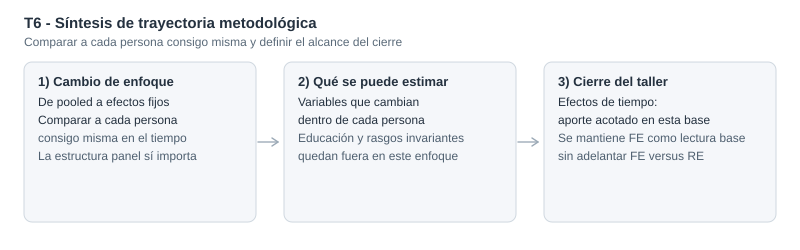

::: {.hero-box}
::: {.hero-title}
En este panel salarial, FE identifica con variación within y deja fuera regresores invariantes en el tiempo
:::

::: {.hero-sub}
La especificación `xtreg ..., fe` es coherente cuando preocupa la correlación entre heterogeneidad individual fija no observada (`c_i`) y regresores, pero en este taller no se ejecuta Hausman y no corresponde declarar ganador entre FE y RE.
:::
:::

:::: {.metric-grid}

::: {.metric-card}
::: {.metric-label}
Modelo operativo
:::

::: {.metric-value}
FE (within)
:::

::: {.metric-note}
`xtreg lwage exper expersq union married, fe`
:::
:::

::: {.metric-card}
::: {.metric-label}
Invariantes en FE
:::

::: {.metric-value}
Absorbidas
:::

::: {.metric-note}
`educ` y `black` se omiten por no variar en `t`
:::
:::

::: {.metric-card}
::: {.metric-label}
Test `all u_i=0`
:::

::: {.metric-value}
F = 9.71
:::

::: {.metric-note}
Rechazo fuerte: la estructura panel importa
:::
:::

::: {.metric-card}
::: {.metric-label}
Variacion explicada
:::

::: {.metric-value}
`R2 within = 0.178`
:::

::: {.metric-note}
La lectura econométrica central es intraindividuo
:::
:::

::::

## Resumen

Este caso introduce FE en panel salarial con una regla de lectura clara: los coeficientes se identifican a partir de cambios dentro del mismo individuo en el tiempo. Por construcción, los regresores invariantes en `t` quedan absorbidos y no se estiman en la ecuación within.

En términos aplicados, este ejercicio ayuda a leer dimensiones laborales dinamicas del salario en una misma persona, como acumulación de experiencia o cambios de estado laboral y familiar. Seguir trabajadores en panel permite separar mejor esos movimientos en el tiempo que una lectura pooled simple, que mezcla diferencias entre personas con cambios dentro de cada trayectoria individual.

Ademas, el test `F test that all u_i=0` aporta evidencia central de que la heterogeneidad individual no observada es relevante, por lo que no conviene tratar estos datos como pooled simple.

:::: {.quick-grid}

::: {.section-box}
## Pregunta

¿Cómo cambia la lectura de una ecuación salarial cuando pasamos de una mirada agrupada a un estimador de efectos fijos que usa variación within?

::: {.small-note}
Variable dependiente: `lwage` (log del salario por hora). Regresores con variación within en el modelo operativo: `exper`, `expersq`, `union`, `married`. Panel: `nr` (1980-1987).
:::
:::

::: {.section-box}
## Idea central

FE mejora el problema de sesgo por heterogeneidad fija no observada cuando esa heterogeneidad puede correlacionarse con regresores.  
Ese avance no vuelve automáticamente insesgado el resultado ni resuelve otras fuentes de endogeneidad en variables que cambian en el tiempo.

Portfolio econométrico
:::

::::

## Por qué este problema importa

En paneles salariales, pueden operar rasgos persistentes no observados o imperfectamente medidos del trabajador que distorsionen la lectura de modelos agrupados. FE aborda ese riesgo eliminando el componente fijo individual en la transformacion within.

El costo es metodológicamente relevante: cualquier covariable constante en el tiempo para cada individuo queda absorbida. Por eso, FE cambia no solo la estimación, sino también el tipo de pregunta que efectivamente podemos contestar con los datos.

## Datos y variables

Se trabaja con el panel `wagepan` (`N = 4360` observaciones, `545` individuos, 8 periodos).

- Variable dependiente: `lwage` (log del salario por hora)
- Regresores en la especificación de partida: `educ`, `exper`, `expersq`, `union`, `married`, `black`
- Regresores efectivamente estimables en FE base: `exper`, `expersq`, `union`, `married`
- Regresores absorbidos en FE base: `educ`, `black`
- Unidad de panel: individuo (`nr`)

## Estrategia empírica

La secuencia aplicada en T6 es:

1. Estimar FE de primera referencia para fijar lectura within.
2. Verificar explicitamente que las invariantes (`educ`, `black`) quedan omitidas por colinealidad en la transformacion FE.
3. Usar `F test that all u_i=0` como evidencia central sobre la relevancia de la estructura panel.
4. Incorporar dummies de año y, luego, interacciones `educ#year` como chequeos secundarios de especificación.
5. Reportar el alcance metodologico: en este taller no hay contraste Hausman, por lo que no corresponde afirmar superioridad empírica de FE frente a RE.

## Qué pasa con un análisis ingenuo

Una lectura ingenua puede cometer dos errores:

1. Tratar FE como una regresion "más", sin reconocer que identifica solo con variación intraindividuo.
2. Concluir que FE ya cierra toda la agenda de identificación.

El mensaje profesional de T6 es más estricto: FE mejora un problema puntual de sesgo por heterogeneidad fija no observada, pero no elimina por sí solo otras fuentes de endogeneidad en regresores variables en el tiempo.

::: {.table-box}
## Resultados principales

La evidencia principal del taller se centra en los coeficientes within de variables con variación temporal. Los estadísticos globales y las omisiones estructurales quedan como respaldo metodológico.

| Variable within | FE base: coef. (EE) | FE + dummies de año: coef. (EE) | Lectura econométrica |
|---|---:|---:|---|
| `exper` | 0.1168 (0.0084) | 0.1321 (0.0098) | Retorno within positivo |
| `expersq` | -0.0043 (0.0006) | -0.0052 (0.0007) | Curvatura cóncava robusta |
| `union` | 0.0821 (0.0193) | 0.0800 (0.0193) | Prima within positiva |
| `married` | 0.0453 (0.0183) | 0.0467 (0.0183) | Asociación within positiva |
:::

En lectura económica y siempre dentro de esta especificación FE, los resultados sugieren asociaciones within coherentes con la narrativa del caso: cuando un trabajador acumula `exper` en su propia trayectoria, su `lwage` tiende a aumentar a una tasa decreciente (`expersq < 0`); cuando cambia su condición de `union` de 0 a 1, el log-salario aparece asociado positivamente; y cuando cambia `married` de 0 a 1, también se observa una asociación positiva dentro de la misma persona en el tiempo. Estas asociaciones no deben leerse automáticamente como libres de sesgo.

::: {.table-box}
## Hallazgos secundarios y especificación

Los contrastes temporales se reportan como chequeos auxiliares, subordinados al mensaje principal del caso.

En FE con dummies de año (`d81-d87`), el test conjunto de exclusion no rechaza al 5% (`F(5,3805)=1.50`, `p=0.1863`).  
En FE con `c.educ##i.year`, las interacciones aparecen sin evidencia estadística robusta en este taller.

| Contraste auxiliar | Resultado reportado | Prob > F | Interpretación econométrica |
|---|---:|---:|---|
| Variables invariantes en FE | `educ` y `black` omitidas | - | FE no identifica regresores constantes en el tiempo |
| Estructura panel | F all u_i=0: F(544,3811)=9.71 | 0.0000 | Pooled simple es insuficiente |
| FE + dummies de año | R2 within = 0.1806 | - | Cambio acotado frente al FE base |
| Test conjunto d82-d87 | F(5,3805)=1.50 | 0.1863 | Sin evidencia fuerte para mantener bloque temporal En esta base |
| FE + educ#year | R2 within = 0.1814 | - | Interacciones sin aporte robusto; contraste didactico |
:::

## Lectura profesional del caso

T6 consolida una regla aplicada de panel:

- FE es una estrategia coherente cuando preocupa `c_i` correlacionado con regresores.
- Esa coherencia no habilita, por si sola, una afirmacion concluyente.
- En esta pieza no se ejecuta una prueba tipo Hausman, por lo que no corresponde afirmar empiricamente que FE sea preferible a RE.

La conclusión metodológica es deliberadamente prudente: FE organiza mejor la identificación frente a heterogeneidad fija no observada, pero no agota la evaluación de endogeneidad ni reemplaza contrastes entre especificaciones cuando esos contrastes no fueron realizados.

## Cierre

Este taller marca el paso de una lectura agrupada a una lectura within: que cambia dentro del individuo es lo que identifica FE, y lo invariante queda fuera de la estimación. En este caso, esa diferencia mejora la lectura empírica del problema salarial frente a pooled simple porque ordena mejor que parte de la evidencia viene de trayectorias individuales y no de contrastes entre personas.

Con evidencia fuerte de que la estructura panel importa y sin sobreafirmar comparaciones no testeadas contra RE, la pieza queda posicionada como reporte profesional útil para análisis aplicado: mejora la interpretación econométrica del ejemplo sin exagerar su alcance inferencial.

