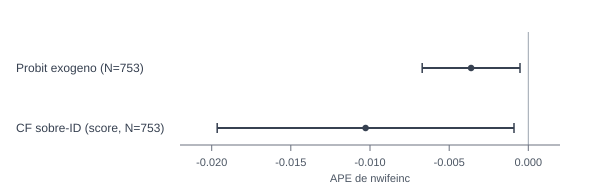

::: {.hero-box}
::: {.hero-title}
¿Cómo se estima una respuesta binaria cuando una covariable continua central (`nwifeinc`) puede ser endógena, y qué cambia entre el enfoque exógeno y el endógeno?
:::

::: {.hero-sub}
La pieza organiza una comparación metodológica con anclaje aplicado: benchmark exógeno, eje CF y contraste paralelo con IV-probit, sin sobrerreaccionar en la lectura final.
:::
:::

:::: {.metric-grid}

::: {.metric-card}
::: {.metric-label}
Modelo operativo
:::

::: {.metric-value}
Probit base + sensibilidad IV/CF
:::

::: {.metric-note}
APEs como unidad principal de lectura en probabilidad
:::
:::

::: {.metric-card}
::: {.metric-label}
Contexto aplicado
:::

::: {.metric-value}
Mujeres y hogares
:::

::: {.metric-note}
`N=753` observaciones, corte transversal (`mroz`)
:::
:::

::: {.metric-card}
::: {.metric-label}
Lectura metodológica
:::

::: {.metric-value}
Exógeno vs endógeno
:::

::: {.metric-note}
CF como eje; IV-probit como contraste paralelo
:::
:::

::: {.metric-card}
::: {.metric-label}
Auditoria de sensibilidad
:::

::: {.metric-value}
`nwifeinc` más negativo en IV/CF
:::

::: {.metric-note}
APE aprox. `-0.0036` (probit exogeno) vs `-0.0108` a `-0.0105` (IV/CF)
:::
:::

::::

## Resumen

Esta pieza estudia participación laboral femenina (`inlf`) en relación con ingreso no laboral del hogar, educación, experiencia y composición familiar. El foco principal es metodológico: comparar estimación binaria exógena vs endógena con anclaje aplicado en decisiones de hogar.

El orden de lectura es deliberado: probit exógeno como benchmark inicial, control function (CF) como eje metodológico principal, `ivprobit` como contraste de robustez e `MPL-IV` como benchmark lineal secundario.

:::: {.quick-grid}

::: {.section-box}
## Pregunta

¿Cómo se estima una respuesta binaria cuando una covariable continua central (`nwifeinc`) puede ser endógena, y qué cambia entre el enfoque exógeno y el endógeno?

::: {.small-note}
Resultado binario de participación laboral femenina (`inlf`): participa / no participa en la fuerza laboral. Variable clave: `nwifeinc`. Controles: `educ`, `exper`, `expersq`, `age`, `kidslt6`, `kidsge6`.
:::
:::

::: {.section-box}
## Idea central

La pieza se ordena como comparación metodológica: primero el problema de endogeneidad en binaria, luego el contraste de APEs entre modelos exógenos y endógenos.

Portfolio econométrico
:::

::::

## Por qué este problema importa

La participación laboral femenina refleja decisiones de tiempo y recursos dentro del hogar. Ingreso no laboral, experiencia acumulada, escolaridad y presencia de hijos pequeños pueden alterar de forma marcada esa decisión.

Para lectura profesional, importa distinguir entre un patrón sustantivo estable y un posible sesgo de modelado cuando una covariable central puede estar correlacionada con factores no observados.

## Datos y variables

Se usa `mroz.dta` en corte transversal.

- Unidad de observacion: mujer/hogar
- Tamano de muestra: `N=753`
- Contexto temporal: información de referencia para 1975
- Variable de resultado: `inlf` (participa / no participa en la fuerza laboral)
- Variables clave: `nwifeinc`, `educ`, `exper`, `expersq`, `age`, `kidslt6`, `kidsge6`
- Instrumentos para auditoría de endogeneidad: `huseduc` (principal), `motheduc`, `fatheduc`

## Estrategia empírica

1. Estimar probit exogeno como lectura base y reportar APEs.
2. Usar control function (CF) como eje para tratar `nwifeinc` como potencialmente endógena en el modelo binario.
3. Contrastar con `ivprobit` como implementación paralela de robustez y mantener `MPL-IV` como benchmark lineal secundario.
4. Usar diagnósticos solo como respaldo de decisión aplicada.

## Resultados principales

La comparación metodológica deja una lectura clara:

- El benchmark probit exógeno reporta un APE de `-0.0036` para `nwifeinc`.
- Al pasar al bloque endógeno, los APEs no lineales quedan cercanos entre sí: `CF` alrededor de `-0.0103` e `IVprobit` alrededor de `-0.0108`.
- `MPL-IV` queda como contraste lineal útil (`-0.0116`), sin desplazar el eje CF de la lectura.
- Los demás patrones aplicados (`kidslt6`, `educ`, `exper`) se mantienen estables y no alteran la decisión metodológica central.

En esta pieza, ese cambio se interpreta como sensibilidad de magnitud y no como señal automatica de que un enfoque deba reemplazar al otro.

::: {.table-box}
## Sintesis de magnitudes (APE)

| Método | Rol en la comparación | APE `nwifeinc` | Error estándar | IC 95% (`nwifeinc`) | Lectura metodológica |
|---|---|---:|---:|---:|---|
| Probit exógeno | Benchmark inicial | -0.0036 | 0.0016 | [-0.0067, -0.0005] | Punto de partida exógeno |
| CF sobre-ID (score) | Eje metodológico principal | -0.0103 | 0.0048 | [-0.0197, -0.0009] | Referencia central para bloque endógeno |
| IVprobit MLE bivariado | Contraste paralelo de robustez | -0.0108 | 0.0057 | [-0.0220, 0.0004] | Magnitud cercana a CF con mayor incertidumbre |
| MPL-IV | Benchmark lineal secundario | -0.0116 | 0.0058 | [-0.0230, -0.0002] | Chequeo lineal complementario |
:::

## Diagnosticos de respaldo

Los diagnósticos se mantienen deliberadamente subordinados al caso aplicado:

- Relevancia instrumental: evidencia fuerte en primera etapa (`F(3,743)=16.67`, `p<0.001`).
- Validez conjunta (sobreidentificacion): sin senales claras de invalidez (`Score chi2(2)=0.489`, `p=0.783`).
- Exogeneidad de `nwifeinc`: no se rechaza de forma robusta (tests en torno a `p=0.17` a `p=0.22`).

Por eso, la correccion IV/CF se lee como auditoría de sensibilidad y no como reemplazo automatico del modelo base.

## Lectura profesional

El valor profesional del caso es mostrar criterio de modelado aplicado en binaria: partir del benchmark exógeno y decidir, con CF como eje, cuánto cambia la lectura al tratar `nwifeinc` como potencialmente endógena.

En T13, `ivprobit` acompaña como verificación paralela y `MPL-IV` como control lineal secundario; la decisión se sostiene sobre la comparación metodológica y no sobre una sobreactuación de hallazgos sustantivos.

## Cierre

Esta pieza no plantea una competencia entre probit e IV-probit. Plantea una decisión econométrica profesional: cuándo una posible endogeneidad amerita escalar complejidad y cuándo conviene tratar esa complejidad como análisis de sensibilidad para no sobrerreaccionar en la interpretación aplicada.

