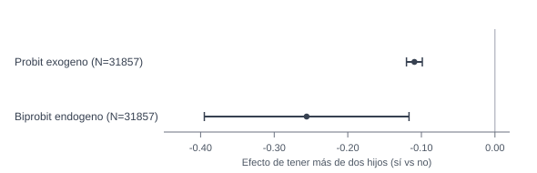

::: {.hero-box}
::: {.hero-title}
¿Qué cambia cuando la madre trabaja/no trabaja y la fecundidad (más de dos hijos: sí/no) también es endógena, y qué modelo es correcto en esa estructura?
:::

::: {.hero-sub}
Aquí la diferencia relevante no es solo corregir endogeneidad, sino reconocer que cuando la variable endógena también es binaria cambia el modelo correcto.
:::
:::

:::: {.metric-grid}

::: {.metric-card}
::: {.metric-label}
Modelo operativo
:::

::: {.metric-value}
Binaria con endogeneidad
:::

::: {.metric-note}
Lectura principal en efectos sobre probabilidad de trabajar
:::
:::

::: {.metric-card}
::: {.metric-label}
Contexto aplicado
:::

::: {.metric-value}
Madres y hogares
:::

::: {.metric-note}
`N=31,857` observaciones, corte transversal (`labsup`)
:::
:::

::: {.metric-card}
::: {.metric-label}
Señal sustantiva
:::

::: {.metric-value}
Asociación negativa de tener más de dos hijos
:::

::: {.metric-note}
La participación laboral materna cae cuando la madre tuvo más de dos hijos (sí vs no)
:::
:::

::: {.metric-card}
::: {.metric-label}
Sensibilidad clave
:::

::: {.metric-value}
Mayor magnitud con endogeneidad
:::

::: {.metric-note}
APE aprox. `-0.109` (probit exógeno) vs `-0.256` (biprobit/eprobit)
:::
:::

::::

## Resumen

Esta pieza estudia participación laboral materna (`worked`: trabaja/no trabaja) en relación con fecundidad (`morekids`: tuvo más de dos hijos, sí/no) y características del hogar. El foco principal es metodológico con anclaje aplicado: identificar el modelo correcto para una estructura con dependiente binaria y regresor endógeno binario.

A diferencia de T13, donde la covariable problemática era continua, aquí ya no corresponde trasladar mecánicamente `cfprobit` o `ivprobit` del caso continuo. En esta estructura, `biprobit` funciona como modelo principal y `eprobit` como contraste de robustez, mientras `MPL`, probit y `MPL-IV` quedan como benchmarks de referencia.

:::: {.quick-grid}

::: {.section-box}
## Pregunta

¿Qué cambia cuando la madre trabaja/no trabaja y la fecundidad (más de dos hijos: sí/no) también es endógena, y qué modelo es correcto en esa estructura?

::: {.small-note}
Resultado binario de trabajo materno (`worked`): trabaja / no trabaja. Variable clave: `morekids` (tuvo más de dos hijos: sí/no). Controles: `nonmomi`, `educ`, `age`, `age2`, `black`, `hispan`.
:::
:::

::: {.section-box}
## Idea central

La pieza mantiene el anclaje aplicado en trabajo y fecundidad, pero ordena la lectura con criterio metodológico: en esta estructura, `biprobit` es el eje principal, `eprobit` actúa como robustez y los modelos exógenos/lineales quedan como benchmarks.

Portfolio econométrico
:::

::::

## Por qué este problema importa

La participación laboral materna y la fecundidad forman parte de decisiones de hogar que pueden estar influidas por factores no observados compartidos. En ese contexto, una lectura puramente exógena puede subestimar o sobreestimar la asociación de interés.

Para un lector profesional, importa saber si el mensaje sustantivo se mantiene y cuánto cambia en magnitud cuando el modelo reconoce de forma explícita la posible endogeneidad de la variable clave.

## Datos y variables

Se trabaja con `labsup.dta` en corte transversal.

- Unidad de observación: madre/hogar
- Tamaño de muestra: `N=31,857`
- Variable de resultado: `worked` (trabaja / no trabaja)
- Regresor clave: `morekids` (tuvo más de dos hijos: sí/no)
- Controles: `nonmomi`, `educ`, `age`, `age2`, `black`, `hispan`
- Instrumento excluido para `morekids`: `samesex` (mismo sexo en los dos primeros hijos)

## Estrategia empírica

1. Estimar benchmarks de referencia (`MPL` y probit exógenos) para lectura base en probabilidades.
2. Estimar `biprobit` como modelo principal en la estructura binaria-binaria y usar `eprobit` como contraste de robustez.
3. Mantener `MPL-IV` como benchmark lineal instrumentado auxiliar, sin rol protagónico.
4. Interpretar resultados como criterio de modelo correcto según estructura del problema, no como competencia general entre métodos.

## Resultados principales

La lectura se ordena en cuatro pasos:

1. Aparece una asociación negativa entre tener más de dos hijos y la probabilidad de trabajar.
2. Esa asociación se vuelve más negativa cuando se modela endogeneidad binaria.
3. La diferencia debe leerse con prudencia porque cambian los supuestos y el encuadre econométrico.
4. El foco de la pieza es distinguir modelo correcto vs modelo incorrecto según la estructura del problema, manteniendo anclaje aplicado.

::: {.table-box}
## Síntesis de magnitudes (APE)

| Enfoque | APE (tuvo más de dos hijos: sí vs no) | Error estándar | IC 95% | Lectura aplicada |
|---|---:|---:|---:|---|
| Probit exógeno | -0.1095 | 0.0055 | [-0.1203, -0.0987] | Menor probabilidad de trabajar en la referencia base |
| MPL-IV | -0.2008 | 0.0965 | [-0.3899, -0.0117] | Contraste lineal instrumental, con mucha incertidumbre |
| Biprobit con endogeneidad binaria | -0.2559 | 0.0710 | [-0.3951, -0.1167] | Asociación más negativa al admitir endogeneidad |
| Eprobit (contraste adicional) | -0.2559 | 0.0519 | [-0.3576, -0.1542] | Magnitud alineada con lectura binaria endógena |
:::

## Diagnósticos de respaldo

Este bloque se mantiene subordinado al caso aplicado:

- **Instrumento relevante:** primera etapa con señal fuerte (`F(1,31849)=103.81`, `p<0.001`).
- **Dependencia de errores (señal prudente):** aparece una señal compatible con correlación en especificaciones endógenas (`p` alrededor de `0.056` y `0.045`), a leer con cautela.
- **Interpretación de efectos en `biprobit`:** la interpretación relevante debe centrarse en la probabilidad de trabajar o en el contraste de tratamiento correspondiente, no en la probabilidad conjunta por defecto.
- **Unidad de interpretación:** los efectos reportados se leen como cambios en probabilidad de trabajar, no como parámetros latentes en abstracto.

## Lectura profesional

El aporte de T14 es mostrar criterio de modelado aplicado en un problema real de trabajo y fecundidad. La pieza prioriza evaluar si el tratamiento econométrico de `morekids` cambia materialmente la lectura de una variable central para el análisis de hogar.

## Cierre

El valor profesional de esta pieza está en saber cuándo una formulación binaria con endogeneidad modifica de forma relevante la lectura aplicada de una variable clave.

En T14, la historia sustantiva se mantiene (asociación negativa entre fecundidad y participación laboral materna), y la formulación endógena aporta una sensibilidad de magnitud que conviene reportar con claridad y prudencia.

La lección metodológica es que el modelo correcto depende de la estructura del problema.

