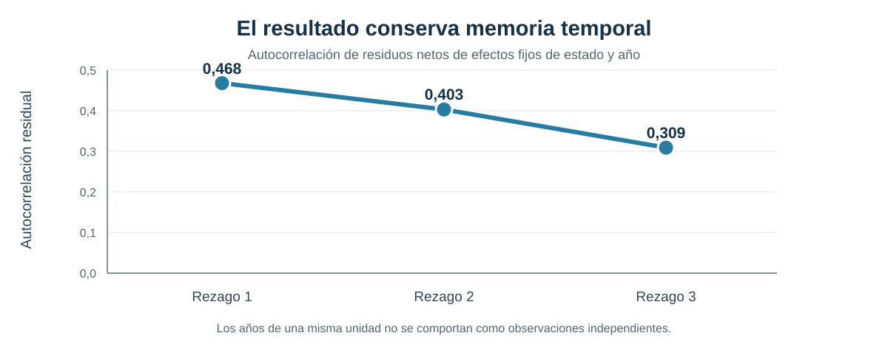
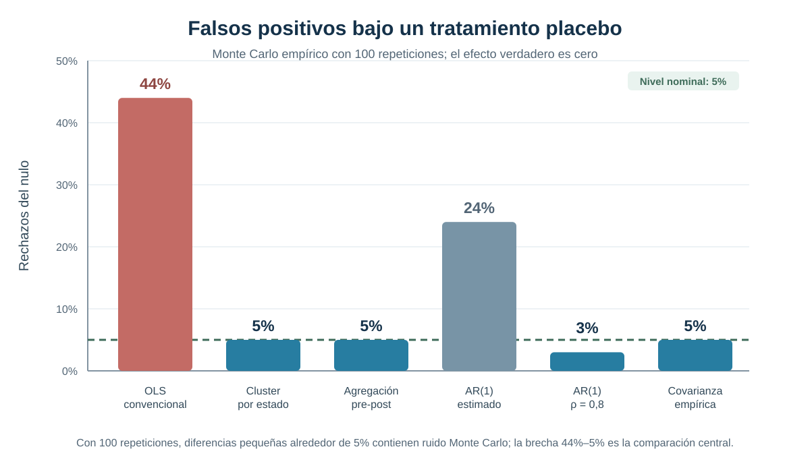
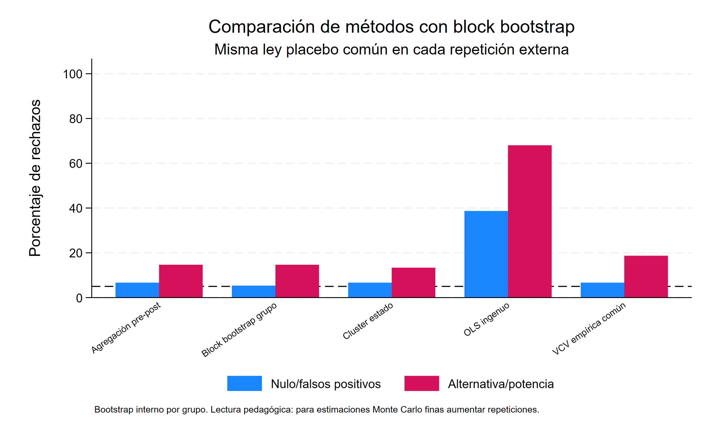
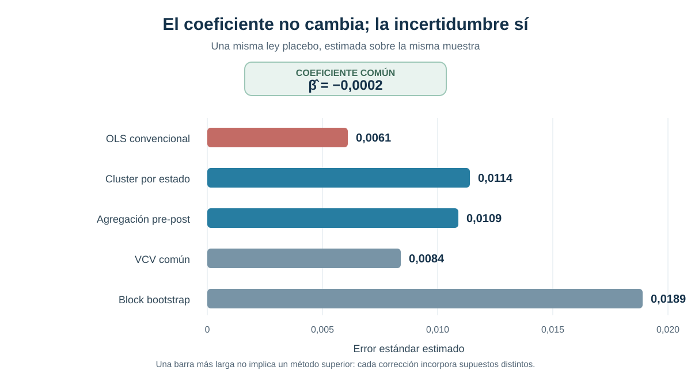

::: {.hero-box}
::: {.hero-title}
La significancia puede aparecer aun cuando el efecto verdadero sea cero
:::

::: {.hero-sub}
Este ejercicio reproduce la lógica de Bertrand, Duflo y Mullainathan: tratamientos persistentes combinados con resultados serialmente correlacionados pueden hacer que la inferencia convencional reporte demasiados efectos estadísticamente significativos.
:::
:::

## Pregunta central

¿Por qué una especificación Difference-in-Differences puede producir una tasa muy alta de falsos positivos cuando los resultados y errores presentan persistencia temporal?

**Respuesta corta:** en el Monte Carlo empírico, OLS convencional rechaza un efecto placebo verdadero igual a cero en **44%** de las repeticiones, frente a un nivel nominal de **5%**. El coeficiente no es el protagonista: el problema es que la incertidumbre se subestima cuando se trata como independiente información que permanece correlacionada dentro de cada estado.

## Significancia espuria en paneles DiD

Un diseño DiD con muchos años suele parecer más informativo que uno de dos períodos. Sin embargo, observar repetidamente a un mismo estado no equivale a obtener nuevas unidades independientes. Salarios, empleo y otras variables agregadas pueden permanecer altos o bajos durante varios años por shocks persistentes.

Si el tratamiento también es persistente —una ley permanece activa después de adoptarse—, el regresor DiD y el error comparten una estructura temporal prolongada. Una regresión con errores estándar convencionales puede interpretar esa persistencia como precisión adicional y producir estadísticos `t` demasiado grandes.

## Por qué importa la correlación serial

La estimación con efectos fijos puede remover diferencias permanentes entre estados y shocks comunes de cada año. Eso no garantiza que el residuo restante sea independiente en el tiempo dentro de un estado.

La consecuencia es inferencial: el coeficiente puede calcularse correctamente para la especificación propuesta, pero su error estándar convencional puede ser demasiado pequeño. En ese caso, el test rechaza el nulo con mucha más frecuencia que la tasa declarada.

## Diseño placebo inspirado en BDM

El ejercicio asigna tratamientos que no corresponden a una política real. En cada repetición se selecciona aleatoriamente un conjunto tratado y se sortea un año placebo; desde ese año, el indicador permanece activo. Un primer experimento mantiene fija la muestra CPS y un segundo remuestrea trayectorias estatales completas para preservar la dependencia temporal dentro de cada estado.

El outcome original no se modifica bajo el nulo. Por construcción, el efecto verdadero del placebo es **cero**. Por tanto, cada rechazo al 5% es un falso positivo y la frecuencia de rechazos mide directamente la calibración del método de inferencia.

:::: {.quick-grid}

::: {.section-box}
**Unidad de asignación**

El tratamiento placebo se asigna a nivel de estado y persiste desde el año ficticio de adopción.
:::

::: {.section-box}
**Hipótesis verdadera**

El efecto bajo el nulo es cero. Una inferencia bien calibrada debería rechazar aproximadamente 5% de las veces.
:::

::: {.section-box}
**Objeto de comparación**

La tasa de falsos positivos producida por seis formas de calcular la incertidumbre.
:::

::::

## Datos y construcción del resultado

La base utiliza microdatos CPS/CEPR ORG de 1979 a 1999. La muestra se restringe a mujeres de 25 a 50 años con remuneración semanal y ponderador muestral válidos. El logaritmo del ingreso semanal se residualiza por educación y un polinomio de cuarto grado en edad; luego se promedia por estado y año.

::: {.small-note}
- **Muestra efectiva de residualización:** 538.506 observaciones individuales.
- **Cobertura:** 51 estados y 21 años.
- **Panel agregado:** 1.071 celdas estado-año, balanceado.
- **Outcome del ejercicio:** media estado-año del residuo del logaritmo del ingreso semanal.
- **Tratamiento:** adopción placebo persistente, asignada aleatoriamente.
- **Repeticiones:** 100 en los experimentos principales.
:::

## Persistencia temporal

{fig-alt="Las autocorrelaciones residuales son 0,468, 0,403 y 0,309 en los primeros tres rezagos, mostrando persistencia positiva dentro de los estados."}

La autocorrelación permanece positiva durante al menos tres años. El primer rezago alcanza **0,468**; incluso en el tercero conserva un valor de **0,309**. Por ello, tres observaciones anuales consecutivas de un estado no aportan la misma información que tres estados independientes.

## Monte Carlo con un efecto verdadero igual a cero

El Monte Carlo empírico remuestrea estados completos con reemplazo. Esta decisión conserva la trayectoria temporal interna de cada estado y evita destruir precisamente la dependencia que se quiere estudiar.

En cada una de las 100 repeticiones se estima la misma especificación DiD con efectos fijos de estado y año. Solo cambia el tratamiento placebo y la forma de calcular la incertidumbre.

{fig-alt="OLS convencional rechaza falsamente el nulo en 44 por ciento de las repeticiones, mientras varios métodos que reconocen la dependencia se acercan al nivel nominal de 5 por ciento."}

La comparación dominante es inmediata: **44% de falsos positivos con OLS convencional frente a un tamaño nominal de 5%**. El procedimiento rechaza casi nueve veces más de lo previsto aun cuando no existe ningún efecto. En el experimento previo sobre la muestra CPS fija, el mismo patrón ya aparece: OLS rechaza 34%, frente a 4% con cluster por estado, 5% con agregación pre-post y 6% con la matriz empírica común.

## Qué ocurre con distintos métodos de inferencia

::: {.table-box}
| Método | Rechazos bajo el nulo | Rechazos bajo la alternativa | Lectura |
|---|---:|---:|---|
| OLS convencional | **44%** | 72% | Sobre-rechazo muy marcado |
| Cluster por estado | **5%** | 29% | Cercano al tamaño nominal |
| Agregación pre-post | **5%** | 30% | Cercano al tamaño nominal |
| AR(1) con persistencia estimada | **24%** | 58% | Corrige solo parcialmente |
| AR(1) con `ρ = 0,8` | **3%** | 18% | Tamaño bajo, con menor capacidad de rechazo bajo la alternativa |
| Matriz de covarianza empírica común | **5%** | 33% | Cercano al tamaño nominal |
:::

La alternativa agrega artificialmente un efecto de 0,02. El 72% de OLS no puede interpretarse como potencia útil sin recordar que el método ya rechaza 44% bajo el nulo. Con solo 100 repeticiones, diferencias pequeñas entre los procedimientos bien calibrados contienen ruido Monte Carlo y no sostienen un ranking fino.

## Qué estrategias corrigen el problema

**Cluster por estado** permite dependencia arbitraria dentro de la unidad donde se asigna el tratamiento. En este ejercicio recupera una tasa de rechazo cercana al nivel nominal y constituye la corrección más directamente alineada con el diseño.

**Agregación pre-post** comprime cada trayectoria a un cambio previo y posterior. Reduce la falsa multiplicación de información temporal y sacrifica detalle dinámico, pero no elimina por sí sola los problemas inferenciales asociados a un número pequeño de grupos.

Las correcciones **AR(1)** imponen una forma paramétrica para la dependencia. El contraste entre 24% con persistencia estimada y 3% con un valor impuesto muestra que sus resultados pueden depender de cómo se especifique el proceso temporal. La matriz empírica común también se acerca al nominal en este ejercicio, pero requiere estimar una estructura de covarianza compartida.

El mensaje no es que exista una corrección universal. La inferencia debe responder al nivel de asignación, el número de grupos y la dependencia temporal plausible en cada aplicación.

## Block bootstrap con leyes placebo comunes

El último experimento compara cinco métodos sobre la misma ley placebo en cada repetición externa y agrega un block bootstrap que remuestrea trayectorias estatales completas. Con 75 repeticiones externas y 74 remuestreos internos, OLS rechaza 38% bajo el nulo; cluster, 6%; y pre-post, la VCV común y el block bootstrap, 8% cada uno.

{fig-alt="Comparación de tasas de rechazo bajo el nulo para OLS, cluster por estado, agregación pre-post, VCV común y block bootstrap con las mismas leyes placebo."}

El bootstrap queda cerca del tamaño nominal, pero el número reducido de repeticiones impide convertir diferencias pequeñas en una jerarquía definitiva. Su aporte es mostrar que preservar la trayectoria completa del estado puede corregir la falsa precisión sin tratar cada celda estado-año como información independiente. Como otras correcciones basadas en grupos, su desempeño también depende de disponer de un número suficiente de clusters.

## Mismo coeficiente, distinta incertidumbre

{fig-alt="El coeficiente estimado es menos 0,0002 con los cinco métodos. Los errores estándar son 0,0061 con OLS, 0,0114 con cluster por estado, 0,0109 con agregación pre-post, 0,0084 con VCV común y 0,0189 con block bootstrap."}

En una ley placebo fija, los cinco métodos producen exactamente el mismo coeficiente: `−0,0002`. Lo que cambia es la incertidumbre. Los errores estándar son `0,0061` con OLS, `0,0114` con cluster por estado, `0,0109` con agregación pre-post, `0,0084` con VCV común y `0,0189` con block bootstrap. La figura aísla así el mecanismo del problema: no aparecen cinco efectos causales distintos, sino cinco evaluaciones de precisión para un único estimador puntual.

Tampoco debe leerse la barra más larga como el “mejor” método. La evidencia favorece reconocer la dependencia pertinente, no maximizar mecánicamente la incertidumbre.

## Alcance y límites

El ejercicio estudia calibración inferencial, no el efecto de una política sustantiva. Las leyes son placebo y el parámetro verdadero se fija en cero para observar directamente cuántas veces cada método declara un efecto inexistente.

Las tasas provienen de 100 repeticiones y deben leerse como evidencia ilustrativa, no como estimaciones de precisión Monte Carlo extrema. El patrón grande —44% frente a 5%— es informativo; las diferencias pequeñas alrededor del nivel nominal no sostienen rankings finos.

En una aplicación real, una inferencia bien calibrada sigue necesitando un diseño identificado: tendencias paralelas pertinentes, ausencia de anticipación y un grupo de comparación defendible. Ninguno de los procedimientos estudiados vuelve causal a un contraste que no satisface esas condiciones.

## Qué resuelve BDM y qué no

BDM identifica un problema de **inferencia**: errores estándar mal calibrados cuando tratamiento y outcome presentan persistencia temporal. Clustering y otras estrategias pueden mejorar la frecuencia con que los tests respetan su nivel nominal.

Esto no resuelve un problema diferente: qué parámetro recupera una regresión con efectos fijos bidireccionales cuando distintos grupos adoptan el tratamiento en momentos distintos y los efectos son heterogéneos. Esa cuestión posterior afecta la **identificación e interpretación del estimando**, aun si los errores estándar estuvieran bien calculados.

## Puente hacia la crisis moderna de TWFE

La progresión conceptual queda separada en dos etapas. Primero, la literatura clásica advierte que la dependencia serial puede convertir persistencia en significancia espuria. Después, la literatura moderna examina cómo las comparaciones implícitas de TWFE pueden combinar cohortes y períodos de manera problemática bajo adopción escalonada.

Mantener la distinción evita atribuir a clustering una capacidad que no tiene: corregir la inferencia no redefine las comparaciones causales incorporadas en el estimador.

## Conclusión

En este ejercicio, OLS convencional rechaza un efecto placebo verdadero igual a cero en **44%** de las repeticiones, aunque el test declara trabajar al 5%. La persistencia residual —0,468 en el primer rezago— explica por qué los años de un mismo estado no pueden tratarse como información independiente.

Cluster por estado, agregación pre-post y una matriz de covarianza empírica reducen sustancialmente el sobre-rechazo y se acercan al tamaño nominal. La enseñanza central es metodológica: en Difference-in-Differences, una especificación plausible no alcanza si la inferencia ignora la estructura temporal y el nivel de asignación. Resolver ese problema prepara, pero no sustituye, el análisis posterior de la crisis moderna de TWFE.
