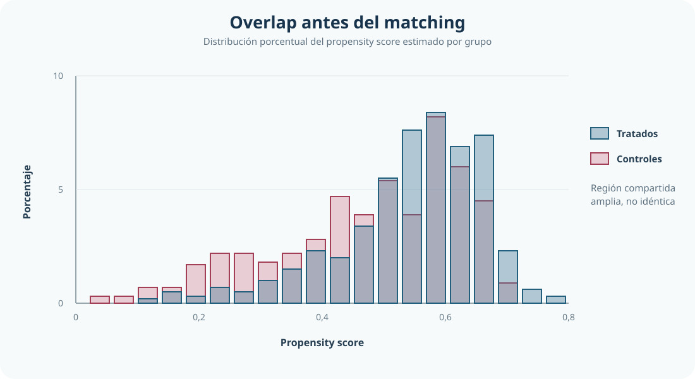

[<- Volver al índice de Causalidad](../index.qmd)

::: {.hero-box}
::: {.hero-title}
En PSM, la decisión relevante no es el efecto más alto, sino el contrafactual más creíble
:::

::: {.hero-sub}
Esta aplicación estima el efecto de la participación femenina en microcrédito sobre el gasto per cápita comparando alternativas de soporte y emparejamiento bajo un criterio explícito de comparabilidad.
:::
:::

## Resumen ejecutivo

Este estudio evalúa el efecto de la participación femenina en microcrédito sobre el gasto per cápita con Propensity Score Matching (PSM) en una muestra de 1.129 hogares. El punto central es examinar cómo cambian el soporte, el balance y el efecto estimado entre alternativas de emparejamiento.

La regla `common` conserva una población más amplia que `trim(10)` y logra una mejora global clara del balance, aunque persisten diferencias en algunas covariables.

El informe no selecciona un algoritmo óptimo: presenta las alternativas como un ejercicio de sensibilidad. Varias especificaciones con soporte común ubican el ATET en torno a 0.10-0.11, mientras que recortes más exigentes cambian la población comparable y elevan algunos puntos estimados hacia 0.13.

## Pregunta central

¿Cuál es el efecto de la participación femenina en microcrédito sobre el gasto total per cápita cuando el contrafactual se construye con PSM y la decisión de diseño prioriza comparabilidad?

## Datos y variables

::: {.small-note}
- **Unidad de análisis:** hogares (`N = 1129`).
- **Tratamiento:** participación femenina en microcrédito (`dfmfd`).
- **Resultado:** logaritmo del gasto total per cápita (`lexptot = ln(1 + exptot)`).
- **Covariables de comparabilidad:** sexo, edad y educación de la jefatura del hogar; tierra; acceso vial; riego per cápita; e indicadores de producción/consumo alimentario.
:::

La lectura causal descansa en selección en observables y soporte común. Por eso, el diseño se evalúa por comparabilidad ex ante entre tratados y controles antes de convertir los resultados en afirmaciones sustantivas.

## Por qué la comparabilidad importa

En este caso, tratados y controles no son intercambiables sin ajuste: difieren en covariables que también se asocian con el gasto. Si esa diferencia no se corrige, la comparación mezcla efecto del tratamiento con composición inicial de grupos.

PSM permite construir un contrafactual más creíble al combinar tres capas: estimación del propensity score, decisión de soporte y chequeo de balance. La decisión metodológica relevante surge de esa secuencia, no del tamaño aislado del coeficiente final.

## Soporte y comparabilidad: `common` frente a `trim(10)`

{fig-alt="Histogramas porcentuales superpuestos del propensity score para hogares tratados y controles. Existe una región amplia de soporte compartido, aunque los controles tienen mayor presencia en valores bajos y los tratados se concentran algo más en valores altos."}

La superposición es relevante, pero las distribuciones no son idénticas: definir soporte y comparabilidad sigue siendo necesario antes de construir el contrafactual mediante matching.

::: {.table-box}
| Regla de soporte | Soporte retenido (`N1/N0`) | Observaciones fuera de soporte | Balance global (post-matching) | Lectura |
|---|---:|---:|---|---|
| `common` | 591 / 530 | 8 | `MeanBias = 4.7`, `B = 20.2`, `R = 0.93` | Mayor cobertura con mejora global clara de comparabilidad |
| `trim(10)` | 536 / 481 | 112 | `MeanBias = 4.9`, `B = 21.8`, `R = 0.95` | Podado más agresivo sin mejora concluyente en desbalances residuales clave |
:::

Aunque `trim(10)` recorta más soporte, esa poda no domina la decisión: en esta aplicación no corrige mejor los desbalances residuales más sensibles y reduce la muestra utilizable. Con `common`, por ejemplo, todavía quedan diferencias estandarizadas de 14,1 en `sexhead`, 9,6 en `vaccess` y 10,1 en `egg`; con `trim(10)`, `sexhead` llega a 15,5 y `egg` a 14,7. El buen balance global no elimina la revisión covariable por covariable.

## Sensibilidad entre alternativas de matching

El taller no implementa una búsqueda formal de la especificación óptima del propensity score ni una regla automática para elegir algoritmo, caliper o ancho de banda. Compara alternativas fijas para mostrar cuánto dependen los resultados de esas decisiones.

Con `common`, NN(1), NN(2), NN(8), radius con caliper 0.01 y los kernels considerados producen ATET cercanos entre sí. En cambio, radius con caliper 0.002 y las variantes con `trim(10)` trabajan sobre un soporte más estrecho y ubican algunos efectos alrededor de 0.13. Esa diferencia debe leerse junto con el cambio de población comparable, no como evidencia de que el mayor resultado sea preferible.

El bloque siguiente resume esa sensibilidad sin declarar un algoritmo ganador.

## Resultado principal: comparación de ATET y contrastes

::: {.table-box}
| Especificación PSM (`common`) | ATET estimado | Lectura breve |
|---|---:|---|
| NN(1) | 0.1108 | Referencia comparativa |
| NN(2) | 0.1135 | Resultado cercano a la referencia |
| NN(8) | 0.1119 | Estabilidad en el rango central |
| Radius (caliper 0.01) | 0.1008 | Magnitud algo menor, misma señal positiva |
| Kernel epanechnikov (`h = 0.06`, bootstrap) | 0.1070 | Magnitud consistente con el rango principal |
:::

La comparación sugiere estabilidad en órdenes de magnitud cercanos a 0.10-0.11 para diseños razonables en soporte común.

::: {.table-box}
| Procedimiento documentado | Soporte | ATE (EE bootstrap) | ATET (EE bootstrap) |
|---|---|---:|---:|
| Kernel epanechnikov (`h = 0.06`) | `common` | 0.0799 (0.0280) | 0.1070 (0.0295) |
| NN(8) | `trim(10)` | 0.1195 (0.0338) | 0.1338 (0.0360) |
| `teffects psmatch` (probit, NN(1)) | soporte de `teffects` | 0.0688 | 0.1099 |
:::

El bootstrap documentado ofrece inferencia para dos contrastes pedagógicos, no para una especificación declarada óptima. En la exportación original de `teffects`, el error estándar del ATET quedó referenciado por error a la matriz de la corrida ATE. Por eso se conservan sus puntos estimados como contraste, pero no se presenta esa precisión defectuosa ni se reestima el modelo.

## Lectura sustantiva del ATET: población objetivo y alcance

:::: {.quick-grid}

::: {.section-box}
**Estimando reportado**

ATET para hogares tratados comparables en soporte común, con valor de referencia de **0.11** en `ln(1 + gasto per cápita)`, equivalente aproximadamente a **11%-12%** en `1 + gasto per cápita`.
:::

::: {.section-box}
**Población objetivo**

Hogares tratados que permanecen en la región de soporte común y pueden compararse con controles observacionalmente similares.
:::

::: {.section-box}
**Alcance**

Interpretación válida bajo selección en observables y `overlap`; no extrapolable automáticamente al total de hogares.
:::

::::

En términos sustantivos, un ATET alrededor de 0.11 indica que, para los hogares tratados comparables en soporte común, el resultado transformado es mayor que su contrafactual no tratado comparable. La conversión porcentual refiere a `1 + gasto per cápita`, no exactamente al gasto medio en niveles.

## Cierre: qué se concluye y qué no

La pregunta inicial puede responderse de forma directa: al construir el contrafactual con PSM bajo criterio de comparabilidad, el efecto estimado sobre hogares tratados comparables en soporte común es positivo y equivale aproximadamente a un valor de `1 + gasto per cápita` **11%-12%** mayor frente a su contrafactual comparable.

Dentro de las reglas evaluadas, `common` conserva más soporte y alcanza un balance global similar al de `trim(10)`. El recorte más agresivo cambia la población comparable y desplaza algunos puntos estimados, por lo que ambos resultados no deben leerse como estimaciones intercambiables sobre la misma muestra.

Esta evidencia no autoriza una afirmación causal absoluta para toda la población. La conclusión aplica a hogares tratados que quedan dentro del soporte común efectivo; su alcance queda delimitado por el diseño observacional, el balance imperfecto en algunas covariables y el supuesto no verificable de selección en observables.
