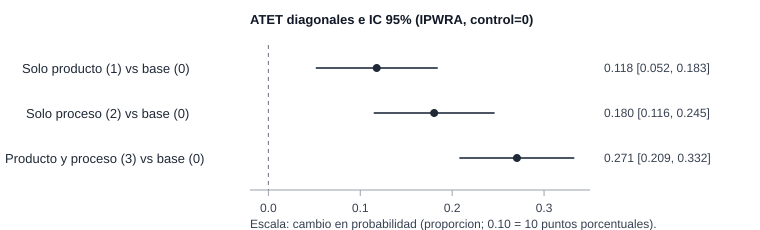

[<- Volver al índice de Causalidad](../index.qmd)

::: {.hero-box}
::: {.hero-title}
Tres contrastes positivos, sin confundir gradiente con complementariedad
:::

::: {.hero-sub}
Este análisis estima, en firmas innovadoras comparables, cómo cambia la probabilidad de reportar mejora ambiental media/alta para cada estado de innovación frente al grupo sin innovación de producto/proceso.
:::
:::

## Resumen ejecutivo

Esta ficha presenta una estimación principal sobre firmas innovadoras con comparabilidad ex ante en soporte y estabilidad de pesos. El foco narrativo es explícito: primero se hace visible la arquitectura de diseño causal y recién después se reportan los efectos.

La lectura metodológica central es que la credibilidad de la comparación depende de soporte, balance y estabilidad de ponderación, no de buscar de antemano la magnitud más alta.

## Pregunta central

¿Cómo cambia la probabilidad de mejora ambiental media/alta entre firmas innovadoras cuando se compara cada estado de innovación de producto/proceso frente al grupo sin innovación de producto/proceso, bajo un diseño de comparabilidad previamente definido?

## Por qué importa la comparabilidad

En este caso, la comparación directa entre estados de innovación puede confundir diferencias de composición con diferencias asociadas al tratamiento. Por eso, la interpretación se apoya en un diseño que restringe la comparación a observaciones con soporte útil y pesos estables.

Esta decisión permite que la lectura final se concentre en una pregunta sustantiva: cuánto cambia la probabilidad de mejora ambiental cuando el estado de innovación pasa de `0` a cada uno de los estados tratados.

## Datos y variables

::: {.small-note}
- **Unidad de análisis:** observación firma-año en panel de innovación.
- **Muestra de estimación principal:** `N = 4,393` observaciones comparables de 2.662 firmas.
- **Resultado:** indicador binario de mejora ambiental media/alta (`Y_cond`).
- **Estados de tratamiento:**  
  `0` = sin innovación de producto/proceso,  
  `1` = solo producto,  
  `2` = solo proceso,  
  `3` = producto y proceso.
- **Población objetivo de los efectos:** subpoblaciones tratadas comparables de cada estado (`D=1`, `D=2`, `D=3`) frente a su contrafactual en el grupo base (`D=0`) dentro del soporte común operativo.
:::

La estimación se organiza en tres contrastes diagonales (`1 vs 0`, `2 vs 0`, `3 vs 0`) definidos para subpoblaciones tratadas comparables dentro del soporte común operativo.

La especificación final modela el tratamiento multivaluado con `mlogit`, el resultado binario con `logit` y agrupa la inferencia por firma. IPWRA combina ambos modelos y ofrece doble robustez, pero esa propiedad no sustituye los supuestos de selección en observables y overlap.

Ambos modelos condicionan por edad, capital extranjero, proporción de profesionales y técnicos, condición exportadora, tamaño y vínculos de red. El modelo de tratamiento incorpora además interacciones de red con exportación y tamaño, y el macrosector; el modelo de resultado agrega términos cuadráticos de edad y tamaño, innovación organizacional y comercial, y un indicador de faltantes.

La muestra pasa de 5.485 observaciones con resultado y tratamiento observados a 5.393 luego de restringir sectores, 4.563 casos completos y 4.393 observaciones después del recorte de soporte. Las 170 observaciones excluidas por esa última regla delimitan la población sobre la que se interpretan los efectos.

## Especificación final documentada

La fuente curada documenta la especificación contemporánea final y sus diagnósticos. No reconstruye ni compara las alternativas consideradas durante una etapa previa de selección, por lo que esta ficha no atribuye a la configuración final una superioridad frente a especificaciones no reportadas.

La evaluación disponible se concentra en lo que sí puede comprobarse para esa especificación: soporte, balance ponderado, estabilidad de pesos y sensibilidad de la interpretación a los supuestos causales.

## Soporte y balance

Los diagnósticos de la estimación principal no muestran señales de ruptura severa:

- en los tres contrastes (`t=1,2,3`) no se observan violaciones de soporte en los indicadores `os_t#` de `teffects`;
- el balance ponderado mejora de forma marcada respecto del balance crudo;
- el contraste `ambas vs 0` es el más exigente en términos de reponderación, pero permanece dentro de una zona de balance aceptable.

Estos chequeos respaldan la credibilidad del diseño y ordenan la lectura del resultado principal.

::: {.table-box}
| Contraste | Máx. \|SMD\| sin ponderar | Máx. \|SMD\| ponderado |
|---|---:|---:|
| Solo producto (`1`) vs `0` | 0.308 | 0.038 |
| Solo proceso (`2`) vs `0` | 0.194 | 0.035 |
| Producto y proceso (`3`) vs `0` | 0.463 | 0.065 |
:::

La regla de diseño restringe la probabilidad estimada del grupo base a `0.05 <= p0(X) <= 0.95`. Después de ese recorte, `teffects` no marca observaciones fuera de soporte en los pares relevantes y el peor desbalance ponderado queda por debajo de 0.10.

No se aplica un recorte superior adicional ni winsorización de pesos. Los máximos observados son 3.35, 2.28 y 4.76 para los contrastes `1 vs 0`, `2 vs 0` y `3 vs 0`; los tamaños efectivos de muestra del grupo base son aproximadamente 470.6, 551.9 y 395.0. Estos diagnósticos no muestran una concentración extrema de la ponderación en la muestra analizada, aunque no sustituyen el supuesto de positividad.

Para el contraste más exigente (`3 vs 0`), se muestra el overlap antes y después de ponderar.

::: {.columns}
::: {.column width="50%"}

:::

::: {.column width="50%"}

:::
:::

Con estas condiciones de comparabilidad y soporte, el bloque siguiente resume los tres efectos ATET principales.

::: {.table-box}
## Resultado principal

| Contraste principal (vs grupo base `0`) | ATET | Error estándar | IC 95% |
|---|---:|---:|---:|
| Solo producto (`1`) vs sin producto/proceso (`0`) | 0.11796 | 0.03344 | [0.0524; 0.1835] |
| Solo proceso (`2`) vs sin producto/proceso (`0`) | 0.18043 | 0.03312 | [0.1155; 0.2453] |
| Producto y proceso (`3`) vs sin producto/proceso (`0`) | 0.27051 | 0.03155 | [0.2087; 0.3323] |
:::

El patrón central es nítido y consistente: `ATET_3 > ATET_2 > ATET_1 > 0` (producto y proceso > solo proceso > solo producto, siempre frente al grupo base).

Como síntesis visual del resultado principal, se muestra un mini coefplot horizontal con los tres ATET diagonales y sus IC 95%.

## Por qué el gradiente no identifica complementariedad

Los tres números no promedian sobre la misma población: cada ATET corresponde a las firmas que efectivamente están en ese estado de innovación. Por eso, restar `ATET_3 - ATET_2` no identifica el efecto causal de agregar innovación de producto a una firma que ya innova en proceso; la diferencia también cambia la población tratada sobre la que se promedia.

La conclusión defendible es más precisa: cada estado tratado presenta un efecto positivo frente a su propio contrafactual `D=0`, y el grupo con innovación de producto y proceso exhibe el ATET puntual más alto. Probar complementariedad exigiría estimar contrastes directos entre tratamientos activos sobre una población objetivo común.

## Lectura sustantiva y alcance

:::: {.quick-grid}

::: {.section-box}
**Estimandos reportados**

ATET diagonales en tratamiento multivaluado (`1 vs 0`, `2 vs 0`, `3 vs 0`) sobre un resultado binario de mejora ambiental media/alta.
:::

::: {.section-box}
**Población objetivo**

Firmas innovadoras tratadas comparables de cada estado, dentro de la muestra filtrada por soporte y completitud de covariables.
:::

::: {.section-box}
**Alcance**

Efectos interpretables como cambios causales en probabilidad, condicionados a selección en observables y overlap, para firmas innovadoras tratadas comparables en soporte.
:::

::::

Dentro del diseño aplicado, cada estado de innovación presenta un efecto positivo frente al grupo base; el ATET puntual es mayor para las firmas que realizan ambas innovaciones, sin que ese gradiente identifique por sí solo un efecto incremental entre tratamientos activos.

## Cierre: qué se concluye y qué no

Los resultados estiman, para firmas innovadoras comparables en soporte, aumentos positivos en la probabilidad de mejora ambiental media/alta en los tres estados frente al grupo base, con un gradiente creciente desde solo producto hasta producto y proceso.

La lectura causal depende de que las covariables incluidas sean suficientes para absorber la selección relevante y de que el orden temporal contemporáneo sea defendible. El panel aporta observaciones firma-año y permite agrupar la inferencia por firma, pero esta especificación no controla heterogeneidad fija de la firma ni incorpora indicadores de año. El buen balance no descarta confusión no observada, simultaneidad ni causalidad inversa; tampoco convierte el gradiente entre ATET en evidencia de complementariedad.
