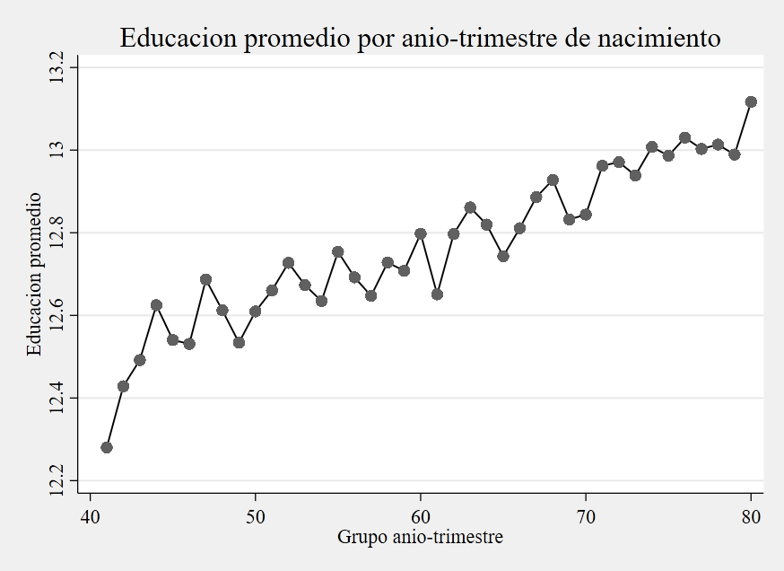
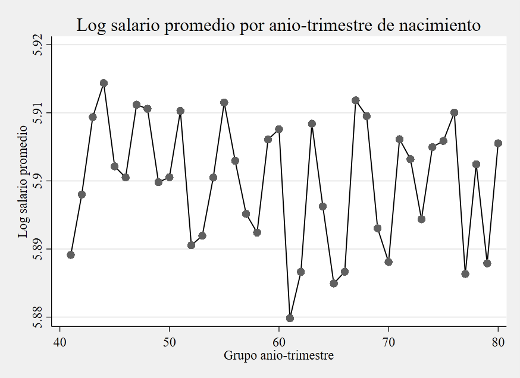

[<- Volver al índice de Causalidad](../index.qmd)

::: {.hero-box}
::: {.hero-title}
En IV, una especificación conceptualmente más completa no siempre mejora la identificación
:::

::: {.hero-sub}
En esta aplicación, el retorno estimado de la educación cambia según cómo se defina el instrumento, y la versión rica tipo Angrist-Krueger termina con primera etapa débil.
:::
:::

## Resumen ejecutivo

Este estudio estima el retorno de la educación sobre el log del salario semanal con variables instrumentales en la cohorte 1930-1939 (`N = 329,509`). La comparación central no es "qué coeficiente es más alto", sino qué tan creíble queda la identificación cuando se pasa de instrumentos simples a una arquitectura IV más rica.

La evidencia muestra un patrón nítido: con instrumentos simples, IV arroja coeficientes cercanos a `0.10` con primera etapa fuerte; en la especificación rica con controles e interacciones, el coeficiente cae a `0.0656` y la primera etapa se vuelve débil (`KP rk F = 1.699`).

## Pregunta central

¿Qué efecto de la educación sobre el log del salario semanal puede sostenerse en esta muestra cuando la identificación IV usa trimestre de nacimiento e interacciones con cohorte?

Respuesta corta: el efecto estimado es sensible al diseño del instrumento. La especificación rica con controles e interacciones sugiere un retorno positivo, pero su lectura causal debe ser prudente porque la primera etapa es débil.

## Datos y variables

::: {.small-note}
- **Unidad de análisis:** individuos en corte transversal.
- **Muestra de trabajo:** cohorte de nacimiento 1930-1939 (`global muestra "inrange(AdN,1930,1939)"`).
- **Resultado:** log salario semanal (`logSalSem`).
- **Variable potencialmente endógena:** años de educación (`educ`).
- **Instrumentos evaluados:** `Z = 1(TdN==1)`, `TdN` numérico, dummies de trimestre (`qob_2 qob_3 qob_4`) e interacciones trimestre x año de nacimiento (`QOB x YOB`), con y sin controles adicionales.
:::

## Cómo IV intenta resolver la endogeneidad

Esta no es una comparación de tratados y controles como en matching o IPWRA. Aquí la identificación causal se apoya en otra lógica: aislar la parte de `educ` que cambia por una fuente exógena (trimestre de nacimiento y sus interacciones con cohorte), y usar solo esa variación para estimar el efecto sobre salario.

En esa arquitectura, OLS puede mezclar el retorno de la educación con factores no observados que también afectan ingresos. IV entra en el módulo de causalidad porque intenta reconstruir un contrafactual causal a partir de variación exógena inducida por instrumentos, no porque sea solo una técnica alternativa de estimación.

La lectura como LATE exige cuatro condiciones: que el trimestre de nacimiento sea relevante para la educación; que sea comparable respecto de los resultados potenciales, condicional en los controles; que afecte el salario únicamente a través de la educación (exclusión); y que no existan personas cuya escolaridad responda al instrumento en la dirección opuesta al margen institucional considerado (monotonicidad). La primera condición puede diagnosticarse en los datos; las restantes dependen de la credibilidad sustantiva del diseño.

## OLS versus IV: qué cambia y por qué importa

El paso de OLS a IV importa porque `educ` puede estar correlacionada con factores no observados del salario. En este caso, sin embargo, la comparación no muestra un salto estable y unidireccional: depende del instrumento usado.

::: {.table-box}
| Comparación base | Coeficiente de `educ` | Lectura |
|---|---:|---|
| OLS robusto (sin controles) | 0.0709 | Referencia descriptiva inicial |
| OLS robusto (con edad, edad² y cohorte) | 0.0711 | Referencia ajustada por observables clave |
| IV con controles e interacciones (`QOB x YOB`) | 0.0656 | Punto IV positivo, pero con primera etapa débil |
:::

La diferencia OLS-IV en la especificación con controles e interacciones es pequeña (`0.0711` vs `0.0656`), y el test Durbin/Wu-Hausman no rechaza exogeneidad (`p = 0.8446`). Esto no prueba exogeneidad verdadera. Además, con primera etapa débil, ese contraste puede tener baja potencia para detectar endogeneidad.

## Evidencia descriptiva inicial

::: {.columns}
::: {.column width="50%"}
{fig-alt="Educación media por grupos de año y trimestre de nacimiento; la tendencia entre cohortes domina, con variaciones menores asociadas al trimestre."}
:::

::: {.column width="50%"}
{fig-alt="Logaritmo medio del salario semanal por grupos de año y trimestre de nacimiento, usado como forma reducida descriptiva."}
:::
:::

Los gráficos descriptivos muestran variación por grupo año-trimestre en educación (primera etapa descriptiva) y salario (forma reducida descriptiva). Ayudan a motivar la estrategia, pero no sustituyen los diagnósticos formales de relevancia.

En la comparación binaria más transparente, nacer en el primer trimestre reduce la educación media en 0,1088 años y el log salario semanal en 0,0111. Su cociente produce el estimador de Wald de 0,102: un retorno local aproximado de 10,2% por año adicional de educación para quienes modifican su escolaridad por ese margen instrumental.

## Criterio de credibilidad para leer la comparación IV

Antes de mirar la tabla comparativa, la lectura del coeficiente IV debe pasar por un filtro simple: la relevancia de primera etapa. Si ese filtro es débil, la interpretación causal se vuelve más frágil, aunque el coeficiente puntual sea estadísticamente significativo.

En este análisis, la comparación entre diseños IV no se interpreta como una competencia de coeficientes "más altos" o "más bajos", sino como una tensión entre magnitud estimada y credibilidad de identificación.

Además, pruebas como Durbin/Wu-Hausman o Hansen ayudan a completar el diagnóstico, pero no sustituyen por sí solas el criterio de relevancia del instrumento.

## Comparación principal de diseños IV

::: {.table-box}
| Diseño econométrico | Coeficiente de `educ` | Primera etapa (`KP rk F`) | Sobreidentificación (`Hansen p`) | Lectura |
|---|---:|---:|---:|---|
| IV binaria (trimestre 1 vs resto) | 0.1020 | 66.782 | No aplica (exactamente identificado) | Estimación alta con primera etapa fuerte |
| IV ordinal (trimestre como 1-4) | 0.0992 | 100.989 | No aplica (exactamente identificado) | Resultado similar, con supuesto lineal entre trimestres |
| IV con dummies de trimestre (`T2`, `T3`, `T4` vs `T1`) | 0.1026 | 34.054 | 0.2365 | Primera etapa fuerte y mayor flexibilidad por trimestre |
| IV con controles (`edad`, `edad²`, cohorte + `QOB x YOB`) | 0.0656 | 1.699 | 0.6424 | 2SLS convencional: `p = 0.020`; Anderson-Rubin: `p = 0.562` |
:::

Con ese filtro de lectura, la tabla resume la evidencia comparativa para esta cohorte con estimaciones robustas en corte transversal. En la especificación final, Stata elimina dos interacciones por colinealidad y quedan 28 instrumentos excluidos efectivos; su señal conjunta alcanza para rechazar subidentificación, pero no para evitar el problema de instrumentos débiles.

## Credibilidad empírica de la identificación

:::: {.quick-grid}

::: {.section-box}
**Endogeneidad (Durbin/Wu-Hausman)**

Durbin/Wu-Hausman: `p = 0.8446`.

No rechazar exogeneidad no equivale a probar exogeneidad verdadera. En esta aplicación, además, la primera etapa débil reduce la capacidad de este test para discriminar con precisión.
:::

::: {.section-box}
**Relevancia del instrumento (primera etapa)**

`KP rk F = 1.699`.

Aquí está el principal cuello de botella empírico: la estrategia causal por IV está bien planteada, pero su credibilidad se debilita porque la primera etapa en la especificación con controles e interacciones es muy baja.
:::

::: {.section-box}
**Sobreidentificación**

Hansen J: `p = 0.6424`.

No rechazar sobreidentificación no certifica validez total del diseño. Menos aún cuando la relevancia del instrumento ya es baja.
:::

::: {.section-box}
**Inferencia robusta a instrumentos débiles**

Anderson-Rubin: `p = 0.5624`.

Mientras la inferencia convencional de 2SLS rechaza efecto cero, Anderson-Rubin no lo hace. Con `KP rk F = 1.699`, esta discrepancia forma parte del resultado principal y no es un detalle técnico.
:::

::::

Como contraste adicional, `gmm2s` en la misma especificación entrega un coeficiente cercano (`0.0674`). Eso sugiere estabilidad puntual frente al estimador, pero no corrige la debilidad de la primera etapa.

## Qué lectura domina

En este ejercicio, IV no identifica un retorno único y universal: identifica efectos locales (LATE) para las personas cuya escolaridad responde a la variación inducida por las reglas de escolarización vinculadas al trimestre de nacimiento.

Por eso, cuando cambia el set de instrumentos, puede cambiar tanto la magnitud estimada como la población local efectivamente identificada. En los diseños simples, el retorno IV ronda `0.10` con primera etapa fuerte; al pasar al diseño con interacciones `QOB x YOB` y controles, el coeficiente baja a `0.0656` y la primera etapa se debilita de forma marcada (`KP rk F = 1.699`).

## Cierre

Para esta cohorte, la evidencia sugiere un retorno positivo de la educación en casi todas las variantes, pero su interpretación causal depende de qué tan convincente sea la identificación por instrumentos.

La estrategia IV mantiene una lógica causal clara: aislar variación exógena en educación para estimar su efecto sobre salarios. En esta aplicación, el límite principal no está en esa lógica, sino en la fuerza empírica de los instrumentos en la especificación con controles e interacciones.

La lectura final es directa: IV aporta una identificación causal local (LATE), pero la credibilidad de esa estimación depende de instrumentos suficientemente relevantes. Aquí, la debilidad de primera etapa acota el alcance inferencial del resultado.

La extensión moderna de esta arquitectura —instrumento binario, covariables y modelos auxiliares doblemente robustos— se desarrolla en [Participación en 401(k) y activos financieros con DR-LATE](c09_drlate_401k.qmd).
