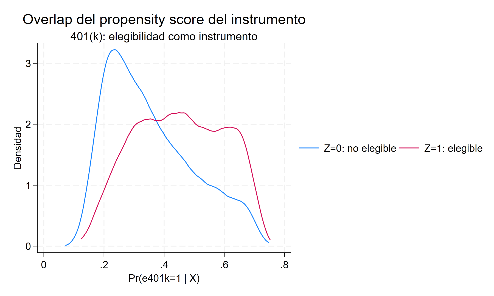
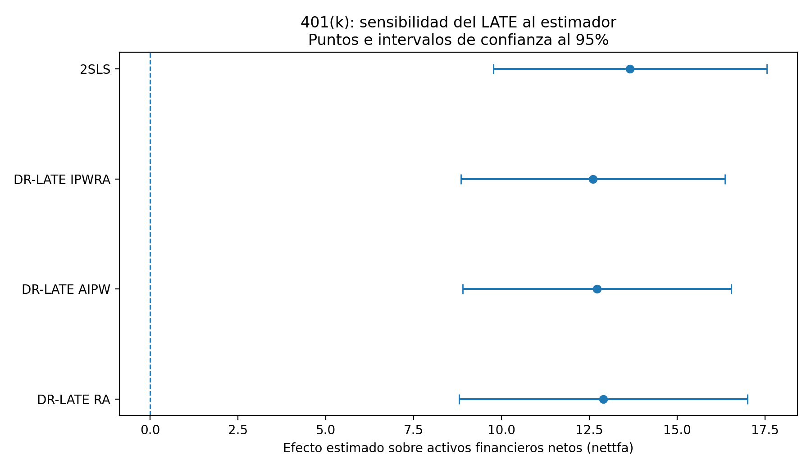

[<- Volver al índice de Causalidad](../index.qmd)

::: {.hero-box}
::: {.hero-title}
La doble robustez amplía la estimación IV, no reemplaza la validez del instrumento
:::

::: {.hero-sub}
La elegibilidad a un plan 401(k) se utiliza como instrumento de la participación efectiva para estimar efectos locales sobre los activos financieros netos, ajustando explícitamente por covariables.
:::
:::

## Resumen ejecutivo

Esta aplicación conserva la arquitectura causal de variables instrumentales: un tratamiento endógeno, un instrumento binario, una primera etapa y un efecto local para quienes modifican su participación por la elegibilidad. La extensión DR-LATE incorpora modelos separados para el resultado, el tratamiento y el mecanismo del instrumento, y permite combinar regresión ajustada con ponderación.

En 9.275 individuos, la elegibilidad eleva la participación en 68,9 puntos porcentuales y produce una primera etapa extraordinariamente fuerte (`F = 7422.81`). El benchmark 2SLS estima un LATE de 13,66 unidades de activos financieros netos; IPWRA estima 12,60. Los resultados son próximos entre 2SLS, IPWRA, AIPW y RA.

:::: {.quick-grid}

::: {.section-box}
## Pregunta central

¿Cuál es el efecto local de participar en un plan 401(k) sobre los activos financieros netos para las personas cuya participación cambia por la elegibilidad, una vez ajustadas diferencias observables?
:::

::: {.section-box}
## Respuesta corta

DR-LATE IPWRA estima un aumento de **12,60** unidades de `nettfa` para los compliers. La cercanía con 2SLS (**13,66**) muestra estabilidad del resultado; no demuestra por sí sola que el instrumento satisfaga exclusión o independencia condicional.
:::

::::

## Qué se mantiene de IV clásica y qué cambia

:::: {.quick-grid}

::: {.section-box}
**Núcleo que se mantiene**

- `p401k` sigue siendo un tratamiento potencialmente endógeno.
- `e401k` sigue siendo la fuente instrumental binaria.
- La interpretación sigue siendo local: LATE o LATT, no un efecto universal.
- Relevancia, comparabilidad condicional, exclusión y monotonicidad siguen sosteniendo la identificación.
:::

::: {.section-box}
**Aporte de DR-LATE**

- Modela por separado resultado, tratamiento e instrumento.
- Incorpora el propensity score del instrumento `P(Z=1|X)`.
- Permite formas funcionales acordes al soporte de cada variable.
- IPWRA y AIPW agregan doble robustez respecto de los modelos auxiliares.
:::

::::

La formulación moderna no sustituye la pregunta clásica —qué variación exógena mueve el tratamiento—, sino que hace explícito cómo se ajustan las diferencias observables y cómo se estiman los componentes del cociente IV.

## Datos, tratamiento e instrumento

::: {.small-note}
- **Unidad de análisis:** individuos de la base `401ksubs` (`N = 9.275`).
- **Resultado principal:** activos financieros netos (`nettfa`).
- **Tratamiento endógeno:** participación efectiva en un plan 401(k) (`p401k`).
- **Instrumento:** elegibilidad a un plan 401(k) (`e401k`).
- **Covariables:** ingreso e ingreso al cuadrado, edad y edad al cuadrado, estado civil, sexo y tamaño familiar.
- **Población objetivo:** personas cuya participación en 401(k) cambia por la elegibilidad, dentro de la región de comparabilidad condicional.
:::

El patrón de cumplimiento es especialmente transparente: entre 5.638 no elegibles no hay participantes; entre 3.637 elegibles, 2.562 participan y 1.075 no. Esta estructura se aproxima a *one-sided noncompliance*: en la muestra, recibir el tratamiento requiere ser elegible, aunque la elegibilidad no obliga a participar.

## Primera etapa, forma reducida y benchmark

::: {.table-box}
| Componente | Estimación | Lectura |
|---|---:|---|
| Elegibilidad sobre participación | 0.6889 | Primera etapa de 68,9 puntos porcentuales (`F = 7422.81`) |
| Elegibilidad sobre activos netos | 9.409 | Forma reducida positiva |
| Participación sobre activos netos, 2SLS | 13.6586 | Benchmark LATE (`EE = 1.9837`) |
:::

La primera etapa descarta la debilidad instrumental como preocupación empírica en este bloque. La interpretación causal todavía requiere que la elegibilidad sea comparable condicionalmente en las covariables, que afecte los activos únicamente mediante la participación y que no existan respuestas contrarias a la dirección de cumplimiento asumida.

## El propensity score es del instrumento

DR-LATE estima `P(e401k = 1 | X)` para comparar personas elegibles y no elegibles con covariables observadas semejantes. Esto es distinto del propensity score del tratamiento utilizado en matching: aquí se modela el mecanismo del instrumento, no la decisión final de participar.

{fig-alt="Distribuciones del propensity score del instrumento para personas elegibles y no elegibles. Existe superposición sustantiva, aunque las distribuciones no son idénticas."}

El gráfico muestra overlap observable suficiente para motivar la ponderación, pero no valida exclusión ni monotonicidad. Tampoco descarta que elegibilidad esté asociada con características laborales no capturadas por las covariables.

## Modelos auxiliares y doble robustez

En la especificación principal, el modelo del resultado es lineal, el modelo de participación es logit y el propensity score de la elegibilidad también se estima mediante logit. La inferencia conjunta se obtiene mediante un sistema GMM.

IPWRA combina regresión ajustada y ponderación. Su propiedad de doble robustez permite consistencia si el modelo del propensity score del instrumento está bien especificado **o** si están bien especificados conjuntamente los modelos del resultado y del tratamiento. AIPW comparte esta protección; RA depende de los modelos de regresión y no utiliza el propensity score del instrumento.

::: {.section-box}
**Límite de la doble robustez**

Esta propiedad protege frente a determinadas fallas de especificación de los *nuisance models*. No vuelve relevante a un instrumento débil, no corrige un efecto directo de la elegibilidad sobre los activos, no garantiza comparabilidad condicional y no repara una violación de monotonicidad.
:::

## Resultado principal: LATE y LATT

::: {.table-box}
| Estimando | Efecto | Error estándar | Población local |
|---|---:|---:|---|
| LATE, IPWRA | 12.6015 | 1.9194 | Personas cuya participación cambia por la elegibilidad |
| LATT, IPWRA | 15.3191 | 2.4440 | Población local tratada correspondiente al LATT |
:::

El LATE IPWRA se construye a partir de un efecto ajustado del instrumento sobre el resultado de 8,5971 y un efecto sobre el tratamiento de 0,6822. La estimación principal equivale a **12,60 unidades de `nettfa`** para los compliers.

El LATT de 15,32 no es una versión superior del LATE. Cambia la población local utilizada para promediar la heterogeneidad del efecto y, por tanto, responde a otra pregunta.

## Estabilidad entre estimadores

{fig-alt="Estimaciones puntuales e intervalos de confianza al 95% para 2SLS, DR-LATE IPWRA, DR-LATE AIPW y DR-LATE RA. Los cuatro intervalos se superponen ampliamente."}

2SLS estima 13,66; IPWRA, 12,60; AIPW, 12,72; y RA, 12,90. Los intervalos se superponen ampliamente. Esta estabilidad muestra que la conclusión sustantiva del caso 401(k) no depende de una única implementación, pero no permite inferir que todos los modelos auxiliares sean correctos ni validar los supuestos estructurales del instrumento.

## Qué cambia cuando el outcome o el tratamiento no son continuos

Los bloques adicionales cambian una pieza por vez para separar flexibilidad funcional de credibilidad causal.

::: {.table-box}
| Aplicación | Cambio respecto del caso canónico | Evidencia principal | Lectura |
|---|---|---|---|
| 401(k) e IRA | Outcome binario | LATE logit: 0.0206 (`EE = 0.0127`, `p = 0.106`) | El efecto se expresa como cambio de probabilidad y no se distingue de cero al 5% |
| Proximidad universitaria y educación | Tratamiento como intensidad | Primera etapa: 0.306 años (`F = 13.04`); DR-LATE lineal: 0.0978 (`EE = 0.0625`) | El margen local ya no describe compliers que pasan literalmente de cero a uno |
| Educación y número de hijos | Outcome de conteo | Poisson: -0.1490 (`EE = 0.0710`); lineal: -0.1695 (`EE = 0.0713`) | La forma funcional cambia poco la conclusión sustantiva |
| Restricciones, cigarrillos e ingreso | Tratamiento de conteo | Poisson: -0.0358 (`EE = 0.0242`); lineal: -0.0296 (`EE = 0.0192`); primera etapa `F = 7.58` | Ambos intervalos incluyen cero y el modelo más flexible no corrige una primera etapa relativamente débil |
:::

Estas extensiones muestran que logit o Poisson pueden representar mejor el soporte de un modelo auxiliar, pero no relajan los supuestos IV. En el bloque de fertilidad, además, el informe no interpreta el LATT Poisson porque el cero reportado es incompatible con los componentes `Z on Y` y `Z on D`; ese control algebraico impide tratar la salida como evidencia.

## Qué puede concluirse y qué no

La evidencia central es compatible con un efecto local positivo de la participación en 401(k) sobre los activos financieros netos para quienes participan debido a la elegibilidad. La primera etapa es muy fuerte, existe overlap observable y los resultados son estables entre 2SLS y tres implementaciones basadas en modelos auxiliares.

La conclusión sigue condicionada a independencia/comparabilidad del instrumento, exclusión y monotonicidad. La doble robustez se refiere a la estimación de componentes condicionales; no protege frente a un instrumento inválido ni transforma el LATE en un efecto promedio para toda la población.

Para la arquitectura elemental de primera etapa, forma reducida e interpretación LATE, véase [Retorno a la educación con IV](c08_vi_retorno_educacion.qmd).
