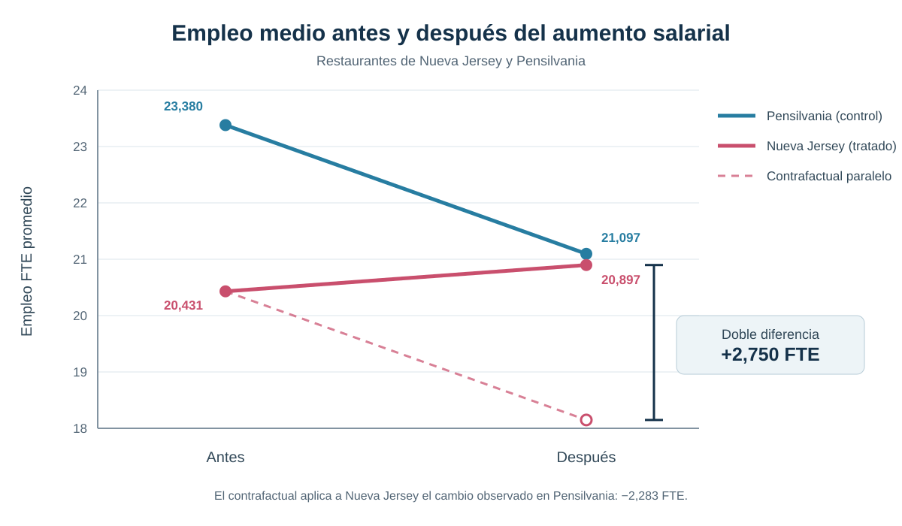
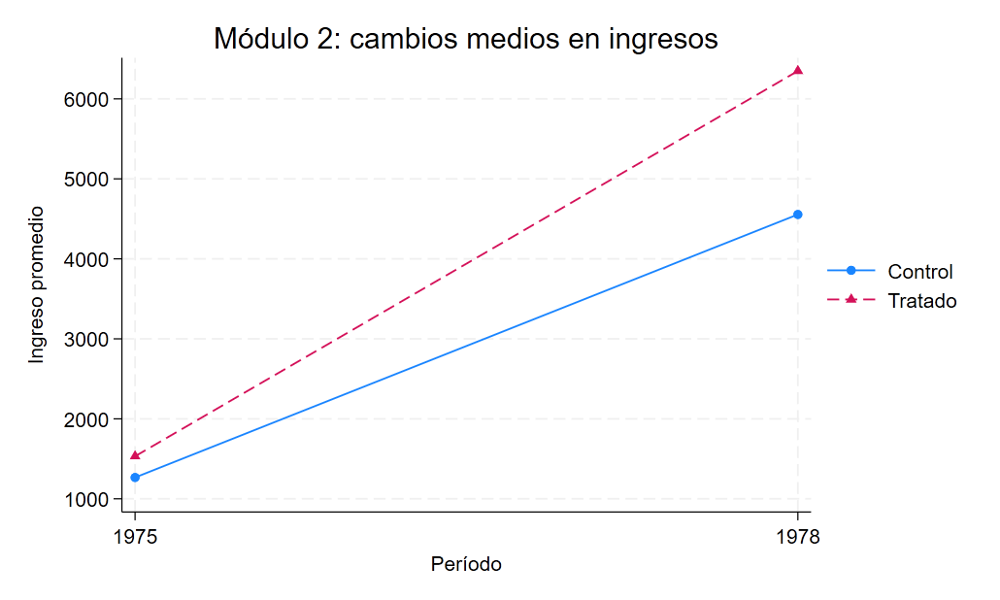
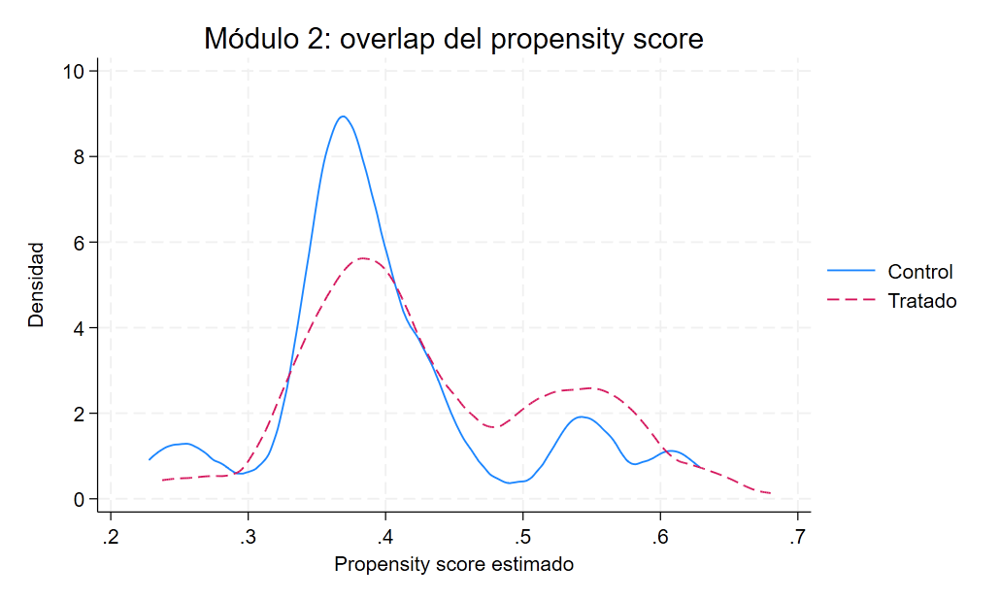

::: {.hero-box}
::: {.hero-title}
El efecto se identifica comparando cambios, no niveles aislados
:::

::: {.hero-sub}
Este análisis parte del diseño canónico de dos grupos y dos períodos y avanza hacia una versión condicional que reconstruye la población de comparación mediante propensity scores y soporte común.
:::
:::

## Pregunta central

¿Cómo puede Difference-in-Differences aislar el efecto de una intervención cuando los grupos parten de niveles distintos y, además, su comparabilidad puede depender de características observables?

**Respuesta corta:** el DiD canónico combina la diferencia temporal de cada grupo con la diferencia entre grupos. En Nueva Jersey, esa comparación estima un aumento de **2,750 empleos equivalentes a tiempo completo por restaurante**. La extensión condicional muestra que la misma lógica puede sostenerse reponderando controles comparables: en la aplicación NSW, el ATT de Abadie es cercano a **1.469 unidades monetarias de ingreso**.

## Por qué niveles y antes-después pueden ser engañosos

Una comparación transversal posterior al tratamiento mezcla el efecto buscado con diferencias permanentes entre los grupos. Si Nueva Jersey y Pensilvania ya tenían niveles de empleo distintos antes del aumento salarial, la brecha posterior no puede atribuirse directamente a la política.

El antes-después de Nueva Jersey evita esa brecha inicial, pero introduce otro problema: cualquier shock temporal que hubiera afectado el empleo aun sin el aumento salarial quedaría confundido con el tratamiento. El grupo de control permite aproximar ese cambio contrafactual.

## La lógica de la doble diferencia

El estimando de dos grupos y dos períodos puede escribirse como:

$$
\widehat{\tau}_{DiD}=
(\overline{Y}_{T,post}-\overline{Y}_{T,pre})
-(\overline{Y}_{C,post}-\overline{Y}_{C,pre}).
$$

La primera diferencia elimina componentes permanentes propios del grupo tratado. La segunda descuenta el cambio temporal observado en el control. Bajo tendencias paralelas, este último cambio aproxima lo que habría ocurrido entre los tratados en ausencia de tratamiento.

:::: {.quick-grid}

::: {.section-box}
**Tratamiento y comparación**

El tratamiento comienza entre los dos períodos para Nueva Jersey. Pensilvania no recibe la intervención y aporta el cambio contrafactual.
:::

::: {.section-box}
**Supuesto de identificación**

Sin el aumento salarial, el empleo medio de ambos grupos habría evolucionado en paralelo, aunque sus niveles iniciales fueran distintos.
:::

::: {.section-box}
**Población objetivo**

Restaurantes de Nueva Jersey observados antes y después, usando los restaurantes de Pensilvania como grupo de comparación.
:::

::::

## Aplicación canónica: Nueva Jersey y Pensilvania

La aplicación utiliza un panel balanceado de **384 restaurantes** observados antes y después del aumento del salario mínimo de Nueva Jersey. El resultado es el empleo equivalente a tiempo completo (`FTE`), que combina trabajadores de tiempo completo, gerentes y la mitad de los trabajadores de tiempo parcial.

{fig-alt="Nueva Jersey presenta un pequeño aumento del empleo FTE, mientras Pensilvania registra una caída. La distancia entre el valor observado de Nueva Jersey y su contrafactual paralelo equivale a 2,750 FTE."}

::: {.table-box}
| Grupo | Antes | Después | Cambio |
|---|---:|---:|---:|
| Pensilvania — control | 23,380 | 21,097 | −2,283 |
| Nueva Jersey — tratado | 20,431 | 20,897 | +0,467 |
| **Diferencia de cambios** |  |  | **+2,750** |
:::

El cálculo es directo: `0,467 − (−2,283) = 2,750`. La regresión saturada con indicadores de grupo, período y su interacción recupera exactamente el mismo coeficiente. No se presentan como resultados diferentes porque son dos representaciones del mismo estimando.

:::: {.metric-grid}

::: {.metric-card}
::: {.metric-label}
Efecto DiD
:::
::: {.metric-value}
+2,750
:::
::: {.metric-note}
empleos FTE por restaurante
:::
:::

::: {.metric-card}
::: {.metric-label}
Error estándar
:::
::: {.metric-value}
1,339
:::
::: {.metric-note}
agrupado por restaurante
:::
:::

::: {.metric-card}
::: {.metric-label}
p-value
:::
::: {.metric-value}
0,041
:::
::: {.metric-note}
contraste bilateral
:::
:::

::: {.metric-card}
::: {.metric-label}
Intervalo 95%
:::
::: {.metric-value}
[0,118; 5,382]
:::
::: {.metric-note}
FTE por restaurante
:::
:::

::::

Dentro de este diseño, la estimación indica que el aumento salarial elevó el empleo medio en Nueva Jersey en **2,75 FTE por restaurante** respecto de la trayectoria contrafactual aproximada por Pensilvania.

## Qué identifica el DiD 2×2

El resultado no requiere que ambos estados tengan el mismo nivel de empleo antes del tratamiento. Requiere que, sin la política, sus **cambios medios** hubieran sido comparables. Esa condición es contrafactual y no puede observarse directamente.

Con un único período pretratamiento tampoco puede realizarse un diagnóstico serio de pretrends. El gráfico permite ver las cuatro medias que forman el estimador, pero no valida tendencias paralelas: la credibilidad del supuesto depende de la elección del grupo de control, del contexto institucional y de la ausencia de shocks diferenciales coincidentes con el tratamiento.

## De tendencias paralelas incondicionales a condicionales

El diseño anterior supone que el cambio contrafactual medio es comparable sin ajustar por composición. Una formulación más flexible permite que ese cambio dependa de características previas al tratamiento:

$$
E[\Delta Y(0)\mid D=1,X]
=
E[\Delta Y(0)\mid D=0,X].
$$

Ahora los controles relevantes son aquellos con covariables `X` semejantes a las de los tratados. La identificación exige, además, **overlap**: para los perfiles observados entre los tratados debe existir una probabilidad positiva de encontrar controles comparables.

## Ponderación de Abadie y soporte común

La ponderación de Abadie utiliza el propensity score, $p(X)=P(D=1\mid X)$, para cambiar la composición del grupo de control. Los controles con perfiles observables relativamente frecuentes entre los tratados y escasos entre los controles reciben mayor peso. Por eso el overlap es crucial: cuando hay pocos controles comparables, los pesos pueden volverse grandes e inestables.

La lógica no consiste en buscar grupos con idéntico ingreso observado después del programa. Se utilizan covariables predeterminadas para construir el contrafactual: edad, educación, raza y etnia, estado civil, finalización secundaria e ingresos de 1974.

## Aplicación NSW

La extensión utiliza una muestra NSW/Dehejia-Wahba de **445 personas**: 185 participantes de un programa de capacitación laboral y 260 controles. El resultado es el cambio de ingresos entre 1975 y 1978. Los ingresos de 1974 se incorporan como covariable previa adicional para capturar diferencias de trayectoria antes del período base.

La base funciona como vehículo pedagógico para implementar el método; no constituye una replicación exacta de la aplicación empírica original de Abadie.

El propensity score probit documentado ubica a los tratados entre `0,237` y `0,680` y a los controles entre `0,228` y `0,629`. La intersección simple, `0,237–0,629`, conserva 439 de las 445 observaciones. La estabilidad del ATT al restringir ese soporte indica que el resultado no depende materialmente de unas pocas observaciones sin comparación adecuada.

:::: {.figure-pair}
::: {.figure-pair__item}
{fig-alt="Cambios medios de ingresos para participantes y controles en la aplicación NSW."}
:::
::: {.figure-pair__item}
{fig-alt="Distribuciones del propensity score para participantes y controles de NSW y su región de soporte compartido."}
:::
::::

::: {.table-box}
| Estrategia | Efecto estimado sobre el cambio de ingresos | EE | p-value | IC 95% |
|---|---:|---:|---:|---:|
| Diferencia no ajustada de cambios | 1.529 | 715 | 0,033 | [124; 2.934] |
| Ajuste lineal por covariables | 1.375 | 713 | 0,054 | [−26; 2.776] |
| Abadie, construcción manual | 1.471 | — | — | — |
| **Abadie, inferencia de `absdid`** | **1.469** | **705** | **0,037** | **[86; 2.851]** |
| Abadie restringido al soporte común | 1.448 | — | — | — |
:::

El parámetro principal es un **ATT**: el efecto promedio del programa para la población tratada representada por el diseño. La estimación con `absdid` indica un aumento de ingresos cercano a **1.469 unidades monetarias** respecto del cambio contrafactual reconstruido con controles reponderados.

El ajuste lineal se utiliza como benchmark; no equivale por sí mismo al estimador semiparamétrico de Abadie ni sustituye su esquema de identificación mediante tendencias paralelas condicionales y reponderación.

La construcción manual y el comando especializado recuperan efectos puntuales muy próximos. La inferencia principal se toma de `absdid`, que incorpora el error asociado con estimar el propensity score; por eso no se asigna a la versión manual una precisión que esa reconstrucción pedagógica no reporta.

## Heterogeneidad y sensibilidad a la escala

La aproximación lineal al ATT condicional no aporta evidencia de heterogeneidad por edad (`p = 0,485`). La pendiente asociada con educación es positiva, pero solo sugestiva (`p = 0,058`); no alcanza para afirmar que el efecto aumente sistemáticamente con los años educativos.

Al cambiar el outcome por la variación de `log(1 + ingreso)`, la diferencia sin ajuste es 0,3296 (`p = 0,514`), el ajuste lineal produce 0,3049 (`p = 0,526`) y la construcción manual de Abadie, 0,3959 sin inferencia formal. Esta sensibilidad no refuta el resultado en niveles: transforma la variable de resultado y, con ella, el estimando. Sí muestra que la precisión de la conclusión depende de la escala elegida.

## Qué cambia entre las dos estrategias

::: {.table-box}
| Dimensión | DiD canónico NJ–PA | DiD condicional NSW |
|---|---|---|
| Fuente de comparabilidad | Cambio medio del grupo de control | Cambio de controles reponderados por `X` |
| Tendencias paralelas | Incondicionales | Condicionales en observables |
| Diagnóstico central | Plausibilidad del control y contexto | Overlap y soporte común |
| Estimando | Efecto sobre restaurantes tratados de NJ | ATT para participantes comparables del programa |
| Riesgo principal | Shock diferencial entre estados | Falta de soporte o covariables insuficientes |
:::

La extensión condicional no abandona Difference-in-Differences. Conserva la comparación de cambios y modifica la forma de construir el grupo de control relevante. Esta es la continuidad metodológica que une ambas aplicaciones.

## Alcance y límites

En NJ–PA, la lectura causal se sostiene para los restaurantes observados bajo la hipótesis de que Pensilvania aproxima la trayectoria contrafactual de Nueva Jersey. La presencia de un solo período previo impide evaluar empíricamente la dinámica pretratamiento.

En NSW, el ATT se refiere a participantes comparables dentro del soporte observado. Tendencias paralelas condicionales permiten diferencias sistemáticas de cambio explicadas por las covariables incluidas, pero siguen requiriendo que no queden factores no observados capaces de generar trayectorias diferenciales.

Las dos aplicaciones tienen dos períodos principales. Por ello no abordan todavía tratamientos escalonados, efectos dinámicos ni problemas derivados de combinar múltiples cohortes y períodos en una única regresión.

## Conclusión

Difference-in-Differences sustituye comparaciones aisladas de niveles o de tiempo por una comparación de cambios con un contrafactual explícito. En la aplicación NJ–PA, el efecto estimado es **+2,750 FTE por restaurante**; en NSW, la extensión de Abadie estima un ATT cercano a **1.469 unidades monetarias de ingreso** para los participantes comparables.

La contribución central no se reduce a esos dos números. El análisis muestra una progresión: tendencias paralelas incondicionales en el diseño canónico, tendencias paralelas condicionales cuando la composición importa y ponderación con soporte común para construir una comparación más pertinente.
