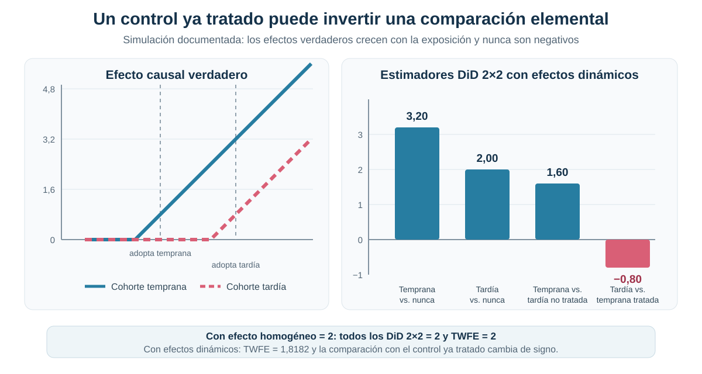

[← Volver a Difference-in-Differences moderno](../did-moderno/index.qmd)

::: {.hero-box}
::: {.hero-title}
Una regresión TWFE puede combinar comparaciones con significados causales diferentes
:::

::: {.hero-sub}
Cuando los estados adoptan una política en años distintos, el coeficiente deja de representar necesariamente un único DiD tratado-control. La descomposición de Goodman–Bacon muestra qué comparaciones lo construyen y cuándo una cohorte ya tratada termina funcionando como control.
:::
:::

## Pregunta central

¿Qué está promediando realmente una regresión con efectos fijos de unidad y tiempo cuando las unidades adoptan el tratamiento en momentos distintos?

**Respuesta corta:** el coeficiente TWFE es una combinación ponderada de múltiples estimadores DiD 2×2. Algunas comparaciones usan unidades nunca tratadas o todavía no tratadas; otras utilizan como control a cohortes cuyo tratamiento ya comenzó. Bajo efectos dinámicos o heterogéneos, estas últimas pueden perder una interpretación causal limpia.

## Del DiD canónico a la adopción escalonada

En un DiD canónico, la comparación es transparente: un grupo tratado, un grupo de control y un cambio antes-después. Con múltiples cohortes y períodos, esa arquitectura se multiplica. Cada par de cohortes puede aportar más de una comparación y sus roles pueden invertirse a lo largo del panel.

Una cohorte tratada más tarde puede ser un control pertinente mientras todavía no recibió la política. Después de su adopción, la regresión también puede comparar su cambio con el de una cohorte tratada antes. En ese segundo caso, el supuesto implícito ya no es solo que las tendencias contrafactuales sean paralelas: también importa que los efectos acumulados en el grupo usado como control no estén cambiando.

## La aplicación: divorcio unilateral y cohortes de adopción

La aplicación utiliza un panel balanceado de estados de Estados Unidos para estudiar legislación de divorcio unilateral y suicidio femenino. Su valor en esta pieza no es establecer un efecto causal definitivo, sino hacer visible la estructura de comparaciones contenida en TWFE.

:::: {.quick-grid}

::: {.section-box}
**Panel**

49 estados observados entre 1964 y 1996: 33 años y 1.617 observaciones estado-año.
:::

::: {.section-box}
**Tratamiento**

Indicador que se activa desde la adopción de la legislación de divorcio unilateral.
:::

::: {.section-box}
**Resultado**

Tasa de suicidio femenino a nivel estatal.
:::

::: {.section-box}
**Timing**

8 estados siempre tratados, 5 nunca tratados y 36 adoptantes; 14 grupos de timing.
:::

::::

## Un coeficiente TWFE aparentemente familiar

La regresión incluye efectos fijos de estado y año y agrupa la inferencia por estado.

:::: {.metric-grid}

::: {.metric-card}
::: {.metric-label}
Coeficiente TWFE
:::
::: {.metric-value}
−3,0799
:::
::: {.metric-note}
tasa de suicidio femenino
:::
:::

::: {.metric-card}
::: {.metric-label}
EE cluster
:::
::: {.metric-value}
2,4558
:::
::: {.metric-note}
agrupado por estado
:::
:::

::: {.metric-card}
::: {.metric-label}
p-value
:::
::: {.metric-value}
0,216
:::
::: {.metric-note}
contraste bilateral
:::
:::

::: {.metric-card}
::: {.metric-label}
Intervalo 95%
:::
::: {.metric-value}
[−8,018; 1,858]
:::
::: {.metric-note}
referencia t clusterizada
:::
:::

::::

La estimación puntual es negativa, pero el intervalo incluye cero. Más importante para el objetivo de esta pieza, el número `−3,0799` no identifica por sí solo qué grupos están siendo comparados ni qué interpretación causal admite esa combinación.

## Qué comparaciones esconde el coeficiente

La descomposición de Goodman–Bacon expresa el TWFE como un promedio ponderado de estimadores DiD 2×2:

$$
\widehat\beta_{TWFE}=\sum_j \omega_j\widehat\beta_j^{2\times2}.
$$

Los pesos reflejan cuánta variación residual del tratamiento aporta cada comparación. La identidad es algebraica: permite abrir el coeficiente, pero no convierte automáticamente todos sus componentes en efectos causales válidos.

## Descomposición Goodman–Bacon

::: {.table-box}
| Familia de comparación | Peso | Estimador | Contribución | Lectura causal |
|---|---:|---:|---:|---|
| Siempre tratadas vs. cohortes | 0,3844 | −7,0437 | −2,7078 | Sin contrafactual no tratado observado |
| Tempranas vs. tardías no tratadas | 0,1107 | −0,1868 | −0,0207 | Control aún no tratado |
| Tardías vs. tempranas tratadas | 0,2646 | 3,5120 | 0,9294 | Control ya tratado; efecto dinámico |
| Cohortes vs. nunca tratadas | 0,2403 | −5,3309 | −1,2809 | Control nunca tratado |
| **Reconstrucción** | **1,0000** | — | **−3,07992578** | Reproduce el TWFE directo: **−3,07992577** |
:::

La familia más cercana a comparar una cohorte temprana con otra tardía todavía no tratada recibe solo **11,1%** del peso. En cambio, **26,5%** corresponde a comparaciones donde una cohorte temprana ya tratada funciona como control, y **38,4%** involucra estados tratados antes del inicio del panel.

Las contribuciones reconstruyen el coeficiente con una diferencia numérica prácticamente nula. La descomposición no es una especificación alternativa: muestra de dónde proviene el TWFE observado.

## Cuando los tratados funcionan como controles

Considérese una cohorte temprana y otra tardía. Antes de que la segunda adopte, puede aproximar la trayectoria contrafactual de la primera. Después de la adopción tardía, TWFE también utiliza a la cohorte temprana como referencia, aunque ya lleva varios períodos expuesta.

Si el efecto es constante, restar el cambio de la cohorte temprana no altera sustantivamente la comparación. Si el efecto aumenta o disminuye con la exposición, ese cambio contiene parte del tratamiento. El grupo de referencia deja entonces de representar una trayectoria no tratada.

## Efectos homogéneos y efectos dinámicos

La simulación documentada utiliza 60 unidades, tres grupos de igual tamaño y 10 períodos. Una cohorte adopta en el período 4, otra en el 7 y la tercera nunca adopta.

Con un efecto homogéneo igual a 2, los cuatro DiD 2×2 recuperan exactamente 2 y el TWFE también es 2. La agregación es inocua porque cambiar los roles de las cohortes no cambia el efecto que se resta.

Con un efecto que crece con la exposición, el TWFE pasa a **1,8182**. Las comparaciones recuperan `3,20`, `2,00`, `1,60` y `−0,80`, respectivamente.

{fig-alt="A la izquierda, los efectos verdaderos de las cohortes temprana y tardía crecen con la exposición y nunca son negativos. A la derecha, tres estimadores 2 por 2 son positivos, pero la comparación que usa a la cohorte temprana ya tratada como control toma el valor menos 0,80."}

La comparación tardía contra temprana ya tratada se vuelve negativa aunque todos los efectos verdaderos sean no negativos. No se trata de ruido muestral: es el resultado mecánico de restar el crecimiento del efecto acumulado en la cohorte utilizada como control.

## Inferencia correcta no implica interpretación correcta

BDM muestra que la correlación serial puede hacer que los errores estándar convencionales subestimen la incertidumbre. Por eso, en esta aplicación la inferencia se agrupa por estado.

Aquí aparece un problema adicional. **Una inferencia correctamente clusterizada no corrige una comparación causal contaminada.** El clustering modifica la estimación de la varianza; no redefine qué comparaciones forman el coeficiente ni elimina el uso de unidades ya tratadas como controles.

## Alcance y límites

La aplicación empírica ilustra la composición de TWFE; no debe leerse como una estimación causal definitiva del efecto del divorcio unilateral sobre el suicidio femenino. El coeficiente no es estadísticamente concluyente y una parte importante de su peso proviene de comparaciones delicadas.

La descomposición diagnostica el origen del coeficiente, pero no ofrece por sí misma un estimador alternativo. Tampoco implica que toda regresión TWFE sea inválida: con efectos homogéneos, o bajo estructuras que preserven una interpretación común de las comparaciones, la agregación puede ser adecuada.

## Puente hacia el siguiente problema moderno

Esta primera pieza de la crisis moderna establece el vocabulario necesario: cohortes, timing de adopción, controles todavía no tratados, controles ya tratados y heterogeneidad dinámica. El paso siguiente será estudiar otra dimensión de la crisis sin volver a tratar TWFE como una única comparación transparente.

## Conclusión

Con adopción escalonada, TWFE combina múltiples DiD 2×2. En la aplicación, solo 11,1% del peso proviene de comparaciones entre cohortes tempranas y tardías todavía no tratadas; 26,5% utiliza cohortes tempranas ya tratadas como controles y 38,4% involucra unidades siempre tratadas.

La simulación muestra la consecuencia con claridad: una comparación elemental alcanza **−0,80** aunque los efectos verdaderos nunca sean negativos. La literatura moderna de DiD surge de este problema econométrico concreto. Antes de interpretar un coeficiente agregado, es necesario saber qué comparaciones lo construyen y si esas comparaciones conservan un contrafactual causal defendible.
