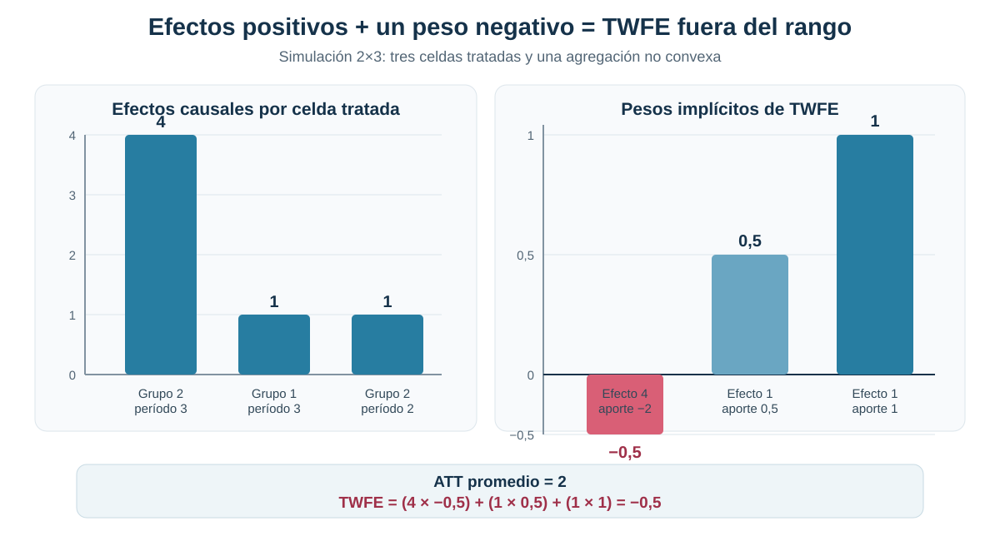
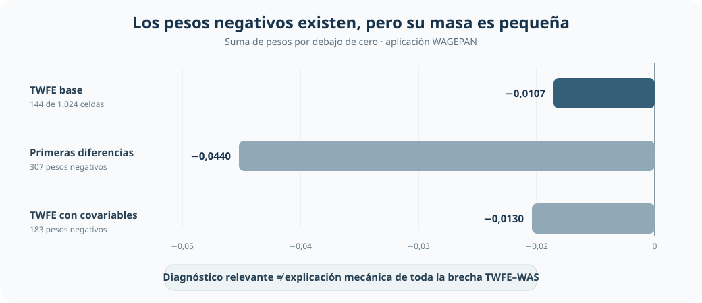
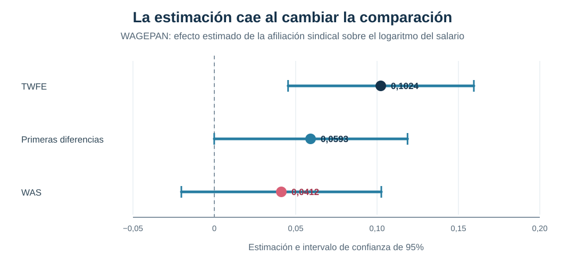

[← Volver a Difference-in-Differences moderno](../did-moderno/index.qmd)

::: {.hero-box}
::: {.hero-title}
Todos los efectos son positivos, pero TWFE estima −0,5
:::

::: {.hero-sub}
Cuando los efectos cambian entre grupos y períodos, una regresión con efectos fijos de unidad y tiempo puede agregarlos con pesos negativos. El resultado deja de ser necesariamente un promedio causal dentro del rango de los efectos verdaderos.
:::
:::

## Pregunta central

¿Cómo puede una regresión TWFE estimar un efecto negativo cuando todos los efectos causales del tratamiento son positivos?

**Respuesta corta:** los pesos implícitos de TWFE suman uno, pero no tienen que ser todos positivos. En la simulación 2×3, los efectos tratados son `1`, `1` y `4`; su promedio es **2**, pero un peso igual a **−0,5** sobre la celda con el efecto más grande lleva el coeficiente TWFE a **−0,5**.

:::: {.metric-grid}

::: {.metric-card}
::: {.metric-label}
Efectos tratados
:::
::: {.metric-value}
1 · 1 · 4
:::
::: {.metric-note}
todos positivos
:::
:::

::: {.metric-card}
::: {.metric-label}
ATT promedio
:::
::: {.metric-value}
2
:::
::: {.metric-note}
promedio simple de las tres celdas
:::
:::

::: {.metric-card}
::: {.metric-label}
TWFE
:::
::: {.metric-value}
−0,5
:::
::: {.metric-note}
fuera del rango de los efectos
:::
:::

::::

## La paradoja en una simulación 2×3

El ejemplo contiene dos grupos y tres períodos. Un grupo comienza a recibir el tratamiento en el segundo período y el otro en el tercero. Los resultados sin tratamiento siguen la misma evolución; la única heterogeneidad proviene de que una de las celdas tratadas tiene un efecto igual a 4, mientras las otras dos tienen un efecto igual a 1.

{fig-alt="Las tres celdas tratadas tienen efectos positivos de 4, 1 y 1. Sus pesos TWFE son menos 0,5, 0,5 y 1. La contribución negativa de la primera celda lleva el coeficiente TWFE a menos 0,5, aunque el ATT promedio es 2."}

La celda con efecto 4 recibe un peso de −0,5 y aporta −2 al coeficiente. Las otras dos celdas aportan 0,5 y 1. La suma es −0,5. Esta reversión no proviene de ruido muestral ni de un error estándar grande: surge de la forma en que la regresión agrega efectos causales heterogéneos.

## De comparaciones 2×2 a pesos sobre efectos heterogéneos

La descomposición de Goodman–Bacon permite reconocer las comparaciones 2×2 que forman TWFE y detectar cuándo una cohorte ya tratada funciona como control. El paso adicional consiste en preguntar cómo esas comparaciones terminan ponderando los efectos causales de cada grupo y período.

Bajo tendencias paralelas apropiadas, el coeficiente poblacional puede escribirse como

$$
\beta_{TWFE}=\sum_{g,t:D_{g,t}=1} w_{g,t}\,ATT_{g,t},
\qquad \sum_{g,t:D_{g,t}=1}w_{g,t}=1.
$$

Que los pesos sumen uno no convierte la expresión en un promedio convexo. Algunos pesos pueden estar por debajo de cero. Cuando los efectos son homogéneos, esa característica no cambia el resultado: cualquier combinación cuyos pesos sumen uno recupera el mismo efecto. Con heterogeneidad, en cambio, la ubicación de los pesos negativos importa.

Primeras diferencias tampoco eliminan mecánicamente el problema. Cambian la transformación y las comparaciones implícitas, pero aún pueden asignar pesos negativos a efectos heterogéneos.

## El resultado central

::: {.table-box}

**Panel A — Simulación 2×3**

| Celda tratada | Efecto verdadero | Peso TWFE | Contribución |
|---|---:|---:|---:|
| Grupo 2, período 3 | 4 | −0,5 | −2,0 |
| Grupo 1, período 3 | 1 | 0,5 | 0,5 |
| Grupo 2, período 2 | 1 | 1,0 | 1,0 |
| **Resultado agregado** | **ATT = 2** | **Suma = 1** | **TWFE = −0,5** |

**Panel B — Aplicación WAGEPAN**

| Método | Estimación | EE | IC95% |
|---|---:|---:|---:|
| TWFE | **0,1024** | 0,0291 | [0,0453; 0,1595] |
| Primeras diferencias | **0,0593** | 0,0302 | [−0,0001; 0,1187] |
| WAS | **0,0412** | 0,0313 | [−0,0202; 0,1026] |

:::

La simulación establece la posibilidad econométrica extrema. La aplicación muestra una situación más matizada: las tres estimaciones son positivas, pero su magnitud y precisión cambian de forma sustantiva con la comparación utilizada.

Los errores estándar (EE) de TWFE y primeras diferencias se agrupan por trabajador; sus intervalos usan la distribución t y el de primeras diferencias incluye cero por un margen mínimo. WAS conserva la inferencia de su implementación. TWFE utiliza 4.360 observaciones en niveles; primeras diferencias y WAS trabajan con 3.815 transiciones anuales. Estas filas no constituyen por sí solas un contraste entre estimadores en muestra común.

## Aplicación: afiliación sindical y salarios

La aplicación utiliza el panel WAGEPAN para comparar estimaciones del efecto de la afiliación sindical sobre el logaritmo del salario. El tratamiento puede cambiar dentro de una misma trayectoria laboral, lo que permite distinguir transiciones hacia o fuera de la afiliación y construir comparaciones entre quienes cambian de estado y quienes permanecen en él.

:::: {.quick-grid}

::: {.section-box}
**Unidad de análisis**

545 trabajadores observados entre 1980 y 1987: 4.360 observaciones persona-año.
:::

::: {.section-box}
**Resultado**

Logaritmo del salario individual.
:::

::: {.section-box}
**Tratamiento**

Indicador de afiliación sindical, con entradas y salidas observadas en el panel.
:::

::: {.section-box}
**Comparación**

TWFE y primeras diferencias frente a WAS, que compara switchers con stayers pertinentes.
:::

::::

## Diagnóstico empírico de pesos

Bajo el supuesto de tendencias paralelas utilizado en la descomposición, el TWFE base pondera **1.024 efectos de celdas trabajador-año**. De sus pesos, **144 son negativos** —14,1%—, pero su masa agregada es solo **−0,0107**. La presencia de pesos negativos confirma que el coeficiente merece ser abierto y diagnosticado; la masa pequeña impide atribuirles mecánicamente toda la distancia entre estimadores.

{fig-alt="Comparación horizontal de la masa agregada de pesos negativos en WAGEPAN: menos 0,0107 en TWFE base, menos 0,0440 en primeras diferencias y menos 0,0130 en TWFE con covariables. También se informa la cantidad de pesos negativos de cada especificación."}

Las tres masas son pequeñas en valor absoluto; aun la mayor, correspondiente a primeras diferencias, alcanza **−0,0440** y no explica automáticamente la distancia entre TWFE y WAS.

::: {.small-note}
**Lectura disciplinada.** WAGEPAN no reproduce la paradoja extrema de la simulación. El coeficiente TWFE permanece positivo y el peso negativo agregado es reducido. El diagnóstico identifica una vulnerabilidad del estimando, no una explicación automática de cada diferencia empírica.
:::

Las medidas formales de sensibilidad a heterogeneidad precisan esa lectura. Para TWFE base, el paquete reporta $\underline{\sigma}=0{,}0945$ y $\overline{\sigma}=3{,}1893$; para primeras diferencias, 0,0319 y 0,6039; y para TWFE con covariables, 0,0764 y 2,0238. La primera medida resume cuánta heterogeneidad mínima sería compatible con un efecto promedio relevante igual a cero; la segunda, cuánta se necesitaría para que todos los efectos tuvieran signo opuesto al coeficiente. No estiman la dispersión verdadera de los ATT. En el TWFE base, el nivel puede ser sensible a heterogeneidad de un orden comparable al coeficiente, mientras que atribuir su signo positivo a una reversión extrema exigiría una heterogeneidad mucho mayor.

## TWFE, primeras diferencias y WAS

{fig-alt="TWFE estima 0,1024 con intervalo positivo; primeras diferencias estima 0,0593 con intervalo de menos 0,0001 a 0,1187, que incluye cero por un margen mínimo; WAS estima 0,0412 y su intervalo de confianza también incluye cero."}

TWFE estima un cambio de aproximadamente **10,2 puntos logarítmicos** en el salario asociado con la afiliación bajo las comparaciones implícitas de esa regresión. Primeras diferencias reduce la estimación a **5,9 puntos logarítmicos** y WAS a **4,1 puntos logarítmicos**. Un contraste bootstrap separado, realizado en muestra común, reporta una diferencia media TWFE–WAS de aproximadamente **0,0624**, con `p = 0,02`. Esa cifra resume las diferencias en las réplicas bootstrap; no se obtiene restando las filas de la tabla anterior.

La comparación no establece que WAS sea automáticamente la estimación causal correcta. Los métodos agregan transiciones y poblaciones de referencia de manera diferente; por tanto, la distancia entre coeficientes es una señal metodológica que debe leerse junto con los supuestos y diagnósticos de cada estimando.

## Switchers y stayers como comparación alternativa

La alternativa estática de de Chaisemartin–D’Haultfoeuille, DIDM, organiza la estimación alrededor de quienes cambian de tratamiento —*switchers*— y quienes permanecen en el mismo estado —*stayers*. En este caso binario, WAS (*Weighted Average Slope*, pendiente media ponderada), con emparejamiento exacto por estado inicial, implementa esa misma lógica:

- **Entradas a la afiliación (`0→1`):** el cambio salarial de quienes entran se compara con el de quienes siguen sin afiliación (`0→0`).
- **Salidas de la afiliación (`1→0`):** el cambio salarial de quienes permanecen afiliados (`1→1`) se compara con el de quienes salen. La resta se invierte para expresar también el efecto de estar afiliado frente a no estarlo.

Los contrastes se agregan según el número de cambios observados. Aquí participan **250 transiciones de afiliación: 128 entradas y 122 salidas**. El estimando es el efecto contemporáneo para esas transiciones, con stayers del mismo estado inicial como contrafactual; no es una trayectoria dinámica ni un promedio para todos los trabajadores del panel.

El taller verifica ese objeto estático con tres implementaciones. La construcción manual entrega **0,0310** y no produce inferencia formal; la implementación histórica de DIDM estima **0,0412** con EE **0,0329**; y WAS moderno estima **0,0412** con EE **0,0313**. La proximidad de los puntos confirma la coherencia de la implementación, mientras que la diferencia entre errores estándar responde a procedimientos inferenciales distintos. Esa verificación no resuelve por sí misma la validez del contrafactual.

::: {.small-note}
**Interpretación del resultado.** El punto WAS de 0,0412 representa una diferencia estimada de **4,1 puntos logarítmicos en el salario por estar afiliado frente a no estarlo**, para las transiciones que componen el agregado. Su lectura causal requiere tendencias paralelas entre switchers y stayers comparables; el intervalo y los placebos permiten evaluar cuánto respalda esta aplicación esa interpretación.
:::

## Placebos y credibilidad causal

El primer placebo de WAS, ubicado antes del cambio de tratamiento, alcanza **0,0802**, con un error estándar de **0,0350**, y resulta estadísticamente distinto de cero. Los dos placebos más alejados no muestran el mismo patrón, pero el desvío inmediatamente anterior es suficiente para limitar la interpretación.

::: {.small-note}
**Implicación:** WAS produce una estimación menor e imprecisa, cuyo IC95% incluye cero. Además, el placebo más próximo al cambio cuestiona la comparabilidad de las trayectorias. La aplicación no sostiene una conclusión causal fuerte sobre el efecto de la afiliación sindical en los salarios.
:::

## Qué resuelve la alternativa y qué no

El diagnóstico de pesos responde qué efectos agrega TWFE y cuánta importancia reciben las celdas con ponderación negativa. WAS propone una comparación más controlada entre transiciones observadas. Son avances sobre la interpretación opaca de un único coeficiente TWFE.

Ninguno reemplaza los supuestos de identificación. Un estimador con una agregación más defendible puede seguir siendo vulnerable si switchers y stayers habrían evolucionado de manera diferente aun sin cambiar de tratamiento. El placebo significativo hace visible precisamente ese límite.

## Puente hacia efectos dinámicos

La crisis no termina con el coeficiente estático. Si TWFE puede agregar de forma problemática efectos heterogéneos, la pregunta siguiente es qué ocurre cuando se incorporan *leads* y *lags* para estimar una trayectoria completa antes y después del tratamiento.

## Conclusión

TWFE puede dejar de representar un promedio causal razonable cuando combina efectos heterogéneos mediante pesos negativos. En el ejemplo 2×3, todos los efectos verdaderos son positivos y su promedio es 2, pero la regresión entrega −0,5: una reversión de signo producida enteramente por la agregación.

La aplicación exige una lectura más contenida. La masa negativa de TWFE es pequeña; WAS reduce la estimación de 0,1024 a 0,0412, pero su intervalo incluye cero y el primer placebo resulta significativo. Detectar una fragilidad en TWFE no valida automáticamente una alternativa.

**No basta con preguntar qué estimador se utiliza: es necesario entender qué efectos agrega y si las comparaciones que emplea son creíbles.**
