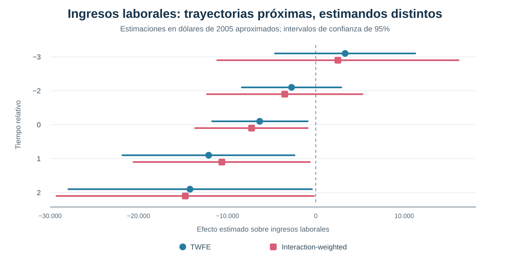

[← Volver a Difference-in-Differences moderno](../did-moderno/index.qmd)

::: {.hero-box}
::: {.hero-title}
Un coeficiente llamado “lead −2” puede contener efectos posteriores al tratamiento
:::

::: {.hero-sub}
Los event studies TWFE parecen ordenar el tiempo con claridad: leads antes, una referencia y lags después. Con adopción escalonada y efectos heterogéneos, esa etiqueta no determina por sí sola qué efectos causales agrega cada coeficiente.
:::
:::

## Pregunta central

¿Los coeficientes de un event study TWFE miden realmente el efecto causal correspondiente a cada período relativo al tratamiento?

**Respuesta corta:** no necesariamente. Cada coeficiente puede combinar efectos de distintas cohortes y otros tiempos relativos. Incluso un *lead* puede asignar peso a efectos pos-tratamiento y desplazarse aunque no exista anticipación causal verdadera.

## La promesa visual de un event study

La lectura habitual es atractiva: los *leads* describen la evolución previa, el período omitido fija la referencia y los *lags* reconstruyen cómo cambia el efecto después del tratamiento. Bajo un único momento de adopción y efectos homogéneos, esa intuición puede ser adecuada.

Con adopción escalonada, cada punto de la trayectoria surge de comparar cohortes expuestas en momentos diferentes. Si los efectos también varían entre cohortes o con la duración de la exposición, una regresión TWFE dinámica no recupera automáticamente un ATT limpio para cada tiempo relativo.

## Por qué una etiqueta temporal no define el estimando

El coeficiente dinámico asociado con el tiempo relativo $\ell$ puede representarse como una combinación de efectos cohorte-tiempo:

$$
\widehat\mu_{\ell}^{TWFE}
=\sum_{e,k} w_{e,k}^{\ell}\,CATT_{e,k}.
$$

El superíndice $\ell$ identifica el coeficiente de la regresión. El subíndice $k$ identifica el tiempo relativo del efecto que recibe peso. Nada obliga a que $k=\ell$ en todas las celdas. Esa diferencia es el origen de la contaminación dinámica.

La pieza anterior mostró que TWFE puede ponderar de manera problemática efectos heterogéneos en un coeficiente estático. Aquí el mismo problema se extiende a una secuencia completa de *leads* y *lags*.

## Cuando un lead incorpora efectos posteriores

El diagnóstico del coeficiente `lead −2` revela pesos distintos de cero sobre efectos ocurridos en los períodos 0 y 1 de varias cohortes. Esos efectos pertenecen al pos-tratamiento, aunque el coeficiente visible esté etiquetado como previo.

{fig-alt="El coeficiente TWFE etiquetado como lead menos dos asigna pesos positivos y negativos a celdas pos-tratamiento de las cohortes 8, 9 y 10 en los tiempos relativos cero y uno. Por tanto, no utiliza exclusivamente información del período menos dos."}

La suma de esos pesos sobre períodos posteriores puede ser pequeña o incluso cercana a cero. Eso no implica que su contribución sea nula: al multiplicarlos por efectos heterogéneos de distinta magnitud, las cancelaciones de pesos dejan de garantizar cancelaciones económicas.

## Ausencia de anticipación no garantiza leads TWFE iguales a cero

El módulo impone un ejercicio transparente: todos los CATT pretratamiento se fijan en cero y se conservan los efectos estimados posteriores al tratamiento. Aun bajo esa ausencia de anticipación, las contribuciones pos-tratamiento a los coeficientes de ingresos alcanzan aproximadamente:

:::: {.metric-grid}

::: {.metric-card}
::: {.metric-label}
Contribución a lead −3
:::
::: {.metric-value}
+445
:::
::: {.metric-note}
proveniente de efectos pos-tratamiento
:::
:::

::: {.metric-card}
::: {.metric-label}
Contribución a lead −2
:::
::: {.metric-value}
−116
:::
::: {.metric-note}
proveniente de efectos pos-tratamiento
:::
:::

::::

El ejercicio no afirma que esos números sean los verdaderos efectos previos. Demuestra algo más básico: un *lead* TWFE puede moverse por efectos que ocurren después del tratamiento. Por eso no constituye automáticamente un test limpio de anticipación o tendencias paralelas.

## Aplicación: hospitalización y consecuencias económicas

La aplicación utiliza RAND HRS para estudiar cómo evolucionan el gasto médico de bolsillo y los ingresos laborales alrededor de la primera hospitalización observada. Las cohortes se definen por la wave en que ocurre esa hospitalización índice.

:::: {.quick-grid}

::: {.section-box}
**Población inicial**

2.332 personas de 50 a 59 años al momento de la hospitalización índice.
:::

::: {.section-box}
**Panel**

Waves 7–11, aproximadamente 2004–2012, conservando el desbalance observado.
:::

::: {.section-box}
**Tratamiento**

Indicador absorbente desde la primera hospitalización en las waves 8, 9, 10 u 11.
:::

::: {.section-box}
**Resultados**

Gasto médico de bolsillo e ingresos laborales en dólares reales de 2005.
:::

::::

La ventana central utiliza tiempos relativos `−3`, `−2`, `0`, `1` y `2`, con `−1` como referencia. La muestra comparable contiene **3.605 observaciones de 963 personas**, con errores estándar agrupados por individuo.

## Cohortes, control y soporte

La muestra analítica está definida alrededor de una hospitalización observada, por lo que no contiene un grupo nunca tratado limpio con un tiempo índice comparable. La estrategia utiliza la cohorte tratada en la wave 11 como control y restringe la estimación a `wave < 11`, cuando esa cohorte todavía no fue hospitalizada.

El soporte cambia con el tiempo relativo. Tres cohortes contribuyen al período 0, dos al período 1 y solo la cohorte 8 permite estimar el período 2. Aunque existe información observada para `l = 3`, no hay soporte comparable para construir el estimador interaction-weighted correspondiente; por eso no se presenta como parte de la trayectoria central.

## TWFE frente a interaction-weighted

Sun–Abraham estima primero efectos específicos por cohorte y tiempo relativo, utilizando como comparación a la cohorte aún no tratada. Después los agrega con participaciones de cohorte explícitas. El estimador interaction-weighted —IW— aproxima así la propiedad deseada: cada punto resume efectos causales definidos para el mismo tiempo relativo.

En esta aplicación, TWFE e IW producen curvas numéricamente cercanas. Esa proximidad es un resultado empírico, no una garantía algebraica ni una equivalencia entre estimandos.

::: {.table-box}
| Tiempo relativo | Gasto TWFE | Gasto IW | Ingresos TWFE | Ingresos IW |
|---:|---:|---:|---:|---:|
| −3 | 226 | 278 | 3.294 | 2.493 |
| −2 | 511 | 474 | −2.751 | −3.515 |
| 0 | **2.916** | **2.662** | **−6.318** | **−7.267** |
| 1 | 373 | 183 | **−12.121** | **−10.632** |
| 2 | 483 | 198 | **−14.189** | **−14.734** |
:::

Las cifras están expresadas en dólares reales de 2005. La tabla organiza la comparación del estimando; la inferencia principal aparece en la trayectoria IW.

## Gasto médico e ingresos laborales

El estimador IW muestra un aumento inmediato del gasto médico de bolsillo en el período de hospitalización: **2.662 dólares**, con EE **649**. Las estimaciones posteriores son 183 y 198 dólares, ambas imprecisas.

Para ingresos laborales, IW estima una caída de **7.267 dólares** en el período 0, con EE **3.237**. La reducción alcanza **10.632 dólares** en el período 1 —EE 5.079— y **14.734 dólares** en el período 2 —EE 7.416—.

{fig-alt="TWFE e interaction-weighted producen trayectorias numéricamente próximas para los ingresos laborales. Ambos muestran valores cercanos a cero antes de la hospitalización y caídas desde el período cero, con intervalos amplios."}

La comparación no sostiene que TWFE haya fallado dramáticamente en esta muestra. Muestra que dos curvas parecidas pueden tener construcciones diferentes: IW agrega CATT cohorte-tiempo de forma explícita; TWFE puede mezclar efectos de otros momentos relativos.

## Qué dicen —y qué no dicen— los leads

Los tests conjuntos de los períodos `−3` y `−2` arrojan:

::: {.table-box}
| Outcome | Test de leads TWFE | Test de leads IW |
|---|---:|---:|
| Gasto médico de bolsillo | p = 0,6705 | p = 0,8330 |
| Ingresos laborales | p = 0,0912 | p = 0,2485 |
:::

Los resultados IW no muestran evidencia estadística de efectos previos en la ventana utilizada. Esto es un diagnóstico compatible con ausencia de anticipación, no una prueba definitiva de tendencias paralelas.

En TWFE, la interpretación es todavía más limitada. Un *lead* distinto de cero podría reflejar anticipación, diferencias preexistentes, contaminación pos-tratamiento u otros tiempos relativos. Un no rechazo tampoco demuestra que las comparaciones contrafactuales sean válidas.

## Qué exige una dinámica causal interpretable

La construcción interaction-weighted funciona aquí como contraste metodológico, no como revisión exhaustiva de las soluciones modernas. Permite precisar qué propiedad se busca recuperar:

1. definir efectos causales por cohorte y período;
2. utilizar grupos de comparación que todavía no recibieron el tratamiento;
3. verificar que cada tiempo relativo tenga soporte;
4. agregar los efectos mediante reglas explícitas y transparentes.

Estas exigencias no sustituyen los supuestos de identificación. La interpretación causal continúa dependiendo de la comparabilidad de las cohortes y de la plausibilidad de las tendencias paralelas relevantes.

## Conclusión

Un event study TWFE no puede interpretarse automáticamente como una trayectoria de ATT por tiempo relativo. Bajo adopción escalonada y heterogeneidad, cada coeficiente puede mezclar cohortes y momentos distintos; incluso un *lead* puede contener efectos pos-tratamiento.

En la aplicación HRS, TWFE e IW son numéricamente próximos: el gasto médico aumenta en la hospitalización y los ingresos laborales caen desde el período índice. La similitud de las curvas no elimina la diferencia de estimando ni convierte los *leads* TWFE en tests limpios de pretratamiento.

La crisis moderna deja instalada una regla de construcción: **estimar efectos causales definidos por cohorte y período mediante comparaciones válidas, y agregarlos después con reglas transparentes**. Esa es la base para evaluar sistemáticamente los estimadores modernos en el bloque siguiente.
