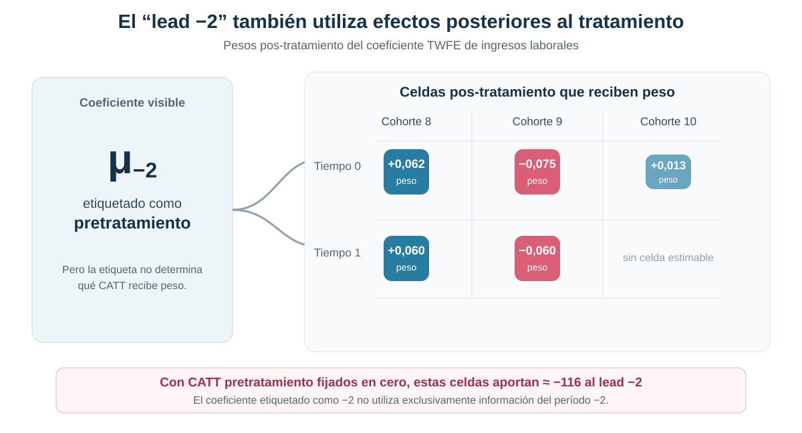
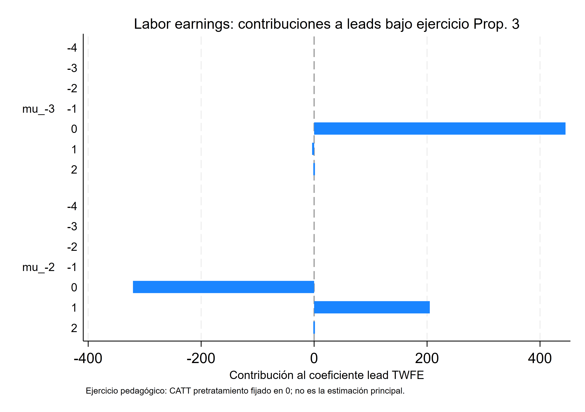
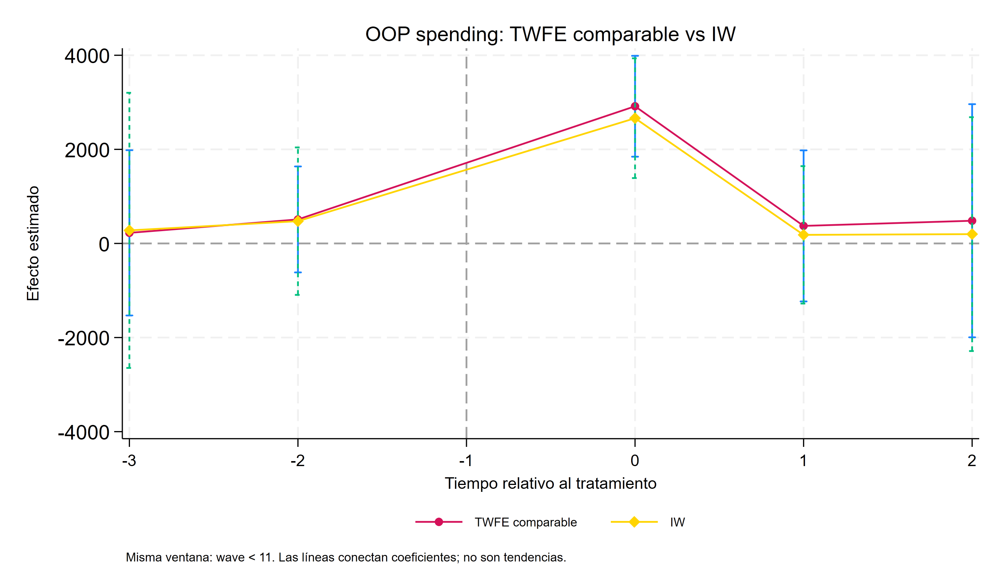
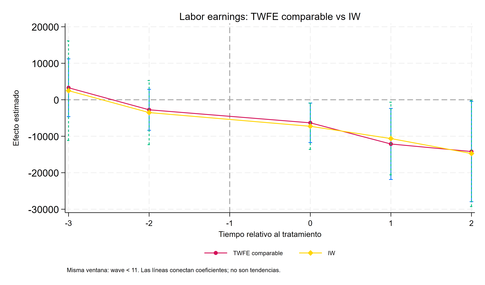

::: {.hero-box}
::: {.hero-title}
Un coeficiente llamado “lead −2” puede contener efectos posteriores al tratamiento
:::

::: {.hero-sub}
Los event studies TWFE parecen ordenar el tiempo con claridad: leads antes, una referencia y lags después. Con adopción escalonada y efectos heterogéneos, esa etiqueta no determina por sí sola qué efectos causales agrega cada coeficiente.
:::
:::

## Pregunta central

¿Los coeficientes de un event study TWFE miden realmente el efecto causal correspondiente a cada período relativo al tratamiento?

**Respuesta corta:** no necesariamente. Cada coeficiente puede combinar efectos de distintas cohortes y otros tiempos relativos. Incluso un *lead* puede asignar peso a efectos pos-tratamiento y desplazarse aunque no exista anticipación causal verdadera.

## La promesa visual de un event study

La lectura habitual es atractiva: los *leads* describen la evolución previa, el período omitido fija la referencia y los *lags* reconstruyen cómo cambia el efecto después del tratamiento. Bajo un único momento de adopción y efectos homogéneos, esa intuición puede ser adecuada.

Con adopción escalonada, cada punto de la trayectoria surge de comparar cohortes expuestas en momentos diferentes. Si los efectos también varían entre cohortes o con la duración de la exposición, una regresión TWFE dinámica no recupera automáticamente un ATT limpio para cada tiempo relativo.

## Por qué una etiqueta temporal no define el estimando

El efecto medio sobre los tratados de la cohorte $e$ en el tiempo relativo $k$ se denota $CATT_{e,k}$. Bajo los supuestos de identificación y la normalización de referencia, el coeficiente poblacional TWFE asociado con $\ell$ puede representarse esquemáticamente como una combinación de esos efectos:

$$
\mu_{\ell}^{TWFE}
=\sum_{e,k} w_{e,k}^{\ell}\,CATT_{e,k}.
$$

El superíndice $\ell$ identifica el coeficiente de la regresión. El subíndice $k$ identifica el tiempo relativo del efecto que recibe peso. Nada obliga a que $k=\ell$ en todas las celdas. Esa diferencia es el origen de la contaminación dinámica.

El análisis anterior mostró que TWFE puede ponderar de manera problemática efectos heterogéneos en un coeficiente estático. Aquí el mismo problema se extiende a una secuencia completa de *leads* y *lags*.

## Cuando un lead incorpora efectos posteriores

El diagnóstico del coeficiente `lead −2` revela pesos distintos de cero sobre efectos ocurridos en los períodos 0 y 1 de varias cohortes. Esos efectos pertenecen al pos-tratamiento, aunque el coeficiente visible esté etiquetado como previo.

{fig-alt="El coeficiente TWFE etiquetado como lead menos dos asigna pesos positivos y negativos a celdas pos-tratamiento de las cohortes 8, 9 y 10 en los tiempos relativos cero y uno. Por tanto, no utiliza exclusivamente información del período menos dos."}

La suma de esos pesos sobre períodos posteriores puede ser pequeña o incluso cercana a cero. Eso no implica que su contribución sea nula: al multiplicarlos por efectos heterogéneos de distinta magnitud, las cancelaciones de pesos dejan de garantizar cancelaciones económicas.

## Ausencia de anticipación no garantiza leads TWFE iguales a cero

En la aplicación sobre hospitalización e ingresos laborales, se fijan en cero todos los CATT pretratamiento y se conservan los efectos estimados posteriores. Aun bajo esa ausencia de anticipación, las contribuciones netas pos-tratamiento a los coeficientes de ingresos alcanzan las siguientes magnitudes, expresadas aproximadamente en dólares de 2005:

:::: {.metric-grid}

::: {.metric-card}
::: {.metric-label}
Contribución a lead −3
:::
::: {.metric-value}
+441,6
:::
::: {.metric-note}
contribución neta de efectos pos-tratamiento
:::
:::

::: {.metric-card}
::: {.metric-label}
Contribución a lead −2
:::
::: {.metric-value}
−115,9
:::
::: {.metric-note}
contribución neta de efectos pos-tratamiento
:::
:::

::::

{fig-alt="Contribuciones de efectos pos-tratamiento a los coeficientes lead menos tres y menos dos del event study TWFE de ingresos."}

El ejercicio no afirma que esos números sean los verdaderos efectos previos. Demuestra algo más básico: un *lead* TWFE puede moverse por efectos que ocurren después del tratamiento. Por eso no constituye automáticamente un test limpio de anticipación o tendencias paralelas.

## Aplicación: hospitalización y consecuencias económicas

La aplicación utiliza RAND HRS Longitudinal File 2022 para estudiar cómo evolucionan el gasto médico de bolsillo y los ingresos laborales alrededor de la primera hospitalización observada. Ilustra el método de Sun–Abraham con esta base alternativa. Las cohortes se definen por la ronda de encuesta en que ocurre esa hospitalización índice.

:::: {.quick-grid}

::: {.section-box}
**Población inicial**

2.332 personas de 50 a 59 años al momento de la hospitalización índice.
:::

::: {.section-box}
**Panel**

Rondas 7–11, aproximadamente 2004–2012, conservando el desbalance observado.
:::

::: {.section-box}
**Tratamiento**

Indicador que permanece activo desde la primera hospitalización en las rondas 8, 9, 10 u 11.
:::

::: {.section-box}
**Resultados**

Gasto médico de bolsillo e ingresos laborales, expresados aproximadamente en dólares de 2005 y con valores extremos limitados al percentil 99,95.
:::

::::

La ventana central utiliza tiempos relativos `−3`, `−2`, `0`, `1` y `2`, con `−1` como referencia. Cada paso corresponde a una ronda de encuesta, aproximadamente dos años. La muestra comparable contiene **3.605 observaciones de 963 personas**, con errores estándar agrupados por individuo. La especificación central incluye efectos fijos de persona y ronda, sin covariables adicionales.

## Cohortes, control y soporte

La muestra analítica está definida alrededor de una hospitalización observada, por lo que no contiene un grupo nunca tratado limpio con un tiempo índice comparable. La estrategia utiliza la cohorte tratada en la ronda 11 como control y restringe la estimación a las rondas anteriores, cuando esa cohorte todavía no fue hospitalizada.

El soporte cambia con el tiempo relativo. Tres cohortes contribuyen al período 0, dos al período 1 y solo la cohorte 8 permite estimar el período 2. Aunque se observa a la cohorte 8 en $\ell=3$, ese horizonte coincide con la ronda 11: la cohorte de control ya se hospitalizó. Por eso no hay una comparación no tratada para construir el estimador interaction-weighted en ese punto.

## TWFE frente a interaction-weighted

En esta aplicación, Sun–Abraham estima primero efectos específicos por cohorte y tiempo relativo utilizando como comparación a la última cohorte tratada mientras todavía permanece no tratada. El estimador interaction-weighted —IW, ponderado por interacciones— los agrega con participaciones no negativas que suman uno entre las cohortes con soporte en cada horizonte:

$$
\widehat\nu_\ell
=\sum_{e\in h_\ell}\widehat p_{e,\ell}\,\widehat{CATT}_{e,\ell},
\qquad \widehat p_{e,\ell}\geq 0,
\qquad \sum_{e\in h_\ell}\widehat p_{e,\ell}=1.
$$

Aquí $h_\ell$ reúne las cohortes con una comparación disponible. Bajo tendencias paralelas y ausencia de anticipación, cada punto estima un promedio causal para ese mismo tiempo relativo. Por ejemplo, el gasto en el período de hospitalización combina los efectos de las cohortes 8, 9 y 10 con pesos de 0,2306, 0,1519 y 0,6175: $0{,}2306(3.220{,}6)+0{,}1519(2.411{,}9)+0{,}6175(2.515{,}2)\approx 2.662$ dólares.

En esta aplicación, TWFE e IW producen curvas numéricamente cercanas. Esa proximidad es un resultado empírico, no una garantía algebraica ni una equivalencia entre estimandos.

::: {.table-box}
| Tiempo relativo | Gasto TWFE | Gasto IW | Ingresos TWFE | Ingresos IW |
|---:|---:|---:|---:|---:|
| −3 | 226 | 278 | 3.294 | 2.493 |
| −2 | 511 | 474 | −2.751 | −3.515 |
| 0 | **2.916** | **2.662** | **−6.318** | **−7.267** |
| 1 | 373 | 183 | **−12.121** | **−10.632** |
| 2 | 483 | 198 | **−14.189** | **−14.734** |
:::

Las cifras están expresadas aproximadamente en dólares de 2005. La tabla compara las estimaciones; los errores estándar y la figura siguiente completan la lectura de su precisión.

## Gasto médico e ingresos laborales

El estimador IW muestra un aumento inmediato del gasto médico de bolsillo en el período de hospitalización: **2.662 dólares**, con EE **649**. Las estimaciones posteriores son 183 y 198 dólares, ambas imprecisas.

Para ingresos laborales, IW estima una caída de **7.267 dólares** en el período 0, con EE **3.237**. La reducción alcanza **10.632 dólares** en el período 1 —EE 5.079— y **14.734 dólares** en el período 2 —EE 7.416—.

:::: {.figure-pair}
::: {.figure-pair__item}
{fig-alt="Trayectorias de gasto médico de bolsillo estimadas mediante TWFE en muestra comparable e interaction-weighted."}
:::
::: {.figure-pair__item}
{fig-alt="Trayectorias de ingresos laborales estimadas mediante TWFE en muestra comparable e interaction-weighted."}
:::
::::

::: {.small-note}
**Alcance de la trayectoria.** Los efectos se refieren a las cohortes de hospitalización con soporte en esta muestra de personas de 50 a 59 años al ingreso, comparadas con quienes se hospitalizan en la ronda 11 mientras aún no recibieron el tratamiento. La caída de **14.734 dólares** en el período 2 corresponde exclusivamente a la cohorte 8. El aumento de las pérdidas entre horizontes combina duración desde la hospitalización y cambios en las cohortes representadas; no describe por sí solo el deterioro de una población constante.
:::

La comparación no sostiene que TWFE haya fallado dramáticamente en esta muestra. Muestra que dos curvas parecidas pueden tener construcciones diferentes: IW agrega CATT cohorte-tiempo de forma explícita; TWFE puede mezclar efectos de otros momentos relativos.

## Qué dicen —y qué no dicen— los leads

Los tests conjuntos de los períodos `−3` y `−2` arrojan:

::: {.table-box}
| Resultado | Test de leads TWFE | Test de leads IW |
|---|---:|---:|
| Gasto médico de bolsillo | p = 0,6705 | p = 0,8330 |
| Ingresos laborales | p = 0,0912 | p = 0,2485 |
:::

Los coeficientes pretratamiento IW no muestran evidencia estadística de desviaciones respecto de cero en la ventana utilizada. El horizonte previo es corto y los intervalos son amplios, por lo que el no rechazo también puede reflejar poca potencia. Es un diagnóstico compatible con ausencia de anticipación, no una prueba definitiva de tendencias paralelas.

En TWFE, la interpretación es todavía más limitada. Un *lead* distinto de cero podría reflejar anticipación, diferencias preexistentes, contaminación pos-tratamiento u otros tiempos relativos. Un no rechazo tampoco demuestra que las comparaciones contrafactuales sean válidas.

## Sensibilidad con covariables prefijadas

Como comprobación adicional, el taller incorpora edad y cobertura de Medicaid, Medicare y seguro privado, fijadas en el primer valor observado dentro de la muestra anterior a la ronda 11 e interactuadas con el tiempo calendario. El IW contemporáneo cambia de **2.662 a 2.416 dólares** para gasto y de **−7.267 a −7.210 dólares** para ingresos. Los tests conjuntos de *leads* siguen sin rechazar (`p = 0,565` y `p = 0,396`, respectivamente).

La estabilidad de esos puntos es informativa, pero la especificación se presenta como una sensibilidad mecánica. Permite tendencias condicionales distintas según observables prefijados; no elimina la contaminación de TWFE ni reemplaza el argumento de identificación. Una aplicación definitiva requeriría fijar esos controles dentro de una ventana pretratamiento común y limpia.

## Qué exige una dinámica causal interpretable

La solución interaction-weighted reconstruye el event study a partir de cuatro decisiones:

1. definir efectos causales por cohorte y período;
2. utilizar grupos de comparación que todavía no recibieron el tratamiento;
3. verificar que cada tiempo relativo tenga soporte;
4. agregar los efectos mediante reglas explícitas y transparentes.

La interpretación causal de esa trayectoria depende de tendencias paralelas entre las cohortes comparadas y de ausencia de anticipación. La agregación explícita permite conocer qué efectos se promedian; los supuestos del diseño sostienen su identificación.

## Conclusión

Un event study TWFE no puede interpretarse automáticamente como una trayectoria de ATT por tiempo relativo. Bajo adopción escalonada y heterogeneidad, cada coeficiente puede mezclar cohortes y momentos distintos; incluso un *lead* puede contener efectos pos-tratamiento.

En la aplicación HRS, TWFE e IW son numéricamente próximos: el gasto médico aumenta en la hospitalización y los ingresos laborales caen desde el período índice. La similitud de las curvas no elimina la diferencia de estimando ni convierte los *leads* TWFE en tests limpios de pretratamiento.

Sun–Abraham ofrece una solución específica a la contaminación dinámica: **estimar efectos por cohorte y período mediante comparaciones válidas y agregarlos después con participaciones explícitas**. Cada punto adquiere así un significado causal bajo los supuestos del diseño, con un alcance determinado por las cohortes que tienen soporte en ese horizonte.
