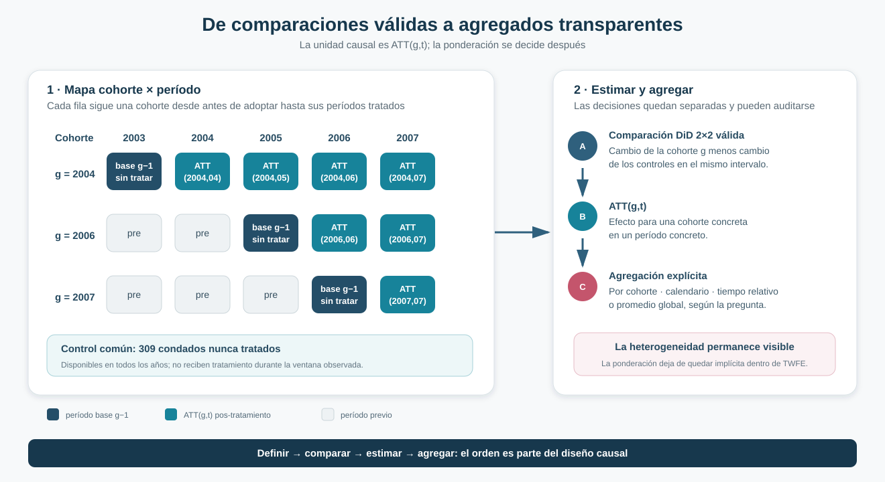
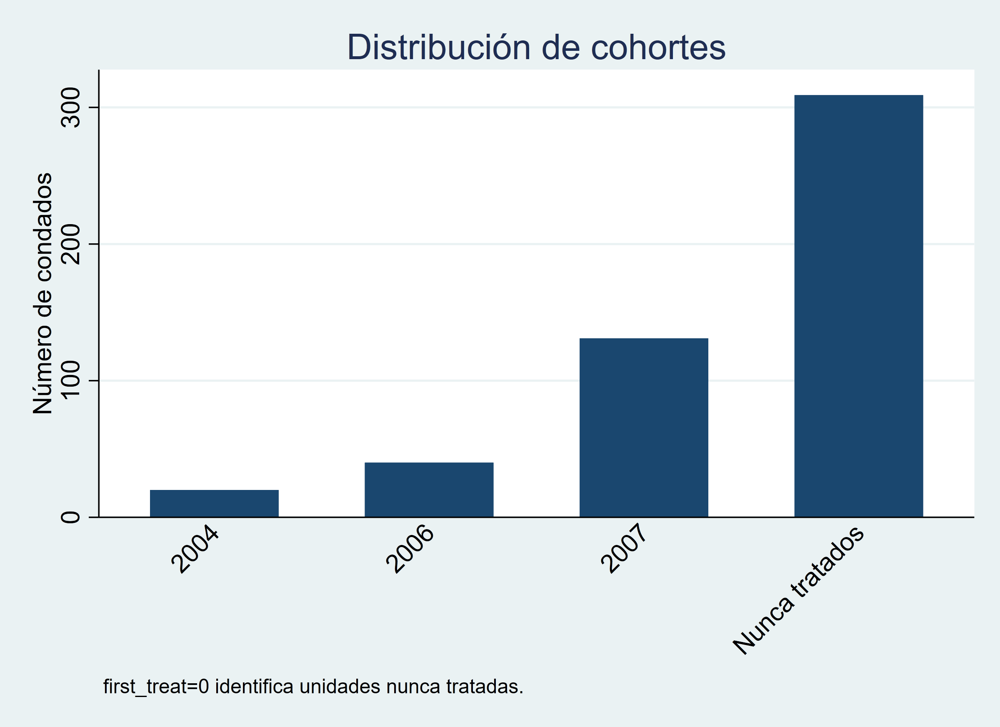
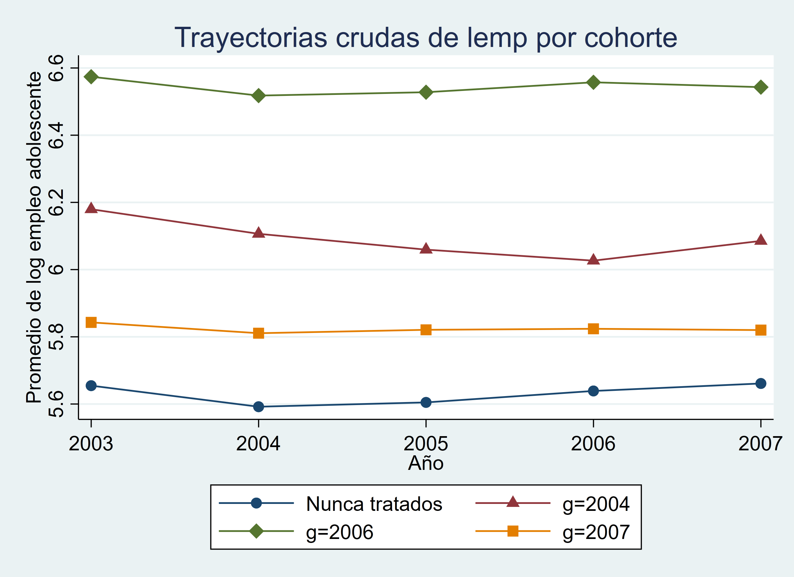
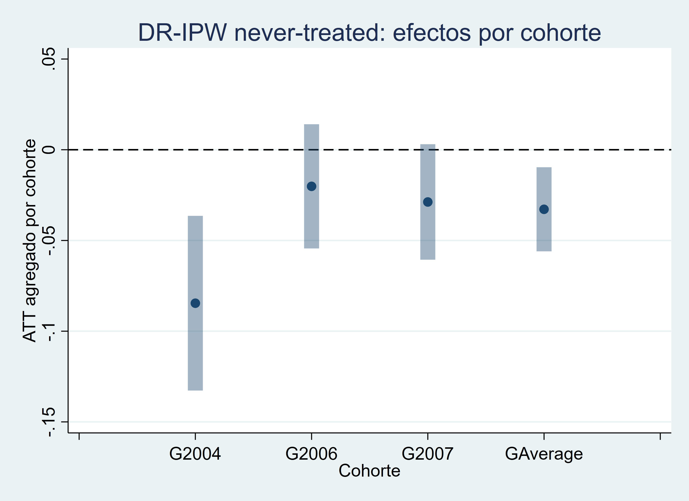
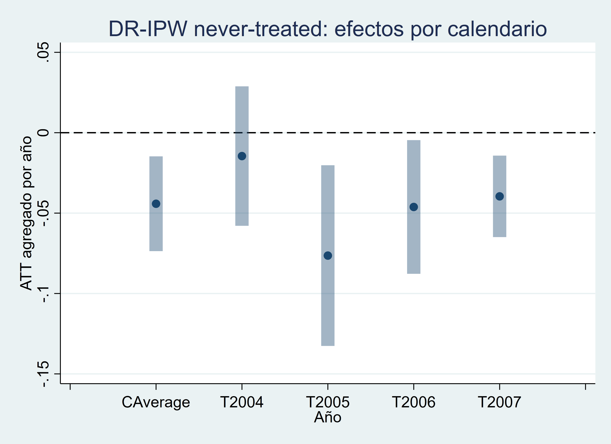
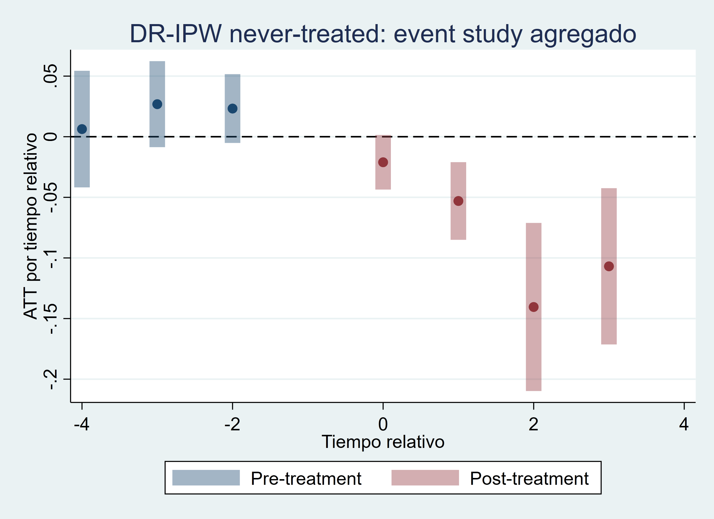
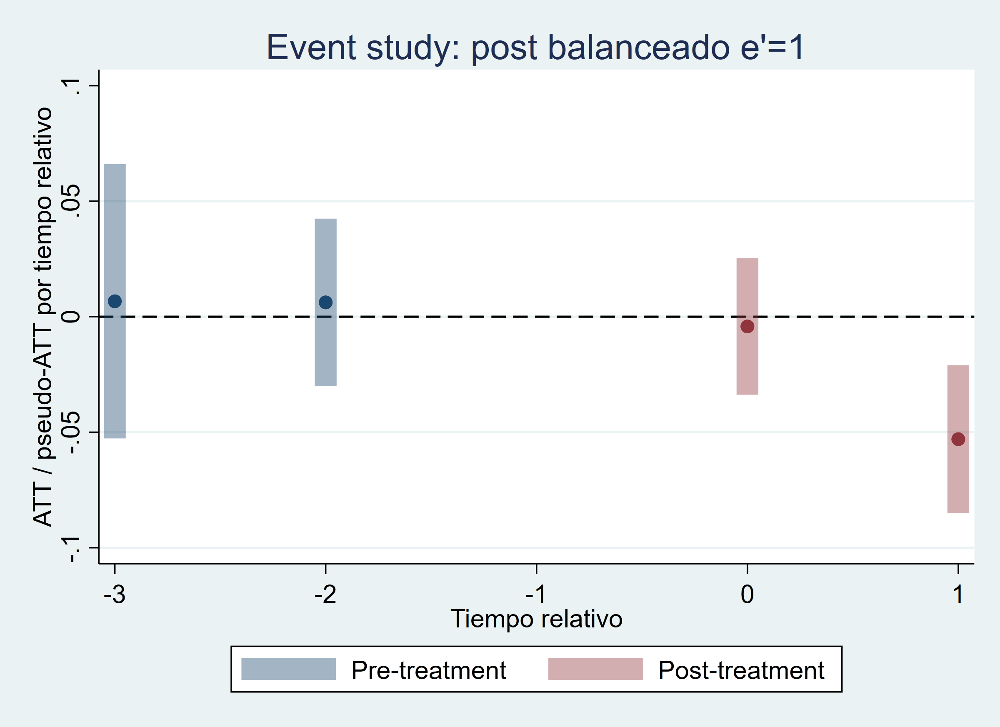
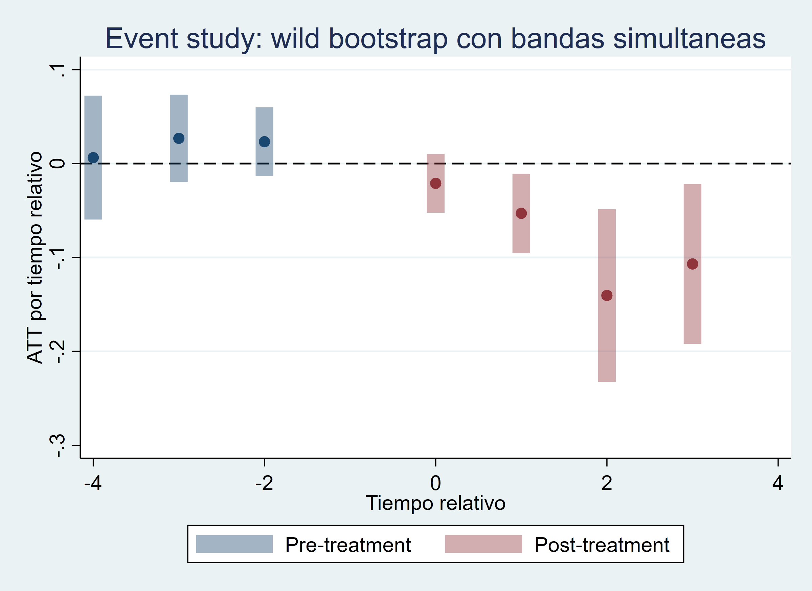
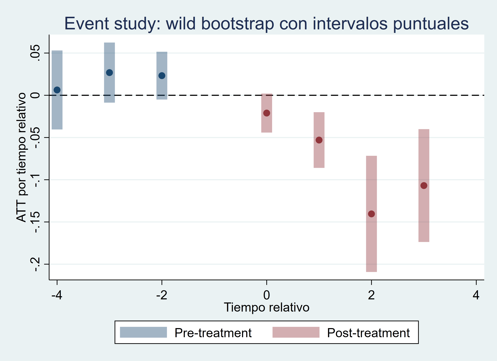

::: {.hero-box}
::: {.hero-title}
Primero definir el efecto causal; después decidir cómo agregarlo
:::

::: {.hero-sub}
Callaway–Sant’Anna reemplaza la búsqueda de un único coeficiente por una secuencia transparente: efectos por cohorte y período, controles todavía válidos y reglas explícitas de agregación.
:::
:::

## Pregunta central

¿Cómo recuperar efectos causales interpretables cuando distintas cohortes adoptan el tratamiento en momentos diferentes?

**Respuesta corta:** definir primero un efecto elemental para cada cohorte y período, identificarlo mediante una comparación DiD válida y agregar esos efectos solo después, de acuerdo con la pregunta sustantiva.

## Del diagnóstico a la solución

La crisis moderna mostró los límites de pedirle a una única regresión TWFE que seleccione comparaciones, acomode la heterogeneidad, reconstruya la dinámica y produzca un promedio final. Con adopción escalonada, esa operación puede incorporar unidades ya tratadas como controles y ocultar qué efectos reciben peso.

Callaway–Sant’Anna cambia el orden del análisis:

1. define el efecto causal elemental;
2. establece quién puede funcionar como control;
3. estima cada comparación identificable;
4. agrega los efectos con ponderaciones observables.

La diferencia principal no es un nuevo comando ni la promesa de un número radicalmente distinto. Es una estrategia que separa **identificación**, **heterogeneidad** y **agregación**.

## El efecto causal elemental: ATT(g,t)

Sea $G=g$ la cohorte que adopta el tratamiento por primera vez en el período $g$. Para un período $t$, el parámetro

$$
ATT(g,t)=E\left[Y_t(g)-Y_t(0)\mid G=g\right]
$$

describe el efecto causal medio para esa cohorte en ese momento. Cada celda pos-tratamiento identificable se apoya en una comparación DiD explícita: el cambio de la cohorte $g$ entre su período base y $t$, menos el cambio del grupo de control durante el mismo intervalo.

{fig-alt="Matriz de cohortes 2004, 2006 y 2007 frente a los años 2003 a 2007. Las celdas posteriores a la adopción representan efectos ATT por cohorte y período; cada una se construye con una comparación DiD frente a los nunca tratados y luego puede agregarse mediante reglas explícitas."}

El objeto ya no es un coeficiente regresivo que resume todo a la vez. Es una colección de efectos causales con población, momento y contrafactual definidos.

## Qué unidades pueden actuar como controles

La especificación principal utiliza **309 condados nunca tratados**. Para una cohorte $g$, estos condados permiten comparar el cambio desde el último período anterior a la adopción hasta cada período $t$ sin recurrir a unidades que ya recibieron el tratamiento.

Como sensibilidad, también pueden incorporarse unidades **todavía no tratadas** en el período de la comparación. Esta alternativa amplía temporalmente el grupo de control, pero exige comprobar qué cohortes siguen sin exposición en cada celda. En ambos casos, las unidades ya tratadas quedan fuera del contrafactual.

Esta selección responde directamente al problema de la descomposición TWFE: una cohorte tratada tempranamente no debe funcionar como control de otra cohorte cuando su propio resultado ya puede haber sido afectado.

## DR-IPW y tendencias paralelas condicionales

El estimador principal combina dos componentes:

- una regresión del cambio del resultado en el grupo de control;
- un *propensity score* que aproxima la comparabilidad entre la cohorte tratada y sus controles mediante covariables pretratamiento.

La estimación doblemente robusta puede conservar consistencia si una de esas dos componentes está correctamente especificada, dadas las demás condiciones del diseño. Esa propiedad no protege frente a tendencias paralelas inválidas, anticipación, falta de soporte, timing mal definido o covariables afectadas por el tratamiento.

## Aplicación: salario mínimo y empleo adolescente

La aplicación utiliza un panel pedagógico de condados asociado con la adopción de cambios en el salario mínimo y la evolución del empleo adolescente.

:::: {.quick-grid}

::: {.section-box}
**Panel**

500 condados observados anualmente entre 2003 y 2007: 2.500 observaciones.
:::

::: {.section-box}
**Tratamiento**

Indicador absorbente desde el primer año de adopción del cambio de salario mínimo.
:::

::: {.section-box}
**Resultado**

Logaritmo del empleo adolescente a nivel de condado.
:::

::: {.section-box}
**Ajuste pretratamiento**

Logaritmo de la población, fijado antes de la exposición.
:::

::::

Las cohortes de primera adopción reúnen 20 condados en 2004, 40 en 2006 y 131 en 2007. Los 309 condados restantes no adoptan durante la ventana observada y constituyen el control principal.

:::: {.figure-pair}
::: {.figure-pair__item}
{fig-alt="Cantidad de condados en las cohortes de adopción de 2004, 2006 y 2007 y en el grupo nunca tratado."}
:::
::: {.figure-pair__item}
{fig-alt="Trayectorias medias crudas del log del empleo adolescente para cada cohorte de adopción y los condados nunca tratados."}
:::
::::

## Cohortes, timing y soporte

El tratamiento no se revierte una vez iniciado. Las siete celdas pos-tratamiento observables cuentan con unidades tratadas y controles válidos. Cuando se utiliza el grupo ampliado, la cantidad de controles todavía no tratados disminuye a medida que avanza el calendario; en 2007, las comparaciones descansan nuevamente en los nunca tratados.

La covariable pretratamiento presenta soporte razonable en la celda ilustrativa `g=2006, t=2006`. Este diagnóstico respalda la viabilidad de la ponderación en esa comparación, pero no valida por sí solo tendencias paralelas ni garantiza soporte idéntico en cualquier otra aplicación.

## Del ATT(g,t) a los efectos por cohorte

Una vez estimadas las celdas elementales, la heterogeneidad puede mostrarse en lugar de quedar absorbida dentro de un único promedio.

::: {.table-box}
| Cohorte o agregado | Estimación | EE | IC95% |
|---|---:|---:|---:|
| Cohorte 2004 | **−0,0846** | 0,0246 | [−0,1327; −0,0364] |
| Cohorte 2006 | −0,0202 | 0,0175 | [−0,0544; 0,0141] |
| Cohorte 2007 | −0,0288 | 0,0162 | [−0,0606; 0,0030] |
| **Promedio por cohorte — GAverage** | **−0,0328** | **0,0118** | **[−0,0560; −0,0096]** |
| **Promedio global simple** | **−0,0418** | **0,0115** | **[−0,0643; −0,0192]** |
:::

{fig-alt="Estimaciones por cohorte y agregado GAverage mediante DR-IPW con condados nunca tratados como comparación."}

Las estimaciones corresponden al efecto sobre el log del empleo adolescente para las cohortes tratadas del panel, bajo las comparaciones y los supuestos del diseño. La cohorte de 2004 presenta una reducción estimada mayor que las cohortes posteriores; esa diferencia se conserva como información sustantiva.

## Cómo agregar efectos heterogéneos

:::: {.metric-grid}

::: {.metric-card}
::: {.metric-label}
Promedio global simple
:::
::: {.metric-value}
−0,0418
:::
::: {.metric-note}
promedia las celdas ATT(g,t); las cohortes con más períodos posteriores pueden aportar más
:::
:::

::: {.metric-card}
::: {.metric-label}
GAverage
:::
::: {.metric-value}
−0,0328
:::
::: {.metric-note}
resume primero cada cohorte y luego combina esos efectos medios con pesos de cohorte
:::
:::

::::

Ambos parámetros son legítimos, pero responden preguntas distintas. El primero da mayor presencia a cohortes que aportan más celdas pos-tratamiento; el segundo organiza la ponderación a partir de efectos medios por cohorte. Elegir entre ellos exige decidir qué población y qué horizonte deben dominar el resumen.

La misma matriz admite otras dos lecturas. La agregación por **calendario** pregunta cuál fue el efecto medio entre las cohortes ya tratadas en un año histórico; la agregación por **tiempo relativo** pregunta cómo evoluciona el efecto desde la adopción. Así, global, cohorte, calendario y *event time* no son cuatro formas intercambiables de presentar un número: son cuatro preguntas construidas sobre los mismos efectos elementales.

{fig-alt="Efectos agregados por calendario mediante DR-IPW con condados nunca tratados como comparación."}

## Callaway–Sant’Anna frente a TWFE

Como referencia, la regresión TWFE estática estima **−0,0365**, con EE **0,0133**. La cercanía numérica respecto de los agregados modernos no establece equivalencia entre estimandos.

::: {.section-status}
**Benchmark, no objeto central**

TWFE entrega un promedio regresivo único. Callaway–Sant’Anna hace visibles las comparaciones, los efectos por cohorte y período y la regla con la que se construye el agregado final.
:::

La contribución metodológica no consiste en afirmar que TWFE estaba completamente equivocado en esta muestra. Consiste en poder explicar qué efecto se estima, para quién, respecto de qué controles y mediante qué ponderaciones.

## Diagnósticos y sensibilidad

::: {.table-box}
| Diagnóstico | Resultado | Lectura |
|---|---:|---|
| Pseudo-ATT pretratamiento, test global | p = 0,2327 | Sin evidencia estadística conjunta de diferencias previas |
| Ventana próxima al tratamiento | p = 0,5651 | Resultado compatible con la lectura global |
| Nunca tratados frente a todavía no tratados | Agregados muy próximos | La elección del control no altera sustantivamente el resultado en esta muestra |
| OR, IPW, IPW estabilizado y dos variantes DR | Globales entre −0,04197 y −0,04175 | Estabilidad frente a distintas rutas de estimación de las celdas |
| Soporte pos-tratamiento | 7 de 7 celdas identificables | Hay tratados y controles válidos en cada celda observada |
| Overlap ilustrativo | Razonable en `g=2006, t=2006` | Apoya esa comparación; no reemplaza tendencias paralelas |
:::

Los no rechazos ordenan la evidencia pretratamiento, pero no prueban tendencias paralelas. La identificación causal continúa dependiendo de que, condicionalmente en las covariables pretratamiento, las cohortes tratadas y sus controles representen evoluciones contrafactuales comparables. La proximidad entre OR, IPW y DR tampoco valida ese supuesto: muestra estabilidad frente a distintas maneras de estimar las mismas comparaciones. En esta base, además, el logaritmo de la población es constante dentro de cada condado; que una base pre común y otra definida por cohorte produzcan el mismo agregado es una limitación pedagógica, no evidencia de que la elección temporal de covariables sea irrelevante.

## Dinámica y composición

Los `ATT(g,t)` también pueden agregarse por tiempo relativo. La trayectoria moderna estima **−0,0211** en el momento de adopción, **−0,0530** un año después, **−0,1404** a dos años y **−0,1069** a tres. Sin embargo, no observa la misma población en todos los puntos: las tres cohortes contribuyen en `e=0`, solo 2004 y 2006 alcanzan `e=1`, y únicamente 2004 llega a `e=2` y `e=3`.

:::: {.figure-pair}
::: {.figure-pair__item}
{fig-alt="Event study DR-IPW frente a condados nunca tratados, con períodos pretratamiento y composición de cohortes variable según el horizonte."}
:::
::: {.figure-pair__item}
{fig-alt="Event study DR-IPW balanceado que mantiene las cohortes con soporte hasta un año después de la adopción."}
:::
::::

*Nota:* los períodos negativos son pseudo-ATT pretratamiento con función diagnóstica, no efectos causales pretratamiento.

La versión balanceada hasta `e'=1` conserva solo las cohortes 2004 y 2006 en ambos horizontes. Su efecto en `e=0` es **−0,0042** y en `e=1` permanece en **−0,0530**. El promedio post cae en magnitud de **−0,08035** en la trayectoria no balanceada a **−0,02860** en la balanceada.

La diferencia no selecciona una estimación “correcta” y otra “incorrecta”. La primera utiliza toda la información disponible en cada horizonte; la segunda sacrifica la cohorte 2007 y los horizontes largos para mantener constante la composición. El contraste muestra por qué una curva dinámica también requiere definir población y soporte antes de interpretarla como evolución del efecto.

## Inferencia sobre agregados y trayectorias

Las funciones de influencia permiten recombinar los `ATT(g,t)` y hacer inferencia sobre el agregado elegido. Para el promedio global simple, el error estándar asintótico es **0,01150** y el bootstrap multiplicador entrega **0,01176**; la conclusión sustantiva no cambia.

En una trayectoria completa, la distinción relevante es entre incertidumbre punto a punto y cobertura conjunta. Para `e=1`, cuya estimación es −0,0530, el intervalo bootstrap punto a punto es aproximadamente **[−0,0860; −0,0200]**, mientras la banda uniforme es **[−0,0952; −0,0108]**. La segunda es más amplia porque busca cubrir simultáneamente toda la trayectoria. Por eso la inferencia del *event study* no debe reducirse a inspeccionar por separado la significación de cada punto.

:::: {.figure-pair}
::: {.figure-pair__item}
{fig-alt="Event study con banda bootstrap uniforme para cobertura conjunta de la trayectoria."}
:::
::: {.figure-pair__item}
{fig-alt="Event study con intervalos bootstrap calculados por separado en cada período relativo."}
:::
::::

## Qué mejora y qué supuestos permanecen

Callaway–Sant’Anna mejora la transparencia del estimando: evita controles ya tratados, admite heterogeneidad y permite elegir el agregado según la pregunta. No elimina la necesidad de:

- tendencias paralelas condicionales creíbles;
- un supuesto explícito sobre anticipación —en esta aplicación, ausencia de anticipación—;
- soporte suficiente dentro de cada comparación;
- timing de adopción correctamente medido;
- covariables definidas antes del tratamiento;
- una decisión sustantiva sobre la población y el horizonte del agregado.

## Conclusión

Callaway–Sant’Anna no “arregla” una regresión TWFE. Cambia la estrategia: define efectos causales por cohorte y período, selecciona controles todavía válidos y expone la regla que transforma esos efectos heterogéneos en un resumen.

En el panel de condados, los agregados son negativos y relativamente próximos al benchmark TWFE, pero no son el mismo objeto. La ganancia principal es interpretativa: cada cifra puede vincularse con una población tratada, un período, un grupo contrafactual y una regla de ponderación.

## Puente hacia la siguiente solución moderna

Esta primera solución fija un criterio para evaluar las siguientes: identificar cuál es su efecto elemental, qué unidades construyen el contrafactual y cómo agregan la heterogeneidad. El paso siguiente será comparar cómo otras estrategias modernas operacionalizan esas decisiones sin volver a delegarlas implícitamente en TWFE.
