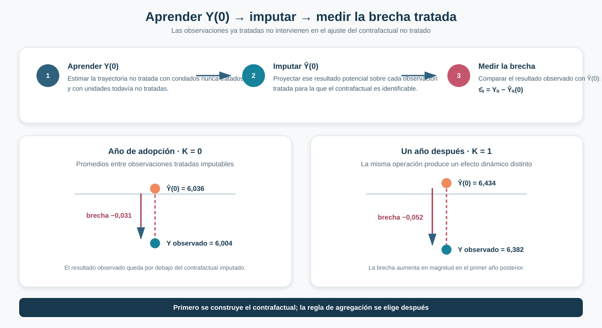
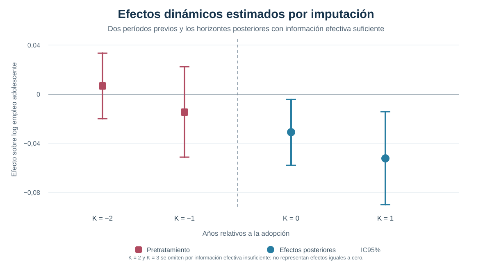

[← Volver a Difference-in-Differences moderno](../did-moderno/index.qmd)

::: {.hero-box}
::: {.hero-title}
Construir el contrafactual antes de agregar los efectos
:::

::: {.hero-sub}
Borusyak–Jaravel–Spiess aprende el resultado potencial no tratado usando exclusivamente observaciones sin tratamiento, lo imputa para las tratadas y convierte cada brecha en un efecto que puede agregarse de manera explícita.
:::
:::

## Pregunta central

¿Cómo estimar efectos dinámicos bajo adopción escalonada sin utilizar resultados ya tratados para construir el contrafactual?

**Respuesta corta:** estimar primero $Y(0)$ con unidades nunca tratadas y todavía no tratadas; imputar después ese resultado potencial para las observaciones tratadas; y solo entonces agregar las brechas de acuerdo con la pregunta causal.

## Del diagnóstico TWFE a una estrategia de imputación

La crisis moderna de Difference-in-Differences mostró que una regresión TWFE puede combinar comparaciones y efectos difíciles de interpretar cuando las cohortes adoptan en momentos diferentes y los efectos varían. BJS no intenta resolver ese problema mediante otro coeficiente único. Cambia la organización del análisis.

En lugar de pedirle a una sola regresión que construya el contrafactual, acomode la heterogeneidad y decida el promedio final, separa tres tareas:

1. aprender la evolución de $Y(0)$ en observaciones no tratadas;
2. obtener efectos imputados para observaciones tratadas;
3. elegir una regla de agregación coherente con la pregunta.

La restricción decisiva es sencilla: **los resultados ya tratados no intervienen en el ajuste del contrafactual no tratado**.

## Aprender el resultado potencial no tratado

Sea $E_i$ el primer período de tratamiento y $D_{it}=1[t\geq E_i]$. BJS utiliza el conjunto de observaciones con $D_{it}=0$ para estimar un modelo de resultados no tratados. En la especificación de referencia:

$$
Y_{it}(0)=\alpha_i+\lambda_t+\varepsilon_{it}.
$$

Los efectos fijos de unidad recogen diferencias permanentes entre condados y los efectos de año capturan shocks comunes. El modelo puede enriquecerse con covariables pretratamiento y trayectorias condicionales, pero su función no cambia: aproximar qué resultado habría tenido una observación tratada si hubiera permanecido sin exposición.

Para cada observación tratada cuyo contrafactual puede construirse:

$$
\widehat{\tau}_{it}=Y_{it}-\widehat{Y}_{it}(0).
$$

Esta brecha es la unidad elemental del método. No es todavía un ATT global ni un coeficiente dinámico: esos objetos aparecen cuando las brechas se agregan.

{fig-alt="Flujo de tres pasos: aprender el resultado potencial no tratado usando observaciones sin tratamiento, imputarlo para observaciones tratadas y comparar el resultado observado con el contrafactual. Para los horizontes cero y uno, las brechas medias son menos 0,031 y menos 0,052."}

## Aplicación: salario mínimo y empleo adolescente

La aplicación utiliza el mismo panel de condados que permite comparar distintas soluciones modernas sobre una base común.

:::: {.quick-grid}

::: {.section-box}
**Panel**

500 condados observados entre 2003 y 2007: 2.500 observaciones.
:::

::: {.section-box}
**Tratamiento**

Primera adopción del cambio relevante en el salario mínimo; una vez iniciado, el tratamiento permanece activo.
:::

::: {.section-box}
**Resultado**

Logaritmo del empleo adolescente a nivel de condado.
:::

::: {.section-box}
**Covariable disponible**

Población inicial medida antes de la exposición, útil para permitir trayectorias condicionales.
:::

::::

Las cohortes adoptan por primera vez en 2004, 2006 y 2007. Otros **309 condados nunca son tratados** durante la ventana observada. Antes de adoptar, los condados de las cohortes posteriores también aportan información a la estimación de $Y(0)$.

## Cohortes y soporte no tratado

El soporte cambia con el calendario: hay 500 observaciones sin tratamiento en 2003, 480 en 2004 y 2005, 440 en 2006 y 309 en 2007. La disminución refleja la entrada sucesiva de cohortes al tratamiento. Los 309 condados nunca tratados mantienen información no tratada hasta el final del panel.

::: {.section-status}
**Quién construye el contrafactual**

Nunca tratados y todavía no tratados mientras permanecen sin exposición. Una vez tratado, el resultado de un condado deja de utilizarse para aprender $Y(0)$.
:::

## Resultado global

El ATT global promedia las brechas imputadas sobre las observaciones tratadas que integran el estimando.

:::: {.metric-grid}

::: {.metric-card}
::: {.metric-label}
ATT global
:::
::: {.metric-value}
−0,0477
:::
::: {.metric-note}
efecto medio sobre el log del empleo adolescente entre observaciones tratadas imputables
:::
:::

::: {.metric-card}
::: {.metric-label}
Error estándar
:::
::: {.metric-value}
0,0135
:::
::: {.metric-note}
p &lt; 0,001 · IC95% [−0,0741; −0,0213]
:::
:::

::::

Dentro del diseño, el cambio de salario mínimo se asocia con una reducción causal media del log del empleo adolescente de aproximadamente 0,048 entre las observaciones tratadas imputables. La cifra resume cohortes y horizontes distintos; su población objetivo no es el conjunto completo de condados ni un efecto homogéneo común.

## Efectos dinámicos

El tiempo relativo permite preguntar cómo evoluciona el efecto desde la primera exposición. Los dos horizontes posteriores con información efectiva suficiente muestran una reducción que aumenta en magnitud durante el primer año.

{fig-alt="Event study BJS con estimaciones cercanas a cero en K menos 2 y K menos 1. Los efectos son menos 0,031 en K igual a cero y menos 0,052 en K igual a uno, con intervalos de confianza de 95 por ciento. Los horizontes dos y tres se omiten por información efectiva insuficiente."}

::: {.table-box}
| Estimando | Estimación | EE | p | IC95% |
|---|---:|---:|---:|---:|
| **ATT global** | **−0,0477** | **0,0135** | **&lt; 0,001** | **[−0,0741; −0,0213]** |
| Año de adopción · K = 0 | −0,0311 | 0,0137 | 0,023 | [−0,0579; −0,0043] |
| Un año después · K = 1 | −0,0522 | 0,0193 | 0,007 | [−0,0901; −0,0143] |

*Nota:* el test conjunto de los dos períodos pretratamiento arroja $F=1{,}298$ y $p=0{,}274$. Los horizontes posteriores se omiten por información efectiva insuficiente; no representan efectos estimados iguales a cero.
:::

## Qué promedio estamos estimando

También en BJS, “el efecto promedio” requiere una decisión sustantiva. Tres agregaciones documentadas ilustran la diferencia:

::: {.table-box}
| Regla de agregación | Estimación | Pregunta que resume |
|---|---:|---|
| ATT global | **−0,0477** | Promedio sobre todas las observaciones tratadas imputables incluidas |
| Media de K = 0 y K = 1 | −0,0417 | Igual peso para ambos coeficientes dinámicos |
| Pooled K = 0/K = 1 | −0,0361 | Promedio directo sobre observaciones tratadas de esos horizontes |
:::

Las diferencias no son una prueba de inestabilidad. Cada regla distribuye el peso de otra manera y responde una pregunta distinta. La elección debe fijar qué horizontes y qué población tratada deben dominar el resumen.

## Heterogeneidad después de la imputación

Una vez construidas las brechas, BJS permite estudiar su variación entre cohortes. El efecto medio estimado para la cohorte 2004 es cercano a **−0,0846**, frente a **−0,0337** para las cohortes posteriores. La diferencia, aproximadamente −0,0509, es marginal (`p≈0,085`).

Esta comparación no reemplaza el resultado principal. Muestra que la heterogeneidad puede permanecer visible después de construir los efectos, en vez de quedar absorbida dentro de un único coeficiente.

## Imputabilidad y tamaño efectivo

Dos preguntas distintas determinan qué efectos pueden reportarse.

:::: {.quick-grid}

::: {.section-box}
**Imputabilidad**

¿Existe información no tratada suficiente para construir $\widehat{Y}_{it}(0)$ para la observación tratada? En la muestra principal no se requieren recortes por este problema.
:::

::: {.section-box}
**Información efectiva**

Aunque el contrafactual sea imputable, ¿hay información suficientemente distribuida para realizar inferencia confiable? Los horizontes K = 2 y K = 3 no superan este criterio.
:::

::::

La cantidad bruta de observaciones no basta: si pocos condados o cohortes concentran la información relevante, la precisión efectiva puede ser mucho menor. Por eso las brechas descriptivas disponibles para horizontes posteriores no se presentan como resultados inferenciales equivalentes.

## Pretrends y especificación de Y(0)

Los dos coeficientes previos son próximos a cero y el test conjunto no rechaza (`p=0,274`). Ese resultado es compatible con la especificación de referencia, pero no demuestra por sí solo tendencias paralelas ni descarta cualquier desviación posible.

La estabilidad frente a modelos plausibles de $Y(0)$ aporta una comprobación adicional. Al permitir trayectorias por población inicial, los efectos se mantienen próximos a la referencia: alrededor de −0,033 en K = 0 y −0,057 en K = 1. La comparación no debe utilizarse para seleccionar el modelo que produce mayor significancia; su función es evaluar si el contrafactual depende de decisiones razonables de especificación.

## BJS frente a TWFE y Callaway–Sant’Anna

::: {.table-box}
| Estrategia | Unidad elemental | Construcción del contrafactual | Agregación |
|---|---|---|---|
| TWFE | Coeficiente regresivo común | Ajuste conjunto con observaciones tratadas y no tratadas | Implícita en la regresión |
| Callaway–Sant’Anna | $ATT(g,t)$ | Comparación cohorte × período con controles válidos | Posterior y explícita |
| **BJS** | Brecha tratada imputable $(i,t)$ | Modelo de $Y(0)$ estimado solo con observaciones no tratadas | Posterior y explícita |
:::

Callaway–Sant’Anna y BJS evitan utilizar unidades ya tratadas como controles, admiten heterogeneidad y exponen la regla de agregación. La diferencia está en su punto de partida: el primero organiza comparaciones grupo-tiempo; el segundo imputa resultados potenciales para observaciones tratadas.

Los pesos firmados que aparecen en la representación algebraica de BJS operan sobre *outcomes* observados porque el estimador resta un contrafactual imputado. No equivalen al problema de asignar pesos negativos a efectos causales tratados dentro de TWFE.

## Qué mejora y qué supuestos permanecen

BJS vuelve transparente la construcción del contrafactual, excluye resultados ya tratados de ese ajuste, admite efectos heterogéneos y separa su agregación. No elimina la necesidad de:

- ausencia de anticipación;
- una especificación creíble de $Y(0)$;
- soporte no tratado suficiente;
- contrafactuales imputables para la población objetivo;
- información efectiva adecuada para cada horizonte;
- una regla de agregación vinculada con la pregunta causal.

## Conclusión

Borusyak–Jaravel–Spiess organiza Difference-in-Differences alrededor de una construcción explícita del resultado potencial no tratado. Primero aprende $Y(0)$ usando exclusivamente observaciones sin tratamiento, luego lo imputa para las tratadas y finalmente agrega las brechas causales según la pregunta de interés.

En el panel de condados, el ATT global es negativo y los efectos publicables aumentan en magnitud entre el año de adopción y el período siguiente. La interpretación corresponde a observaciones tratadas cuyo contrafactual puede imputarse dentro del soporte del diseño.

Imputar no elimina los supuestos. Especificación, no anticipación, soporte, imputabilidad, información efectiva y agregación continúan determinando qué efecto puede sostenerse y para quién.

## Puente hacia la siguiente solución

BJS añade una segunda arquitectura moderna: Callaway–Sant’Anna parte de comparaciones cohorte-período; BJS parte de contrafactuales individuales imputados. La siguiente solución puede evaluarse con la misma vara: qué efecto elemental define, qué observaciones construyen su comparación, cómo representa la heterogeneidad y qué promedio entrega.
