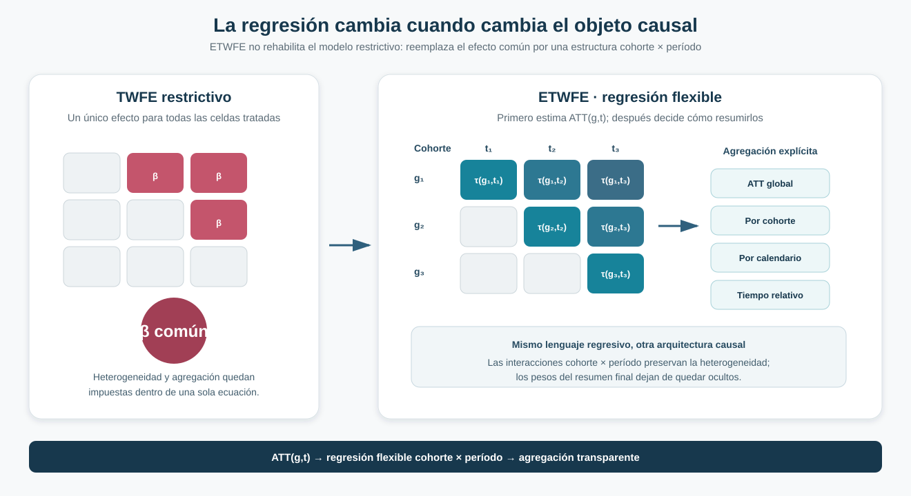
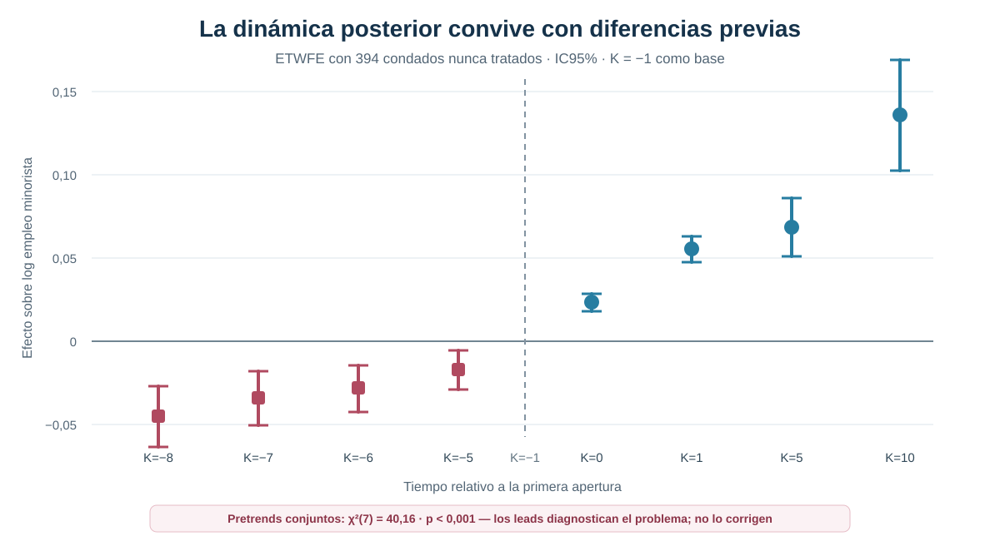

[← Volver a Difference-in-Differences moderno](../did-moderno/index.qmd)

::: {.hero-box}
::: {.hero-title}
La regresión no es el problema; la restricción sí
:::

::: {.hero-sub}
Wooldridge muestra cómo una especificación suficientemente flexible puede recuperar efectos por cohorte y período sin volver a comprimir la heterogeneidad dentro del coeficiente único del TWFE convencional.
:::
:::

## Pregunta central

¿Cómo recuperar efectos por cohorte y período mediante una regresión sin volver a las restricciones del TWFE convencional?

**Respuesta corta:** reemplazar el tratamiento único por interacciones que permitan un efecto para cada cohorte y período, estimar primero esos objetos causales y agregarlos después mediante una regla explícita.

## El problema no es la regresión, sino la restricción

La crisis moderna de Difference-in-Differences no implica abandonar el lenguaje regresivo. Implica abandonar una ecuación demasiado rígida para un diseño con adopción escalonada y efectos heterogéneos.

El TWFE convencional resume toda la exposición mediante un único parámetro:

$$
Y_{it}=\alpha_i+\lambda_t+\beta D_{it}+u_{it}.
$$

Esa especificación trata como si el efecto fuera el mismo para todas las cohortes y en todos los períodos. ETWFE —*Extended Two-Way Fixed Effects*— cambia la ecuación: permite que cada celda tratada tenga su propio efecto $\tau_{g,t}$.

La afirmación relevante no es que “TWFE vuelve a estar bien”. ETWFE conserva herramientas regresivas familiares, pero deja atrás la restricción que originó el problema.

## De ATT(g,t) a una regresión flexible

El objeto causal continúa siendo:

$$
ATT(g,t)=E\left[Y_{it}(1)-Y_{it}(0)\mid G_i=g\right].
$$

Describe el efecto medio para la cohorte que adopta en $g$, observada en el período $t$. La especificación flexible incluye interacciones entre cohorte, calendario y estado tratado para recuperar esos efectos de celda.

{fig-alt="Comparación entre TWFE restrictivo, que asigna un beta común a todas las celdas tratadas, y ETWFE, que representa efectos distintos por cohorte y período y luego los agrega globalmente, por cohorte, calendario o tiempo relativo."}

El orden importa: el agregado no se impone desde el comienzo. Primero se estima la colección $ATT(g,t)$; después se decide qué cohortes, años u horizontes deben pesar en el resumen.

## Continuidad con Callaway–Sant’Anna y BJS

La secuencia de soluciones modernas puede resumirse sin convertirlas en métodos rivales:

- **Callaway–Sant’Anna:** organiza la identificación directamente alrededor de comparaciones $ATT(g,t)$.
- **Borusyak–Jaravel–Spiess:** aprende $Y(0)$ con observaciones sin tratamiento e imputa el contrafactual para las tratadas.
- **Wooldridge:** demuestra cuándo esos objetos modernos pueden recuperarse mediante una regresión flexible.

M09 funciona así como puente entre los estimandos del DiD moderno y la práctica regresiva aplicada.

## TWM e imputación como representaciones relacionadas

Two-Way Mundlak representa la heterogeneidad de unidad y los shocks temporales mediante promedios de los regresores, en lugar de absorberlos como efectos fijos. Bajo las condiciones correspondientes, TWFE y TWM pueden ser representaciones algebraicamente equivalentes de una misma ecuación.

Esa equivalencia, por sí sola, no resuelve la heterogeneidad del tratamiento. El paso sustantivo aparece cuando la ecuación también incorpora los efectos cohorte × período.

La misma regresión flexible puede interpretarse como un modelo del resultado no tratado. Pooled OLS flexible, ETWFE, TWM extendido y ciertas representaciones por imputación pueden coincidir en los **ATT medios de celda**. Esto no exige que Wooldridge y BJS produzcan idénticas predicciones contrafactuales para cada observación individual.

## Aplicación: aperturas de Walmart y empleo minorista

La aplicación sigue aperturas de Walmart en condados de Estados Unidos y la evolución del empleo minorista local.

:::: {.quick-grid}

::: {.section-box}
**Panel**

1.280 condados entre 1977 y 1999: 23 períodos y 29.440 observaciones.
:::

::: {.section-box}
**Tratamiento**

Primera apertura de Walmart. El indicador permanece activo desde el año de entrada.
:::

::: {.section-box}
**Resultado**

Logaritmo del empleo minorista a nivel de condado.
:::

::: {.section-box}
**Timing**

Cohortes tratadas entre 1986 y 1999; 886 condados están tratados al final del panel.
:::

::::

Otros **394 condados nunca reciben una apertura** durante la ventana observada. En la especificación principal, estos condados y las cohortes todavía no tratadas construyen el grupo de comparación mientras permanecen sin exposición.

## Covariables y comparación

La especificación central incorpora características pretratamiento relacionadas con estructura manufacturera, pobreza y educación secundaria, medidas alrededor de 1980. Al ser anteriores a las aperturas analizadas, pueden utilizarse para permitir trayectorias contrafactuales condicionales sin controlar por variables potencialmente afectadas por Walmart.

Las covariables no entran como simples controles aditivos. Se centran e interactúan con la estructura de heterogeneidad para preservar la interpretación de los coeficientes principales como promedios de cohorte y período.

Para estudiar leads y pretrends se utiliza un comparador estable formado únicamente por los 394 condados nunca tratados. Cambiar el grupo de comparación cambia también el parámetro agregado y no constituye una mera opción computacional.

## Resultado agregado

:::: {.metric-grid}

::: {.metric-card}
::: {.metric-label}
ETWFE con covariables
:::
::: {.metric-value}
0,0898
:::
::: {.metric-note}
ATT agregado sobre observaciones tratadas bajo la especificación flexible central
:::
:::

::: {.metric-card}
::: {.metric-label}
Inferencia
:::
::: {.metric-value}
EE 0,0103
:::
::: {.metric-note}
IC95% [0,0696; 0,1099]
:::
:::

::::

La estimación sugiere un aumento medio del log del empleo minorista de aproximadamente 0,090 entre las observaciones tratadas que integran el agregado. La precisión estadística del coeficiente no resuelve la credibilidad del diseño: las trayectorias previas y la sensibilidad del contrafactual deben evaluarse antes de sostener una interpretación causal fuerte.

## Qué cambia entre especificaciones

::: {.table-box}
| Especificación | ATT agregado | EE | Lectura |
|---|---:|---:|---|
| TWFE restrictivo | 0,0810 | 0,0081 | Impone un efecto común para todas las cohortes y períodos |
| ETWFE sin covariables | 0,0978 | 0,0099 | Permite heterogeneidad completa cohorte × período |
| **ETWFE con covariables pretratamiento** | **0,0898** | **0,0103** | Flexibiliza los efectos y condiciona el contrafactual en características de 1980 |
| ETWFE con solo nunca tratados | 0,0740 | 0,0078 | Cambia el comparador y habilita leads frente a un grupo estable |
| ETWFE con tendencias por cohorte | 0,0352 | 0,0092 | Permite trayectorias lineales distintas entre cohortes |
:::

La tabla no establece un ranking. Cada fila modifica restricciones, comparadores o trayectorias contrafactuales. La cercanía entre TWFE (`0,0810`) y ETWFE central (`0,0898`) tampoco implica que ambos estimen el mismo objeto.

## Cómo se agregan los ATT(g,t)

Una vez estimadas las celdas elementales, la misma especificación puede responder preguntas diferentes:

:::: {.quick-grid}

::: {.section-box}
**Global**

Promedia los efectos sobre las observaciones tratadas incluidas.
:::

::: {.section-box}
**Por cohorte**

Resume la experiencia media de cada año de primera apertura.
:::

::: {.section-box}
**Por calendario**

Combina cohortes ya tratadas dentro de cada año observado.
:::

::: {.section-box}
**Por exposición**

Agrupa celdas con igual distancia temporal desde la apertura.
:::

::::

Estas reglas no son nombres alternativos para un mismo coeficiente. Cambian qué población y qué horizonte dominan el resumen. En horizontes largos participan menos cohortes, por lo que también cambia la composición del estimando.

## Event study y dinámica

El event study con nunca tratados organiza los efectos alrededor de la primera apertura y utiliza K=−1 como período base.

{fig-alt="Event study ETWFE con estimaciones negativas entre ocho y cinco años antes de la apertura y efectos positivos seleccionados después. El test conjunto de pretrends rechaza con chi cuadrado 40,16 y p menor a 0,001."}

Con este comparador estable, los efectos posteriores seleccionados son `0,0234` en K=0, `0,0554` en K=1, `0,0686` en K=5 y `0,1359` en K=10. La trayectoria creciente no puede leerse aisladamente de las diferencias previas.

## Qué revelan los pretrends

Antes de la apertura, las estimaciones alcanzan `−0,0452` en K=−8, `−0,0343` en K=−7, `−0,0282` en K=−6 y `−0,0172` en K=−5. El test conjunto rechaza:

::: {.section-status}
**Diagnóstico de pretrends**

$\chi^2(7)=40{,}16$ · `p < 0,001`

Los condados que posteriormente reciben Walmart ya presentan diferencias sistemáticas respecto de los nunca tratados. Incorporar leads permite observar el problema; no lo corrige.
:::

Este diagnóstico limita una lectura causal limpia de los efectos posteriores. Una especificación moderna puede evitar las restricciones del TWFE tradicional y, al mismo tiempo, descansar en una comparación empírica poco creíble.

## Sensibilidad a tendencias por cohorte

La especificación central estima `0,0898`. Cuando se permiten tendencias lineales específicas por cohorte, el agregado cae a `0,0352`.

:::: {.metric-grid}

::: {.metric-card}
::: {.metric-label}
ETWFE central
:::
::: {.metric-value}
0,0898
:::
::: {.metric-note}
trayectorias comunes condicionales
:::
:::

::: {.metric-card}
::: {.metric-label}
Tendencias por cohorte
:::
::: {.metric-value}
0,0352
:::
::: {.metric-note}
EE 0,0092 · IC95% [0,0171; 0,0533]
:::
:::

::::

La segunda cifra no debe declararse automáticamente como “el efecto verdadero”. La comparación muestra que el resultado depende de cómo se modelan las trayectorias contrafactuales. Junto con los pretrends, esa sensibilidad impide presentar la aplicación como una estimación causal definitiva del efecto de Walmart.

## ETWFE frente a TWFE, C&S y BJS

::: {.table-box}
| Arquitectura | Punto de partida | Construcción principal |
|---|---|---|
| TWFE restrictivo | Un efecto común | Regresión única con heterogeneidad limitada |
| Callaway–Sant’Anna | $ATT(g,t)$ | Comparaciones explícitas por cohorte y período |
| BJS | $Y(0)$ | Imputación con observaciones no tratadas |
| **Wooldridge / ETWFE** | $ATT(g,t)$ | Regresión flexible que recupera efectos cohorte × período |
:::

Las tres soluciones modernas comparten el objetivo de mantener visibles el estimando, el contrafactual y la agregación. Wooldridge aporta una formulación especialmente cercana a la práctica regresiva, no un retorno al coeficiente único.

## Qué mejora y qué supuestos permanecen

ETWFE admite heterogeneidad por cohorte y período, vuelve explícita la agregación y permite incorporar covariables pretratamiento dentro de una estructura coherente. La interpretación causal continúa requiriendo:

- SUTVA y tratamiento correctamente medido;
- ausencia de anticipación;
- tendencias paralelas condicionales creíbles;
- covariables no afectadas por el tratamiento;
- soporte suficiente para las celdas y horizontes reportados;
- inferencia agrupada que reconozca la dependencia serial;
- una decisión explícita sobre comparador y regla de agregación.

La equivalencia algebraica entre estimadores no reemplaza ninguno de estos supuestos de identificación.

## Conclusión

Wooldridge demuestra que la regresión sigue siendo una herramienta válida para Difference-in-Differences moderno cuando la especificación conserva la heterogeneidad causal relevante y la agregación permanece explícita. ETWFE no rehabilita el TWFE restrictivo: estima una ecuación distinta, alineada con los efectos por cohorte y período.

En la aplicación Walmart, ETWFE produce agregados positivos y una dinámica creciente. Pero los pretrends son sistemáticos y permitir tendencias por cohorte reduce el agregado de `0,0898` a `0,0352`. La lección final es metodológica y empírica a la vez: **flexibilizar el estimador no sustituye la credibilidad del diseño**.
