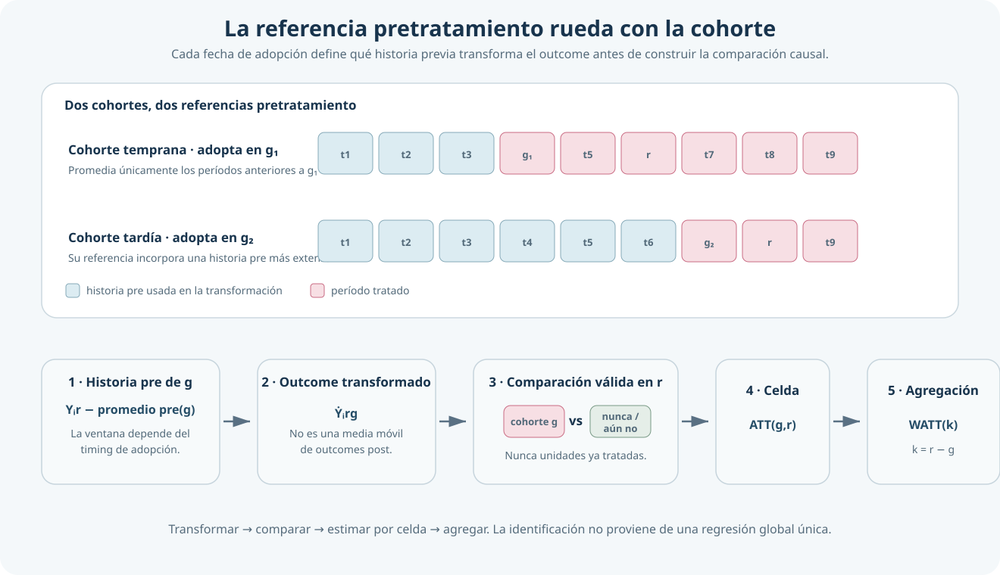
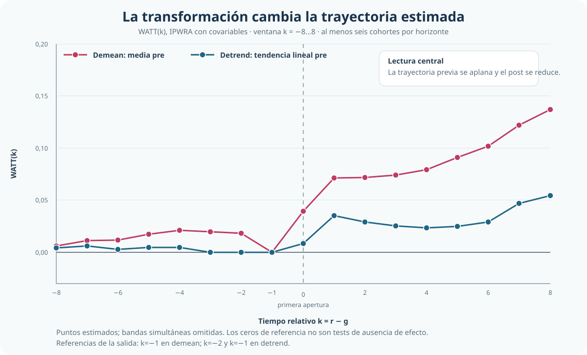

[← Volver a Difference-in-Differences moderno](../did-moderno/index.qmd)

::: {.hero-box}
::: {.hero-title}
La referencia pretratamiento también es una decisión causal
:::

::: {.hero-sub}
Lee–Wooldridge transforma el resultado con la historia previa relevante de cada cohorte, construye después comparaciones limpias y recién entonces agrega los efectos estimados.
:::
:::

## Pregunta central

¿Cómo aprovechar la historia pretratamiento para construir comparaciones DiD limpias sin imponer una regresión global?

**Respuesta corta:** transformar el resultado para cada cohorte, comparar su outcome transformado con unidades todavía válidas como controles y estimar primero cada $ATT(g,r)$ antes de resumir la dinámica.

## La dificultad pendiente después de ETWFE

ETWFE mostró que una regresión suficientemente flexible puede representar efectos heterogéneos por cohorte y período. Queda, sin embargo, una decisión anterior: **qué parte de la historia previa debe construir la referencia contrafactual**.

Una comparación local puede utilizar solamente el último período antes de la adopción. Una regresión global puede explotar una estructura más amplia del panel. Lee–Wooldridge propone una tercera arquitectura: usar la historia pretratamiento relevante para transformar el outcome y convertir cada celda cohorte × período en un problema estándar de efecto sobre los tratados.

La contribución no es una nueva media móvil ni una variante menor de ETWFE. El orden es distinto:

$$
\text{transformar }Y
\longrightarrow
\text{comparar con controles válidos}
\longrightarrow
ATT(g,r)
\longrightarrow
\text{agregar}.
$$

## Qué significa rolling

Para una cohorte que adopta en $g$ y un período calendario $r$, la transformación *demean* puede escribirse de forma compacta como:

$$
\dot Y_{irg}
=
Y_{ir}-\frac{1}{|\mathcal P_g|}\sum_{s\in\mathcal P_g}Y_{is},
\qquad \mathcal P_g\subset\{s:s<g\}.
$$

Es el resultado actual menos el promedio de la historia pretratamiento elegida para esa cohorte. La referencia “rueda” porque $\mathcal P_g$ cambia con su fecha de adopción: una cohorte temprana dispone de menos períodos pre que una tardía. También puede restringirse la ventana, por ejemplo al último período con `pre(1)`.

**Rolling no significa promediar outcomes pos-tratamiento en una ventana móvil.** Toda la información que construye la referencia debe ser anterior a la adopción de la cohorte correspondiente.

{fig-alt="Esquema de dos cohortes con fechas de adopción distintas. Cada una utiliza una historia pretratamiento diferente para transformar el outcome; luego se compara con controles válidos, se estima ATT por cohorte y período y se agrega por tiempo relativo."}

## Transformar, comparar y agregar

El objeto elemental permanece visible:

$$
ATT(g,r)=E\left[Y_r(g)-Y_r(\infty)\mid G=g\right].
$$

Es el efecto medio para la cohorte que adopta en $g$, evaluada en el calendario $r$, respecto de permanecer sin tratamiento. Para estimarlo, cada celda reúne cuatro componentes:

:::: {.quick-grid}

::: {.section-box}
**Cohorte tratada**

Unidades cuya primera adopción ocurre en $g$.
:::

::: {.section-box}
**Resultado transformado**

Outcome neto de la referencia pretratamiento elegida.
:::

::: {.section-box}
**Controles válidos en r**

Nunca tratados y unidades que todavía no fueron tratadas.
:::

::: {.section-box}
**Efecto de celda**

ATT para una cohorte y un calendario concretos.
:::

::::

Una unidad puede ser control mientras permanece sin tratamiento y dejar de serlo después de adoptar. Las unidades ya tratadas nunca funcionan como controles de otra cohorte. Sobre cada sección cruzada transformada pueden aplicarse ajuste por regresión, ponderación, IPWRA o matching; esa elección es posterior a la definición de la comparación causal.

## Demean y detrend cambian el contrafactual

La decisión central no es qué comando ejecutar, sino qué componente previo remover.

:::: {.quick-grid}

::: {.section-box}
**Demean · nivel previo**

Centra el outcome en la media de la historia pretratamiento relevante. Aprovecha más información previa bajo tendencias paralelas condicionales para el resultado transformado.
:::

::: {.section-box}
**Detrend · nivel y pendiente**

Resta además una tendencia lineal estimada con períodos pretratamiento. Admite pendientes diferentes, pero exige que su extrapolación al post sea un contrafactual creíble.
:::

::::

Detrending no “soluciona” automáticamente los pretrends. Cambia el supuesto: en lugar de requerir trayectorias paralelas después de remover niveles, supone que las diferencias sistemáticas de pendiente son aproximadamente lineales, estables y extrapolables.

## Aplicación: aperturas de Walmart

La aplicación sigue la primera apertura de Walmart y el empleo minorista local en un panel balanceado de condados estadounidenses.

:::: {.quick-grid}

::: {.section-box}
**Muestra**

1.280 condados, 1977–1999: 23 períodos y 29.440 observaciones.
:::

::: {.section-box}
**Tratamiento y timing**

Primera apertura de Walmart; adopción absorbente en cohortes 1986–1999.
:::

::: {.section-box}
**Comparación**

886 condados tratados y 394 nunca tratados, más cohortes todavía no tratadas cuando son válidas.
:::

::: {.section-box}
**Resultado y covariables**

Log del empleo minorista; pobreza, manufactura y educación secundaria medidas en baseline.
:::

::::

El parámetro agregado resume las celdas tratadas identificables bajo la transformación, las covariables y el conjunto de controles especificados. No es un efecto homogéneo impuesto a todos los condados y años.

## Cuánto importa la transformación

:::: {.metric-grid}

::: {.metric-card}
::: {.metric-label}
Demean + IPWRA
:::
::: {.metric-value}
0,0944
:::
::: {.metric-note}
EE 0,0105 · referencia basada en la media pre
:::
:::

::: {.metric-card}
::: {.metric-label}
Detrend + IPWRA
:::
::: {.metric-value}
0,0317
:::
::: {.metric-note}
EE 0,0102 · IC95% [0,0117; 0,0517]
:::
:::

::::

El post promedio cae de `0,0944` a `0,0317` cuando la transformación deja de remover únicamente el nivel previo y pasa a remover también una tendencia lineal. En términos aproximados, las magnitudes equivalen a 9,9% y 3,2% en empleo minorista, respectivamente.

La segunda cifra **no es automáticamente el efecto verdadero**. La comparación demuestra que la magnitud depende fuertemente de cómo se construye la trayectoria contrafactual con la historia pretratamiento.

::: {.table-box}
| Transformación / especificación | Post promedio | EE | Lectura |
|---|---:|---:|---|
| Demean + ajuste por regresión, sin covariables | 0,1027 | 0,0101 | Referencia amplia; muestra el punto de partida sin ajuste observable |
| **Demean + IPWRA, con covariables** | **0,0944** | **0,0105** | Cambia el estimador auxiliar y condiciona en características baseline |
| Demean `pre(1)` + IPWRA | 0,0707 | 0,0068 | Usa solamente el último período pre; aproxima una referencia local |
| **Detrend + IPWRA, con covariables** | **0,0317** | **0,0102** | Remueve nivel y pendiente lineal pretratamiento |
| Detrend + IPWRA, solo nunca tratados | 0,0250 | 0,0114 | Restringe el grupo de comparación sin cambiar la transformación |
:::

La tabla no establece un ranking. Dentro de una misma transformación, ajuste por regresión e IPWRA producen resultados relativamente cercanos. Las diferencias sustantivas aparecen al cambiar la referencia pre y, sobre todo, al pasar de *demean* a *detrend*.

## Event study y trayectorias previas

El event study agrega por tiempo relativo los efectos de celda estimados después de transformar el outcome. El contraste se restringe a $k=-8,\dots,8$; incluso en el último horizonte participan seis cohortes, evitando extremos sostenidos por una o dos.

{fig-alt="Event study comparativo entre rolling demean y rolling detrend con IPWRA y covariables. Demeaning conserva una trayectoria previa ascendente y efectos posteriores mayores; detrending acerca el pre a cero y reduce los efectos posteriores."}

Con *demean*, los puntos previos muestran una trayectoria ascendente marcada antes de la apertura. Con *detrend*, los pretratamientos quedan mucho más cerca de cero y la dinámica posterior se reduce. El diagnóstico, sin embargo, no desaparece:

::: {.section-status}
**Promedio pre bajo detrending**

`0,00122` · `p < 0,001`

La magnitud previa remanente es pequeña, pero estadísticamente distinta de cero. La credibilidad causal continúa dependiendo de que la tendencia lineal removida sea una aproximación razonable del contrafactual.
:::

## Ventana pre y grupo de comparación

Usar solo el último período pre reduce el post promedio de `0,0944` a `0,0707`. La ventana no es una elección inocua: determina qué historia se considera informativa para construir el contrafactual. Una referencia amplia puede mejorar precisión si el pre lejano es comparable; `pre(1)` es más local y puede ser preferible si esa comparabilidad se debilita con la distancia.

Restringir la especificación detrended a nunca tratados reduce el agregado de `0,0317` a `0,0250`. El cambio es menor que el producido por la transformación, pero recuerda que el grupo de comparación también define el estimando.

## WATT y dinámica

Para $k=r-g$, la trayectoria dinámica combina las celdas disponibles mediante ponderaciones por tamaño de cohorte:

$$
WATT(k)=\sum_{g\in\mathcal G_k}w(g,k)ATT(g,g+k).
$$

En la especificación detrended central, un año después de la apertura:

:::: {.metric-grid}

::: {.metric-card}
::: {.metric-label}
WATT(1)
:::
::: {.metric-value}
0,0354
:::
::: {.metric-note}
EE 0,0051 · trece cohortes contribuyen al horizonte
:::
:::

::: {.metric-card}
::: {.metric-label}
Lectura
:::
::: {.metric-value}
≈ 3,6%
:::
::: {.metric-note}
aumento estimado del empleo minorista al primer año, bajo el contrafactual detrended
:::
:::

::::

WATT es una agregación posterior, no un coeficiente primitivo de una regresión TWFE con leads y lags. Su composición cambia con el horizonte porque no todas las cohortes aportan a todos los valores de $k$.

## C&S, BJS, ETWFE y rolling

::: {.table-box}
| Arquitectura | Construcción del contrafactual | Aporte distintivo |
|---|---|---|
| Callaway–Sant’Anna | Comparación cohorte × período, típicamente contra $g-1$ | Organiza $ATT(g,t)$ y controles válidos |
| BJS | Modela $Y(0)$ con observaciones no tratadas e imputa | Separa explícitamente outcome observado y contrafactual |
| Wooldridge / ETWFE | Regresión global flexible cohorte × período | Recupera heterogeneidad moderna mediante una especificación regresiva |
| **Lee–Wooldridge rolling** | Transforma $Y$ con historia pre y estima después por celda | Hace explícita la referencia pretratamiento y admite estimadores de tratamiento modulares |
:::

`pre(1)` acerca rolling a la referencia local de C&S. Con ajuste por regresión lineal existen equivalencias parciales con POLS en contextos específicos, pero no una equivalencia general con ETWFE para toda la dinámica bajo adopción escalonada. BJS y rolling también difieren en el orden: **modelar $Y(0)$ e imputar** frente a **transformar $Y$ y estimar ATT por celda**.

## Qué mejora y qué supuestos permanecen

Rolling utiliza información previa sin introducir controles ya tratados y mantiene visibles los efectos cohorte × período. La interpretación causal requiere todavía:

- tratamiento absorbente y correctamente fechado;
- ausencia de anticipación en la ventana usada;
- tendencias paralelas condicionales para el outcome transformado;
- soporte suficiente dentro de cada comparación;
- covariables predeterminadas y no afectadas por Walmart;
- para *detrend*, pendientes lineales estables y extrapolables;
- una regla explícita de agregación y atención a la composición por horizonte.

La transformación puede reducir patrones previos visibles. No convierte por sí sola una comparación frágil en un diseño creíble.

## Conclusión

Lee–Wooldridge muestra que la historia pretratamiento puede incorporarse de manera explícita antes de estimar los efectos. La referencia se redefine con cada cohorte, el outcome transformado se compara solo con controles todavía válidos y los $ATT(g,r)$ se agregan después según la pregunta causal.

En Walmart, la sensibilidad dominante es `0,0944 → 0,0317` al pasar de *demean* a *detrend*. La evidencia continúa siendo positiva, pero su magnitud depende de aceptar una extrapolación lineal de las trayectorias previas y el diagnóstico pretratamiento no desaparece. La conclusión correcta no es que detrending encuentre “el verdadero efecto”, sino que **la construcción del contrafactual es parte del estimando empírico**.

La secuencia de soluciones modernas queda así cerrada: Callaway–Sant’Anna organiza comparaciones $ATT(g,t)$; BJS imputa $Y(0)$; Wooldridge flexibiliza la regresión; Lee–Wooldridge hace explícita la referencia pre mediante transformaciones rolling. Difference-in-Differences moderno no es una colección de comandos: es un conjunto de decisiones sobre estimando, controles, contrafactual, heterogeneidad, timing y agregación.
