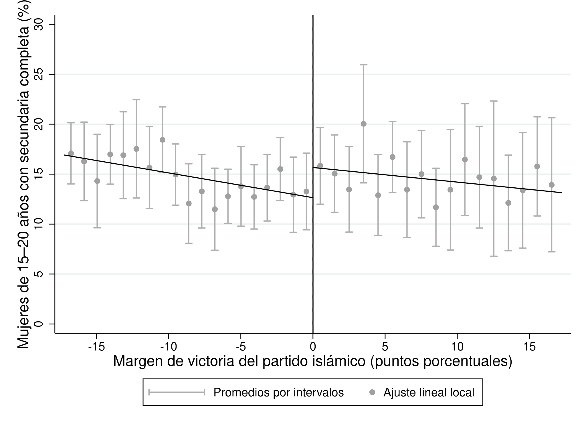
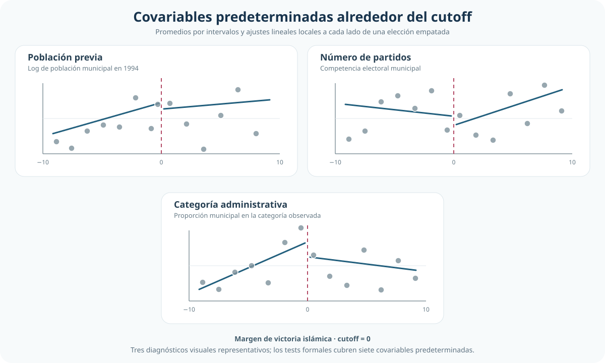
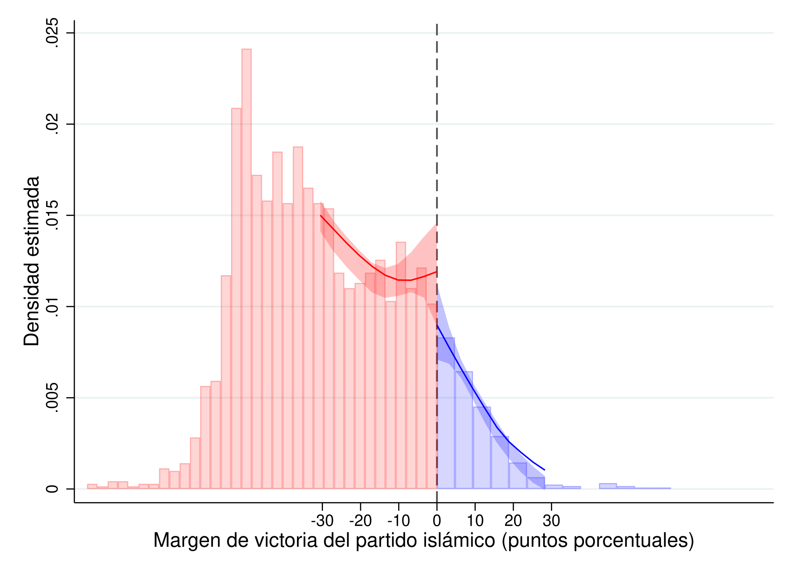

[← Volver al índice de Causalidad](../index.qmd)

::: {.hero-box}
::: {.hero-title}
Una elección decidida por poco permite cambiar la comparación causal
:::

::: {.hero-sub}
Esta aplicación explota el umbral de victoria electoral para estimar el efecto local de un alcalde islámico sobre la finalización de secundaria entre mujeres jóvenes.
:::
:::

## Pregunta y problema de comparación directa

¿Qué efecto tiene el control municipal de un alcalde islámico sobre la finalización de secundaria entre mujeres de 15 a 20 años, en municipios donde la elección se decidió por un margen mínimo?

**Respuesta corta:** la estimación local moderna es positiva y cercana a **3 puntos porcentuales**. La inferencia robusta es sugestiva (`p = 0,076`), pero el intervalo de confianza al 95% incluye cero; por eso el resultado no se presenta como concluyente al 5%.

Una comparación directa entre municipios con y sin alcalde islámico mezclaría el efecto del gobierno local con diferencias políticas, demográficas e institucionales previas. Los municipios más conservadores pueden votar distinto y, al mismo tiempo, presentar trayectorias educativas diferentes aun sin un cambio de alcalde.

## Idea de identificación: elecciones decididas por un margen mínimo

El diseño de regresión discontinua cambia la fuente de comparabilidad. Matching, PSM e IPWRA buscan construir grupos comparables a partir de características observadas; aquí no se comparan globalmente todos los municipios tratados y no tratados.

La comparación se concentra alrededor del margen electoral cero. Bajo continuidad de los resultados potenciales en ese punto, municipios que quedaron apenas a un lado u otro del umbral ofrecen el contraste relevante: son elecciones muy próximas, pero sólo quienes superan cero reciben el tratamiento.

## Diseño RDD

:::: {.quick-grid}

::: {.section-box}
**Regla de asignación**

La variable de asignación es el margen de victoria del partido islámico. El punto de corte es `0`: valores negativos indican derrota y valores positivos, victoria.
:::

::: {.section-box}
**Tratamiento y resultado**

El tratamiento es tener un alcalde islámico luego de la elección. El resultado es el porcentaje de mujeres de 15 a 20 años con secundaria completa.
:::

::: {.section-box}
**Estimando local**

El parámetro es el salto en el resultado esperado justo en el umbral: un efecto causal local para municipios con elecciones muy reñidas.
:::

::::

La asignación es *sharp*: en la base, el tratamiento coincide exactamente con la regla `margen ≥ 0`. Hay **0 discrepancias** y ninguna observación ubicada exactamente en el punto de corte.

## Datos y muestra

::: {.small-note}
- **Unidad de análisis:** municipio, en corte transversal.
- **Muestra total:** 2.629 municipios; 2.314 a la izquierda del umbral y 315 a la derecha.
- **Resultado:** porcentaje de mujeres de 15 a 20 años con secundaria completa.
- **Tratamiento:** alcalde islámico luego de la elección municipal.
- **Variable de asignación:** margen de victoria del partido islámico, en puntos porcentuales.
- **Covariables predeterminadas:** alcalde islámico previo, número de partidos, población y categorías administrativas del municipio.
:::

:::: {.metric-grid}

::: {.metric-card}
::: {.metric-label}
Muestra total
:::
::: {.metric-value}
2.629
:::
::: {.metric-note}
municipios
:::
:::

::: {.metric-card}
::: {.metric-label}
Asignación sharp
:::
::: {.metric-value}
0
:::
::: {.metric-note}
discrepancias
:::
:::

::: {.metric-card}
::: {.metric-label}
Ventana principal
:::
::: {.metric-value}
17,24
:::
::: {.metric-note}
ancho de banda MSE
:::
:::

::: {.metric-card}
::: {.metric-label}
Muestra local
:::
::: {.metric-value}
795
:::
::: {.metric-note}
municipios en la ventana
:::
:::

::::

## Evidencia visual alrededor del corte

{fig-alt="Promedios locales y ajustes lineales a ambos lados del margen electoral cero; el ajuste muestra un salto positivo en el umbral."}

El gráfico utiliza la ventana MSE-óptima y ajustes lineales locales con kernel triangular. Los puntos resumen el resultado por intervalos sólo para facilitar la lectura; la estimación se realiza con las observaciones municipales dentro de la ventana. El salto visual es positivo, pero la incertidumbre requiere una inferencia específica para RDD.

## Resultado principal: estimación local e inferencia robusta

::: {.table-box}
| Estimación | Ventana / ponderación | Efecto estimado (pp) | EE | p-value | IC 95% |
|---|---|---:|---:|---:|---:|
| Lineal local manual | ±20; pesos uniformes | 2,927 | — | — | — |
| MSE-óptima con corrección de sesgo | `h = 17,240`; kernel triangular | **2,983** | **1,680** | **0,076** | **[−0,309; 6,276]** |
:::

La primera fila reconstruye la intuición del diseño: los valores predichos en el umbral son 12,623% a la izquierda y 15,550% a la derecha. Su diferencia es 2,927 puntos porcentuales, pero esa construcción manual no aporta por sí sola la inferencia adecuada para RDD.

La segunda fila es la lectura principal. Con selección MSE-óptima del ancho de banda e inferencia robusta con corrección de sesgo, el control municipal islámico se asocia con un incremento local estimado de **2,98 puntos porcentuales** en la finalización de secundaria de mujeres jóvenes. La magnitud es sustantiva y la evidencia es marginal o sugestiva: `p = 0,076`, mientras que el IC 95% incluye cero.

## Robustez y sensibilidad esencial

::: {.table-box}
| Variante representativa | Efecto robusto (pp) | p-value robusto | Lectura |
|---|---:|---:|---|
| Lineal local, kernel triangular | 2,983 | 0,076 | Especificación principal |
| Polinomio local cuadrático | 2,662 | 0,185 | Mantiene el signo; pierde precisión |
| Ajuste con siete covariables predeterminadas | 3,271 | 0,054 | Magnitud similar; muestra de 1.908 por datos faltantes |
:::

El signo positivo y el orden de magnitud no dependen de una única variante. Sin embargo, la fuerza inferencial sí cambia con el orden polinómico, el kernel, la regla de varianza y la muestra disponible. Esa sensibilidad refuerza la decisión de privilegiar la especificación lineal local y presentar la evidencia sin una conclusión binaria basada sólo en un umbral de significación.

## Validez del diseño: covariables y densidad

Los tests locales sobre siete covariables predeterminadas no detectan saltos estadísticamente significativos. Sus p-values robustos se ubican entre `0,275` y `0,910`. Es una señal favorable para la continuidad local de características observables, aunque no prueba por sí sola continuidad de factores no observados.

{fig-alt="Tres paneles muestran promedios por intervalos y ajustes lineales locales a ambos lados del cutoff para población previa, número de partidos y categoría administrativa. Son diagnósticos visuales representativos; los tests formales cubren siete covariables predeterminadas."}

{fig-alt="Estimaciones de densidad del margen electoral a ambos lados de cero dentro de las ventanas seleccionadas por el test de densidad."}

El diagnóstico de densidad requiere una lectura mixta. La versión convencional rechaza continuidad (`p = 0,0145`), mientras que el test robusto no la rechaza (`p = 0,1634`). Además, los conteos son compatibles con equilibrio en las ventanas más estrechas y la asimetría aparece al ampliar la vecindad.

La conclusión prudente no es que la ausencia de manipulación haya quedado probada. La evidencia robusta no indica sorting preciso exactamente en el umbral, pero la señal convencional y la asimetría en ventanas más amplias justifican cautela.

## Alcance del estimando y límites

El efecto estimado es local. Describe municipios cuyas elecciones estuvieron suficientemente cerca del empate como para entrar en la ventana alrededor del corte; no es un efecto promedio para todos los municipios turcos ni para elecciones con márgenes amplios.

La lectura causal depende de que, en ausencia del cambio de alcalde, los resultados potenciales evolucionen suavemente al cruzar el umbral. La continuidad de covariables y el diagnóstico de densidad aportan evidencia sobre esa condición, pero no eliminan toda incertidumbre. A esto se suma la imprecisión estadística reflejada en el intervalo de confianza.

## Conclusión

En municipios con elecciones muy reñidas, el control municipal islámico presenta un efecto local estimado cercano a **3 puntos porcentuales** sobre la finalización de secundaria entre mujeres de 15 a 20 años.

El resultado es positivo, de magnitud sustantiva y sugestivo bajo inferencia robusta (`p ≈ 0,076`). Al mismo tiempo, el IC 95% incluye cero y los diagnósticos de densidad no son completamente uniformes. La conclusión adecuada es, por tanto, una evidencia causal local prometedora pero no concluyente al 5%, sostenida por una estrategia de comparación más creíble que el contraste global entre municipios.
