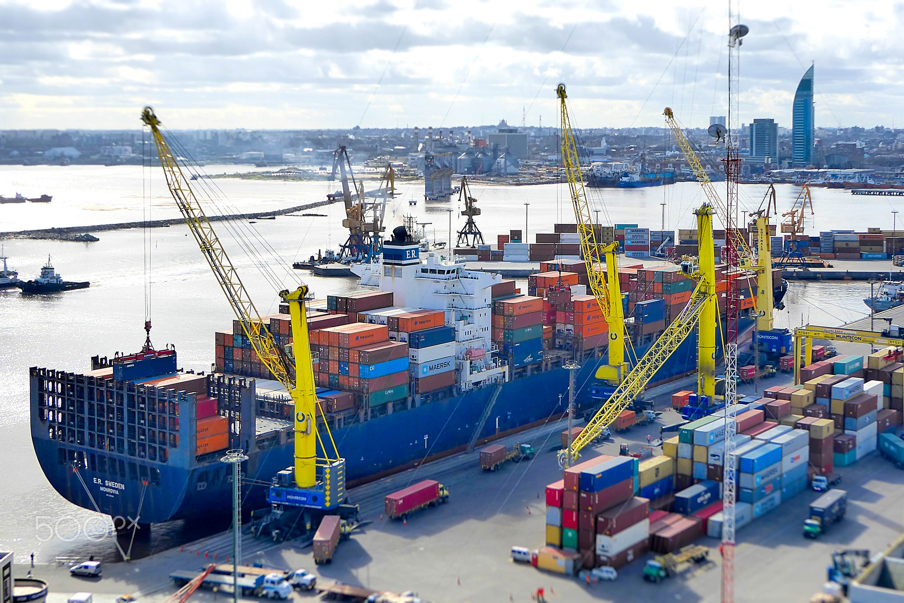
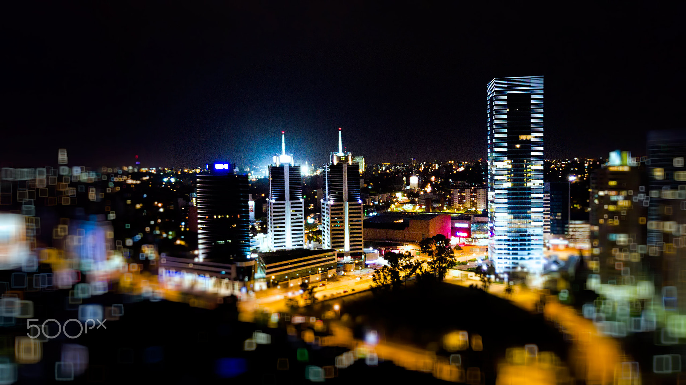
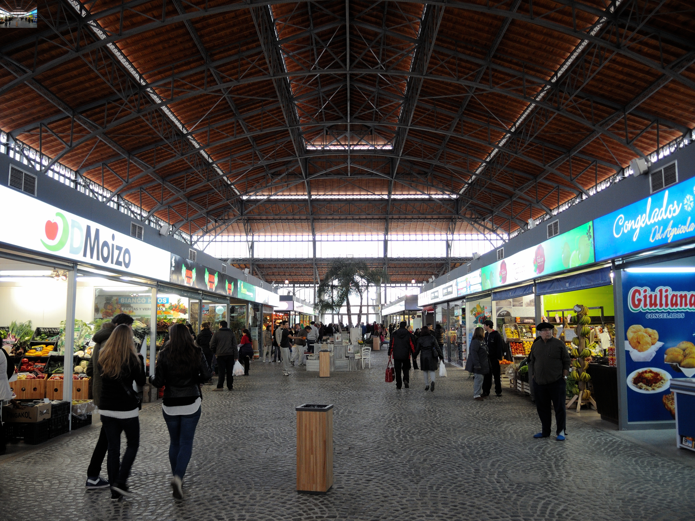
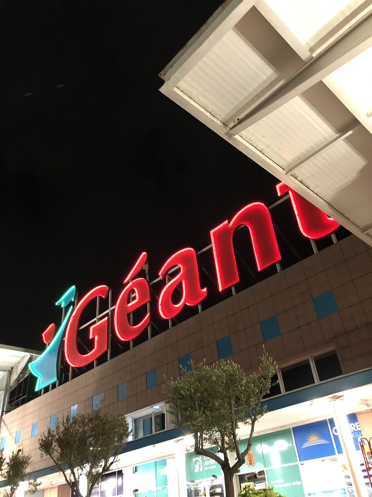
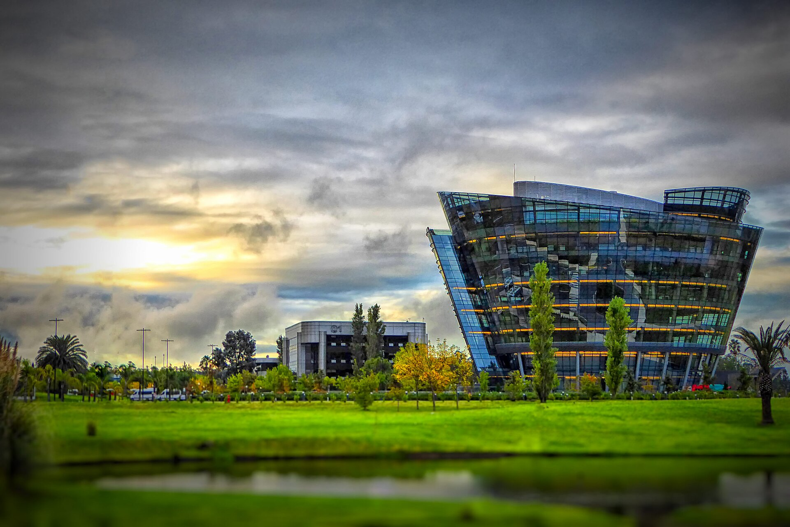
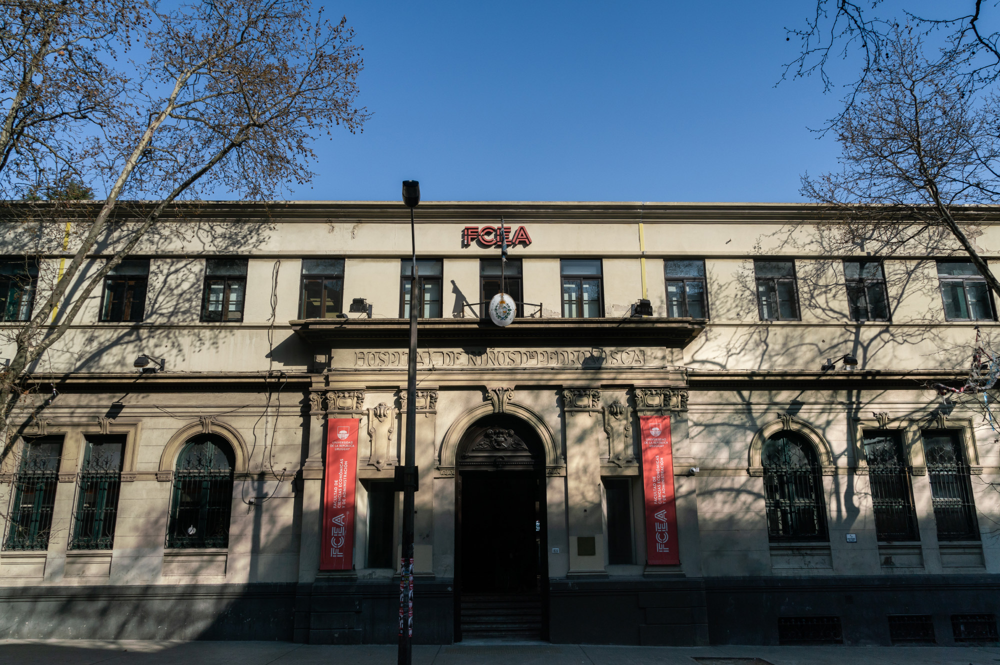

Las fotografías se almacenan localmente. Se usan los archivos originales disponibles o versiones de alta resolución generadas por Wikimedia; el hero aplica únicamente un recorte de encuadre mediante CSS. Cada obra conserva la licencia indicada por su fuente.

## Econometría

{fig-alt="Puerto de carga de Montevideo" width="70%"}

- **Imagen:** *Loading Port (163817647)*.
- **Autor:** Marcelo Campi.
- **Fuente:** [Wikimedia Commons](https://commons.wikimedia.org/wiki/File:Loading_Port_%28163817647%29.jpeg), importada originalmente desde 500px.
- **Licencia:** [CC BY-SA 3.0](https://creativecommons.org/licenses/by-sa/3.0/).
- **Adaptación:** versión local y recorte de encuadre mediante CSS; sin edición de contenido.

## Causalidad

### Portal general

{fig-alt="Vista nocturna del World Trade Center de Montevideo" width="70%"}

- **Imagen:** *Wtc At Night (218019347)*.
- **Autor:** Marcelo Campi.
- **Fuente:** [Wikimedia Commons](https://commons.wikimedia.org/wiki/File:Wtc_At_Night_%28218019347%29.jpeg).
- **Licencia:** [CC BY-SA 3.0](https://creativecommons.org/licenses/by-sa/3.0/).
- **Adaptación:** archivo original local y recorte de encuadre mediante CSS; sin edición de contenido.

### Fundamentos

{fig-alt="Área central del interior del Mercado Agrícola de Montevideo" width="70%"}

- **Imagen:** *Mercado Agricola Montevideo interior*.
- **Autor:** Fedaro.
- **Fuente:** [Wikimedia Commons](https://commons.wikimedia.org/wiki/File:Mercado_Agricola_Montevideo_interior.jpg).
- **Licencia:** [CC BY-SA 3.0](https://creativecommons.org/licenses/by-sa/3.0/).
- **Adaptación:** archivo original local y recorte de encuadre mediante CSS; sin edición de contenido.

### Difference-in-Differences moderno

{fig-alt="Vista nocturna del Hipermercado Géant de Ciudad de la Costa" width="55%"}

- **Imagen:** *Hipermercado Geant*.
- **Autor:** JacobinoWunsh.
- **Fuente:** [Wikimedia Commons](https://commons.wikimedia.org/wiki/File:Hipermercado_Geant.jpg).
- **Licencia:** [CC BY-SA 4.0](https://creativecommons.org/licenses/by-sa/4.0/).
- **Adaptación:** versión local de alta resolución y recorte de encuadre mediante CSS; sin edición de contenido.

## Machine Learning

{fig-alt="Edificio Celebra en Zonamerica, Montevideo" width="70%"}

- **Imagen:** *Zonamerica*.
- **Autor:** Marcelo Campi.
- **Fuente:** [Wikimedia Commons](https://commons.wikimedia.org/wiki/File:Zonamerica.jpg), publicada originalmente en Flickr.
- **Licencia:** [CC BY-SA 2.0](https://creativecommons.org/licenses/by-sa/2.0/).
- **Adaptación:** versión local de alta resolución y recorte de encuadre mediante CSS; sin edición de contenido.

## Sobre mí

{fig-alt="Fachada frontal de la Facultad de Ciencias Económicas y de Administración de la Universidad de la República" width="70%"}

**Sobre mí — Facultad de Ciencias Económicas y de Administración, Universidad de la República.** Imagen institucional asociada a LACEA–LAMES 2024. Fuente: [FCEA/Udelar](https://www.lacealames2024.org/). Adaptada mediante recorte de encuadre para su presentación en el sitio.
