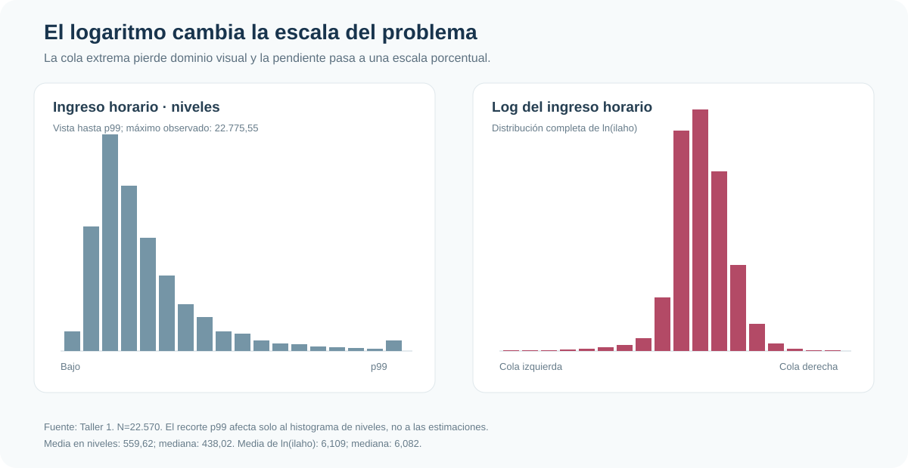
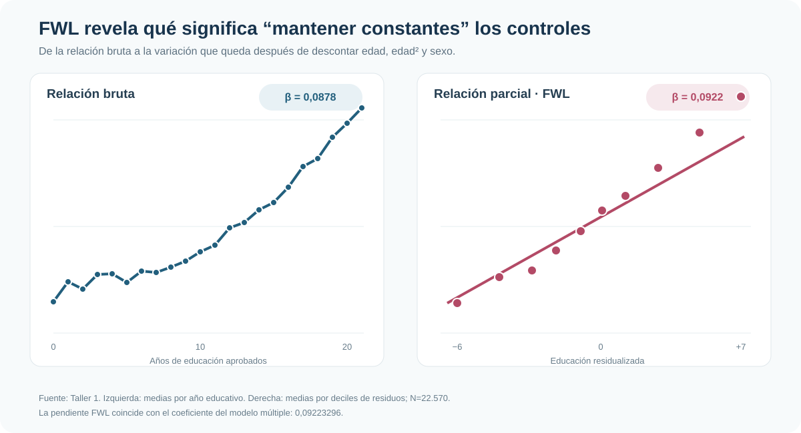

::: {.hero-box}
::: {.hero-title}
Controlar significa aislar la variación que queda después de descontar los controles.
:::

::: {.hero-sub}
Esta aplicación usa ingresos laborales para conectar MCO simple y múltiple con una idea central: el coeficiente parcial de educación compara componentes de ingreso y educación que ya no están explicados linealmente por edad y sexo. FWL vuelve visible esa operación.
:::
:::

:::: {.metric-grid}
::: {.metric-card}
::: {.metric-label}
Muestra analítica
:::
::: {.metric-value}
22.570 personas
:::
::: {.metric-note}
Ingreso horario positivo, educación, edad y sexo observados
:::
:::
::: {.metric-card}
::: {.metric-label}
Relación bruta
:::
::: {.metric-value}
8,78 log-puntos
:::
::: {.metric-note}
Por año educativo en el modelo log-lineal simple
:::
:::
::: {.metric-card}
::: {.metric-label}
Relación parcial
:::
::: {.metric-value}
9,22 log-puntos
:::
::: {.metric-note}
Condicional en edad, edad² y sexo
:::
:::
::: {.metric-card}
::: {.metric-label}
FWL
:::
::: {.metric-value}
Diferencia = 0
:::
::: {.metric-note}
La pendiente residualizada coincide con el MCO múltiple
:::
:::
::::

## Pregunta aplicada

¿Cómo se relaciona la educación con el ingreso laboral horario y qué cambia cuando comparamos personas similares en edad y sexo? La pregunta ordena tres decisiones: la escala del ingreso, la diferencia entre asociación bruta y parcial, y la inferencia apropiada cuando la dispersión del error no es constante.

La base contiene 22.570 observaciones. La variable de interés es `aedu`, años de educación aprobados; el resultado es el ingreso laboral horario (`ilaho`). El ejercicio estima una proyección lineal condicional. No identifica automáticamente un retorno causal: habilidad, contexto familiar y selección educativa pueden seguir relacionadas con educación e ingreso.

## Por qué transformar el ingreso

El ingreso horario en niveles tiene media 559,62, mediana 438,02 y una cola derecha muy larga: su asimetría es 8,77 y el máximo alcanza 22.775,55. El logaritmo comprime esa cola, produce una distribución más concentrada y permite expresar pendientes como cambios porcentuales aproximados.

{fig-alt="Histogramas comparativos del ingreso horario en niveles y en logaritmos" width="100%"}

La transformación no es cosmética. En niveles, un año adicional de educación se asocia con 56,02 unidades más de ingreso horario. En logaritmos, la pendiente simple es 0,0878: 8,78 log-puntos o aproximadamente 9,18% en términos exactos, usando `exp(β)−1`.

## De MCO simple a MCO múltiple

El modelo simple resume la relación bruta. El modelo múltiple agrega edad, edad al cuadrado y sexo. El coeficiente educativo pasa de 0,0878 a 0,09223; controlar por esas variables modifica poco la pendiente, pero cambia qué comparación la sostiene.

::: {.table-box}
## Especificaciones principales

| Especificación | Coeficiente educativo | EE | R² | Interpretación |
|---|---:|---:|---:|---|
| Ingreso en niveles, simple | 56,016 | 0,775 | 0,188 | Unidades monetarias por año educativo |
| Log ingreso, simple | 0,0878 | 0,0010 | 0,256 | Asociación bruta en log-puntos |
| Log ingreso, múltiple | 0,0922 | 0,0009 | 0,368 | Asociación parcial con EE clásico |
| Log ingreso, múltiple robusto | 0,0922 | 0,0010 | 0,368 | Misma pendiente, inferencia robusta |
:::

El término lineal de edad es positivo y el cuadrático negativo, consistente con un perfil creciente a tasa decreciente. Alrededor de los 40 años, la combinación correspondiente equivale a 0,0154 log-puntos por un año adicional. El coeficiente asociado a hombre es 0,197, una diferencia condicional aproximada de 21,8% respecto de la categoría base. Son asociaciones condicionadas, no efectos causales.

## FWL: hacer visible el coeficiente parcial

El teorema de Frisch–Waugh–Lovell traduce “mantener constantes” edad, edad² y sexo en tres operaciones:

1. remover de `ln(ilaho)` la parte explicada linealmente por esos controles;
2. hacer lo mismo con educación;
3. relacionar ambos residuos.

La pendiente resultante es 0,09223296, exactamente la misma que el coeficiente educativo del modelo múltiple. La igualdad no es una aproximación empírica: es una propiedad algebraica de MCO cuando se usan la misma muestra y los mismos controles.

{fig-alt="Comparación entre relación bruta de educación e ingreso y relación parcial residualizada mediante FWL" width="100%"}

FWL también aclara un límite: residualizar respecto de unos pocos controles observados no elimina toda la endogeneidad. El gráfico muestra qué significa una asociación parcial dentro del modelo, no demuestra que educación sea exógena.

## Educación continua o categórica

Tratar educación como años aprobados impone una pendiente promedio constante. La alternativa categórica permite saltos diferentes entre niveles y rechaza conjuntamente que todas las categorías sean irrelevantes (`F=1485,52`, *p*<0,001).

El gradiente es claro —educación superior completa presenta un coeficiente de 1,1205 frente a la categoría omitida—, pero la base “nunca asistió” contiene solo 18 personas. Por eso la versión categórica funciona como sensibilidad de forma funcional; la especificación continua es más estable para explicar MCO y FWL.

## Inferencia y heterocedasticidad

Los coeficientes MCO no cambian al solicitar errores robustos; cambia la estimación de su incertidumbre. Para educación, el EE pasa de 0,000938 a 0,000982. La diferencia es pequeña en esta muestra grande, pero el principio importa: precisión clásica y robusta responden a supuestos distintos sobre la varianza condicional del error.

::: {.table-box}
| Diagnóstico | Resultado | Lectura |
|---|---:|---|
| Test individual de educación | `F=8823,09`; *p*<0,001 | Asociación parcial estadísticamente precisa |
| Edad y edad², test conjunto | `F=1551,21`; *p*<0,001 | El perfil de edad debe evaluarse conjuntamente |
| Breusch–Pagan/Cook–Weisberg | *p*=0,051 | Evidencia limítrofe bajo una alternativa específica |
| White/Cameron–Trivedi | χ²=152,33; *p*<0,001 | Rechazo claro de homocedasticidad |
:::

La evidencia conjunta favorece errores robustos como salida principal. Esto no corrige variables omitidas ni vuelve causal el coeficiente: ajusta la inferencia frente a heterocedasticidad. Los VIF elevados de edad y edad² reflejan su construcción mecánica y justifican interpretar ambos términos conjuntamente, no eliminar automáticamente el cuadrático.

## Conclusión

MCO simple muestra una relación bruta; MCO múltiple redefine la comparación mediante controles; FWL revela qué variación produce el coeficiente parcial. La transformación logarítmica vuelve interpretable una distribución muy asimétrica, y los errores robustos separan la estimación puntual de los supuestos usados para cuantificar su precisión.

En esta muestra, un año adicional de educación se asocia con aproximadamente 9,66% más ingreso horario después de controlar linealmente por edad, edad² y sexo. Es una asociación estable y precisa dentro del modelo, pero no un retorno causal identificado. Esa distinción —entre describir, controlar e identificar— es la enseñanza central.
