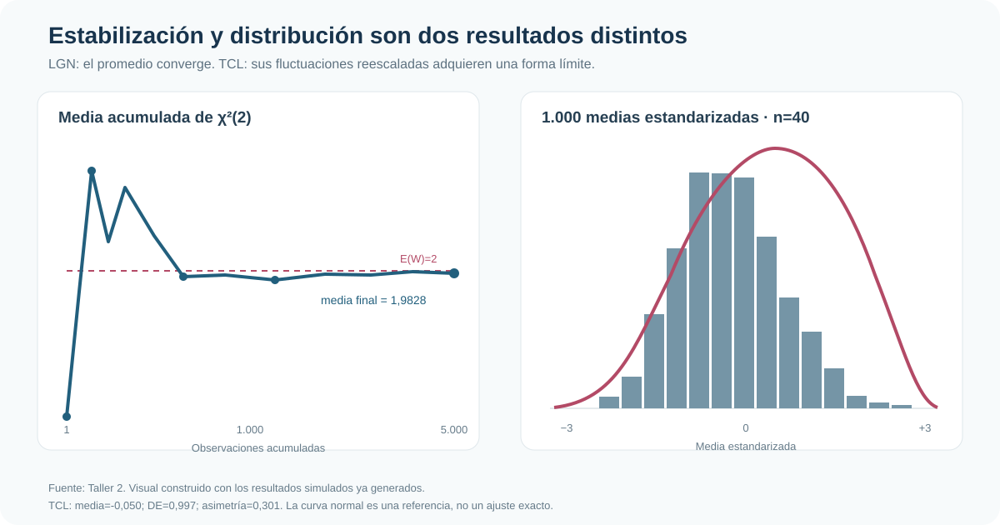
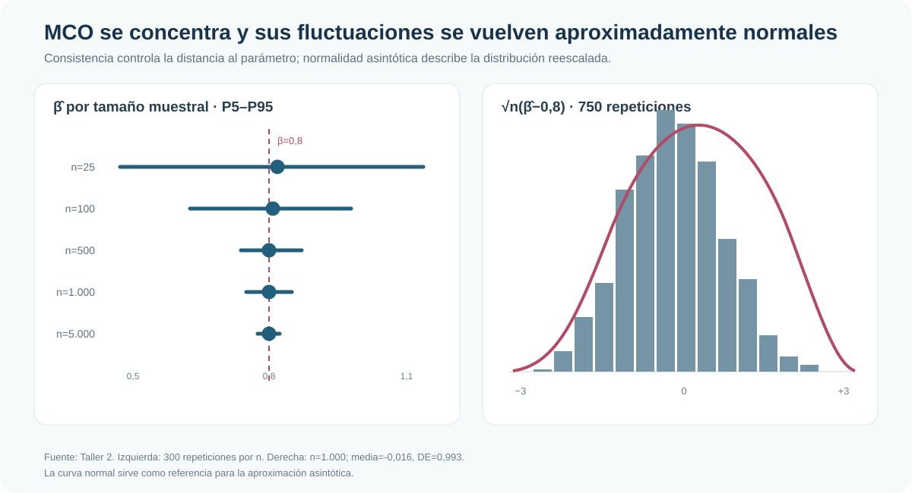

::: {.hero-box}
::: {.hero-title}
Las muestras grandes estabilizan estimadores y aproximaciones distributivas; no corrigen una fórmula de varianza equivocada.
:::
::: {.hero-sub}
Cinco resultados clásicos forman una sola cadena: la LGN estabiliza momentos muestrales, el TCL describe sus fluctuaciones, ambas propiedades sostienen consistencia y normalidad asintótica de MCO, y la matriz de varianzas correcta convierte esa aproximación en inferencia válida.
:::
:::

:::: {.metric-grid}
::: {.metric-card}
::: {.metric-label}
LGN
:::
::: {.metric-value}
1,983 → 2
:::
::: {.metric-note}
Media acumulada final de una χ²(2), con N=5.000
:::
:::
::: {.metric-card}
::: {.metric-label}
TCL
:::
::: {.metric-value}
DE = 0,997
:::
::: {.metric-note}
1.000 medias estandarizadas de muestras con n=40
:::
:::
::: {.metric-card}
::: {.metric-label}
Consistencia MCO
:::
::: {.metric-value}
DE: 0,226 → 0,015
:::
::: {.metric-note}
Al pasar de n=25 a n=5.000; β verdadero=0,8
:::
:::
::: {.metric-card}
::: {.metric-label}
Heterocedasticidad
:::
::: {.metric-value}
EE: 0,046 → 0,065
:::
::: {.metric-note}
Mismo coeficiente; incertidumbre robusta mayor
:::
:::
::::

## Una tesis, dos dimensiones de la simulación

La econometría observa una sola muestra; la simulación permite ver la distribución que existiría detrás de ella. El tamaño muestral `n` determina cuánto varía un estadístico dentro del experimento. Las repeticiones no mejoran el estimador de una muestra: permiten reconstruir su distribución muestral.

El ejercicio usa procesos deliberadamente simples y parámetros conocidos. Así puede comprobarse si una media converge a 2, si una pendiente converge a 0,8 y si los errores estándar reflejan la variabilidad que realmente se introdujo.

## De la LGN al TCL

La Ley de los Grandes Números explica por qué los promedios muestrales se estabilizan. Una variable χ²(2) es positiva y muy asimétrica, pero tiene esperanza conocida igual a 2. En una trayectoria de 5.000 observaciones, la media acumulada termina en 1,9828.

El Teorema Central del Límite responde una pregunta distinta: no dónde termina la media, sino cómo fluctúa alrededor de su esperanza. Con 1.000 muestras de tamaño 40, el estadístico estandarizado tiene media -0,050, desviación 0,997 y una forma aproximadamente normal, aunque los datos originales no lo sean.

{fig-alt="Media acumulada convergiendo a dos y distribución aproximadamente normal de medias estandarizadas" width="100%"}

La aproximación no es una igualdad exacta: la asimetría residual de las medias es 0,301. El tamaño de cada muestra gobierna la calidad de la aproximación; las 1.000 repeticiones solo permiten verla con mayor claridad.

## De promedios a MCO

MCO también es una función de momentos muestrales. Bajo exogeneidad y variación suficiente del regresor, la LGN lleva esos momentos hacia sus contrapartes poblacionales y la pendiente se concentra alrededor del parámetro verdadero.

En 300 repeticiones por tamaño muestral, la media de `β̂` permanece cerca de 0,8 y su dispersión cae con `n`. El intervalo P5–P95 pasa de [0,471; 1,197] con `n=25` a [0,775; 0,824] con `n=5.000`. Consistencia no significa convergencia monótona en una trayectoria: significa concentración probabilística de la distribución del estimador.

## Normalidad asintótica e inferencia

La normalidad asintótica describe las fluctuaciones de orden `√n`. En 750 muestras de tamaño 1.000, `√n(β̂−0,8)` tiene media -0,016, desviación 0,993, asimetría -0,016 y curtosis 2,715. Bajo este diseño particular, la varianza límite es cercana a uno.

{fig-alt="Intervalos de la pendiente MCO por tamaño muestral e histograma de la distribución asintótica reescalada" width="100%"}

La consistencia permite que el estimador se acerque al parámetro. La normalidad asintótica permite construir aproximaciones para errores estándar, intervalos y tests. Son propiedades relacionadas, pero no intercambiables.

::: {.table-box}
## Concentración de β̂

| n | Media de β̂ | Desviación estándar | P5 | P95 |
|---:|---:|---:|---:|---:|
| 25 | 0,8157 | 0,2258 | 0,4713 | 1,1970 |
| 100 | 0,8058 | 0,1111 | 0,6332 | 0,9857 |
| 500 | 0,8002 | 0,0412 | 0,7358 | 0,8695 |
| 1.000 | 0,7998 | 0,0303 | 0,7464 | 0,8470 |
| 5.000 | 0,8001 | 0,0147 | 0,7748 | 0,8236 |
:::

## Heterocedasticidad: el límite de “más datos”

Se simula `y=1+0,8x+u` con media condicional cero, pero con una dispersión del error que crece con `|x|`. MCO estima 0,7969, cerca del parámetro verdadero. La heterocedasticidad no altera el coeficiente calculado ni su consistencia bajo este diseño; sí invalida la fórmula homocedástica de varianza.

::: {.table-box}
| Resultado | MCO clásico | MCO robusto |
|---|---:|---:|
| Coeficiente de x | 0,7969 | 0,7969 |
| Error estándar | 0,0460 | 0,0650 |
| IC95% aproximado | [0,707; 0,887] | [0,670; 0,924] |
| N | 1.000 | 1.000 |
:::

Breusch–Pagan rechaza homocedasticidad (`p=0,0042`) y White lo hace con mayor claridad (`p<0,001`). El error robusto es 41% mayor que el clásico. Aumentar `n` puede hacer más precisa la aproximación asintótica, pero no transforma una matriz de varianzas mal especificada en una correcta.

## Conclusión

La LGN explica estabilización; el TCL, fluctuaciones; ambas sostienen consistencia y normalidad asintótica de MCO. Esa cadena justifica gran parte de la estimación y la inferencia habitual, pero solo bajo las condiciones relevantes del proceso generador.

La lección operativa es doble: una muestra grande mejora la concentración y la aproximación distributiva, pero no reemplaza el diagnóstico del modelo. Cuando la varianza condicional está mal especificada, la inferencia convencional puede seguir siendo incorrecta incluso con muchos datos; la robustez debe incorporarse en la matriz de varianzas, no esperarse como un premio automático por aumentar la muestra.
