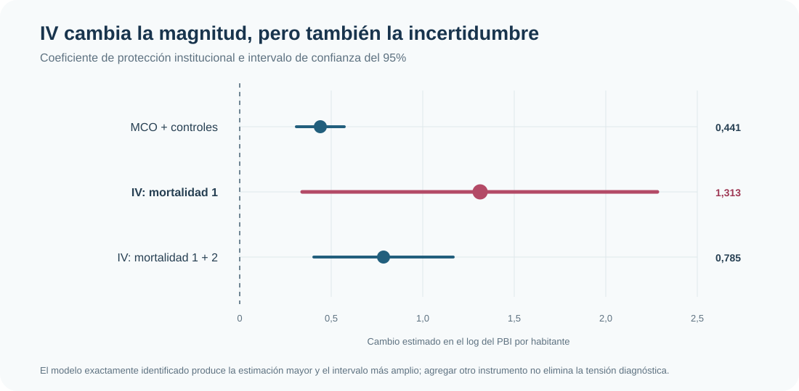
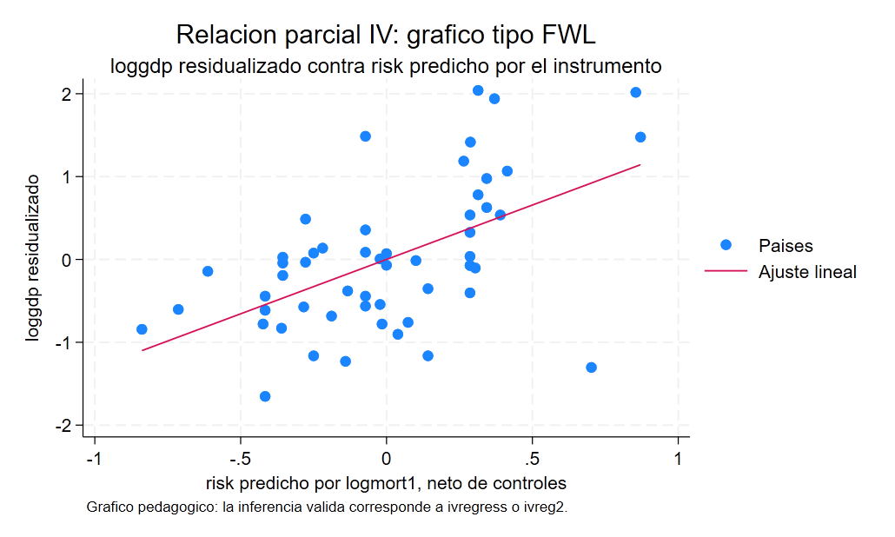

::: {.hero-box}
::: {.hero-title}
Instrumentar no equivale a resolver la endogeneidad
:::

::: {.hero-sub}
La mortalidad histórica permite aislar una fuente distinta de variación institucional. Pero una primera etapa frágil, mayor incertidumbre y tensiones de sobreidentificación impiden convertir 2SLS en una garantía automática de credibilidad.
:::
:::

:::: {.metric-grid}

::: {.metric-card}
::: {.metric-label}
Muestra común
:::

::: {.metric-value}
53 países
:::

::: {.metric-note}
Corte transversal
:::
:::

::: {.metric-card}
::: {.metric-label}
Primera etapa
:::

::: {.metric-value}
F = 4,38
:::

::: {.metric-note}
Instrumento débil o borderline
:::
:::

::: {.metric-card}
::: {.metric-label}
IV: un instrumento
:::

::: {.metric-value}
1,313
:::

::: {.metric-note}
EE robusto = 0,495
:::
:::

::: {.metric-card}
::: {.metric-label}
Sobreidentificación
:::

::: {.metric-value}
p = 0,049
:::

::: {.metric-note}
Tensión con dos instrumentos
:::
:::

::::

## Pregunta

¿Cuánto cambia la relación estimada entre protección institucional y desarrollo económico cuando la calidad de las instituciones se trata como endógena y se utiliza mortalidad histórica como instrumento?

El caso separa dos preguntas que a menudo se confunden: si el instrumento **mueve** la variable endógena y si es razonable sostener que afecta el resultado **solamente a través de ella**. La primera puede estudiarse en los datos; la segunda exige un argumento sustantivo de exclusión.

## Aplicación y problema de endogeneidad

La base reúne **53 países**. El resultado es el logaritmo del PBI por habitante en 1995 y la variable endógena es un indicador de protección institucional —mayores valores representan menor riesgo de expropiación—. Los modelos incluyen controles regionales para Asia, América y Oceanía.

Una regresión directa puede mezclar la relación institucional con geografía, historia, medición, persistencia o causalidad inversa. La estrategia instrumental utiliza el logaritmo de la mortalidad histórica como fuente de variación para la protección institucional.

Esta estrategia requiere dos condiciones diferentes:

- **Relevancia:** la mortalidad histórica debe estar asociada con las instituciones actuales.
- **Exclusión:** condicional en los controles, no debe afectar el desarrollo actual por canales distintos de las instituciones.

## Primera etapa y forma reducida

La primera etapa relaciona mortalidad histórica con protección institucional. La forma reducida relaciona ese mismo instrumento con el resultado. Ambas pendientes son negativas: mayor mortalidad histórica aparece asociada con instituciones menos protectoras y con menor desarrollo contemporáneo.

{fig-alt="Dos paneles de dispersión. En ambos, mortalidad histórica aparece en el eje horizontal. El primero muestra una relación negativa con protección institucional y el segundo una relación negativa con el log del PBI por habitante." width="100%"}

Con controles regionales, la pendiente de la primera etapa es **−0,326**, con **F = 4,38** y un R² parcial de **0,077**. Existe una relación empírica, pero es débil o borderline. La forma reducida es más precisa: su pendiente es **−0,428**, con **F = 15,46**.

En el caso exactamente identificado, el cociente entre forma reducida y primera etapa recupera el coeficiente IV:

$$
\widehat\beta_{IV}=\frac{-0{,}4278}{-0{,}3259}=1{,}3128.
$$

La identidad organiza la lógica del estimador, pero no resuelve por sí misma la validez del instrumento ni su debilidad.

## MCO frente a 2SLS

MCO con controles regionales produce un coeficiente de **0,441** para protección institucional, con error estándar robusto de **0,066**. Al utilizar la variación inducida por la primera medida de mortalidad histórica, 2SLS eleva el coeficiente a **1,313**, con error estándar robusto de **0,495** e IC95% aproximado de **[0,342; 2,284]**.

{fig-alt="Coeficientes e intervalos de confianza para MCO e IV. MCO tiene la estimación menor y más precisa; IV con un instrumento tiene la mayor estimación y el intervalo más amplio; IV con dos instrumentos ocupa una posición intermedia." width="100%"}

El aumento del coeficiente no debe presentarse como una corrección automática de MCO. 2SLS utiliza una porción mucho más estrecha de la variación institucional y esa porción está débilmente explicada por el instrumento. La magnitud mayor viene acompañada por una pérdida sustancial de precisión.

La prueba de endogeneidad rechaza la exogeneidad de la protección institucional —p = 0,006 en el test robusto de score—. Esto justifica tomar en serio la diferencia entre MCO e IV, pero no demuestra que la restricción de exclusión sea correcta.

## Fragilidad instrumental

El estadístico Kleibergen–Paap de **4,38** y el test de subidentificación con **p = 0,051** ubican al modelo exactamente identificado en una zona frágil. Con una primera etapa débil:

- el coeficiente IV puede ser inestable;
- los intervalos convencionales pueden ofrecer una imagen incompleta de la incertidumbre;
- una estimación alejada de MCO no es, por sí sola, evidencia de mayor credibilidad.

El bloque FWL-IV confirma visualmente la mecánica: después de retirar los controles regionales, la pendiente entre desarrollo residualizado y protección institucional predicha por el instrumento reproduce **1,313**. Esa regresión auxiliar explica la geometría de 2SLS, pero su error estándar manual no es la inferencia IV correcta. Por eso queda como apoyo conceptual y no como resultado adicional.

{fig-alt="Representación FWL de la relación entre desarrollo residualizado y protección institucional predicha por el instrumento" width="100%"}

## Un segundo instrumento: más relevancia, nueva tensión

Al agregar una segunda medida de mortalidad histórica, el coeficiente IV baja a **0,785** y su error estándar robusto a **0,195**. La primera etapa conjunta mejora: el R² parcial sube a **0,213** y el estadístico Kleibergen–Paap a **7,27**. Aun así, la preocupación por debilidad no desaparece.

::: {.table-responsive}
| Especificación | Coeficiente institucional | Diagnóstico decisivo | Lectura |
|---|---:|---|---|
| MCO + controles | 0,441 | No trata la endogeneidad | Asociación parcial precisa |
| IV: mortalidad 1 | 1,313 | KP F = 4,38 | Identificación débil o borderline |
| IV: mortalidad 1 + 2 | 0,785 | KP F = 7,27; Hansen p = 0,049 | Mejora relevancia, pero aparece tensión de exclusión conjunta |

: Una mejora mecánica de la primera etapa no garantiza validez instrumental
:::

El test de Hansen rechaza las restricciones de sobreidentificación al 5%. No identifica cuál instrumento sería problemático ni prueba por sí solo un canal alternativo, pero advierte que las dos restricciones de exclusión no encajan cómodamente en conjunto. Agregar instrumentos puede ganar relevancia y, al mismo tiempo, exigir supuestos adicionales difíciles de defender.

## Alcance

Esta aplicación está vinculada a la discusión sobre instituciones y desarrollo, pero no constituye una réplica completa de esa literatura ni resuelve sus controversias históricas. La mortalidad es un instrumento continuo y la estimación debe interpretarse dentro del modelo lineal especificado y de la variación que ese instrumento genera en esta muestra.

La evidencia muestra asociaciones consistentes con la lógica instrumental, pero la primera etapa frágil y la tensión de sobreidentificación impiden presentar los coeficientes como una demostración causal concluyente.

## Conclusión

Variables instrumentales cambia la fuente de variación utilizada para estimar la relación entre instituciones y desarrollo. En esta muestra, 2SLS produce coeficientes mayores que MCO, pero también revela mucha más incertidumbre y sensibilidad al conjunto de instrumentos.

La lectura dominante es metodológica: **IV no resuelve automáticamente la endogeneidad**. Una estrategia defendible necesita relevancia suficiente, una exclusión sustantivamente creíble y una inferencia acorde con la fragilidad de la primera etapa. El comando estima el modelo; los diagnósticos y el argumento económico determinan cuánto puede sostenerse con él.
