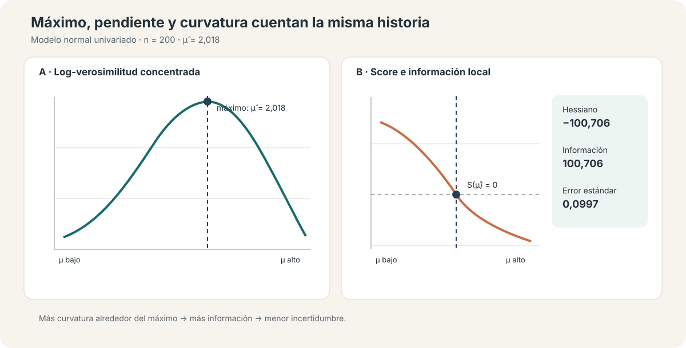

::: {.hero-box}
::: {.hero-title}
Estimar por máxima verosimilitud significa escribir una distribución completa; usar QMLE significa preguntar qué parte de esa estructura todavía identifica el objeto de interés.
:::

::: {.hero-sub}
Este ejercicio usa simulaciones para conectar función objetivo, score, Hessiano e inferencia. El recorrido muestra cuándo máxima verosimilitud coincide con MCO, por qué Wald, LR y Score contrastan una misma restricción desde lugares distintos y cómo una media correctamente especificada puede sobrevivir a una distribución o varianza incorrectas —si la inferencia se vuelve robusta.
:::
:::

:::: {.metric-grid}

::: {.metric-card}
::: {.metric-label}
Media verdadera
:::
::: {.metric-value}
2,000
:::
::: {.metric-note}
La estimación MV en una muestra de 200 es 2,018
:::
:::

::: {.metric-card}
::: {.metric-label}
Información observada
:::
::: {.metric-value}
100,71
:::
::: {.metric-note}
Implica un error estándar de 0,0997 para la media
:::
:::

::: {.metric-card}
::: {.metric-label}
Wald · LR · LM
:::
::: {.metric-value}
p ≈ 0,027
:::
::: {.metric-note}
Tres rutas, la misma decisión en esta muestra
:::
:::

::: {.metric-card}
::: {.metric-label}
QMLE: SE de x₁
:::
::: {.metric-value}
0,0468 → 0,0689
:::
::: {.metric-note}
Nominal frente a sandwich bajo heterocedasticidad
:::
:::

::::

## Qué cambia al escribir una distribución

MCO puede comenzar con una condición sobre la media, como $E(Y\mid X)=X'\beta$. Máxima verosimilitud comienza más arriba: postula una densidad o función de probabilidad completa, $f(y\mid x;\theta)$. Esa elección determina simultáneamente una función objetivo, una estructura de varianza y una forma de cuantificar incertidumbre.

Para observaciones independientes, el estimador maximiza la suma de contribuciones individuales:

$$
\widehat\theta_{MV}=\arg\max_\theta\sum_{i=1}^{n}\log f(y_i\mid x_i;\theta).
$$

La ventaja es potente: si la distribución está correctamente especificada, la misma estructura entrega estimación eficiente e inferencia coherente. El costo también es claro: la matriz de varianza basada en información hereda las restricciones de la densidad escrita.

## Máximo, score y curvatura

El primer ejercicio simula $Y_i\sim N(2,1{,}5^2)$ con $n=200$. La media estimada es 2,0184 y la varianza MV —que divide por $n$— es 1,9860. La log-verosimilitud concentrada alcanza su máximo exactamente en la media muestral.

El **score** es la pendiente de esa función: es positivo antes del máximo, cero en el máximo y negativo después. El **Hessiano** mide su curvatura. Su negativo es la información observada; una cima más pronunciada contiene más información y produce un error estándar menor.

{fig-alt="Log-verosimilitud, score e información observada para una media normal simulada" width="100%"}

En esta realización, el Hessiano es −100,706 y la información observada 100,706. Por eso,

$$
se(\widehat\mu)=\sqrt{I(\widehat\mu)^{-1}}=0{,}0997.
$$

La figura no es una metáfora decorativa: función objetivo, condición de primer orden e incertidumbre son tres lecturas del mismo problema de optimización.

## Cuándo MCO y MV producen el mismo coeficiente

En una regresión normal homocedástica,

$$
Y_i\mid X_i\sim N(X_i'\beta,\sigma^2),
$$

maximizar la log-verosimilitud respecto de $\beta$ equivale a minimizar la suma de residuos cuadrados. La simulación con 1.000 observaciones confirma la equivalencia numérica.

::: {.table-box}
| Parámetro | MCO | MV normal | Diferencia |
|---|---:|---:|---:|
| Constante | 0,97647 | 0,97647 | < 0,000001 |
| $x_1$ | 0,76529 | 0,76529 | < 0,000001 |
| $x_2$ | −0,30573 | −0,30573 | < 0,000001 |
| Varianza residual con divisor $n$ | 1,57173 | 1,57173 | < 0,000001 |
:::

La coincidencia no vuelve idénticas las justificaciones. MCO puede identificar la proyección o una media lineal bajo condiciones más débiles; MV normal interpreta además la forma, homocedasticidad y colas de la distribución condicional. También explica la diferencia habitual en la varianza residual: MV usa $RSS/n$, mientras la versión insesgada convencional de MCO usa $RSS/(n-k)$.

## Inferencia muestral: exacta, asintótica y simulada

El Monte Carlo usa 1.000 repeticiones para $n=50$ y otras 1.000 para $n=750$. Bajo un proceso normal y con $\sigma_0$ conocido, el estadístico estandarizado de la media es normal exacto para cualquier $n$: ese ejercicio verifica la mecánica y el ruido de simulación, no una convergencia.

Cuando el proceso es lognormal reescalado para mantener media 2 y varianza 2,25, la normalidad es solo aproximada. Con $n=50$, el percentil 95 del estadístico es 1,839; con $n=750$ cae a 1,556, más cerca de la referencia normal 1,645. La muestra grande reduce la huella de la asimetría original, aunque 1.000 repeticiones todavía dejan ruido Monte Carlo.

{fig-alt="Aproximación normal por tamaño muestral y comparación de errores estándar nominales y robustos bajo QMLE" width="100%"}

La simulación cumple así una función única: separar normalidad exacta, aproximación asintótica y precisión estimada. No prueba que una likelihood sea correcta en datos reales.

## Wald, LR y Score/LM: tres puntos de apoyo

Los tres contrastes evalúan $H_0:\beta_2=0$, pero usan información distinta:

- **Wald** parte del máximo irrestricto y pregunta cuán lejos está de la restricción.
- **LR** compara los máximos de las log-verosimilitudes irrestricta y restringida.
- **Score/LM** permanece en el modelo restringido y pregunta si la pendiente de la función objetivo empuja a salir de él.

::: {.table-box}
| Test | Estadístico $\chi^2(1)$ | p-valor |
|---|---:|---:|
| Wald | 4,9042 | 0,0268 |
| Razón de verosimilitud | 4,9069 | 0,0267 |
| Score / LM | 4,8949 | 0,0269 |
:::

Los tres rechazan al 5% en esta muestra. Su proximidad ilustra la equivalencia asintótica bajo especificación correcta; no garantiza igualdad en muestras finitas ni bajo mala especificación.

## De MLE correcta a QMLE

Una likelihood normal homocedástica admite dos lecturas. Como **MLE correcta**, afirma que la distribución condicional es normal, la media es lineal y la varianza es constante. Como **QMLE**, puede usarse solo como criterio para estimar una media lineal: maximizarla respecto de $\beta$ sigue siendo minimizar residuos cuadrados.

El ejercicio simula una media lineal correctamente especificada con errores heterocedásticos y no normales. MCO y la estimación normal entregan los mismos coeficientes: para $x_1$, 0,7688. La diferencia aparece en la incertidumbre.

::: {.table-box}
| Parámetro | Coeficiente | SE nominal | SE robusto |
|---|---:|---:|---:|
| $x_1$ | 0,7688 | 0,0468 | 0,0689 |
| $x_2$ | −0,6833 | 0,1603 | 0,1525 |
:::

La robustez no significa “errores siempre mayores”. El sandwich reemplaza una estructura homocedástica por contribuciones observación por observación: aumenta el error de $x_1$, donde crece la dispersión, y reduce levemente el de $x_2$. El estimador puntual conserva su interpretación porque la media está bien especificada; la matriz nominal deja de ser defendible porque la varianza escrita no lo está.

::: {.callout-note}
## La frontera de QMLE

Si falla una implicancia de la distribución completa pero la media condicional sigue siendo válida, puede sobrevivir el parámetro de media con inferencia sandwich. Si falla la propia media, el problema ya no es solo el error estándar: puede perderse el objeto que se pretendía estimar.
:::

## Qué queda fuera

Los diagnósticos normal, Poisson y Gamma del material fuente aclaran que una distribución completa impone media, varianza y forma. Aquí se usan solo para fijar ese principio. Las aplicaciones sustantivas de conteos, respuestas positivas y QMLE en panel pertenecen a otras unidades y no se incorporan a este análisis.

## Conclusión

Máxima verosimilitud no es simplemente “otro comando” para obtener coeficientes. Es una decisión sobre la distribución de los datos: el score localiza el máximo, el Hessiano traduce curvatura en información y los contrastes Wald, LR y LM explotan distintas partes de esa estructura.

La equivalencia MCO–MV normal muestra que dos métodos pueden coincidir numéricamente y descansar en compromisos distintos. QMLE vuelve explícita esa separación: una función objetivo puede seguir identificando una media aun cuando no describa toda la distribución, pero su inferencia debe reconocer la mala especificación. Lo que sobrevive no es la likelihood completa; es el objeto respaldado por las condiciones de media y una matriz de varianza robusta.
