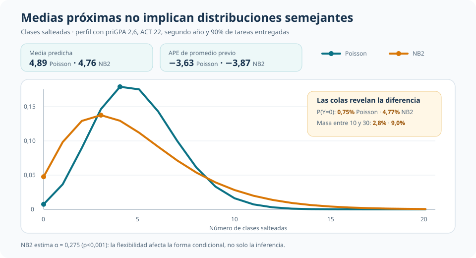
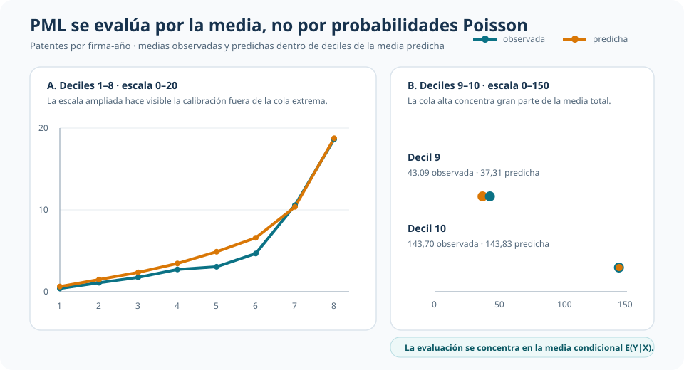

::: {.hero-box}
::: {.hero-title}
La decisión no empieza por el comando: empieza por cuánto de la distribución necesitamos defender para responder la pregunta.
:::

::: {.hero-sub}
T4B avanza por tres niveles de compromiso. Poisson completo permite interpretar probabilidades; NB2 flexibiliza la distribución cuando aparece sobredispersión; Poisson PML/QMLE abandona la pretensión distribucional y conserva una media condicional exponencial con inferencia robusta.
:::
:::

:::: {.metric-grid}

::: {.metric-card}
::: {.metric-label}
Nivel 1
:::
::: {.metric-value}
Poisson completo
:::
::: {.metric-note}
Distribución condicional y probabilidades de conteos.
:::
:::

::: {.metric-card}
::: {.metric-label}
Nivel 2
:::
::: {.metric-value}
Binomial negativa NB2
:::
::: {.metric-note}
Sobredispersión y una distribución con colas más flexibles.
:::
:::

::: {.metric-card}
::: {.metric-label}
Nivel 3
:::
::: {.metric-value}
Poisson PML/QMLE
:::
::: {.metric-note}
Media condicional sin defender toda la distribución.
:::
:::

::::

## La pregunta: ¿cuánto necesitamos especificar?

En los tres casos el resultado es un conteo y la media se representa mediante

$$
E(Y_i\mid X_i)=\mu_i=\exp(X_i'\beta).
$$

Compartir esa media no vuelve equivalentes a los modelos. La pregunta distribucional exige sostener mucho más que la pregunta sobre $E(Y\mid X)$. Por eso, el análisis sigue una dirección deliberada:

- **distribución completa:** media, varianza y probabilidades Poisson;
- **distribución más flexible:** misma media exponencial, pero sobredispersión bajo NB2;
- **media condicional:** función exponencial e inferencia robusta, sin interpretar probabilidades Poisson.

El criterio no es elegir el modelo más flexible por reflejo. Es usar el compromiso mínimo que permita responder la pregunta y que resulte defendible frente a los datos.

## Nivel 1 — Poisson completo: de la media a las probabilidades

La aplicación de fecundidad funciona como punto de partida. Para 4.361 mujeres se modela el número de hijos vivos según edad, educación, residencia, servicios y afiliación religiosa. Los diagnósticos globales no detectan una incompatibilidad condicional fuerte con Poisson. Ese no rechazo no prueba que la distribución sea verdadera, pero permite mostrar qué se gana al defenderla cautelosamente.

Una especificación completa transforma la media estimada en probabilidades de conteos. Al promediar sobre los perfiles observados, la probabilidad predicha de cero hijos es 27,0%, la de exactamente tres es 11,2% y la de cuatro o más es 25,5%. También hace visible una distinción no lineal: evaluar $P(Y=0\mid X)$ en el perfil promedio produce 11,7%, muy lejos del promedio de probabilidades individuales.

::: {.t4b-visual}
{.t4b-visual-img fig-alt="Diagrama de una distribución Poisson completa aplicada al número de hijos, con media predicha y probabilidades de cero, tres y cuatro o más hijos" width="100%"}
:::

Este bloque es deliberadamente breve: establece el punto de partida. Si la aplicación necesitara probabilidades o colas, no bastaría con que la media estuviera bien representada; la forma distribucional también tendría que ser defendible.

## Nivel 2 — NB2: flexibilizar la distribución

La segunda aplicación es el primer bloque empírico central. En 680 estudiantes, el número medio de clases salteadas es 5,853 y la varianza 29,757. Los diagnósticos rechazan el Poisson de referencia y NB2 estima $\widehat\alpha=0{,}275$ (p < 0,001). La igualdad Poisson entre media y varianza condicional resulta demasiado restrictiva.

NB2 conserva la media exponencial, pero permite

$$
Var(Y_i\mid X_i)=\mu_i+\alpha\mu_i^2.
$$

La diferencia importa aunque algunos resúmenes de media sean próximos. Un punto adicional de promedio previo se asocia con 3,63 clases menos bajo Poisson y 3,87 bajo NB2. Para un perfil representativo, las medias predichas son 4,89 y 4,76. Sin embargo, NB2 asigna mucha más probabilidad al cero y aproximadamente triplica la masa predicha entre 10 y 30 ausencias.

::: {.t4b-visual}
{.t4b-visual-img fig-alt="Comparación editorial de las distribuciones predichas Poisson y NB2 para clases salteadas, con medias próximas y colas diferentes" width="100%"}
:::

La cercanía de los efectos medios no rehabilita Poisson como distribución. $\alpha$ cambia la forma condicional y, con ella, las preguntas de riesgo y cola. NB2 tampoco es una elección universal: las ausencias están acotadas por el total de clases y otra aplicación podría modelar explícitamente ese denominador.

## Nivel 3 — PML/QMLE: conservar la media

La tercera aplicación da el paso final: abandonar la defensa de una distribución completa. En 2.260 observaciones firma-año, el número medio de patentes es 22,9, la varianza alcanza 4.868,7 y el máximo es 906. La sobredispersión extrema vuelve poco creíble interpretar probabilidades Poisson.

Poisson se usa aquí como PML/QMLE para modelar $E(Y\mid X)$ y la inferencia se clusteriza por firma. Esto habilita razones de medias, elasticidades y efectos sobre la media; no habilita $P(Y=k\mid X)$ ni colas Poisson.

La especificación separa dos márgenes de I+D:

- el **margen extensivo** compara no realizar I+D con realizar un monto positivo bajo de referencia;
- el **margen intensivo** compara niveles de gasto entre firmas que ya realizan I+D.

:::: {.quick-grid}

::: {.section-box}
### Margen extensivo

Pasar de no realizar I+D a un monto positivo bajo se asocia con **0,841 patentes adicionales** al promediar cambios individuales, pero la estimación es imprecisa (**p = 0,447**).
:::

::: {.section-box}
### Margen intensivo

Entre firmas con I+D positiva, la elasticidad de la media es **0,611** (**p < 0,001**). Un aumento de 1% en I+D se asocia aproximadamente con 0,611% más patentes esperadas.
:::

::::

::: {.t4b-visual}
{.t4b-visual-img fig-alt="Medias observadas y predichas de patentes por deciles bajo Poisson PML, con escalas separadas para los deciles bajos y altos" width="100%"}
:::

La calibración agrupada evalúa únicamente la media. La coincidencia estrecha en varios deciles —incluido el décimo— no autoriza a reconstruir una distribución Poisson ni prueba que la forma exponencial sea correcta en todos los perfiles. Es evidencia alineada con el objeto PML, no una validación distribucional.

## Objeto de decisión

::: {.table-box}
| Compromiso | Cuándo se justifica | Lectura que T4B conserva |
|---|---|---|
| Poisson completo | La pregunta requiere probabilidades y la forma distribucional es defendible | En fecundidad, permite pasar de la media a probabilidades de conteos |
| Binomial negativa NB2 | La sobredispersión exige flexibilizar la distribución | En ausencias, medias próximas ocultan diferencias sustantivas en las colas |
| Poisson PML/QMLE | Interesa la media condicional, no toda la distribución | En patentes, se retiene la elasticidad intensiva de I+D de 0,611 con inferencia clusterizada |
:::

La progresión es **distribución completa → distribución más flexible → media condicional**. No constituye una receta automática: NB2 sigue imponiendo una familia distribucional y PML depende de que la media exponencial esté correctamente especificada.

::: {.callout-note}
## La frontera de la robustez

La matriz robusta o clusterizada corrige la inferencia frente a una varianza mal especificada. No repara una media condicional equivocada.
:::

## Conclusión

Los modelos de conteo no se eligen solo porque el resultado tome enteros no negativos. La decisión relevante es cuánto de la distribución necesita la pregunta y cuánto puede sostener la evidencia.

Poisson completo es útil cuando importan probabilidades y la forma distribucional resulta defendible. NB2 permite conservar una lectura distribucional cuando la equidispersión es demasiado rígida. PML/QMLE es la opción más austera cuando el interés está en la media condicional: en patentes preserva una elasticidad intensiva de I+D de 0,611, pero deja fuera probabilidades Poisson y mantiene impreciso el margen extensivo. El análisis no corona un estimador universal; ordena qué afirmación corresponde a cada nivel de compromiso.
