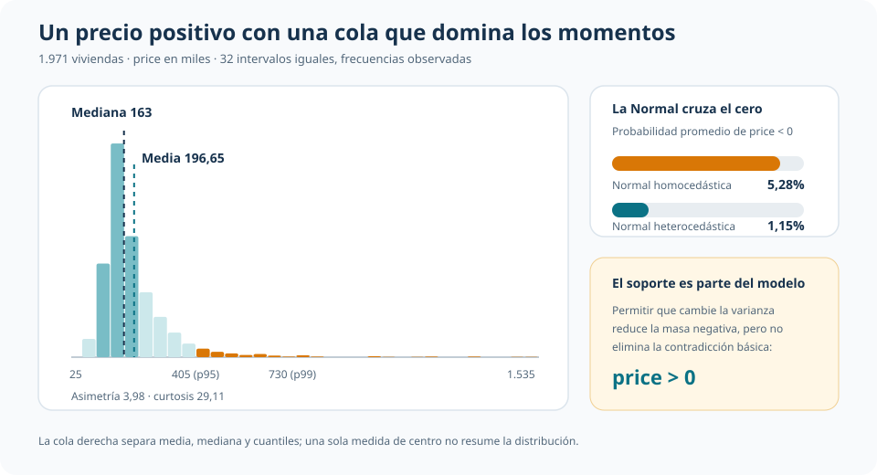
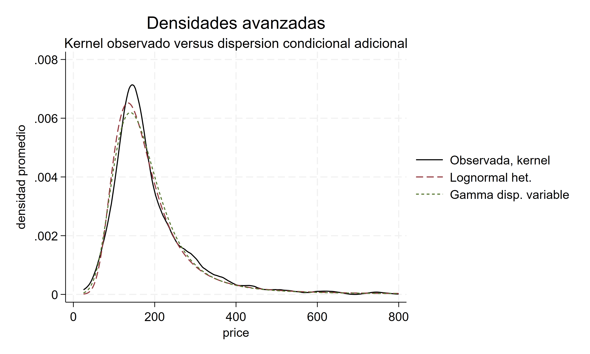
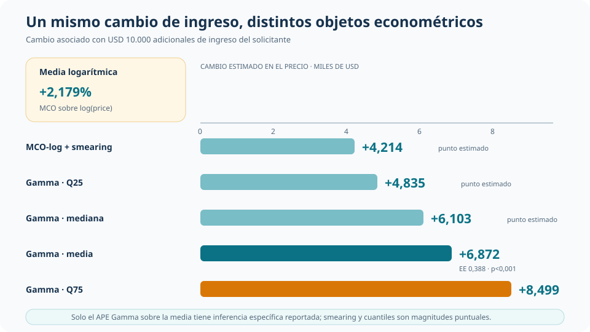

::: {.hero-box}
::: {.hero-title}
Una distribución puede describir mejor la forma observada y, al mismo tiempo, volver inestable el objeto que interesa interpretar.
:::

::: {.hero-sub}
En precios de vivienda positivos y muy asimétricos conviene separar tres criterios que no deben confundirse: respetar el soporte, ajustar la distribución condicional y producir una media en niveles bien comportada.
:::
:::

:::: {.metric-grid}

::: {.metric-card}
::: {.metric-label}
Resultado
:::
::: {.metric-value}
Precio positivo
:::
::: {.metric-note}
Media 196,65 · mediana 163 · cola hasta 1.535.
:::
:::

::: {.metric-card}
::: {.metric-label}
Mejor BIC
:::
::: {.metric-value}
21.918,5
:::
::: {.metric-note}
Lognormal heterocedástica, con una media en niveles explosiva.
:::
:::

::: {.metric-card}
::: {.metric-label}
Compromiso
:::
::: {.metric-value}
Gamma estándar
:::
::: {.metric-note}
Soporte positivo, distribución completa y media exponencial directa.
:::
:::

::::

## La pregunta: ¿qué significa ajustar bien un resultado positivo?

La aplicación usa 1.971 operaciones hipotecarias de `loanapp`. El resultado es el precio de compra de la vivienda, medido en miles. La ecuación incorpora ingreso del solicitante, ratios de gasto y obligaciones, dependientes, desempleo y características del solicitante y la localización.

La distribución observada está concentrada en precios moderados, pero tiene una cola derecha larga: la media es 196,65, la mediana 163, el percentil 95 alcanza 405 y el máximo 1.535. Esa forma obliga a distinguir cuatro objetos: soporte, densidad, colas y momentos como la media.

Una Normal en niveles sirve como benchmark, pero asigna probabilidad a precios negativos. Permitir heterocedasticidad reduce esa contradicción: la probabilidad negativa promedio baja de 5,28% a 1,15%. No la elimina, porque el soporte normal continúa siendo toda la recta real.

::: {.t4c-visual}
{.t4c-visual-img fig-alt="Distribución positiva y asimétrica del precio de vivienda, con media, mediana, percentiles altos y probabilidad negativa bajo dos modelos normales" width="100%"}
:::

## Familias positivas: más que transformar el resultado

La lognormal y la Gamma respetan $Y>0$, pero organizan de manera diferente la media y la dispersión. Bajo lognormalidad, la localización natural está en $log(Y)$ y la media en niveles incorpora la varianza logarítmica:

$$
E(Y_i\mid X_i)=\exp\left(\eta_i+\frac{\sigma_i^2}{2}\right).
$$

La Gamma estándar modela directamente una media exponencial en niveles y una varianza proporcional a su cuadrado:

$$
E(Y_i\mid X_i)=\mu_i=\exp(X_i'\beta),
\qquad
Var(Y_i\mid X_i)=\phi\mu_i^2.
$$

La exponencial impone la restricción adicional de coeficiente de variación igual a uno. Los datos la rechazan frente a Gamma con un LR de 2.113,08 (p < 0,001): elegir una familia de soporte positivo no alcanza si su dispersión es demasiado rígida.

MCO sobre `log(Y)` cumple otra función. Estima una media condicional logarítmica y, mediante smearing, ofrece una referencia retransformada en niveles. Esa corrección permite comparar medias, pero no convierte la regresión auxiliar en una distribución completa capaz de sostener probabilidades y cuantiles.

## Cuando el mejor BIC desestabiliza la media

Flexibilizar la dispersión mejora mucho el ajuste global. La lognormal heterocedástica obtiene el menor BIC, 21.918,5, y la Gamma con dispersión condicional queda cerca, con 21.984,3. Sus densidades promediadas también reproducen bien la forma visible de la distribución.

{fig-alt="Densidades observada y ajustadas de los modelos positivos con dispersión flexible" width="100%"}

El ranking cambia al examinar la media en niveles. En la lognormal heterocedástica, unas pocas predicciones altas de $\sigma_i^2$ entran exponencialmente en $E(Y_i\mid X_i)$ y llevan la media predicha promedio a aproximadamente $1{,}54\times10^{28}$. La Gamma con dispersión variable predice 582,22, con error medio de +385,57 y RMSE de 4.733,73.

Las versiones parsimoniosas sacrifican ajuste distribucional, pero conservan momentos mucho más estables. La lognormal estándar predice una media de 195,58 y la Gamma estándar 204,95, frente a 196,65 observada. MCO-log con smearing queda en 195,46, aunque su objeto original sigue siendo $E[\log(Y)\mid X]$.

::: {.t4c-visual}
{.t4c-visual-img fig-alt="Comparación editorial entre BIC y estabilidad de la media para modelos lognormales, Gamma y MCO log con smearing" width="100%"}
:::

Las probabilidades de cola tampoco producen un ranking absoluto. Para $Y>250$, la frecuencia observada es 18,98%; Gamma estándar predice 17,39% y las versiones flexibles se acercan a 19%. Para $Y>600$, lo observado es 1,67%: lognormal estándar predice 1,37%, Gamma estándar 1,13% y las versiones flexibles suben a 3,94% y 3,26%.

## Por qué Gamma estándar queda como compromiso

Gamma estándar no tiene el menor BIC ni el menor RMSE. Su valor en esta aplicación está en combinar propiedades que responden al objetivo empírico:

- respeta el soporte estrictamente positivo;
- entrega una distribución completa para interpretar probabilidades y cuantiles;
- modela directamente la media condicional en niveles;
- mantiene una parametrización parsimoniosa y evita la inestabilidad extrema de las versiones con dispersión adicional.

Su media predicha promedio es 204,95, con error medio de +8,30 y RMSE de 169,55. La elección no corona una familia universal: fija un compromiso defendible para esta aplicación cuando importan simultáneamente distribución y media en niveles.

## Ingreso del solicitante: el objeto cambia la respuesta

El cierre aplicado compara el cambio asociado con USD 10.000 adicionales de ingreso del solicitante. MCO-log estima +2,179% en la escala logarítmica. Al retransformar mediante smearing, la media en niveles aumenta USD 4.214. Bajo Gamma, el efecto parcial promedio sobre la media es USD 6.872, con EE de USD 388 y p < 0,001.

La distribución Gamma permite además seguir otros puntos: el cambio estimado es USD 4.835 en el cuantil 25, USD 6.103 en la mediana y USD 8.499 en el cuantil 75. Son magnitudes puntuales; no se calculó inferencia específica para el smearing ni para esos cuantiles.

::: {.t4c-visual}
{.t4c-visual-img fig-alt="Cambios asociados con diez mil dólares adicionales de ingreso en la media logarítmica, la media en niveles y cuantiles Gamma del precio" width="100%"}
:::

## Objeto de decisión

::: {.table-box}
| Pregunta | Especificación útil | Lectura que se conserva |
|---|---|---|
| ¿Cómo cambia la media logarítmica? | MCO sobre `log(price)` | Semielasticidad; smearing adicional para expresar una media retransformada en niveles |
| ¿Cómo modelar una distribución positiva completa con estabilidad razonable? | Gamma estándar | Media directa en niveles, probabilidades y cuantiles bajo una familia parsimoniosa |
| ¿Cómo mejorar al máximo el ajuste distribucional dentro de muestra? | Dispersión condicional flexible | Menor BIC y mejor forma visible, con riesgo de momentos muy inestables |
:::

La decisión depende del objeto: el BIC resume ajuste distribucional, el RMSE resume error de la media y el soporte determina qué valores puede representar el modelo. Ningún criterio sustituye a los otros.

## Conclusión

En resultados positivos y muy asimétricos, flexibilizar la distribución puede mejorar notablemente la verosimilitud y la densidad ajustada sin mejorar el comportamiento de la media. La aplicación vuelve visible esa separación: la lognormal heterocedástica lidera por BIC, pero su media en niveles se vuelve explosiva; la Gamma con dispersión variable enfrenta una tensión menos extrema, aunque todavía sustantiva.

Gamma estándar queda como compromiso porque respeta el soporte, modela directamente la media en niveles y habilita una lectura distribucional completa sin pagar el costo de esa inestabilidad. El cierre con ingreso muestra la consecuencia práctica: una semielasticidad, una media retransformada y el desplazamiento de cuantiles responden preguntas diferentes, aun cuando partan de la misma covariable y la misma muestra.
