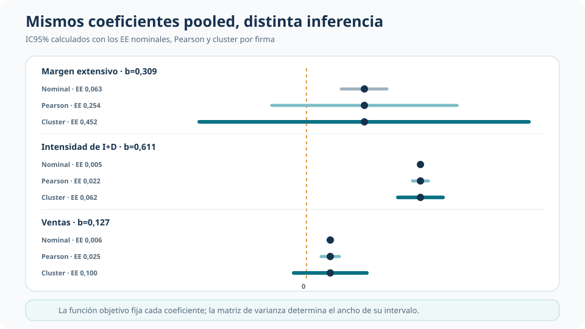
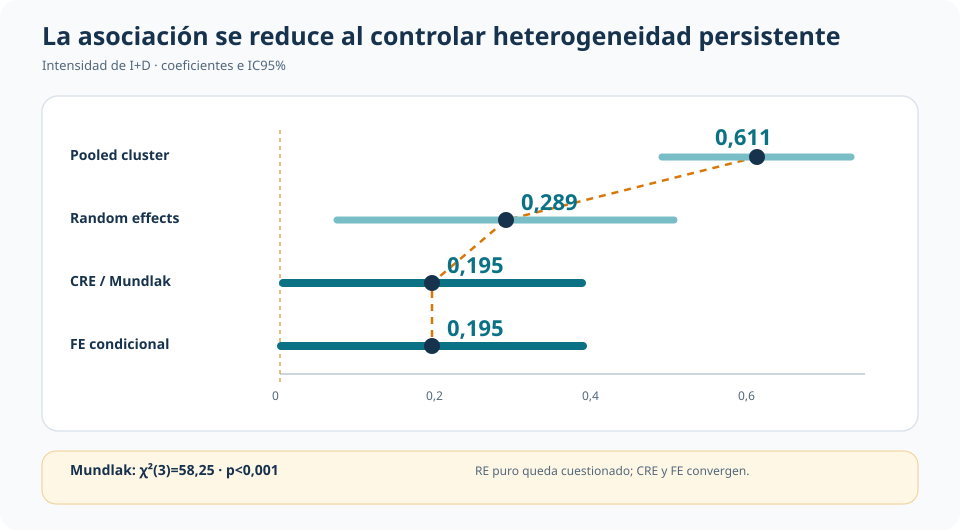
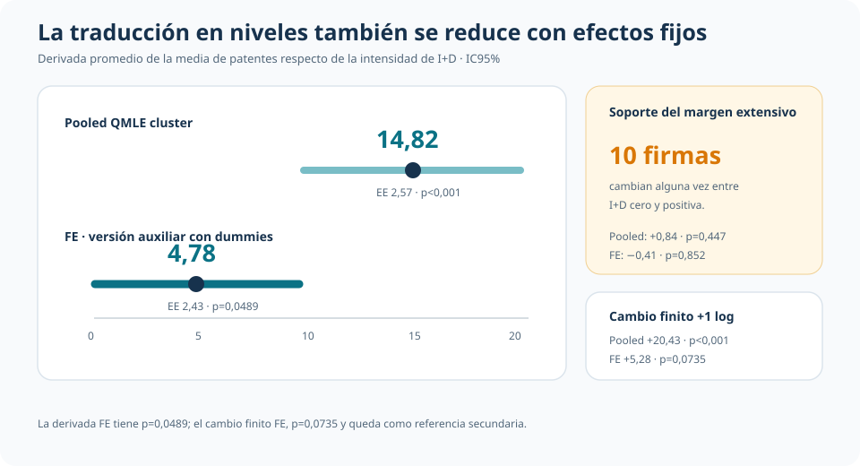

::: {.hero-box}
::: {.hero-title}
Controlar la heterogeneidad persistente de las firmas no borra la asociación entre intensidad de I+D y patentes, pero reduce sustancialmente su magnitud.
:::

::: {.hero-sub}
En un panel de 226 firmas, Poisson se usa para modelar una media condicional exponencial. La inferencia debe reconocer sobredispersión y dependencia dentro de firma; la comparación entre pooled, RE, CRE y FE determina cuánto cambia la lectura al explotar variación intra-firma.
:::
:::

:::: {.metric-grid}
::: {.metric-card}
::: {.metric-label}
Conteo sobredisperso
:::
::: {.metric-value}
22,93 vs. 4.874,58
:::
::: {.metric-note}
Media y varianza de patentes en la muestra común.
:::
:::

::: {.metric-card}
::: {.metric-label}
Intensidad pooled
:::
::: {.metric-value}
0,611
:::
::: {.metric-note}
EE cluster 0,0617 · p&lt;0,001.
:::
:::

::: {.metric-card}
::: {.metric-label}
Intensidad FE
:::
::: {.metric-value}
0,195
:::
::: {.metric-note}
EE 0,0987 · p=0,0484.
:::
:::
::::

## Un conteo en panel exige separar distribución, media e inferencia

La unidad observada es una firma en un año. La muestra común contiene 2.257 observaciones de 226 firmas entre 1972 y 1981; `patents` registra solicitudes de patentes y las covariables centrales separan el margen extensivo de I+D, su intensidad entre valores positivos y el logaritmo de ventas. Todas las especificaciones incorporan efectos de año.

La media de patentes es 22,93 y la varianza 4.874,58. El estadístico de Pearson alcanza 36.776,34 con 2.244 grados de libertad: una razón de dispersión de 16,39. Esa evidencia hace poco defendible la igualdad entre media y varianza de una Poisson completa.

La función objetivo Poisson conserva otra utilidad. Como QMLE/PML estima

$$
E(\text{patents}_{it}\mid X_{it})=\exp(X_{it}'\beta),
$$

sin requerir que toda la distribución condicional sea Poisson. El objeto es la media; las probabilidades puntuales y los cuantiles Poisson quedan fuera. En panel, además, la inferencia debe permitir dependencia arbitraria dentro de cada firma.

## La misma media pooled produce inferencias muy distintas

Las tres versiones pooled estiman los mismos coeficientes porque mantienen la misma función objetivo. Lo que cambia es la matriz de varianza. La inferencia nominal trata la Poisson completa como correcta; la escala Pearson admite una sobredispersión proporcional común; la sandwich cluster agrega varianza arbitraria y correlación dentro de firma.

{.t4d-visual-img fig-alt="Comparación de coeficientes pooled e intervalos de confianza bajo inferencia Poisson nominal, escala Pearson y cluster por firma" width="100%"}

El contraste es nítido. Para el margen extensivo, (b=0,3092): su EE pasa de 0,0627 nominal a 0,2539 con escala Pearson y 0,4518 con cluster; el p-valor llega a 0,494. En ventas, (b=0,1272) pasa de p&lt;0,001 nominal a p=0,203 con cluster. La intensidad de I+D conserva (b=0,6110), EE cluster 0,0617 y p&lt;0,001.

Clusterizar corrige la precisión del pooled. Todavía no controla la heterogeneidad persistente que puede estar asociada simultáneamente con la capacidad de patentar, la I+D y la escala de la firma.

## El cambio decisivo: modelar la heterogeneidad de firma

Random effects introduce un componente persistente, pero restringe su relación con las covariables. CRE/Mundlak agrega las medias por firma de las variables que cambian en el tiempo y permite diagnosticar esa restricción. El test conjunto rechaza el RE puro: χ²(3)=58,25, p&lt;0,001.

{.t4d-visual-img fig-alt="Recorrido del coeficiente de intensidad de I+D entre pooled, random effects, CRE Mundlak y fixed effects Poisson con intervalos de confianza" width="100%"}

La pendiente intensiva baja de 0,611 en pooled a 0,289 en RE, 0,195 en CRE/Mundlak y 0,195 en FE condicional. CRE y FE producen resultados prácticamente iguales, mientras el contraste de Mundlak cuestiona interpretar el RE puro como referencia final. El descenso no es una descomposición exacta entre componentes between y within: muestra cuánto cambia la asociación estimada con especificaciones que controlan de forma más exigente la heterogeneidad persistente.

## Cómo funciona la referencia FE

Poisson FE condicional elimina el efecto de firma condicionando en el total de patentes de cada unidad. Así estima las pendientes, sin recuperar explícitamente un parámetro persistente para cada firma, a partir de cambios de las covariables dentro de la trayectoria de cada firma.

Tres firmas con conteos siempre iguales a cero no aportan a esa función condicional; la estimación FE utiliza 2.227 observaciones de 223 firmas. La lectura descansa en estricta exogeneidad condicional. Una versión auxiliar con dummies de firma reproduce las pendientes y permite recuperar medias predichas y efectos promedio en niveles mediante `margins`.

## De la pendiente a patentes esperadas

El cambio también es económicamente visible en niveles. Entre observaciones con I+D positiva, la derivada promedio de la media respecto de la intensidad es 14,82 patentes en pooled y 4,78 bajo FE.

{.t4d-visual-img fig-alt="Comparación de derivadas promedio de intensidad de I+D en pooled y fixed effects, con intervalos y diagnóstico de soporte dentro de firma" width="100%"}

La estimación FE de 4,78 tiene EE 2,43 y p=0,0489. El cambio finito ante una unidad adicional de log I+D es 20,43 en pooled y 5,28 en FE, pero este último tiene p=0,0735 y se mantiene como referencia secundaria.

El margen extensivo queda impreciso: solo 10 firmas cambian alguna vez entre I+D cero y positiva. Sus efectos promedio son 0,84 patentes en pooled (p=0,447) y −0,41 en FE (p=0,852). La escasa variación intra-firma limita la precisión de esa comparación.

## Qué aporta cada especificación

::: {.table-box}
| Especificación | Qué incorpora | Lectura que habilita |
|---|---|---|
| Pooled QMLE cluster | Media exponencial e inferencia agrupada por firma | Asociación promedio sin modelar heterogeneidad persistente |
| Random effects | Componente no observado de firma | Benchmark de panel bajo restricciones fuertes sobre su relación con las covariables |
| CRE/Mundlak | Medias por firma de covariables variantes | Diagnóstico y relajación del RE puro; intensidad cercana a 0,195 |
| FE condicional | Efecto de firma eliminado por condicionamiento | Asociación estimada a partir de variación intra-firma, bajo estricta exogeneidad condicional |
:::

## Conclusión

La sobredispersión y la dependencia dentro de firma obligan a abandonar la inferencia Poisson nominal, pero corregir la matriz de varianza no agota el problema. La dimensión de panel cambia también la magnitud: la pendiente intensiva pasa de 0,611 en pooled a aproximadamente 0,195 cuando CRE y FE controlan la heterogeneidad persistente.

La asociación entre intensidad de I+D y media de patentes permanece positiva, aunque bastante menor bajo la referencia intra-firma. Ese es el resultado empírico más claro. El margen extensivo no ofrece una lectura precisa porque casi no cambia dentro de las firmas, y el RE puro queda cuestionado por el contraste de Mundlak.
