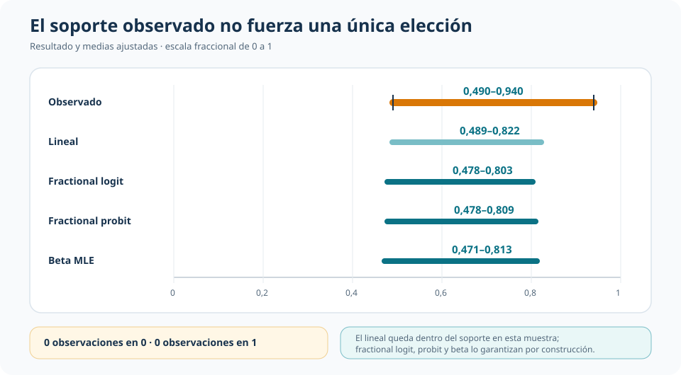

::: {.hero-box}
::: {.hero-title}
Cuatro modelos producen prácticamente la misma asociación entre gasto electoral y voto, aunque no imponen las mismas restricciones ni permiten interpretar los mismos objetos.
:::

::: {.hero-sub}
En una respuesta continua acotada entre cero y uno, la estabilidad de un efecto marginal no resuelve por sí sola la elección econométrica: también importan la garantía de soporte, la forma de la media condicional y la estructura distribucional que se está dispuesto a sostener.
:::
:::

:::: {.metric-grid}
::: {.metric-card}
::: {.metric-label}
Muestra común
:::
::: {.metric-value}
177 distritos
:::
::: {.metric-note}
Participación del voto bipartidista del incumbente en 1990.
:::
:::

::: {.metric-card}
::: {.metric-label}
Respuesta observada
:::
::: {.metric-value}
0,490–0,940
:::
::: {.metric-note}
Media 0,635 · mediana 0,630 · sin observaciones en 0 o 1.
:::
:::

::: {.metric-card}
::: {.metric-label}
APE del gasto
:::
::: {.metric-value}
0,104–0,111
:::
::: {.metric-note}
Rango entre las cuatro especificaciones comparadas.
:::
:::
::::

## La pregunta: cómo modelar una proporción continua

La unidad de observación es un distrito electoral estadounidense. El resultado es la participación del incumbente en el voto bipartidista de 1990, expresada entre cero y uno. La covariable principal es la participación del incumbente en el gasto total de campaña; los controles recogen fortaleza partidaria previa, partido, presencia de un retador repetido, antigüedad legislativa y formación jurídica.

La pregunta es cómo cambia la participación esperada de voto del incumbente con su participación en el gasto electoral, manteniendo constantes esas características. La dificultad econométrica surge porque el resultado es continuo, pero está acotado: no es una variable binaria ni una respuesta sin límites.

## El soporte importa, aunque el benchmark lineal no falle aquí

Las 177 observaciones son estrictamente interiores: no hay valores exactamente iguales a cero o uno. El modelo lineal no garantiza que sus predicciones permanezcan en el intervalo unitario; sin embargo, en esta muestra predice entre 0,489 y 0,822. El riesgo teórico no se materializa en los valores ajustados observados, pero eso no constituye una defensa general del modelo lineal para proporciones.

{.t4f-visual-img fig-alt="Rango observado de participación de voto y rangos de predicción del modelo lineal, fractional logit, fractional probit y beta MLE sobre una escala de cero a uno" width="100%"}

Fractional logit y fractional probit modelan directamente una media condicional acotada,

$$
E(y\mid x)=G(x'\beta),
$$

con enlace logístico o normal. La función objetivo Bernoulli se utiliza como QMLE para especificar la media condicional, con inferencia robusta. Estas especificaciones también admitirían eventuales observaciones en cero o uno.

Beta MLE agrega una hipótesis distinta. Además de usar un enlace logit para la media, postula una distribución beta condicional completa con precisión constante. Esto requiere $0<y<1$ y permite describir varianza, mediana y colas condicionales. La comparación, por tanto, no enfrenta versiones más o menos sofisticadas de una misma promesa: enfrenta un benchmark lineal, dos modelos de media acotada y un modelo distribucional completo.

## El resultado principal: los efectos marginales casi no cambian

Los coeficientes crudos de los índices logit, probit y beta no están en la misma escala. La comparación relevante se realiza mediante el efecto marginal promedio —APE— de la participación en el gasto sobre la media esperada de voto.

{.t4f-visual-img fig-alt="Efectos marginales promedio e intervalos de confianza del 95 por ciento para el modelo lineal, fractional logit, fractional probit y beta MLE" width="100%"}

El APE es 0,1105 en el modelo lineal, 0,1068 en fractional logit, 0,1072 en fractional probit y 0,1037 en beta MLE. Sus errores estándar se ubican entre 0,0384 y 0,0395. En términos sustantivos, un aumento de diez puntos porcentuales en la participación del incumbente en el gasto se asocia con aproximadamente 1,0–1,1 puntos porcentuales adicionales de voto bipartidista.

La coincidencia es empíricamente importante: ni el enlace elegido ni la distribución beta alteran de manera sustantiva la magnitud promedio que organiza la aplicación.

## Estabilidad del APE no equivale a forma funcional adecuada

Un test de variables agregadas tipo RESET rechaza la especificación básica del fractional logit: $\chi^2(2)=41,60$, con $p<0,001$. El contraste apunta a la forma de la media condicional y sugiere revisar no linealidades, interacciones o covariables relevantes.

El rechazo no selecciona automáticamente fractional probit ni beta MLE. La estabilidad del APE entre las cuatro especificaciones y la adecuación de una forma funcional concreta son cuestiones distintas: la primera describe un resultado comparativo; la segunda limita cuánto conviene confiar en la parametrización básica de la media.

## Una distribución completa permite hacer preguntas adicionales

Las medias ajustadas de fractional logit y beta son casi idénticas observación por observación. La diferencia aparece en los objetos disponibles: beta estima una precisión de aproximadamente 53,99 y una mediana condicional promedio de 0,637, además de habilitar residuos estandarizados y un diagnóstico PIT.

{.t4f-visual-img fig-alt="Comparación de 177 predicciones de media entre fractional logit y beta MLE junto con precisión beta, mediana condicional promedio y resumen del diagnóstico PIT" width="100%"}

El PIT tiene media 0,492 y desviación estándar 0,284, cercana a la referencia uniforme de 0,289. Diez observaciones presentan un PIT bilateral inferior a 0,05. La evidencia no muestra una falla distribucional manifiesta, pero tampoco certifica la familia beta: con 177 casos, los diagnósticos deben leerse como evidencia moderada.

La ganancia de especificar una distribución completa es concreta: permite describir medianas, varianzas y posiciones en las colas que un modelo centrado solo en la media no modela directamente. Esa riqueza se obtiene a cambio de una hipótesis distribucional adicional.

## Objeto de decisión

::: {.table-box}
| Especificación | Objeto principal | Qué garantiza | Estructura adicional |
|---|---|---|---|
| Lineal | Media condicional | Interpretación directa; no garantiza soporte | Linealidad de la media |
| Fractional logit / probit | Media condicional acotada | Predicciones en $(0,1)$; admite respuestas en 0 y 1 | Forma funcional paramétrica de la media e inferencia robusta |
| Beta MLE | Distribución condicional completa | Media acotada y objetos distribucionales | Respuesta interior, familia beta y precisión constante |
:::

## Conclusión

La asociación estimada entre gasto relativo y voto es estable: los cuatro APE se concentran entre 0,104 y 0,111. Esa coincidencia permite separar con claridad tres decisiones que a menudo se confunden. Una es si el modelo garantiza el soporte; otra, si la media condicional está bien especificada; la tercera, si resulta defendible imponer una distribución completa.

El benchmark lineal funciona razonablemente en esta muestra, los modelos fraccionales aseguran una media acotada y beta habilita preguntas distribucionales adicionales. Ninguna de esas ventajas resuelve las demás. El RESET, además, advierte que la estabilidad del resultado no vuelve irrelevante la forma funcional. La elección final depende del objeto que se quiere interpretar y de cuánta estructura puede sostener la aplicación.
