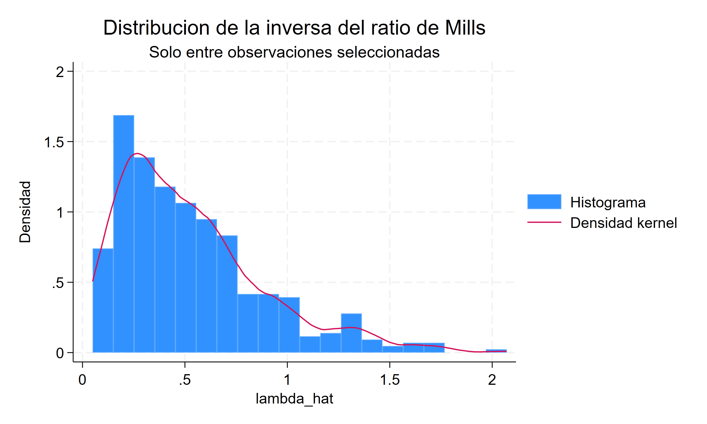

::: {.hero-box}
::: {.hero-title}
El salario no es cero fuera del empleo: simplemente no está observado.
:::

::: {.hero-sub}
Esta aplicación estudia salarios de mujeres casadas cuando el resultado solo se observa entre quienes participan en el mercado laboral. El modelo de Heckman explicita esa puerta de entrada, conecta participación y salarios mediante la razón inversa de Mills y permite evaluar si MCO sobre la muestra observada cambia al corregir selección sobre inobservables.
:::
:::

:::: {.metric-grid}

::: {.metric-card}
::: {.metric-label}
Muestra completa
:::
::: {.metric-value}
753 mujeres
:::
::: {.metric-note}
La participación laboral está observada para todas
:::
:::

::: {.metric-card}
::: {.metric-label}
Salario observado
:::
::: {.metric-value}
428 casos
:::
::: {.metric-note}
56,84% participa y entra en la ecuación salarial
:::
:::

::: {.metric-card}
::: {.metric-label}
Resultado ausente
:::
::: {.metric-value}
325 casos
:::
::: {.metric-note}
43,16% no participa; su salario potencial no se observa
:::
:::

::: {.metric-card}
::: {.metric-label}
Corrección en dos etapas
:::
::: {.metric-value}
λ = 0,032
:::
::: {.metric-note}
EE 0,134; p=0,809 bajo el modelo Heckman
:::
:::

::::

## Pregunta aplicada

¿Una ecuación salarial estimada únicamente entre mujeres que trabajan representa adecuadamente la relación salarial de la población? La dificultad es que el logaritmo del salario (`lwage`) se observa si y solo si la mujer participa en la fuerza laboral. Para las 325 no participantes no hay un salario cero: el salario de mercado potencial está ausente.

La regresión sobre las 428 observaciones disponibles puede ser informativa, pero requiere que la selección sea ignorable una vez controladas educación y experiencia. Si factores no observados que inducen a trabajar también se relacionan con el salario potencial, el error salarial deja de tener media cero dentro de la submuestra observada.

{fig-alt="Mecanismo de observación salarial y distribuciones de probabilidad predicha de participación según el estado observado" width="100%"}

## Datos y composición de la muestra

La aplicación utiliza `mroz.dta`, un corte transversal clásico de mujeres casadas. La ecuación de resultado explica el logaritmo del salario mediante educación, experiencia y experiencia al cuadrado. La ecuación de participación usa esas variables y agrega edad, hijos menores de seis años, hijos mayores y el ingreso no laboral del hogar.

La muestra observada no es una réplica aleatoria de la completa:

::: {.table-box}
| Característica | No participa | Participa | Diferencia descriptiva |
|---|---:|---:|---|
| Educación, años | 11,80 | 12,66 | Mayor entre participantes |
| Experiencia, años | 7,46 | 13,04 | Marcadamente mayor |
| Hijos menores de 6 | 0,37 | 0,14 | Menor entre participantes |
| Ingreso no laboral | 21,70 | 18,94 | Menor entre participantes |
:::

Estas diferencias documentan selección en observables. No demuestran todavía que los inobservables de participación y salario estén correlacionados, que es la amenaza específica tratada por Heckman.

## MCO sobre salarios observados

El punto de partida estima por MCO robusto:

$$
\log(salario_i)=\beta_0+\beta_1 educación_i+\beta_2 experiencia_i+\beta_3 experiencia_i^2+u_i,
$$

solo para las 428 mujeres con salario observado. La educación se asocia con 0,107 log puntos adicionales de salario; la experiencia tiene signo positivo y su cuadrado, negativo. Esta es una descripción condicional de la muestra seleccionada. Para extenderla a una ecuación salarial poblacional debe sostenerse que, dados los controles, la decisión de participar no selecciona sistemáticamente por el componente salarial no observado.

## La puerta de entrada: ecuación de participación

El probit de selección se estima con las 753 mujeres. Educación y experiencia se relacionan positivamente con la participación; edad, hijos menores de seis años e ingreso no laboral lo hacen negativamente. El coeficiente probit para hijos pequeños es -0,868 (*p*<0,001), una señal fuerte de que las restricciones familiares intervienen en la observabilidad del salario.

Las variables adicionales cumplen dos funciones. Mejoran la representación de la participación y proporcionan exclusiones: entran en la ecuación de selección, pero no en la salarial. Esta restricción requiere argumento económico; no es válida por construcción.

## De la participación a la razón inversa de Mills

El procedimiento manual vuelve visible la lógica del método:

1. estimar la probabilidad de participar mediante un probit;
2. construir, entre participantes, la razón inversa de Mills $\widehat{\lambda}_i=\phi(z_i'\widehat{\gamma})/\Phi(z_i'\widehat{\gamma})$;
3. agregar $\widehat{\lambda}_i$ a la ecuación salarial observada.

Bajo normalidad bivariada, Mills resume cómo cambia la media del error salarial al condicionar en haber sido seleccionada. Un valor alto corresponde a una participación relativamente improbable dado el perfil observado; su variación permite representar la parte de la selección asociada con el resultado no observado.

{fig-alt="Histograma y densidad de la razón inversa de Mills entre las observaciones seleccionadas" width="100%"}

La segunda etapa manual estima un coeficiente de Mills de 0,032, con *p*=0,843 usando errores robustos ordinarios. Sirve para entender la mecánica, pero no es la inferencia final: trata como fijo un regresor generado. `Heckman` en dos etapas conserva los mismos coeficientes y usa la corrección de varianza apropiada.

## Qué cambia al corregir selección

::: {.table-box}
| Relación salarial estimada | MCO observado | Heckman dos etapas | Heckman máxima verosimilitud |
|---|---:|---:|---:|
| Educación | 0,107 (0,013) | 0,109 (0,016) | 0,108 (0,014) |
| Experiencia | 0,042 (0,015) | 0,044 (0,016) | 0,043 (0,014) |
| Experiencia² | -0,00081 (0,00042) | -0,00086 (0,00044) | -0,00084 (0,00040) |
| Corrección de selección $\lambda$ | — | 0,032 (0,134) | 0,018 (0,087) |
| Correlación de errores $\rho$ | — | 0,049 | 0,027 (0,130) |
:::

{fig-alt="Coefplot de educación y experiencia bajo MCO y Heckman, con parámetros de selección lambda y rho" width="100%"}

La corrección prácticamente no altera las asociaciones salariales. En dos etapas, $\lambda=0,032$ y *p*=0,809; en máxima verosimilitud, $\rho=0,027$ y *p*=0,838. Bajo la especificación mantenida no aparece evidencia fuerte de correlación entre los inobservables que gobiernan participación y salario.

La lectura correcta no es que la selección muestral sea irrelevante en general. En esta aplicación hay composición observable distinta, pero el mecanismo paramétrico de Heckman no detecta una corrección sustantiva por selección sobre inobservables.

## Exclusión, forma funcional y fragilidad

Heckman puede identificarse por la no linealidad de Mills aun usando las mismas variables en ambas ecuaciones. Esa identificación exclusivamente funcional suele ser frágil. Aquí edad, hijos e ingreso no laboral se excluyen de la ecuación salarial para aportar variación adicional, pero su ausencia directa del salario potencial debe defenderse sustantivamente.

Un diagnóstico ilustra el problema. Mills tiene $R^2=0,539$ al regresarla sobre las covariables salariales y $R^2=0,962$ al usar todas las variables de selección. Sin exclusiones defendibles, la corrección quedaría casi completamente alineada con los regresores y descansaría sobre la curvatura impuesta por el probit.

::: {.callout-note}
## Objeto de decisión

MCO, Heckman en dos etapas y máxima verosimilitud cuentan aquí la misma historia salarial. La evidencia no justifica una gran corrección numérica, pero sí obliga a explicitar el mecanismo de observación y las restricciones de exclusión antes de interpretar la regresión sobre quienes trabajan.
:::

## Alcance y extensión a panel

Los resultados describen asociaciones salariales bajo una estructura paramétrica; no constituyen por sí solos efectos causales de educación o experiencia. No rechazar $\rho=0$ tampoco prueba ausencia de selección: puede reflejar baja potencia, exclusiones débiles o una distribución mal especificada.

En panel, Heckman y efectos fijos atienden amenazas diferentes. Heckman modela selección contemporánea sobre inobservables; los efectos fijos controlan heterogeneidad persistente. Una extensión podría contrastar Heckman pooled, FE sobre observaciones disponibles y una parametrización CRE/Mundlak, pero esta extensión no se implementa aquí y no desplaza el caso transversal central.

## Conclusión

Cuando el salario solo se observa para quienes trabajan, restringirse a esa submuestra no es una operación inocua. La ecuación de participación permite representar la puerta de observación y Mills traduce, bajo supuestos fuertes, cómo esa selección puede desplazar la media salarial observada.

En este caso, la corrección es pequeña y los resultados salariales permanecen estables. El aporte de Heckman no es garantizar que toda regresión seleccionada cambie, sino convertir una condición implícita en una hipótesis estimable: quién entra en la muestra, por qué entra y qué debe asumirse para aprender sobre el resultado que no vemos.
