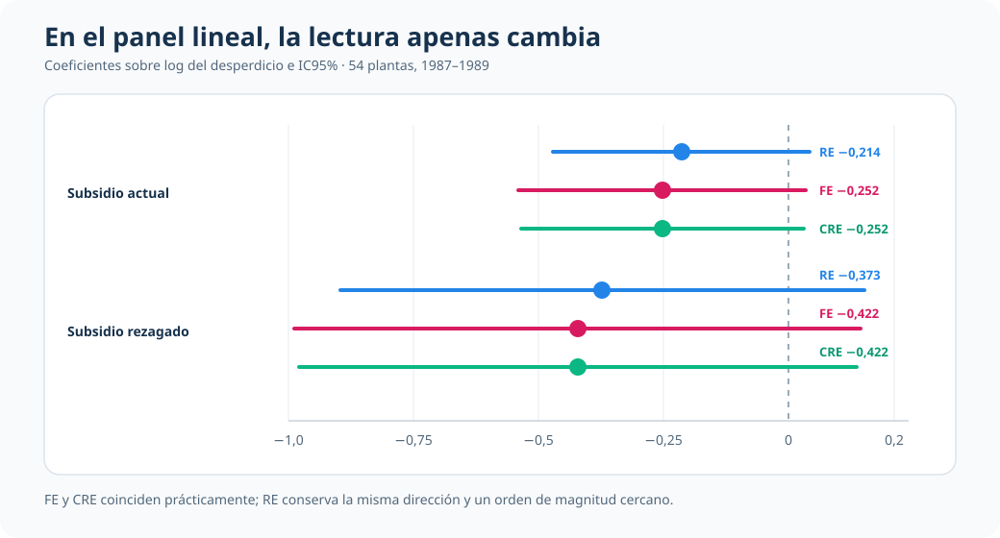
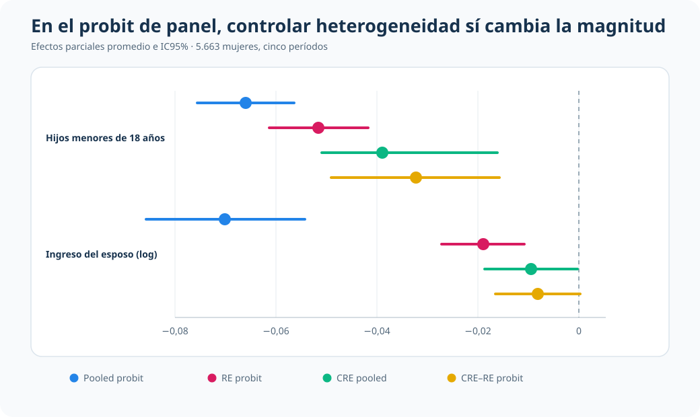

::: {.hero-box}
::: {.hero-title}
¿Cuándo cambia realmente la conclusión al modelar la heterogeneidad no observada?
:::

::: {.hero-sub}
La respuesta depende de la evidencia. En un panel lineal de plantas, FE, RE y CRE-Mundlak cuentan una historia muy parecida. En un probit de panel sobre participación laboral, controlar heterogeneidad correlacionada reduce materialmente los efectos parciales.
:::
:::

:::: {.metric-grid}
::: {.metric-card}
::: {.metric-label}
Pregunta común
:::
::: {.metric-value}
¿La especificación altera el mensaje?
:::
::: {.metric-note}
Se comparan magnitudes antes de usar los tests como respaldo.
:::
:::

::: {.metric-card}
::: {.metric-label}
Panel lineal
:::
::: {.metric-value}
Lectura estable
:::
::: {.metric-note}
FE, RE y CRE producen coeficientes cercanos para los subsidios.
:::
:::

::: {.metric-card}
::: {.metric-label}
Panel binario
:::
::: {.metric-value}
Atenuación sustantiva
:::
::: {.metric-note}
Los APE disminuyen al incorporar RE y heterogeneidad correlacionada.
:::
:::

::: {.metric-card}
::: {.metric-label}
Regla de decisión
:::
::: {.metric-value}
Diagnóstico + sensibilidad
:::
::: {.metric-note}
Ningún estimador es un ganador universal.
:::
:::
::::

## Resumen

Los datos de panel permiten reconocer diferencias persistentes entre unidades, pero no garantizan que tratarlas de una manera u otra cambie la conclusión aplicada. Este análisis contrasta dos situaciones deliberadamente distintas.

En plantas industriales, la relación entre subsidios de capacitación y desperdicio productivo resulta estable bajo efectos fijos (FE), efectos aleatorios (RE) y efectos aleatorios correlacionados (CRE-Mundlak). En un panel de mujeres, en cambio, los efectos parciales de la estructura del hogar sobre la participación laboral se reducen de forma sostenida al pasar de pooled probit a RE y CRE.

El aprendizaje no es elegir siempre FE, RE o CRE. Es comprobar cuánto depende la lectura del supuesto sobre la heterogeneidad y cerrar la especificación con evidencia sustantiva y diagnóstica combinada.

:::: {.quick-grid}
::: {.section-box}
## Problema econométrico

Si el componente individual persistente, $c_i$, está correlacionado con los regresores, una especificación pooled o RE convencional puede mezclar diferencias estructurales entre unidades con cambios dentro de cada unidad.
:::

::: {.section-box}
## Criterio de comparación

Primero se comparan signos, magnitudes e incertidumbre. Después se usan Hausman o Mundlak para evaluar si la independencia entre $c_i$ y los regresores es compatible con los datos.

Panel y heterogeneidad
:::
::::

## Caso 1 · Plantas industriales: una lectura robusta a la especificación

La primera aplicación usa `jtrain1.dta`, con 162 observaciones de 54 plantas entre 1987 y 1989. El resultado es el log del desperdicio productivo (`lscrap`); las variables centrales indican subsidio de capacitación actual (`grant`) y rezagado (`grant_1`).

Las plantas pueden diferir persistentemente en tecnología, gestión o calidad operativa. La comparación FE/RE/CRE pregunta si esas diferencias alteran la lectura de los subsidios.

| Especificación | Subsidio actual | Subsidio rezagado | Lectura |
|---|---:|---:|---|
| FE + cluster | -0,252 (EE 0,143) | -0,422 (EE 0,282) | Magnitudes negativas con incertidumbre amplia |
| RE + cluster | -0,214 (EE 0,131) | -0,373 (EE 0,268) | Patrón muy cercano a FE |
| CRE-Mundlak + cluster | -0,252 (EE 0,144) | -0,422 (EE 0,284) | Prácticamente coincide con FE |

La estabilidad visual es el hallazgo principal. El test de relevancia del panel rechaza pooling simple (`F(53,104)=24,66`; `p<0,001`), pero los contrastes que distinguen RE de FE/CRE no aportan evidencia fuerte contra RE: Hausman `p=0,2425`, Mundlak clásico `p=0,3591` y Mundlak robusto `p=0,3965`.

RE puede usarse aquí como referencia operativa parsimoniosa. Eso no prueba que su supuesto sea verdadero: indica que, en esta muestra, cambiar el tratamiento de la heterogeneidad no cambia materialmente la historia empírica.

## Caso 2 · Participación laboral: la magnitud sí depende del tratamiento de la heterogeneidad

La segunda aplicación utiliza un panel balanceado de 28.315 observaciones: 5.663 mujeres seguidas durante cinco períodos. El resultado es la participación en la fuerza laboral. Las variables protagonistas son el número de hijos menores de 18 años y el log del ingreso del esposo.

Aquí una lectura pooled puede confundir restricciones persistentes del hogar, preferencias o condiciones individuales no observadas con asociaciones contemporáneas. Por eso se comparan pooled probit, RE probit, CRE pooled y CRE-RE probit mediante efectos parciales promedio (APE).

| Modelo | APE: hijos menores de 18 | APE: ingreso del esposo (log) | Lectura |
|---|---:|---:|---|
| Pooled probit | -0,0660 (0,0049) | -0,0701 (0,0080) | Referencia sin modelar persistencia individual |
| RE probit | -0,0516 (0,0050) | -0,0190 (0,0042) | Atenuación al incorporar efecto aleatorio |
| CRE pooled | -0,0389 (0,0089) | -0,0095 (0,0047) | Menor magnitud al admitir correlación tipo Mundlak |
| CRE-RE probit | -0,0322 (0,0085) | -0,0081 (0,0043) | Cierre operativo con heterogeneidad correlacionada |

Los signos negativos se mantienen, pero su magnitud cae de forma marcada. El test conjunto de las medias individuales rechaza independencia entre heterogeneidad y regresores tanto en CRE pooled (`χ²(2)=57,50`) como en CRE-RE (`χ²(2)=61,34`), con `p<0,001`.

La baja variación temporal del número de hijos aconseja prudencia sobre cuánto puede separarse el componente dentro de la mujer del componente entre mujeres. Aun con ese límite, la trayectoria pooled → RE → CRE muestra que la especificación sí afecta la lectura en probabilidades.

## Lo que enseña el contraste

| Dimensión | Panel lineal de plantas | Probit de panel laboral |
|---|---|---|
| Qué se compara | Coeficientes FE, RE y CRE | APE pooled, RE y CRE |
| Sensibilidad empírica | Baja | Alta |
| Evidencia Mundlak | No rechaza independencia | Rechaza con fuerza |
| Cierre operativo | RE con FE/CRE como auditoría | CRE con pooled/RE como referencias |

CRE cumple el mismo papel conceptual en ambos casos: permite hacer visible la posible correlación entre heterogeneidad persistente y regresores. Lo que cambia es la respuesta de los datos. En una aplicación confirma que la conclusión es robusta; en la otra revela que parte de la magnitud pooled estaba asociada con heterogeneidad no modelada.

## Cierre

Modelar heterogeneidad no observada no es un ritual ni una regla automática de selección. La decisión útil combina tres elementos: una pregunta aplicada clara, comparaciones en una escala interpretable y diagnósticos coherentes con el supuesto que se está evaluando.

Cuando FE, RE y CRE cuentan una historia semejante, conviene decirlo sin sobreactuar diferencias técnicas. Cuando los APE cambian materialmente y Mundlak rechaza independencia, esa sensibilidad pasa a formar parte de la conclusión.
