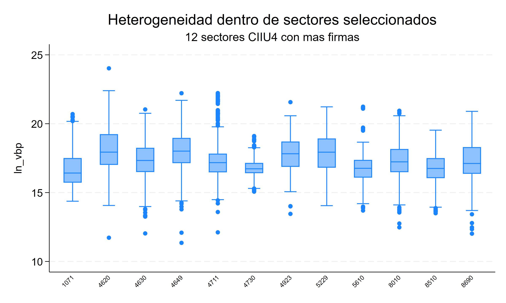
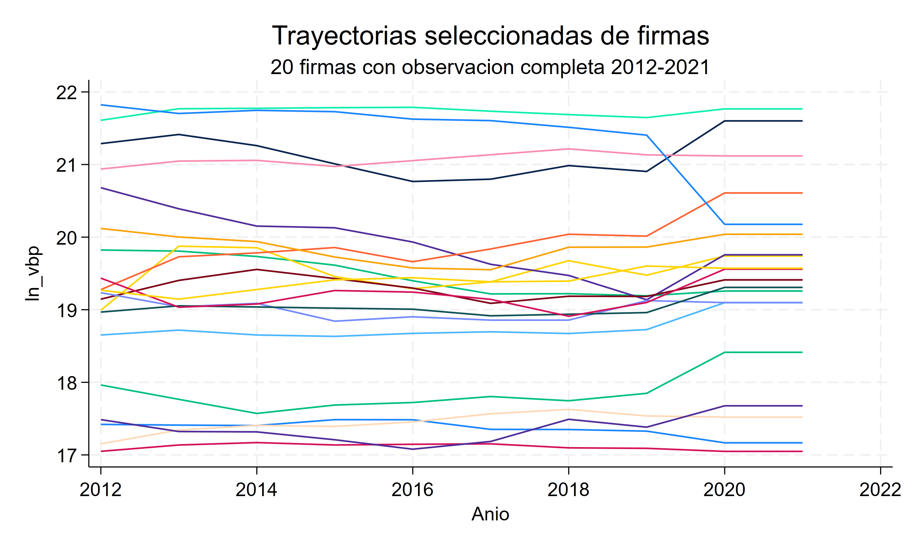

::: {.hero-box}
::: {.hero-title}
Un panel no siempre es una superficie plana: las empresas comparten tiempo, firma y sector.
:::

::: {.hero-sub}
Este estudio analiza el valor bruto de producción de firmas uruguayas entre 2012 y 2021. Un modelo multinivel separa heterogeneidad persistente de sector, heterogeneidad de firma dentro del sector y variación firma–año. El aporte no es solamente otra pendiente: son componentes de varianza, correlaciones intraclase y predicciones de grupo regularizadas por shrinkage.
:::
:::

:::: {.metric-grid}

::: {.metric-card}
::: {.metric-label}
Muestra base
:::
::: {.metric-value}
38.427
:::
::: {.metric-note}
Observaciones de 7.919 firmas en 304 sectores CIIU4
:::
:::

::: {.metric-card}
::: {.metric-label}
Varianza sectorial
:::
::: {.metric-value}
35,3%
:::
::: {.metric-note}
Componente puro del sector en el modelo ampliado
:::
:::

::: {.metric-card}
::: {.metric-label}
Varianza de firma
:::
::: {.metric-value}
55,0%
:::
::: {.metric-note}
Heterogeneidad persistente dentro del sector
:::
:::

::: {.metric-card}
::: {.metric-label}
ICC firma | sector
:::
::: {.metric-value}
0,903
:::
::: {.metric-note}
Correlación acumulada de dos años de la misma firma
:::
:::

::::

## Pregunta aplicada

¿Cuánta heterogeneidad productiva se ubica entre sectores, cuánta entre firmas del mismo sector y cuánta queda en cada observación anual? La variable dependiente es el logaritmo del valor bruto de producción real. La especificación ampliada incorpora empleo, capital, condición exportadora y efectos de año.

La unidad observada es firma–año, pero la arquitectura económica tiene tres niveles: años dentro de firmas y firmas dentro de sectores CIIU4. El 94,5% de las firmas mantiene un único sector observado en la ventana; para preservar el anidamiento, se asigna a cada firma su sector modal. La muestra ampliada contiene 35.989 observaciones, 7.283 firmas y 302 sectores.

::: {.figure-pair}
::: {.figure-pair__item}
{fig-alt="Distribución del logaritmo del valor bruto de producción en los doce sectores principales"}
:::
::: {.figure-pair__item}
{fig-alt="Trayectorias del logaritmo del valor bruto de producción para firmas seleccionadas"}
:::
:::

## Qué agrega una jerarquía

Pooled OLS puede agrupar errores por firma y mejorar la inferencia, pero sigue tratando la heterogeneidad como un residuo plano. Efectos aleatorios clásico agrega un intercepto persistente de firma, aunque no distingue cuánto de él pertenece al sector. Efectos fijos permite correlación arbitraria entre la heterogeneidad permanente de firma y los regresores, pero absorbe esa heterogeneidad: no estima su varianza ni produce efectos sectoriales regularizados.

El modelo multinivel hace explícita la estructura:

$$
y_{ist}=X_{ist}'\beta+\lambda_t+a_s+b_{i(s)}+\varepsilon_{ist},
$$

donde $a_s$ es el intercepto aleatorio del sector y $b_{i(s)}$ el de la firma dentro del sector. No es “un FE mejor”: cambia el objeto. Impone una distribución común para los efectos de grupo y permite describir de dónde proviene la dependencia residual.

{fig-alt="Jerarquía firma-año-sector y descomposición de varianza con ICC sectorial y de firma" width="100%"}

## Interceptos aleatorios e ICC

Un intercepto aleatorio permite que cada sector y cada firma se desvíen del promedio condicional. En el modelo ampliado, las varianzas estimadas son 0,470 para sector, 0,732 para firma y 0,130 para el residuo anual. Traducidas a proporciones, representan 35,3%, 55,0% y 9,7% de la varianza residual total.

El ICC sectorial es 0,353: dos observaciones de firmas distintas dentro del mismo sector comparten ese componente. El ICC de firma dentro del sector es acumulado:

$$
ICC_{firma\mid sector}
=\frac{\sigma_s^2+\sigma_{i(s)}^2}
{\sigma_s^2+\sigma_{i(s)}^2+\sigma_\varepsilon^2}
=0{,}903.
$$

No debe confundirse 0,903 con la contribución pura de la firma. Incluye 35,3 puntos porcentuales sectoriales y 55,0 propios de firma porque dos años de una misma empresa comparten ambos niveles.

::: {.table-box}
| Modelo mixto | Sector | Firma | Residuo anual | ICC sector | ICC firma \| sector |
|---|---:|---:|---:|---:|---:|
| Firma solamente | — | 91,7% | 8,3% | — | 0,917 |
| CIIU4 + firma | 37,8% | 54,5% | 7,7% | 0,378 | 0,923 |
| CIIU4 ampliado | 35,3% | 55,0% | 9,7% | 0,353 | 0,903 |
| CIIU3 ampliado | 28,2% | 61,7% | 10,2% | 0,282 | 0,898 |
:::

La sensibilidad CIIU3 agrupa actividades más amplias y desplaza parte de la heterogeneidad fina desde sector hacia firma. Esto respalda usar CIIU4 como nivel principal sin tratar la clasificación sectorial como una decisión inocua.

## Pendientes: comparación sin ranking

La asociación entre empleo y producción es positiva en todas las especificaciones, pero cambia con la fuente de variación y la estructura de heterogeneidad.

::: {.table-box}
| Modelo | Coeficiente de log empleo | EE | Qué utiliza |
|---|---:|---:|---|
| POLS | 0,846 | 0,017 | Mezcla diferencias within, entre firmas y entre sectores |
| RE de firma | 0,625 | 0,007 | Un solo componente persistente de firma |
| FE de firma | 0,581 | 0,008 | Variación dentro de firma |
| Mixed firma | 0,623 | 0,007 | Intercepto aleatorio de firma |
| Mixed CIIU4 + firma | 0,668 | 0,007 | Separa sector y firma |
| Mixed ampliado | 0,571 | 0,007 | Agrega capital y condición exportadora |
:::

La caída de 0,846 en pooled a 0,581 en FE muestra que la relación transversal entre tamaño y producción es más fuerte que la relación dentro de una firma. En el modelo ampliado, la elasticidad condicional asociada al capital es 0,150 (EE 0,003) y las firmas exportadoras presentan un diferencial de 0,158 log-puntos (EE 0,010), aproximadamente 17,1%. Son asociaciones condicionadas por el modelo, no efectos causales.

La comparación no elige un ganador universal. FE sigue siendo central cuando preocupa que la heterogeneidad permanente se correlacione con los regresores. El modelo mixto responde otra pregunta: cómo se distribuye esa heterogeneidad y cómo predecir desviaciones específicas de grupos bajo una estructura común.

## Shrinkage: efectos específicos con precisión desigual

Una media sectorial bruta trata la señal observada de cada sector como si tuviera igual precisión. El efecto aleatorio predicho combina esa información con covariables, efectos de año, heterogeneidad de firma, tamaño del grupo y varianzas estimadas. En el caso simple,

$$
\widehat a_s=\lambda_s\,\bar r_s,
\qquad
\lambda_s=\frac{\sigma_a^2}{\sigma_a^2+\sigma_\varepsilon^2/n_s}.
$$

Sectores grandes y precisos reciben menos contracción; sectores pequeños o ruidosos se acercan más a cero, entendido como ausencia de desviación respecto del promedio condicional.

{fig-alt="Medias sectoriales brutas frente a efectos aleatorios sectoriales predichos con contracción hacia cero" width="100%"}

El gráfico distingue tres objetos. La media bruta es descriptiva; un efecto fijo sería un parámetro libre para cada sector; el efecto aleatorio es una predicción regularizada —BLUP o empírico-bayes—. La contracción no borra heterogeneidad: evita atribuir la misma credibilidad a diferencias respaldadas por cantidades muy distintas de información.

## Interceptos frente a pendientes aleatorias

Los interceptos aleatorios permiten que los grupos difieran en nivel medio condicional. Una pendiente aleatoria agregaría una pregunta distinta: si la asociación entre empleo y producción también cambia entre sectores,

$$
y_{ist}=\beta_0+(\beta_1+u_{1s})\ln(empleo_{ist})+\cdots+a_s+b_{i(s)}+\varepsilon_{ist}.
$$

Esto exige estimar la varianza de pendientes y su covarianza con los interceptos. Se conserva como extensión conceptual y bloque opcional, no como resultado principal: no se ejecutó por defecto porque la enseñanza central es identificar y predecir heterogeneidad de niveles antes de flexibilizar también las pendientes.

## Diagnóstico y supuestos

Los tests LM y sus versiones ajustadas rechazan tanto ausencia de componente individual como ausencia de autocorrelación de primer orden. Eso descarta una lectura iid plana, pero no selecciona automáticamente el modelo multinivel. La especificación depende además de supuestos sustantivos:

- sectores y firmas deben constituir niveles económicamente interpretables;
- los efectos aleatorios se modelan como provenientes de distribuciones comunes y, condicional en covariables, no deben introducir correlación omitida sistemática con los regresores;
- los componentes de varianza son constantes dentro de cada nivel en la especificación principal;
- los efectos predichos describen desviaciones condicionales, no rankings estructurales ni efectos causales.

La comparación de igual parte fija favorece empíricamente el nivel sectorial: el AIC baja de 65.289,8 en el modelo de firma solamente a 62.693,7 al agregar CIIU4, y el LR reportado es 2.598,11. Se trata de evidencia auxiliar; los tests de componentes de varianza tienen una hipótesis nula en la frontera y no sustituyen la justificación económica de la jerarquía.

::: {.callout-note}
## Objeto de decisión

Modelar niveles tiene valor cuando la pregunta requiere saber dónde reside la heterogeneidad o predecir efectos de grupo con precisión desigual. Si el objetivo es únicamente una pendiente within robusta a heterogeneidad fija correlacionada, FE puede seguir siendo la referencia más directa.
:::

## Conclusión

La estructura firma–año–sector agrega información que pooled, RE de un nivel y FE no entregan conjuntamente. El modelo multinivel muestra que, aun después de incorporar covariables, 35,3% de la varianza residual corresponde al sector y 55,0% a diferencias persistentes entre firmas del mismo sector. Los ICC convierten esa descomposición en dependencia compartida; el shrinkage transforma medias de grupo ruidosas en predicciones regularizadas.

La enseñanza no es que los modelos mixtos sustituyan a los estimadores de panel tradicionales. Es que hacen explícito otro objeto econométrico: la arquitectura de la heterogeneidad. Cuando esa arquitectura es sustantiva, modelarla cambia qué se estima, cómo se predicen efectos específicos y cuánta confianza se asigna a cada grupo.
