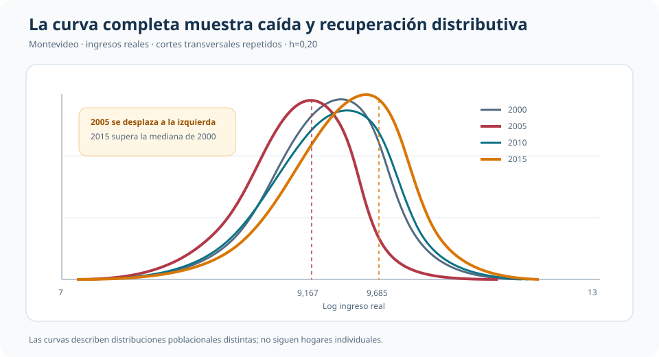

::: {.hero-box}
::: {.hero-title}
Una curva suave elimina los saltos de los bins, no la necesidad de elegir cuánto suavizar.
:::

::: {.hero-sub}
Este análisis estima la distribución marginal del ingreso per cápita familiar real de Montevideo. El histograma y la densidad kernel describen el mismo objeto mediante reglas locales distintas. La transición permite ver mejor forma, concentración y desplazamientos; también vuelve central una decisión que el gráfico puede esconder: el ancho de banda.
:::
:::

:::: {.metric-grid}

::: {.metric-card}
::: {.metric-label}
Cortes disponibles
:::
::: {.metric-value}
4 años
:::
::: {.metric-note}
2000, 2005, 2010 y 2015; no es un panel de hogares
:::
:::

::: {.metric-card}
::: {.metric-label}
Muestra total
:::
::: {.metric-value}
154.977
:::
::: {.metric-note}
Observaciones ponderadas con factores de expansión
:::
:::

::: {.metric-card}
::: {.metric-label}
Mediana 2015
:::
::: {.metric-value}
9,6847
:::
::: {.metric-note}
Log del ingreso real per cápita familiar
:::
:::

::: {.metric-card}
::: {.metric-label}
Bandwidth de referencia
:::
::: {.metric-value}
h = 0,20
:::
::: {.metric-note}
El selector plug-in entrega 0,2229
:::
:::

::::

## Pregunta distributiva

¿Dónde se concentra el ingreso, qué forma tienen sus colas y cómo cambia la distribución entre años? La pregunta no es condicional ni causal: se estima una función completa, $f_X(x)$, sin imponer que pertenezca a una familia paramétrica.

La base contiene cortes transversales repetidos de Montevideo. Los ingresos nominales se expresan en pesos de 2015 y se ponderan con factores de expansión. En 2015 hay 45.503 observaciones, de las cuales 45.483 tienen ingreso real positivo y pueden transformarse a logaritmos.

## Primero, elegir una escala legible

En niveles, el ingreso real tiene una cola derecha extensa. Para 2015, la mediana ponderada es $16.070$ pesos de 2015 y el percentil 99 alcanza $89.855$. Un recorte visual al percentil 99 permite observar el centro, pero no elimina la asimetría.

El logaritmo comprime la cola. En 2015, su media ponderada es 9,6202, la mediana 9,6847 y el desvío estándar 0,8339. La densidad pasa a verse aproximadamente unimodal y se vuelve más útil para comparar forma y localización. No es la misma densidad con otro eje: es la distribución de una variable transformada.

## Del histograma a una regla local

Un histograma también estima densidad. Divide la escala en celdas y asigna a cada barra una altura tal que su área represente la masa observada en ese intervalo. Mover los bordes o cambiar el número de bins modifica el aspecto del estimador.

La densidad kernel reemplaza celdas rígidas por ponderaciones locales:

$$
\widehat f_h(x)=\frac{1}{nh}\sum_{i=1}^n
K\!\left(\frac{X_i-x}{h}\right).
$$

Cada observación aporta más cerca de su valor y menos a medida que se aleja. Usar un kernel gaussiano no supone que el ingreso sea normal: la normal define los pesos locales, no la forma global de la distribución.

{fig-alt="Histograma y densidad kernel del log ingreso junto con sensibilidad a tres anchos de banda" width="100%"}

El panel izquierdo muestra que ambos estimadores recuperan una misma historia general, pero la curva evita que los límites de los bins se interpreten como discontinuidades reales. Esa suavidad no es gratuita: proviene de $h$.

## El bandwidth es la decisión dominante

Con $h=0,10$, cada punto utiliza vecinos más próximos: el pico es más alto y aparecen irregularidades locales. Con $h=0,40$, la curva combina información más lejana: gana estabilidad y pierde detalle. El valor $h=0,20$ conserva la forma unimodal sin seguir oscilaciones pequeñas.

El compromiso es entre varianza y sesgo. Un ancho pequeño puede convertir ruido muestral en rasgos aparentes; uno grande puede borrar asimetrías, acumulaciones o multimodalidad. Por eso una conclusión distributiva debe sobrevivir a un rango razonable de suavizado.

::: {.table-box}
| Decisión de suavizado | Valor | Lectura |
|---|---:|---|
| Sensibilidad baja | $h=0,10$ | Más detalle y variabilidad |
| Referencia pedagógica | $h=0,20$ | Forma estable y legible |
| Plug-in Epanechnikov | $h=0,2229$ | Selección AMISE muy próxima a la referencia |
| Sensibilidad alta | $h=0,40$ | Mayor suavizado; pico más bajo |
| Automático de Stata con *frequency weights* | $h=0,0429$ | Trata expansión como frecuencia y produce una curva más irregular |
:::

El selector plug-in usa un tamaño efectivo ponderado de 44.437,45, estima la curvatura integrada y obtiene $h=0,2229$. Su cercanía a 0,20 disciplina la referencia visual. En cambio, el automático con *frequency weights* es 0,0429 porque la suma expandida de ponderadores se interpreta como mucha más información independiente. La expansión poblacional no debe confundirse mecánicamente con tamaño muestral efectivo.

## Kernel: importante, pero secundario aquí

Con el mismo $h=0,20$, las curvas gaussiana, Epanechnikov y triangular son casi indistinguibles en la aplicación. La forma exacta de los pesos locales importa menos que la distancia sobre la cual se permite que las observaciones contribuyan.

El resultado no implica que el kernel nunca importe. Indica que, con kernels simétricos y razonables, la decisión que gobierna la lectura visual en esta muestra es cuánto suavizar. Por eso comparar una enciclopedia de kernels aportaría menos que mostrar sensibilidad al bandwidth.

## Un punto local hace visible el cálculo

El análisis evalúa la densidad en la mediana ponderada de 2015, $x_0=9,6847$, usando $h=0,20$. Una ventana rígida contiene 19,873% de la masa ponderada; al dividirla por su ancho total, $2h=0,40$, el estimador naive es 0,49682. El kernel gaussiano ponderado, que reduce suavemente el peso con la distancia, entrega 0,48682.

::: {.table-box}
| Estimador en $x_0$ | Densidad |
|---|---:|
| Ventana naive no ponderada | 0,49337 |
| Ventana naive ponderada | 0,49682 |
| Kernel gaussiano ponderado | 0,48682 |
:::

La cercanía confirma que ambos procedimientos usan el mismo principio local. Difieren en si los vecinos reciben peso uniforme dentro de una ventana o pesos continuos según distancia.

## Distribuciones que se desplazan en el tiempo

Una vez fijada una regla común de suavizado, las densidades permiten comparar cortes completos, no solo medias o medianas.

{fig-alt="Densidades del log ingreso real de Montevideo en 2000, 2005, 2010 y 2015" width="100%"}

El desplazamiento de 2005 hacia la izquierda y la recuperación posterior aparecen en toda la forma distributiva. La mediana baja de 9,5211 en 2000 a 9,1670 en 2005, vuelve a 9,4878 en 2010 y alcanza 9,6847 en 2015. El percentil 90 pasa de 10,2652 en 2005 a 10,6295 en 2015.

::: {.table-box}
| Año | p10 | p50 | p90 |
|---:|---:|---:|---:|
| 2000 | 8,3626 | 9,5211 | 10,5500 |
| 2005 | 7,9024 | 9,1670 | 10,2652 |
| 2010 | 8,2615 | 9,4878 | 10,5660 |
| 2015 | 8,4812 | 9,6847 | 10,6295 |
:::

Las curvas no identifican qué produjo esos cambios ni siguen a los mismos hogares. Describen poblaciones transversales bajo factores de expansión y una moneda común.

## Comparaciones entre grupos

La extensión nacional de 2015 muestra la misma utilidad para subpoblaciones: la densidad de Montevideo aparece desplazada a la derecha respecto de la del Interior. Es una brecha marginal, no condicional. Puede reflejar educación, ocupaciones, precios, estructura demográfica u otras diferencias de composición; no representa el efecto de residir en Montevideo.

Este contraste queda subordinado porque la comparación temporal construye una narrativa más completa con la base principal. Su función es recordar que una densidad marginal puede comparar grupos siempre que el alcance descriptivo permanezca explícito.

## Inferencia y límites

La fuente produce estimaciones ponderadas y análisis de sensibilidad, pero no implementa bandas pointwise ni inferencia de diseño muestral. No se agregan intervalos no documentados: las curvas deben leerse como evidencia descriptiva y diagnóstica.

- El histograma depende de bins y la curva kernel depende de $h$.
- Las colas y los bordes pueden tener mayor sesgo que el centro de la distribución.
- Los factores de expansión aproximan una distribución poblacional, pero no convierten cada unidad expandida en información independiente.
- Comparar densidades no controla por covariables ni identifica mecanismos.
- Rasgos que desaparecen ante cambios razonables de bandwidth deben tratarse como frágiles.

::: {.callout-note}
## Objeto de decisión

Una densidad no paramétrica es útil cuando la forma completa importa. Su credibilidad visual exige mostrar que los rasgos sustantivos sobreviven a una elección razonable de ancho de banda.
:::

## Conclusión

Pasar del histograma a una densidad kernel cambia lo que vemos porque deja de imponer fronteras discretas entre bins. La curva revela con mayor continuidad dónde se concentra la masa, cómo se comportan las colas y cómo se desplaza una distribución completa.

Pero el suavizado no elimina decisiones; las desplaza. En esta aplicación, cambiar de kernel con el mismo ancho apenas altera el resultado, mientras modificar $h$ cambia el pico y el detalle local. La enseñanza central es doble: una curva suave puede contar mejor la historia distributiva y, precisamente por eso, debe transparentar cuánto de esa historia depende del bandwidth elegido.
