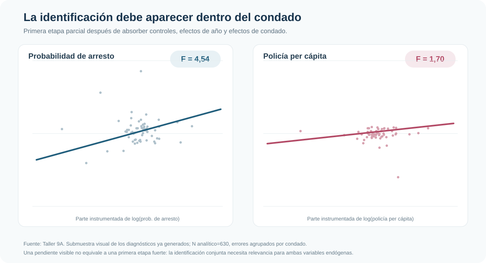
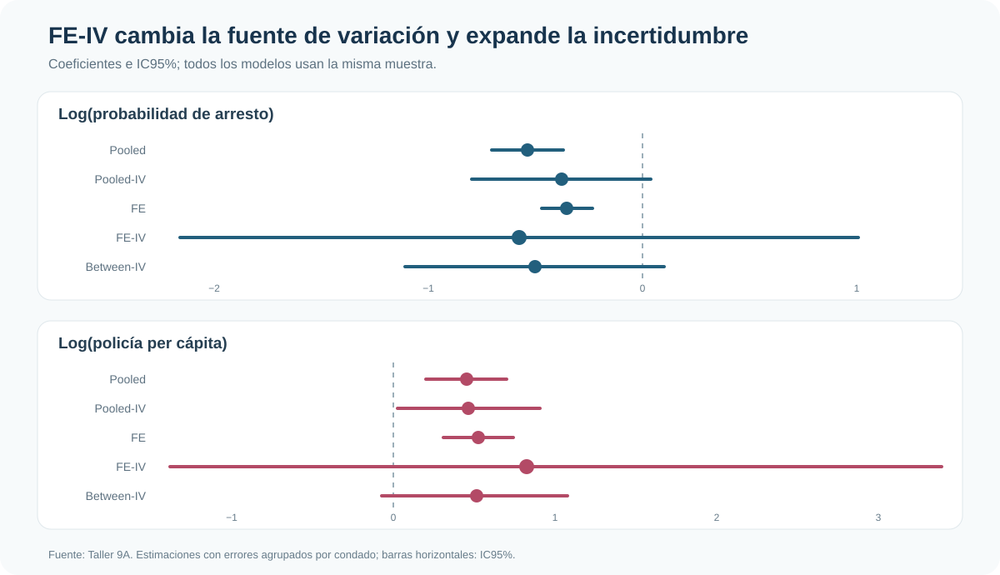

::: {.hero-box}
::: {.hero-title}
Disponer de un panel y de instrumentos no garantiza identificación útil.
:::

::: {.hero-sub}
Esta aplicación estudia criminalidad, arrestos y dotación policial en 90 condados. La pregunta no es solo si existen instrumentos, sino si explican suficiente variación dentro de cada condado para sostener una estimación FE-IV precisa y creíble.
:::
:::

:::: {.metric-grid}

::: {.metric-card}
::: {.metric-label}
Panel balanceado
:::
::: {.metric-value}
630 observaciones
:::
::: {.metric-note}
90 condados observados durante siete años, 1981–1987
:::
:::

::: {.metric-card}
::: {.metric-label}
Primera etapa: arrestos
:::
::: {.metric-value}
F = 4,54
:::
::: {.metric-note}
Relevancia conjunta visible, pero insuficiente para una lectura confortable
:::
:::

::: {.metric-card}
::: {.metric-label}
Primera etapa: policía
:::
::: {.metric-value}
F = 1,70
:::
::: {.metric-note}
Los instrumentos no explican bien su variación within
:::
:::

::: {.metric-card}
::: {.metric-label}
Diagnóstico robusto
:::
::: {.metric-value}
KP F = 0,215
:::
::: {.metric-note}
Señal severa de identificación débil en la especificación conjunta
:::
:::

::::

## Simultaneidad en una ecuación de crimen

¿Cómo se relacionan la probabilidad de arresto y la dotación policial con la tasa de crimen? Una regresión directa enfrenta una dificultad inmediata: más policía y más arrestos pueden reducir el crimen, pero un aumento contemporáneo del crimen también puede inducir mayor despliegue policial y actividad de arresto.

La aplicación usa el panel de Cornwell–Trumbull. El resultado es el logaritmo de la tasa de crimen (`lcrmrte`); las variables potencialmente endógenas son el logaritmo de la probabilidad de arresto (`lprbarr`) y de la policía per cápita (`lpolpc`). Los instrumentos excluidos son impuestos per cápita (`ltaxpc`) y composición delictiva (`lmix`), junto con controles y efectos de año.

## FE e IV resuelven problemas diferentes

Los efectos fijos eliminan características permanentes del condado que pueden estar correlacionadas con policía, arrestos y crimen: geografía, instituciones persistentes o estructura urbana estable. No eliminan simultaneidad, errores de medición ni shocks omitidos que cambian en el tiempo.

IV intenta aislar variación de los regresores endógenos inducida por los instrumentos. Tampoco elimina por sí sola la heterogeneidad permanente. FE-IV combina ambas operaciones: primero trabaja con cambios dentro del condado y luego instrumenta esa variación residual.

:::: {.quick-grid}

::: {.section-box}
## Pooled

Mezcla diferencias entre condados y cambios dentro de cada condado. Puede aprovechar mucha variación, pero no separa la heterogeneidad permanente.
:::

::: {.section-box}
## Between

Compara promedios de condados. Un instrumento puede ser relevante entre unidades aunque explique poco los cambios temporales dentro de ellas.
:::

::: {.section-box}
## Within

Compara cada condado consigo mismo. Es la fuente de variación pertinente para FE-IV y la que deben predecir los instrumentos excluidos.
:::

::::

## Primeras etapas dentro del condado

Con dos variables endógenas existen dos primeras etapas. Después de absorber controles, efectos de año y efectos de condado, `ltaxpc` y `lmix` explican algo de la variación de `lprbarr`, pero casi nada de la variación de `lpolpc`.

{fig-alt="Dos primeras etapas within: F 4,54 para probabilidad de arresto y F 1,70 para policía per cápita" width="100%"}

El contraste es sustantivo: `F(2,89)=4,54` (*p*=0,013) para arrestos y `F(2,89)=1,70` (*p*=0,189) para policía. Que una primera etapa sea estadísticamente detectable no implica que sea fuerte; además, la identificación conjunta requiere variación útil para ambas variables.

El diagnóstico robusto profundiza la advertencia. Kleibergen–Paap entrega un rk LM de 0,548 (*p*=0,459) y un rk Wald F de 0,215. La especificación no demuestra rango suficiente para identificar con solidez las dos pendientes estructurales.

## Qué cambia entre pooled, FE y sus versiones IV

Sin instrumentos, pooled y FE producen estimaciones relativamente precisas: la probabilidad de arresto aparece negativamente asociada con crimen, mientras la dotación policial aparece positivamente asociada. Esta última relación es compatible con simultaneidad: los condados pueden asignar más policía cuando enfrentan más crimen.

Instrumentar amplía la incertidumbre, especialmente al exigir que la identificación provenga de cambios dentro del condado. El problema no es que FE-IV entregue un coeficiente “incorrecto” por ser grande o impreciso; es que los datos instrumentados contienen poca información para distinguirlo de un rango muy amplio de efectos.

{fig-alt="Coefplot de cinco estimadores que muestra intervalos mucho más amplios para FE-IV" width="100%"}

::: {.table-box}
## Resultados compactos

| Modelo | Arrestos: coef. [IC95%] | Policía: coef. [IC95%] | Fuente de variación |
|---|---:|---:|---|
| Pooled | -0,537 [-0,705; -0,370] | 0,360 [0,160; 0,560] | Total |
| Pooled-IV | -0,379 [-0,799; 0,041] | 0,372 [0,019; 0,724] | Total instrumentada |
| FE | -0,355 [-0,473; -0,237] | 0,413 [0,248; 0,578] | Within |
| FE-IV | -0,576 [-2,157; 1,006] | 0,658 [-1,073; 2,388] | Within instrumentada |
| Between-IV | -0,503 [-1,107; 0,101] | 0,408 [-0,057; 0,874] | Entre promedios |
:::

## Between-IV como contraste

Between-IV trabaja con promedios por condado. Sus intervalos son más estrechos que los de FE-IV, pero identifica a partir de diferencias persistentes entre condados, no de cambios dentro de ellos. Por eso no es una versión más precisa del mismo estimando ni una solución a la debilidad de la primera etapa within.

La comparación muestra una idea general: un instrumento puede funcionar de manera diferente según la transformación del panel. La relevancia siempre debe evaluarse en la variación que utiliza el estimador final.

## Exclusión, GMM y límites

Incluso una primera etapa fuerte no probaría la exclusión. Interpretar `ltaxpc` y `lmix` como instrumentos exige sostener que no afectan directamente la tasa de crimen una vez incluidos controles, efectos temporales y efectos de condado. Esta es una hipótesis sustantiva, particularmente exigente para la composición delictiva.

La especificación tiene dos instrumentos excluidos para dos variables endógenas. Está exactamente identificada y no permite un test interno de sobreidentificación. La versión IV-GMM puede reorganizar la ponderación de momentos válidos, pero no agrega instrumentos, no repara una primera etapa débil y no convierte una restricción de exclusión dudosa en una válida. Por eso queda como extensión técnica subordinada.

Los resultados tampoco deben interpretarse como efectos causales firmes de policía o arrestos sobre crimen. La amplitud de los intervalos FE-IV es parte del resultado: la aplicación no contiene variación instrumentada within suficiente para una conclusión precisa.

## Conclusión

FE e IV son complementos, no sustitutos. FE remueve heterogeneidad permanente; IV busca variación exógena en regresores que todavía pueden responder a shocks contemporáneos. Al combinarlos, la primera etapa debe sobrevivir dentro de la unidad.

En este caso no lo hace con fuerza suficiente. Pooled-IV y between-IV pueden parecer más informativos porque explotan otras fuentes de variación, pero no responden a la misma comparación que FE-IV. La enseñanza es directa: disponer de panel e instrumentos no garantiza identificación útil; la credibilidad de FE-IV depende de relevancia instrumental dentro del condado, exclusión sustantiva y precisión compatible con la pregunta aplicada.
