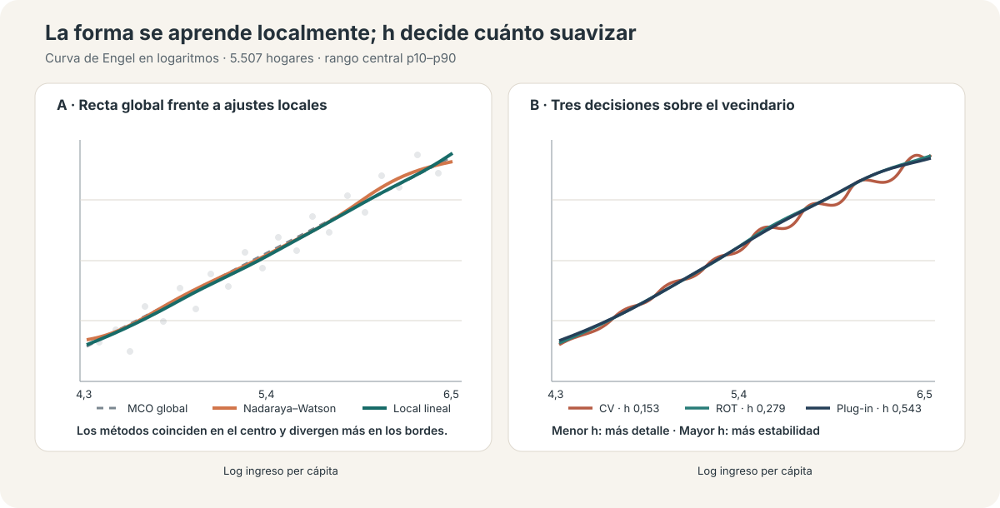
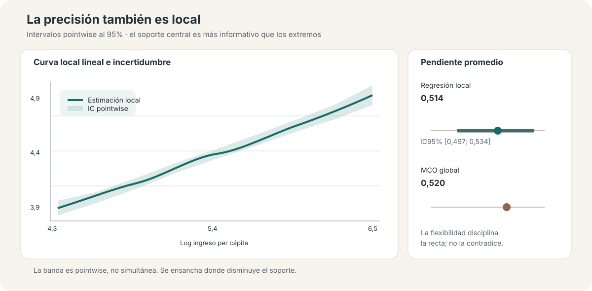

::: {.hero-box}
::: {.hero-title}
Una relación condicional puede aprenderse localmente; la flexibilidad depende de cuánto vecindario dejamos entrar.
:::

::: {.hero-sub}
Este análisis estima una curva de Engel entre ingreso y consumo per cápita sin imponer que sea lineal o cuadrática. Nadaraya–Watson y la regresión local lineal convierten observaciones cercanas en predicciones; el ancho de banda decide qué significa “cerca” y, con ello, cuánto detalle conserva la curva.
:::
:::

:::: {.metric-grid}

::: {.metric-card}
::: {.metric-label}
Hogares
:::
::: {.metric-value}
5.507
:::
::: {.metric-note}
Corte transversal con ingreso y consumo positivos
:::
:::

::: {.metric-card}
::: {.metric-label}
Pendiente MCO
:::
::: {.metric-value}
0,520
:::
::: {.metric-note}
Referencia global log–log; no es un efecto causal
:::
:::

::: {.metric-card}
::: {.metric-label}
Derivada media local
:::
::: {.metric-value}
0,514
:::
::: {.metric-note}
IC bootstrap 95%: [0,497; 0,534]
:::
:::

::: {.metric-card}
::: {.metric-label}
Bandwidth local lineal
:::
::: {.metric-value}
0,153–0,543
:::
::: {.metric-note}
CV, ROT y plug-in responden a criterios distintos
:::
:::

::::

## Pregunta aplicada

¿Cómo cambia el consumo per cápita cuando aumenta el ingreso per cápita de un hogar? Una recta resume la asociación mediante una pendiente común; un polinomio agrega curvatura global. La regresión no paramétrica formula otra pregunta: ¿qué promedio de consumo observamos entre hogares con ingresos próximos a cada punto del soporte?

La aplicación usa logaritmos de ingreso y consumo en 5.507 hogares. El ingreso logarítmico tiene media 5,378 y desvío 0,859; el análisis gráfico central se concentra entre sus percentiles 10 y 90, de 4,326 a 6,466. Es una curva condicional descriptiva: flexibilidad funcional no equivale a identificación causal.

## De una pendiente global a promedios locales

La referencia lineal estima una pendiente de 0,5196 y explica 36,7% de la variación del consumo. La especificación cuadrática apenas cambia el ajuste. Eso no demuestra que la recta sea verdadera; proporciona un benchmark contra el cual evaluar cuánto agrega una curva aprendida desde los datos.

### Nadaraya–Watson

El estimador Nadaraya–Watson es un promedio ponderado. Para un ingreso objetivo $x_0$, asigna más peso a hogares cuyo ingreso está cerca de $x_0$ y peso nulo o pequeño a los lejanos:

$$
\widehat m(x_0)=\frac{\sum_i K\!\left((x_i-x_0)/h\right)y_i}{\sum_i K\!\left((x_i-x_0)/h\right)}.
$$

En la mediana del ingreso ($x_0=5,342$), un kernel Epanechnikov con $h=0,35$ usa 1.811 observaciones con peso positivo y estima un consumo logarítmico de 4,376. El cálculo hace visible la lógica: la predicción no proviene de una forma global, sino de un vecindario ponderado.

### Regresión local lineal

Nadaraya–Watson ajusta una constante en cada vecindario. La regresión local lineal agrega una pendiente local y suele reducir el sesgo en bordes o zonas con densidad desigual. En el centro del soporte ambas curvas son próximas; las diferencias aparecen principalmente donde hay menos información a un lado del punto de evaluación.

{fig-alt="Comparación entre regresión global, Nadaraya–Watson, regresión local lineal y tres selectores de ancho de banda" width="100%"}

## El ancho de banda es la decisión central

El kernel determina cómo cae el peso con la distancia; el ancho de banda $h$ determina qué observaciones cuentan como cercanas. Un $h$ pequeño sigue rasgos locales y también ruido. Un $h$ grande estabiliza la estimación, pero puede borrar estructura sustantiva.

::: {.table-box}
| Selector | Local constante | Local lineal | Lectura |
|---|---:|---:|---|
| ROT | 0,279 | 0,279 | Referencia rápida basada en una regla regular |
| Plug-in | 0,316 | 0,543 | Orientado al error integrado de una función suave |
| Cross-validation | 0,153 | 0,153 | Prioriza predicción fuera de muestra y retiene más detalle |
:::

Las curvas coinciden ampliamente en la región central y divergen más en los extremos. La sensibilidad relevante no es elegir mecánicamente un ganador, sino distinguir rasgos persistentes de ondulaciones que solo aparecen con un vecindario muy estrecho. En esta aplicación, cambiar el método local altera menos la historia que cambiar cuánto se suaviza.

## Inferencia: precisión local, no una banda uniforme

La incertidumbre también depende de dónde se evalúa la curva. La estimación local lineal usa $h=0,543$ para la media y un ancho piloto de 0,814 para la varianza. Sus intervalos son **pointwise**: cubren cada punto por separado, no toda la función simultáneamente.

{fig-alt="Curva de consumo condicional con intervalos pointwise y comparación de la derivada media local con la pendiente lineal" width="100%"}

El bootstrap documentado entrega una derivada media de 0,5144, con error estándar 0,0094 e IC95% [0,4974; 0,5338]. Es muy próxima a la pendiente lineal de 0,5196: la flexibilidad confirma una relación positiva y casi lineal en el centro, en lugar de descubrir una forma radicalmente distinta.

La derivada es la pendiente promedio de $E[\log(consumo)\mid\log(ingreso)]$. No debe interpretarse automáticamente como la elasticidad de $E[consumo\mid ingreso]$ en niveles. Además, el bootstrap usa 80 réplicas —y 40 en la grilla de predicción—: suficiente para ilustrar el procedimiento disponible, pero modesto para una inferencia definitiva.

## Extensión multivariada: flexibilidad y pérdida de localidad

La regresión kernel puede incorporar educación, área urbana y departamento junto con ingreso. Para variables continuas se usa Epanechnikov; para discretas, un kernel de Li–Racine. Las predicciones se promedian sobre la distribución observada de los demás regresores, de modo que la curva sigue siendo legible como una función del ingreso.

El costo aparece de inmediato: cross-validation selecciona ventanas muy amplias y, en la especificación mayor, el vecindario esperado alcanza las 5.507 observaciones. La curva sigue aumentando, pero la estimación deja de ser muy local. Esta es la maldición de la dimensionalidad en términos operativos: cada covariable fragmenta el soporte y exige más suavizado para conservar información.

::: {.callout-note}
## Qué agrega la extensión

La versión multivariada no constituye otra aplicación. Muestra el límite interno del método: agregar controles puede reducir rigidez funcional y, al mismo tiempo, debilitar la comparación verdaderamente local.
:::

## ¿Y en datos de panel?

El material plantea dos rutas conceptuales: retirar medias dentro de cada unidad y estimar $E(\widetilde y\mid\widetilde x)$, o usar un modelo parcialmente lineal de panel. No se estiman aquí porque la base es transversal. Tampoco existe, en general, una equivalencia FWL exacta cuando la relación es no lineal y no paramétrica.

Una aplicación de panel requeriría definir el objeto within, preservar la dependencia temporal y remuestrear por unidad —no por observación—. Por eso queda como extensión metodológica y no como una segunda aplicación empírica.

## Alcance y límites

- La curva describe una asociación condicional; no elimina endogeneidad ni confusión no observada.
- La inferencia pointwise no autoriza una afirmación simultánea sobre toda la función.
- Los bordes combinan menos soporte, mayor sesgo y mayor incertidumbre.
- ROT, plug-in y cross-validation optimizan criterios distintos; su diferencia es información diagnóstica.
- Incorporar muchas dimensiones puede convertir una estimación nominalmente local en un promedio muy amplio.

## Conclusión

La regresión no paramétrica reemplaza una forma funcional rígida por una secuencia de ajustes locales. Nadaraya–Watson muestra la intuición de promediar vecinos; la regresión local lineal mejora el comportamiento en zonas difíciles; la inferencia recuerda que precisión y soporte varían a lo largo de la curva.

En esta curva de Engel, la flexibilidad no contradice la referencia lineal: la disciplina. La conclusión sustantiva es estable en el centro y más frágil en los extremos. El resultado metodológico es más general: el bandwidth no es un detalle de implementación, sino la decisión que gobierna el compromiso entre ajuste local, suavizado e incertidumbre.
