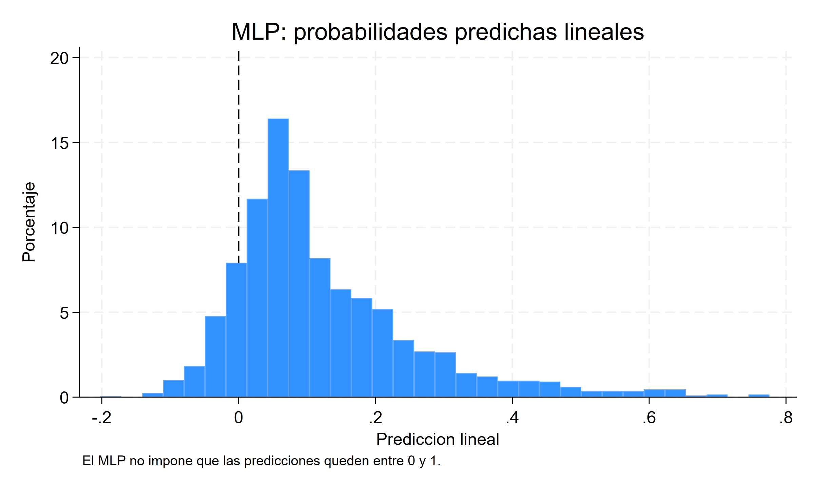
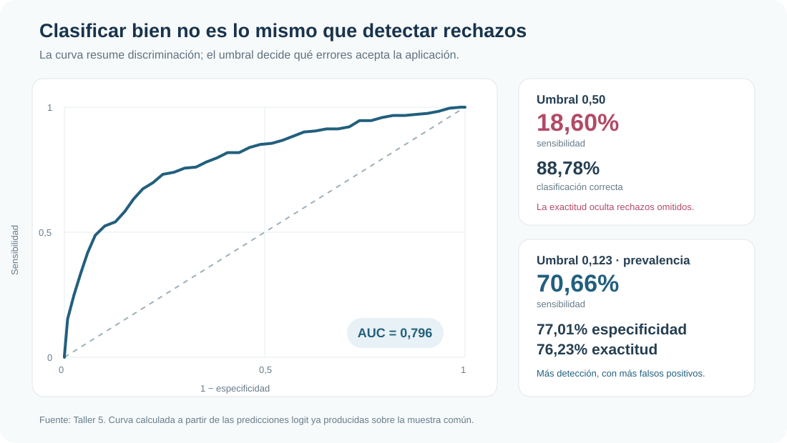

::: {.hero-box}
::: {.hero-title}
Una tasa alta de aciertos puede esconder un modelo que casi no detecta rechazos.
:::

::: {.hero-sub}
Esta aplicación compara MLP, logit y probit para explicar el rechazo de solicitudes hipotecarias. El foco no está en elegir una función por costumbre, sino en traducir sus resultados a probabilidades, evaluar su capacidad de discriminación y entender qué cambia cuando el evento es poco frecuente.
:::
:::

:::: {.metric-grid}

::: {.metric-card}
::: {.metric-label}
Muestra común
:::
::: {.metric-value}
1.969 solicitudes
:::
::: {.metric-note}
242 fueron rechazadas: una prevalencia de 12,29%
:::
:::

::: {.metric-card}
::: {.metric-label}
Límite del MLP
:::
::: {.metric-value}
11,88% inválidas
:::
::: {.metric-note}
234 probabilidades predichas quedaron fuera de [0, 1]
:::
:::

::: {.metric-card}
::: {.metric-label}
Efecto parcial promedio
:::
::: {.metric-value}
+0,148
:::
::: {.metric-note}
APE logit de `loanprc`; el probit entrega +0,145
:::
:::

::: {.metric-card}
::: {.metric-label}
Discriminación
:::
::: {.metric-value}
AUC = 0,796
:::
::: {.metric-note}
Buen ordenamiento relativo, pero el umbral define qué errores se priorizan
:::
:::

::::

## Pregunta aplicada

¿Cómo cambia la probabilidad de rechazo hipotecario con las características de la solicitud y del solicitante? El resultado `reject` distingue solicitudes aprobadas y rechazadas; la variable central, `loanprc`, mide el préstamo solicitado en relación con el precio de la propiedad.

La aplicación usa 1.969 observaciones comunes de `loanapp`. Como solo 12,29% de las solicitudes fueron rechazadas, el problema exige separar dos preguntas: qué variables se asocian con la probabilidad de rechazo y cuán útil es el modelo para detectar efectivamente esos casos.

## MLP: un punto de partida con límites visibles

El modelo lineal de probabilidad ofrece una referencia inmediata: un aumento unitario de `loanprc` se asocia con 0,122 puntos adicionales en la probabilidad de rechazo (EE robusto 0,038; *p*=0,001). Pero esa sencillez impone una relación lineal y constante sobre todo el rango.

El costo aparece en las predicciones: 234 de 1.969 quedan fuera del intervalo admisible [0, 1]. El MLP sigue siendo un benchmark útil, pero no una representación completa de una probabilidad condicional binaria.

{fig-alt="Predicciones del modelo lineal de probabilidad, incluidas observaciones fuera del intervalo entre cero y uno" width="100%"}

## Logit: odds y cambios en probabilidad

En logit, el coeficiente de `loanprc` es 1,699 y su *odds ratio* es 5,47. Esto no significa que la probabilidad se multiplique por 5,47: son los *odds* de rechazo los que cambian en esa proporción ante un aumento unitario, manteniendo constantes las demás covariables.

Para volver a una escala aplicada, el efecto parcial promedio es más transparente. El APE de `loanprc` es 0,148 (EE 0,043; IC95% [0,063; 0,233]): en promedio, una variación unitaria del ratio se asocia con 14,8 puntos porcentuales adicionales de probabilidad de rechazo. Es una asociación condicional, no una estimación causal.

## Probit como contraste funcional

Logit y probit usan enlaces diferentes, por lo que sus coeficientes latentes no son comparables en magnitud directa. En cambio, sus APE sí ofrecen una escala común.

::: {.table-box}
## Comparación compacta

| Modelo | Resultado para `loanprc` | Incertidumbre | Lectura |
|---|---:|---:|---|
| MLP robusto | Coef. 0,122 | EE 0,038 | Cambio lineal constante; 11,88% de predicciones inválidas |
| Logit | APE 0,148 | EE 0,043 | Cambio promedio en probabilidad |
| Probit | APE 0,145 | EE 0,040 | Cambio promedio en probabilidad |

Los APE logit y probit son casi idénticos y sus probabilidades predichas resultan muy próximas. La elección del enlace no altera aquí la conclusión sustantiva, aunque sí cambia la parametrización y exige interpretar cada escala correctamente.
:::

## Probabilidades ajustadas

La asociación se vuelve más tangible al variar `loanprc` y promediar sobre las demás características observadas. La probabilidad ajustada logit pasa de 7,2% cuando el ratio es 0,4 a 19,4% cuando alcanza 1,2. La incertidumbre se amplía en la parte alta, donde hay menos información efectiva.

{fig-alt="Tasas observadas de rechazo por deciles de loanprc y trayectoria de probabilidad ajustada con intervalo de confianza" width="100%"}

## Clasificación, umbral y ROC

Con el umbral convencional de 0,50, el modelo clasifica correctamente 88,78% de las solicitudes. Esa cifra parece excelente, pero detecta solo 18,60% de los rechazos: la baja prevalencia permite acertar mucho prediciendo casi siempre aprobación.

Usar como referencia un umbral cercano a la tasa observada de rechazo (0,123) cambia el compromiso: la sensibilidad sube a 70,66%, la especificidad queda en 77,01% y la exactitud global baja a 76,23%. No existe un umbral universalmente óptimo; depende del costo relativo de omitir un rechazo frente a marcar erróneamente una aprobación.

{fig-alt="Curva ROC con AUC 0,796 y comparación de sensibilidad y exactitud para dos umbrales" width="100%"}

## Diagnósticos esenciales

::: {.table-box}
| Diagnóstico | Resultado | Lectura prudente |
|---|---:|---|
| Hosmer–Lemeshow | *p*=0,260 | No rechaza el ajuste por grupos de riesgo |
| Linktest logit | `_hatsq` *p*=0,486 | No ofrece evidencia clara de mala especificación del enlace |
| Linktest probit | `_hatsq` *p*=0,793 | Conclusión equivalente para probit |
| Pregibon auxiliar | *p*=0,023 | Señal de tensión que aconseja revisar forma funcional y observaciones influyentes |
:::

Los diagnósticos no se reducen a un voto mecánico. En conjunto, logit y probit producen resultados centrales estables, mientras el test auxiliar de Pregibon recuerda que un buen AUC o un test favorable no garantizan que toda la especificación sea incuestionable.

## Probit bivariado: una extensión, no otro caso

El análisis se extiende a una decisión relacionada: la solicitud de seguro hipotecario privado (`inss`). El probit bivariado estima una correlación de errores de -0,149 y rechaza `rho=0` (*p*=0,020), señal de dependencia no observada entre ambas ecuaciones.

La extensión muestra por qué modelar conjuntamente dos resultados binarios puede ser informativo. No identifica por sí sola un mecanismo causal ni desplaza el objetivo central del análisis: interpretar y diagnosticar adecuadamente una probabilidad de rechazo.

## Conclusión

MLP, logit y probit cuentan una historia sustantiva parecida sobre `loanprc`, y logit y probit entregan APE casi iguales. Sin embargo, esa coincidencia no vuelve intercambiables sus coeficientes ni elimina la necesidad de revisar rango, calibración, forma funcional y capacidad predictiva.

La lección más importante aparece al clasificar: 88,78% de aciertos convive con apenas 18,60% de sensibilidad bajo el umbral 0,50. En eventos poco frecuentes, una cifra global puede ocultar justamente los casos que interesa detectar. Modelar una respuesta binaria exige combinar interpretación económica, probabilidades ajustadas y diagnósticos alineados con la decisión.
