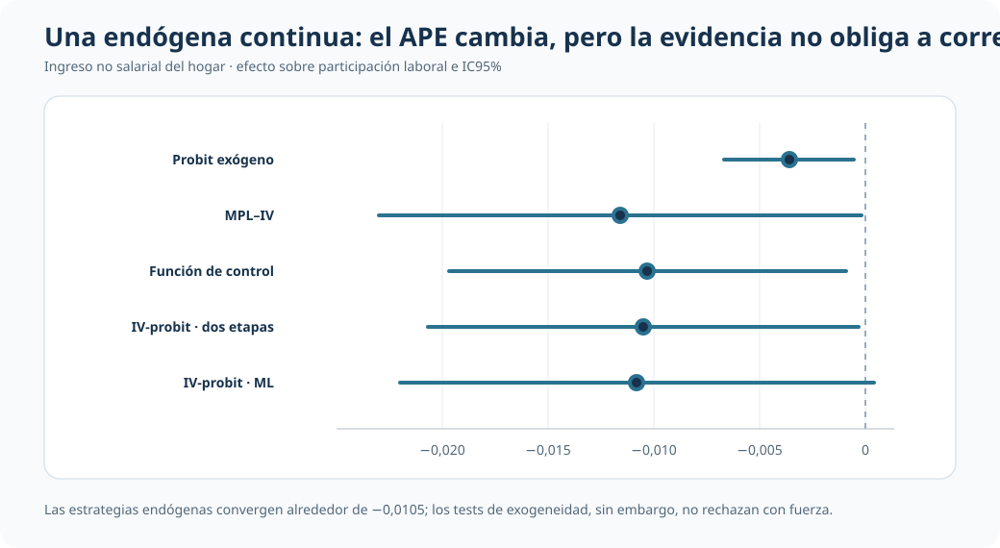
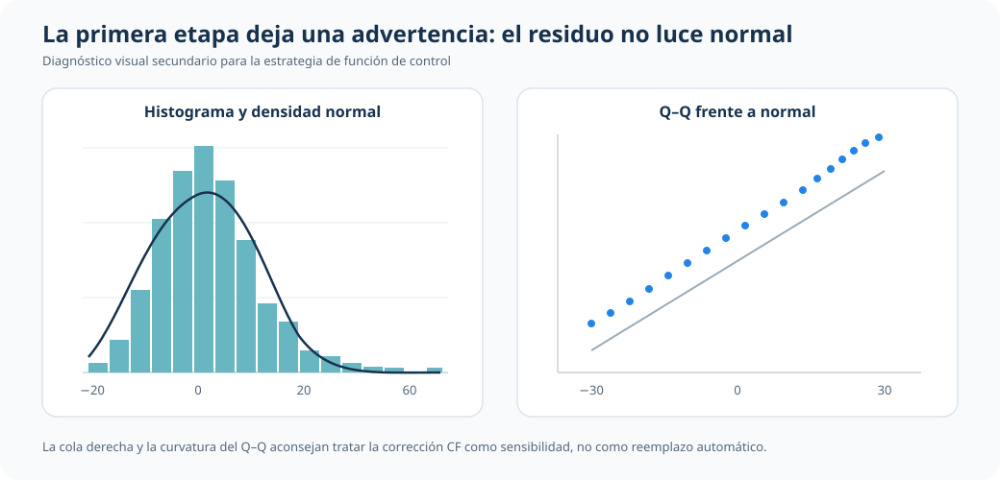
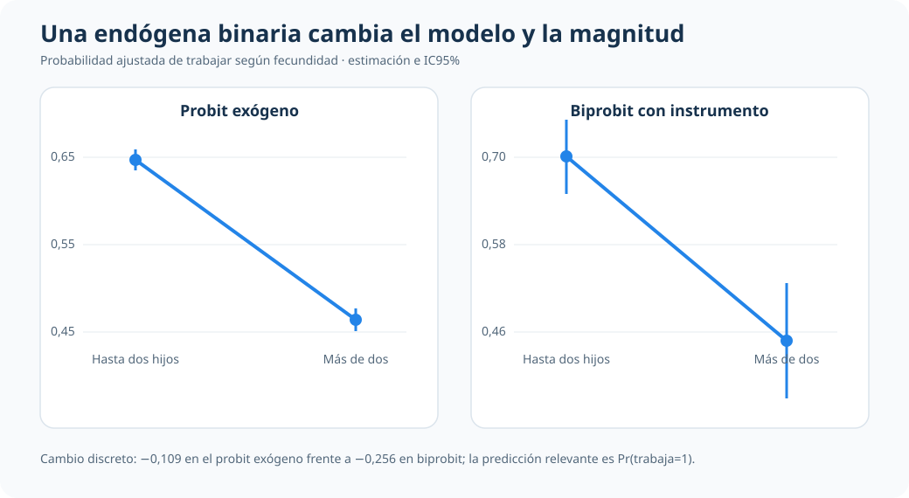

::: {.hero-box}
::: {.hero-title}
Una respuesta binaria no implica una única receta para tratar endogeneidad
:::

::: {.hero-sub}
Cuando la covariable endógena es continua, la corrección se construye con función de control o IV-probit. Cuando también es binaria, cambia la estructura probabilística y corresponde un modelo recursivo como biprobit.
:::
:::

:::: {.metric-grid}
::: {.metric-card}
::: {.metric-label}
Resultado común
:::
::: {.metric-value}
Participa / no participa
:::
::: {.metric-note}
La variable dependiente es binaria en ambas aplicaciones.
:::
:::

::: {.metric-card}
::: {.metric-label}
Endógena continua
:::
::: {.metric-value}
CF / IV-probit
:::
::: {.metric-note}
Ingreso no salarial del hogar.
:::
:::

::: {.metric-card}
::: {.metric-label}
Endógena binaria
:::
::: {.metric-value}
Biprobit / eprobit
:::
::: {.metric-note}
Haber tenido más de dos hijos.
:::
:::

::: {.metric-card}
::: {.metric-label}
Unidad de lectura
:::
::: {.metric-value}
Probabilidades y APE
:::
::: {.metric-note}
No se comparan coeficientes latentes de forma mecánica.
:::
:::
::::

## Resumen

Dos problemas pueden compartir una variable dependiente binaria y, sin embargo, exigir estrategias econométricas distintas. La diferencia decisiva está en la naturaleza de la variable endógena.

Con una covariable continua, la primera etapa puede modelarse linealmente y su residuo incorporarse mediante función de control; IV-probit ofrece una formulación paralela. Con una covariable binaria, esa lógica no se traslada mecánicamente: la ecuación de selección o tratamiento también es binaria y requiere una distribución conjunta apropiada, como la de biprobit.

:::: {.quick-grid}
::: {.section-box}
## La bifurcación metodológica

| Variable endógena | Estrategia central | Cantidad interpretada |
|---|---|---|
| Continua | Función de control / IV-probit | APE estructural |
| Binaria | Biprobit / eprobit | Cambio en `Pr(resultado=1)` |
:::

::: {.section-box}
## Pregunta profesional

No es “qué comando usar”, sino qué estructura probabilística corresponde al proceso que genera la variable endógena y cuál es la probabilidad relevante para la decisión aplicada.

Respuesta binaria e instrumentos
:::
::::

## Caso 1 · Ingreso no salarial: covariable endógena continua

La primera aplicación usa 753 observaciones de mujeres y hogares de `mroz.dta`. El resultado es participación laboral (`inlf`) y la covariable central es el ingreso no salarial del hogar, medido en miles. El instrumento principal es la educación del esposo; educación de la madre y del padre amplían la especificación sobreidentificada.

El probit exógeno sirve como referencia. La función de control estima una primera etapa para el ingreso no salarial, incorpora su residuo en el probit y permite evaluar exogeneidad. IV-probit modela conjuntamente el resultado binario y la covariable continua. El modelo lineal IV se conserva solo como benchmark secundario.

| Estrategia | APE del ingreso no salarial | EE | IC95% | Papel |
|---|---:|---:|---:|---|
| Probit exógeno | -0,0036 | 0,0016 | [-0,0067; -0,0005] | Punto de partida |
| MPL–IV | -0,0116 | 0,0058 | [-0,0230; -0,0002] | Benchmark lineal |
| Función de control | -0,0103 | 0,0048 | [-0,0197; -0,0009] | Eje del bloque endógeno |
| IV-probit, dos etapas | -0,0105 | 0,0052 | [-0,0207; -0,0003] | Contraste no lineal |
| IV-probit, ML | -0,0108 | 0,0057 | [-0,0220; 0,0004] | Contraste conjunto |

Las estrategias endógenas arrojan APE próximos entre sí y alrededor de tres veces mayores en magnitud que el probit exógeno. Pero la corrección no debe venderse como obligatoria: la primera etapa es relevante (`F(3,743)=16,67`; `p<0,001`), la sobreidentificación no muestra señales claras contra los instrumentos (`p=0,783`) y los tests de exogeneidad quedan aproximadamente entre `p=0,17` y `p=0,22`.

### Un límite que importa para la función de control

La función de control descansa en supuestos distributivos sobre el error de la primera etapa. El residuo presenta una cola derecha pronunciada y se aparta de la referencia normal en el gráfico Q–Q.

Esta advertencia refuerza una lectura de sensibilidad: los métodos endógenos son informativos, pero no justifican reemplazar automáticamente el benchmark exógeno en esta muestra.

## Caso 2 · Fecundidad: covariable endógena binaria

La segunda aplicación usa 31.857 observaciones de madres y hogares de `labsup.dta`. El resultado indica si la madre trabaja (`worked`) y la variable problemática indica si tuvo más de dos hijos (`morekids`). El instrumento excluido es que los dos primeros hijos sean del mismo sexo (`samesex`).

Aquí no corresponde trasladar sin cambios la función de control o el IV-probit del caso continuo. La ecuación de `morekids` es también binaria; biprobit estima recursivamente las dos ecuaciones y permite correlación entre sus errores. `eprobit` funciona como contraste adicional.

| Enfoque | Cambio en `Pr(trabaja=1)` al pasar a más de dos hijos | EE | Lectura |
|---|---:|---:|---|
| Probit exógeno | -0,1095 | 0,0055 | Referencia sin tratar endogeneidad |
| MPL–IV | -0,2008 | 0,0965 | Benchmark lineal con alta incertidumbre |
| Biprobit con instrumento | -0,2559 | 0,0710 | Modelo central para dos binarias |
| Eprobit | -0,2559 | 0,0519 | Magnitud alineada con biprobit |

La asociación permanece negativa, pero aumenta en magnitud al modelar la endogeneidad binaria. El instrumento es relevante en la primera etapa (`F(1,31849)=103,81`; `p<0,001`) y la dependencia entre errores muestra una señal limítrofe, por lo que el resultado se reporta con prudencia.

### La predicción correcta en biprobit

El `margins` por defecto de biprobit puede referirse a una probabilidad conjunta, `Pr(trabaja=1, más de dos hijos=1)`. Esa no es la cantidad sustantiva buscada aquí. La comparación debe solicitar la probabilidad marginal de trabajar, `Pr(trabaja=1)`, mediante `predict(pmarg1)`, y construir el contraste entre `morekids=0` y `morekids=1`.

## Qué cambia entre ambos problemas

| Dimensión | Endógena continua | Endógena binaria |
|---|---|---|
| Primera etapa | Ecuación continua | Ecuación probit |
| Estructura conjunta | Binaria + continua | Dos ecuaciones binarias |
| Estrategia principal | Función de control / IV-probit | Biprobit / eprobit |
| Riesgo interpretativo | Sobreactuar una corrección débilmente respaldada | Leer la probabilidad conjunta equivocada |

## Cierre

La naturaleza binaria del resultado no determina por sí sola la estrategia de endogeneidad. Es necesario mirar también cómo se genera la covariable problemática.

Cuando es continua, función de control e IV-probit permiten construir APE comparables, pero sus supuestos y diagnósticos deben permanecer visibles. Cuando es binaria, cambia la verosimilitud y también la cantidad que debe pedirse al modelo. La decisión econométrica correcta comienza antes del estimador: comienza al describir adecuadamente la estructura del problema.
