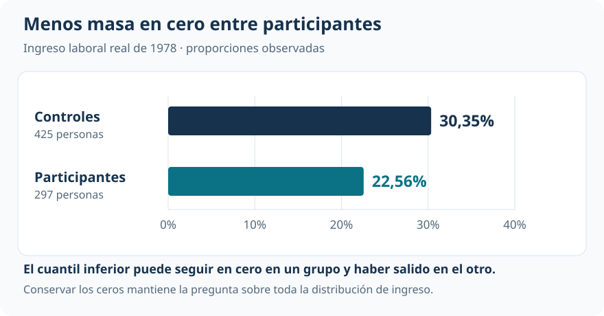
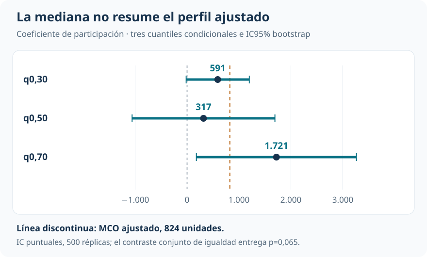

[Econometría](../index.qmd) / [Cuantiles, distribuciones y descomposiciones](../index.qmd#cuantiles)

Cuantiles y efectos distributivos

::: {.hero-box}
::: {.hero-title}
La ventaja media de ingreso reúne tres patrones: menos ingresos cero, poca diferencia en la mediana y una asociación mayor en la zona media-alta.
:::
::: {.hero-sub}
¿La diferencia entre participantes y controles se reparte de manera uniforme? Comparar la media con cuantiles permite ubicar dónde aparecen las diferencias. El ajuste por características previas cambia el objeto de comparación, pero no convierte la participación observada en un tratamiento exógeno.
:::
:::

:::: {.metric-grid}
::: {.metric-card}
::: {.metric-label}
Personas analizadas
:::
::: {.metric-value}
722
:::
::: {.metric-note}
297 participantes y 425 controles; ingreso de 1978.
:::
:::
::: {.metric-card}
::: {.metric-label}
Diferencia media observada
:::
::: {.metric-value}
886
:::
::: {.metric-note}
Unidades de ingreso; estimación positiva e imprecisa (p=0,070).
:::
:::
::: {.metric-card}
::: {.metric-label}
Mediana condicional
:::
::: {.metric-value}
317
:::
::: {.metric-note}
Coeficiente ajustado de participación; amplio intervalo que incluye cero.
:::
:::
::: {.metric-card}
::: {.metric-label}
Cuantil condicional 0,70
:::
::: {.metric-value}
1.721
:::
::: {.metric-note}
Asociación ajustada; se mantiene cerca de 1.695 al incluir ingreso previo.
:::
:::
::::

## Qué oculta una diferencia de medias

Un ingreso promedio mayor puede combinar cambios en la probabilidad de tener ingresos positivos, diferencias cerca de la mediana y una separación en la parte alta. La media resume esos movimientos en un solo número. Para evaluar la forma de la diferencia necesitamos observar la distribución.

La aplicación utiliza una adaptación docente de una base inspirada en el National Supported Work Demonstration (NSW). Aunque existen observaciones de 1975 y 1978, aquí se construye un **corte transversal de 1978**. El resultado es el ingreso laboral real; la comparación principal distingue participación observada en capacitación. Edad, educación y los indicadores de origen racial y latino se miden en 1975. El ingreso de ese año se incorpora después como sensibilidad.

La asignación aleatoria original no está disponible. Por eso el análisis describe diferencias observadas y asociaciones condicionales. El buen balance de las características previas ayuda a interpretar el ajuste, pero no identifica el efecto causal del programa.

## Los ceros forman parte de la distribución

Entre controles, el 30,35% tiene ingreso cero; entre participantes, el 22,56%. Esta masa puntual determina los cuantiles inferiores. En los cuantiles 0,10 y 0,20 ambos grupos siguen en cero; alrededor del 0,25, los participantes ya han salido de ese punto mientras los controles todavía permanecen allí.

{#fig-qr-ceros fig-alt="Proporción de ingreso cero: 30,35% en controles y 22,56% en participantes, sobre una escala común de cero a 40%." width="100%"}

Eliminar los ceros cambiaría la pregunta: pasaríamos a estudiar ingresos entre quienes tienen ingreso positivo. Además, ingreso cero no permite distinguir por sí solo desempleo, inactividad u otros motivos de ausencia de ingresos laborales. El resultado analizado es el ingreso, no una tasa de empleo.

## Tres objetos que conviene separar

Mínimos cuadrados ordinarios (MCO) compara medias. La regresión por cuantiles (QR) desplaza la atención hacia una posición de la distribución. Con una constante y una dummy de participación, QR reproduce las diferencias entre cuantiles de los dos grupos observados. Al agregar covariables, estima otro objeto:

$$
Q_\tau(Y\mid D,H)=\alpha(\tau)+\delta(\tau)D+H'\gamma(\tau),
$$

donde $D$ indica participación y $H$ contiene las características previas. El coeficiente $\delta(\tau)$ compara el cuantil **condicional**, manteniendo fijos esos controles dentro de la especificación lineal.

::: {.table-box}
| Comparación | Qué mide | Lectura en esta aplicación |
|---|---|---|
| MCO sin controles | Diferencia de medias observadas | Participantes con ingreso medio 886 unidades mayor |
| QR sin controles | Diferencia de cuantiles marginales observados | Brecha de medianas de 486 unidades |
| QR con características previas | Coeficiente en un cuantil condicional | Asociación de 317 unidades en la mediana condicional |
:::

Las dos últimas cifras no son versiones intercambiables del mismo parámetro. Tampoco un coeficiente condicional puede leerse como el efecto para una persona que ocupa permanentemente cierto percentil.

## Mediana y zona media-alta cuentan historias distintas

Con controles previos, la asociación de participación es 591 unidades en el cuantil 0,30, baja a 317 en la mediana y alcanza 1.721 en el 0,70. La figura concentra la lectura en esos tres puntos y muestra la incertidumbre bootstrap reportada.

{#fig-qr-perfil fig-alt="Coeficientes QR ajustados e intervalos bootstrap del 95%: cuantil 0,30, 591 e intervalo de menos 17 a 1199; mediana, 317 e intervalo de menos 1059 a 1692; cuantil 0,70, 1721 e intervalo de 180 a 3263." width="100%"}

La evidencia no autoriza a declarar heterogeneidad solo porque un intervalo incluye cero y otro no. El contraste conjunto de igualdad entre los tres coeficientes, con covarianzas bootstrap, entrega **p=0,065**: el perfil es sugestivo, pero no se rechaza igualdad al 5%.

### Qué se sostiene al incorporar el ingreso previo

::: {.table-box}
| Cuantil condicional | Controles previos | Más ingreso de 1975 | Lectura |
|---|---:|---:|---|
| 0,30 | 590,78 | 247,48 | Asociación sensible al ajuste |
| 0,50 | 316,94 | 374,21 | Punto pequeño respecto de su incertidumbre |
| 0,70 | 1.721,15 | 1.695,01 | Magnitud prácticamente estable |
:::

Son coeficientes en unidades de ingreso, estimados sobre las mismas 722 personas. La parte baja combina dos dificultades: proximidad al salto en cero y sensibilidad al ingreso previo. En la zona media-alta, el punto estimado cambia poco. Esa estabilidad frente a una especificación concreta es el resultado más defendible; no demuestra robustez frente a cualquier control posible.

## Alcance de la evidencia

Los intervalos de la figura usan la inferencia bootstrap reportada para QR con 500 réplicas. El contraste conjunto utiliza la estimación simultánea de los tres cuantiles. Cerca de una masa puntual, la aproximación inferencial regular es delicada: remuestrear no elimina esa dificultad.

Un efecto cuantílico de tratamiento (QTE) compara cuantiles de distribuciones de resultados potenciales. Esta base no identifica esas distribuciones: se observa participación, pero falta la asignación que podría aportar variación exógena. **Ninguna de las brechas presentadas debe denominarse QTE causal.**

::: {.section-box}
### Lectura que domina

La media positiva no describe un desplazamiento uniforme: hay menos masa de ingreso cero entre participantes, poca evidencia de diferencia en la mediana y una asociación mayor y relativamente estable alrededor del cuantil condicional 0,70. La QR aporta localización distributiva; la identificación causal requiere información adicional.
:::

## Continuar la comparación

[Capacitación laboral: participación, selección y efectos distributivos](t14_qriv_qte_vi.qmd) estudia qué cambia cuando sí existe una oferta aleatoria utilizable como instrumento. [Experiencia y antigüedad](t15_qr_panel.qmd) examina otra fuente de heterogeneidad: las diferencias persistentes entre personas observadas en panel.

::: {.small-note}
**Fuente:** informe curado «Taller 13: Regresión por cuantiles y efectos distributivos». Figuras elaboradas con las proporciones, coeficientes e intervalos reportados; el perfil visual selecciona tres cuantiles, sin interpolar resultados adicionales.
:::
