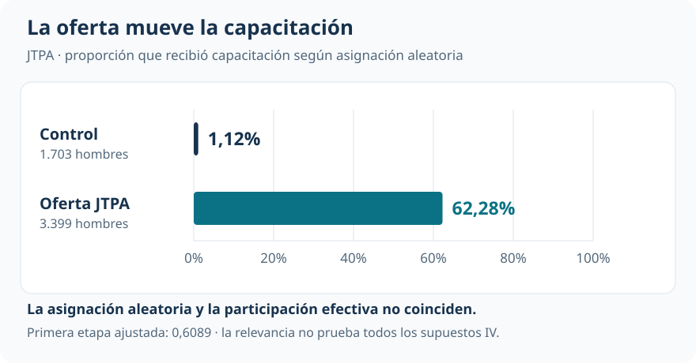
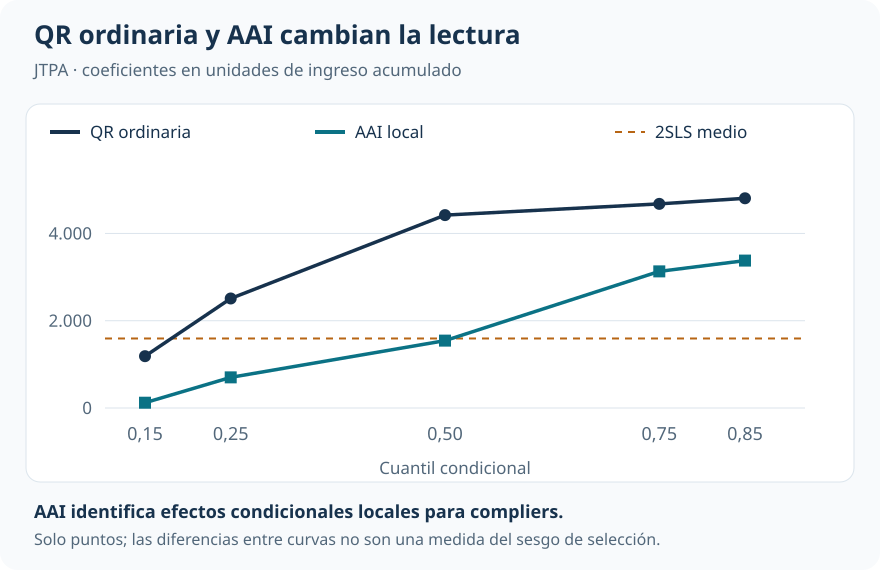
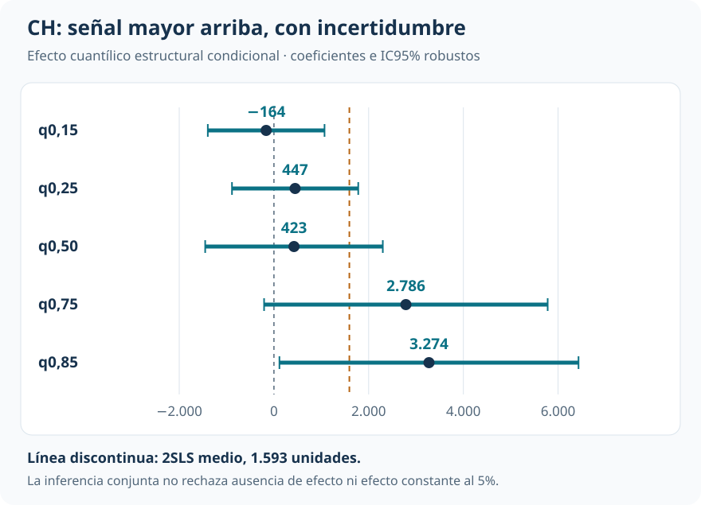

[Econometría](../index.qmd) / [Cuantiles, distribuciones y descomposiciones](../index.qmd#cuantiles)

Cuantiles y efectos distributivos

::: {.hero-box}
::: {.hero-title}
Quienes reciben capacitación ganan más. La oferta aleatoria permite preguntar cuánto puede atribuirse al programa y para qué población.
:::
::: {.hero-sub}
En JTPA, recibir una oferta no implica necesariamente capacitarse. Esa diferencia permite instrumentar la participación efectiva y contrastar la historia distributiva observacional con dos marcos causales distintos: efectos locales para quienes responden a la oferta y efectos cuantílicos estructurales.
:::
:::

:::: {.metric-grid}
::: {.metric-card}
::: {.metric-label}
Diseño y muestra
:::
::: {.metric-value}
5.102
:::
::: {.metric-note}
Hombres adultos de la evaluación aleatorizada JTPA.
:::
:::
::: {.metric-card}
::: {.metric-label}
Primera etapa ajustada
:::
::: {.metric-value}
60,9 pp
:::
::: {.metric-note}
Aumento de capacitación inducido por la oferta; F≈4.845.
:::
:::
::: {.metric-card}
::: {.metric-label}
Asociación media MCO
:::
::: {.metric-value}
3.754
:::
::: {.metric-note}
Unidades de ingreso; comparación por capacitación efectiva.
:::
:::
::: {.metric-card}
::: {.metric-label}
Efecto medio local 2SLS
:::
::: {.metric-value}
1.593
:::
::: {.metric-note}
Para compliers bajo los supuestos instrumentales; p=0,075.
:::
:::
::::

## La oferta y la participación son variables distintas

¿La ventaja salarial de quienes se capacitan refleja el programa, la selección de participantes o ambas cosas? La regresión por cuantiles ordinaria permite describir dónde difieren los ingresos, pero no resuelve que la participación pueda depender de motivación, restricciones o empleabilidad no observadas.

La aplicación utiliza ingresos acumulados durante el seguimiento de la evaluación del **Job Training Partnership Act (JTPA)**. La muestra de replicación reúne 5.102 hombres adultos. Se conservan los ingresos cero, presentes en el 10,3% de la muestra. Los modelos incluyen controles de educación, raza y origen hispano, estado civil, inserción laboral previa, estrategia recomendada, edad y seguimiento.

La oferta aleatoria es el instrumento $Z$; la capacitación efectiva es $D$. Entre quienes reciben la oferta, el 62,28% se capacita. En el control lo hace el 1,12%.

{#fig-iv-cumplimiento fig-alt="Tasa de capacitación: 1,12% entre 1703 hombres asignados al control y 62,28% entre 3399 asignados a la oferta de JTPA." width="100%"}

Los **compliers** son quienes se capacitarían al recibir la oferta y no lo harían sin ella. Bajo independencia, exclusión, relevancia y monotonicidad, mínimos cuadrados en dos etapas (2SLS) identifica su efecto medio local. La primera etapa es muy fuerte; la imprecisión del efecto medio proviene de la señal sobre ingresos, no de falta de movimiento en capacitación.

## Tres métodos, tres lecturas

Pasar a cuantiles exige definir nuevamente el parámetro. No alcanza con sustituir la capacitación por su valor predicho en una QR: la condición instrumental cuantílica no es la ortogonalidad de media que utiliza 2SLS.

::: {.table-box}
| Enfoque | Objeto y población | Qué sostiene la interpretación |
|---|---|---|
| QR ordinaria | Asociación en cuantiles condicionales de la muestra observada | Describe diferencias por participación; no resuelve selección |
| Abadie–Angrist–Imbens (AAI) | Efecto cuantílico condicional local para compliers | Instrumento válido, exclusión, monotonicidad y especificación cuantílica local |
| Chernozhukov–Hansen (CH) | Diferencia entre cuantiles de resultados potenciales dentro de una función estructural condicional | Validez instrumental respecto de los rankings y supuestos de similitud o invarianza de rankings |
:::

AAI utiliza ponderaciones para recuperar información sobre una subpoblación que no se observa individualmente. CH busca el parámetro que satisface una restricción cuantílica instrumental sobre la función de resultados potenciales. **CH no debe etiquetarse automáticamente como un efecto local para compliers**: su objeto y sus supuestos son distintos de AAI.

## Qué cambia al utilizar la oferta aleatoria

La QR ordinaria arroja asociaciones positivas y grandes: 1.187 unidades en el cuantil 0,15, 4.420 en la mediana y 4.806 en el 0,85. AAI produce magnitudes menores, especialmente abajo y en el centro.

{#fig-iv-aai fig-alt="Perfil en cinco cuantiles: QR ordinaria, 1187, 2510, 4420, 4678 y 4806; AAI local, 121, 702, 1544, 3131 y 3378. Referencia 2SLS: 1593." width="100%"}

En AAI, el efecto local es 121 unidades en el cuantil 0,15 y 1.544 en la mediana, ambos imprecisos. En los cuantiles 0,75 y 0,85 alcanza 3.131 y 3.378. Solo el primero se distingue de cero al 5%; el segundo tiene p=0,063. La pendiente de los puntos sugiere una señal mayor arriba, pero no se implementa un contraste conjunto AAI de igualdad entre cuantiles.

El marco CH ofrece una comparación complementaria. Sus puntos también son pequeños en la mitad inferior y mayores arriba. La mediana muestra por qué los dos enfoques instrumentales no son equivalentes: AAI estima 1.544 y CH 423.

{#fig-iv-ch fig-alt="Coeficientes estructurales CH e intervalos robustos del 95% en cuantiles 0,15 a 0,85. Solo el intervalo del cuantil 0,85 excluye cero; referencia media 2SLS de 1593 unidades." width="100%"}

### La comparación decisiva

::: {.table-box}
| Cuantil | QR ordinaria | AAI local | CH estructural |
|---|---:|---:|---:|
| 0,15 | 1.187 | 121 | −164 |
| 0,25 | 2.510 | 702 | 447 |
| 0,50 | 4.420 | 1.544 | 423 |
| 0,75 | 4.678 | 3.131 | 2.786 |
| 0,85 | 4.806 | 3.378 | 3.274 |
:::

Coeficientes en unidades de ingreso acumulado, con los controles de la aplicación. AAI utiliza 5.099 observaciones tras excluir tres pesos estimados no positivos; los otros enfoques utilizan 5.102. Las columnas resumen objetos diferentes, no estimadores intercambiables de un parámetro común.

## La forma del perfil no basta para probar heterogeneidad

Los contrastes conjuntos CH no rechazan al 5% ni ausencia de efecto ni efecto constante en la grilla. Sí rechazan la exogeneidad de la capacitación dentro de ese marco. No hay contradicción entre un efecto puntual significativo y un contraste conjunto no significativo: las hipótesis y la inferencia son distintas.

Los intervalos CH mostrados son robustos y puntuales. AAI utiliza la inferencia analítica de su estimador. La postestimación conjunta CH usa solo 100 repeticiones: sus decisiones deben leerse con el alcance de una implementación docente, especialmente cerca de umbrales convencionales.

## Identificación y lectura que permanece

La aleatorización respalda la independencia de la oferta, pero no demuestra por sí sola exclusión ni monotonicidad. Una primera etapa fuerte acredita relevancia. Para CH se agregan restricciones sobre los rankings potenciales; para AAI la población objetivo sigue siendo local. Ninguno de los dos coeficientes representa automáticamente la ganancia de la persona que hoy ocupa cierto percentil ni la distribución de efectos individuales.

La diferencia entre MCO y 2SLS, o entre QR y AAI, es compatible con selección positiva hacia la capacitación. También puede recoger heterogeneidad entre poblaciones. Presentarla como una descomposición exacta del sesgo daría una interpretación que estos resultados no identifican.

::: {.section-box}
### Lectura que domina

La gran ventaja observada de quienes se capacitan no puede atribuirse directamente al programa. La oferta aleatoria conduce a estimaciones menores en la zona baja y central, mientras ambos marcos instrumentales conservan puntos mayores arriba. Esa coincidencia cualitativa es informativa; la evidencia de heterogeneidad causal sigue siendo sugestiva y depende del estimando y sus supuestos.
:::

## Continuar la comparación

[Ingresos más allá del promedio](t13_qr_qte.qmd) separa las diferencias observadas de los efectos causales cuando falta la asignación original. [Experiencia y antigüedad](t15_qr_panel.qmd) cambia el problema hacia el control de heterogeneidad individual persistente en un panel.

::: {.small-note}
**Fuente:** informe curado «Taller 14: Regresión cuantílica con variables instrumentales», aplicación JTPA y replicación AAI. Figuras elaboradas con los puntos e intervalos reportados. La línea 2SLS es una referencia de media; no implica una identidad con los coeficientes cuantílicos condicionales.
:::
