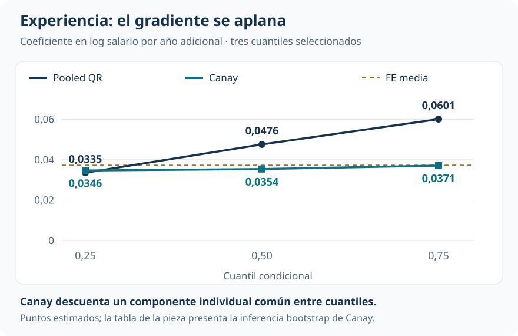
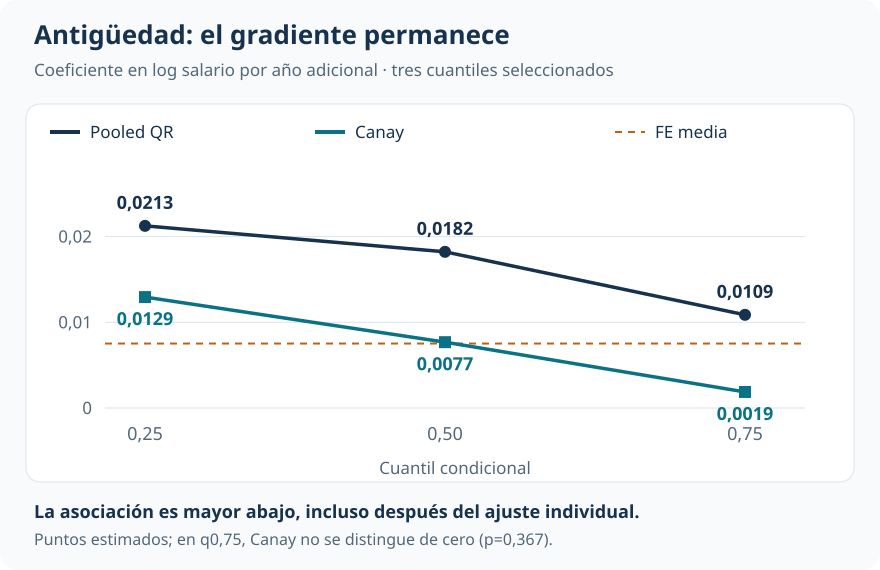
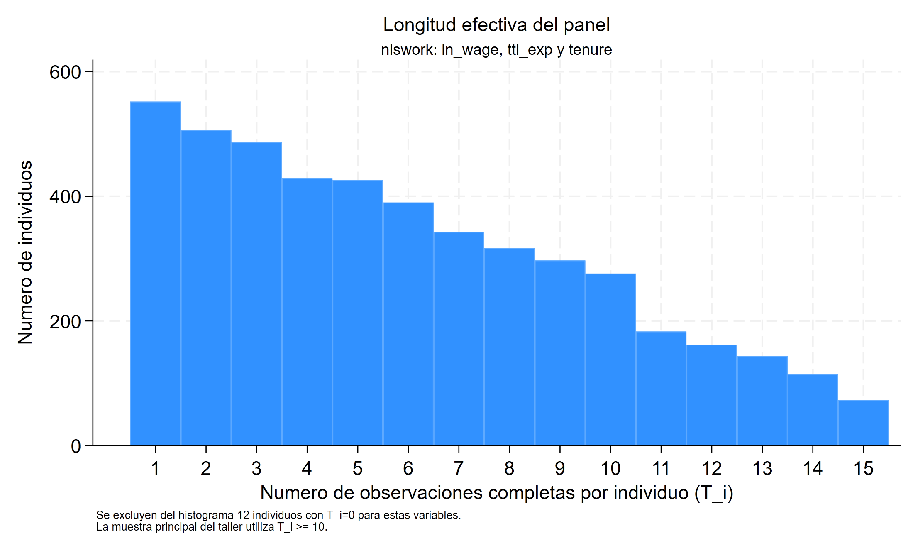

Cuantiles y efectos distributivos

::: {.hero-box}
::: {.hero-title}
Al separar un componente salarial persistente, el perfil de experiencia se aplana. El de antigüedad conserva una asociación mayor en los cuantiles bajos.
:::
::: {.hero-sub}
Observar repetidamente a las mismas mujeres permite estudiar si una aparente heterogeneidad distributiva depende de diferencias permanentes entre personas. La comparación entre QR pooled y Canay cambia la lectura de experiencia y antigüedad de maneras distintas.
:::
:::

:::: {.metric-grid}
::: {.metric-card}
::: {.metric-label}
Muestra principal
:::
::: {.metric-value}
952 mujeres
:::
::: {.metric-note}
11.280 observaciones completas; al menos diez por persona.
:::
:::
::: {.metric-card}
::: {.metric-label}
Experiencia con Canay
:::
::: {.metric-value}
0,035–0,037
:::
::: {.metric-note}
Coeficientes casi planos entre los cuantiles 0,25 y 0,75.
:::
:::
::: {.metric-card}
::: {.metric-label}
Antigüedad con Canay
:::
::: {.metric-value}
0,013 → 0,002
:::
::: {.metric-note}
El gradiente entre 0,25 y 0,75 permanece tras el ajuste.
:::
:::
::: {.metric-card}
::: {.metric-label}
Longitud máxima
:::
::: {.metric-value}
15 entrevistas
:::
::: {.metric-note}
La información temporal sigue siendo limitada para estimar efectos individuales.
:::
:::
::::

## Una diferencia distributiva puede mezclar diferencias personales

¿La experiencia está más asociada con salarios altos porque su relación salarial cambia entre cuantiles, o porque las mujeres con distintas trayectorias también tienen niveles salariales persistentemente diferentes? En una regresión cuantílica que agrupa todas las observaciones persona-año, ambas fuentes de variación quedan mezcladas.

La aplicación utiliza el panel **National Longitudinal Survey of Young Women**, con entrevistas entre 1968 y 1988. El resultado es el logaritmo del salario real; las variables centrales son experiencia laboral acumulada y antigüedad en el empleo actual. Todas las especificaciones incluyen efectos de año.

La base completa contiene 28.534 observaciones de 4.711 mujeres. El análisis principal retiene 952 con al menos diez observaciones completas, que aportan 11.280 registros. Pooled QR y Canay se comparan sobre esa misma muestra. La restricción busca disponer de más información para estimar el componente persistente, a costa de representar un grupo de mujeres con mayor permanencia observada.

## Qué hace Canay con la heterogeneidad individual

La QR pooled estima cuantiles condicionales sin un intercepto por mujer. Canay supone que cada mujer tiene un componente persistente $\alpha_i$ que desplaza por igual todos los cuantiles:

$$
Q_\tau(y_{it}\mid x_{it},\alpha_i)=\alpha_i+x_{it}'\beta(\tau).
$$

Las pendientes $\beta(\tau)$ pueden cambiar entre cuantiles. Lo restrictivo es que el efecto individual sea **común a todos ellos**. En dos pasos, se estima primero ese componente mediante efectos fijos de media y después se aplica QR al salario logarítmico una vez descontado el componente estimado.

Este procedimiento no equivale a restar medias individuales de todas las variables y ejecutar QR. La transformación que funciona para MCO no conserva, en general, la condición cuantílica del error. Tampoco agrupar los errores estándar por mujer convierte una QR pooled en un modelo con efectos individuales.

El benchmark lineal encuentra un componente individual importante: el 55,4% de la varianza del error compuesto corresponde a heterogeneidad persistente estimada. Eso motiva el ajuste, aunque no prueba la restricción común entre cuantiles.

## Experiencia: el gradiente pooled se aplana

En pooled QR, el coeficiente de experiencia aumenta de 0,0335 en el cuantil 0,25 a 0,0601 en el 0,75. Bajo Canay, los puntos quedan mucho más próximos: 0,0346, 0,0354 y 0,0371.

{#fig-panel-experiencia fig-alt="Experiencia en cuantiles 0,25, 0,50 y 0,75: pooled QR, 0,03352, 0,04756 y 0,06007; Canay, 0,03463, 0,03536 y 0,03706. Referencia FE de media, 0,03725." width="100%"}

En log salario, los coeficientes Canay equivalen aproximadamente a asociaciones del 3,5%–3,8% por año adicional de experiencia en los cuantiles condicionales seleccionados. La lectura dominante es la sensibilidad del perfil pooled al componente individual. La diferencia entre métodos no identifica una cantidad de “sesgo” ni demuestra que toda la heterogeneidad inicial fuera puramente personal.

## Antigüedad: el gradiente permanece

La antigüedad en el empleo actual sigue otra trayectoria. Canay reduce los coeficientes, pero mantiene una asociación mayor abajo: 0,0129 en el cuantil 0,25, 0,0077 en la mediana y 0,0019 en el 0,75.

{#fig-panel-antiguedad fig-alt="Antigüedad en cuantiles 0,25, 0,50 y 0,75: pooled QR, 0,02125, 0,01822 y 0,01087; Canay, 0,01294, 0,00768 y 0,00187. Referencia FE de media, 0,00752." width="100%"}

El contraste entre experiencia y antigüedad es el resultado principal: separar un nivel salarial individual persistente cambia la historia de forma selectiva. Para experiencia desaparece casi todo el gradiente; para antigüedad permanece una diferencia clara entre los cuantiles centrales.

## La inferencia debe incorporar los dos pasos

El efecto individual se estima antes de entrar en QR. Tratarlo como conocido omite incertidumbre. La inferencia de Canay remuestrea mujeres completas y repite ambas etapas en cada una de 199 réplicas.

::: {.table-box}
| Cuantil | Experiencia: coeficiente (EE) | Antigüedad: coeficiente (EE) |
|---|---:|---:|
| 0,25 | 0,03463 (0,00455) | 0,01294 (0,00190) |
| 0,50 | 0,03536 (0,00448) | 0,00768 (0,00174) |
| 0,75 | 0,03706 (0,00487) | 0,00187 (0,00208) |
:::

Coeficientes Canay en log salario por año adicional y errores estándar (EE) del bootstrap completo por mujer. El número de réplicas es docente; las cifras no deben interpretarse como inferencia definitiva de producción.

Para antigüedad en el cuantil 0,75, la segunda etapa aislada sugeriría p=0,022. Al incorporar ambas etapas y la dependencia longitudinal, el mismo punto tiene **p=0,367**. Cambia la incertidumbre reconocida, no el coeficiente.

El contraste adecuado de heterogeneidad usa además las covarianzas entre cuantiles. El Wald reportado no rechaza igualdad para experiencia (**p≈0,63**) y sí la rechaza para antigüedad (**p<0,001**). La conclusión no se basa en comparar una etiqueta de “significativo” con otra de “no significativo”.

## Qué exige la longitud del panel

Canay necesita estimar con suficiente precisión el componente de cada mujer. Elevar la longitud mínima puede ayudar, pero también cambia quién permanece en la muestra.

{fig-alt="Distribución del número de observaciones disponibles por mujer en el panel" width="100%"}

::: {.table-box}
| Mínimo de observaciones | Mujeres | Experiencia: q0,25 → q0,75 | Antigüedad: q0,25 → q0,75 |
|---|---:|---:|---:|
| 8 | 1.566 | 0,0336 → 0,0363 | 0,0151 → 0,0041 |
| 10 | 952 | 0,0346 → 0,0371 | 0,0129 → 0,0019 |
| 12 | 493 | 0,0353 → 0,0374 | 0,0115 → 0,0020 |
:::

La sensibilidad conserva los patrones cualitativos, pero solo compara puntos: no se repite la inferencia para cada umbral. Además, un máximo de 15 entrevistas no convierte la muestra en un panel largo. La estabilidad observada no resuelve la selección por permanencia ni valida el supuesto de localización común.

## Alcance y lectura que permanece

Los efectos individuales controlan heterogeneidad invariante. Experiencia y antigüedad todavía pueden relacionarse con shocks laborales, movilidad y decisiones no observadas que varían en el tiempo. Estas pendientes describen **asociaciones cuantílicas condicionales**, no retornos causales ni efectos sobre cuantiles de toda la población.

::: {.section-box}
### Lectura que domina

Bajo el supuesto de Canay, el perfil de experiencia resulta casi plano después de descontar un nivel salarial individual persistente. La antigüedad conserva una asociación mayor abajo y menor arriba. El panel ayuda a distinguir qué historia depende del tratamiento de la heterogeneidad personal, siempre con el límite de una longitud temporal moderada y una estructura individual restrictiva.
:::

## Continuar la comparación

[Ingresos más allá del promedio](t13_qr_qte.qmd) introduce la diferencia entre media y cuantiles. [Capacitación, selección y efectos distributivos](t14_qriv_qte_vi.qmd) muestra por qué la endogeneidad necesita una estrategia instrumental específica: controlar diferencias persistentes en panel y utilizar una oferta aleatoria resuelven problemas distintos.

::: {.small-note}
**Fuente:** informe curado «Taller 15: Regresión por cuantiles con datos de panel», aplicación NLS Young Women y estimador de Canay. Figuras elaboradas con los tres cuantiles centrales reportados; la inferencia bootstrap y la sensibilidad se presentan por separado.
:::
