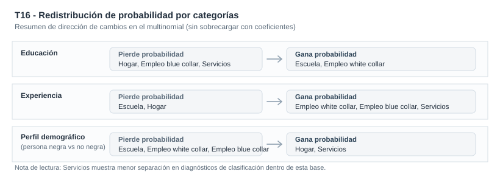

::: {.hero-box}
::: {.hero-title}
¿Cómo se redistribuyen las probabilidades entre estudio, hogar y distintos tipos de empleo según educación, experiencia y perfil demográfico?
:::

::: {.hero-sub}
El análisis sigue trayectorias de actividad en el panel laboral `keane` y usa un logit multinomial, tratado como pooled con `cluster(id)`, para traducir una variable multiclase en probabilidades comparables y útiles para lectura profesional.
:::
:::

:::: {.metric-grid}

::: {.metric-card}
::: {.metric-label}
Modelo operativo
:::

::: {.metric-value}
Logit multinomial pooled con `cluster(id)`
:::

::: {.metric-note}
Panel no balanceado tratado como pooled para priorizar interpretación aplicada en probabilidades
:::
:::

::: {.metric-card}
::: {.metric-label}
Contexto aplicado
:::

::: {.metric-value}
Trayectorias de actividad en panel laboral
:::

::: {.metric-note}
`N=12,665`, `1,881` personas, `1981-1987`, cinco categorias nominales de actividad
:::
:::

::: {.metric-card}
::: {.metric-label}
Senales sustantivas
:::

::: {.metric-value}
Educacion y experiencia reubican probabilidades
:::

::: {.metric-note}
Mas educación mueve masa hacia escuela y white collar; más experiencia desplaza desde escuela/hogar hacia empleo
:::
:::

::: {.metric-card}
::: {.metric-label}
Limite principal
:::

::: {.metric-value}
Menor discriminacion en `services`
:::

::: {.metric-note}
La categoria `services` se separa peor que escuela o blue collar bajo esta especificación
:::
:::

::::

## Resumen

Este análisis examina como se distribuyen estados de actividad (`choice`) en un panel laboral corto, con categorias nominales mutuamente excluyentes: escuela, hogar, white collar, blue collar y services. El foco no es metodologico en abstracto, sino sustantivo: leer como cambian probabilidades entre alternativas frente a educación, experiencia y perfil demográfico.

La econometría se usa para ordenar una pregunta aplicada. El panel se trata como pooled con inferencia robusta `cluster(id)`, y la lectura principal se apoya en APEs y probabilidades predichas por categoria.

:::: {.quick-grid}

::: {.section-box}
## Pregunta

¿Cómo se redistribuyen las probabilidades entre estudio, hogar y distintos tipos de empleo según educación, experiencia y perfil demográfico?

::: {.small-note}
Resultado: `choice` con cinco categorías de actividad: Escuela, Hogar, Empleo white collar, Empleo blue collar y Servicios. Variables clave: `educ`, `exper`, `expersq`, `black`, dummies anuales.
:::
:::

::: {.section-box}
## Idea central

El valor profesional del análisis es transformar una variable multiclase en una lectura comparativa de probabilidades entre alternativas de actividad, explícita en sus alcances y limites de discriminacion.

Portfolio econométrico
:::

::::

## Por qué este problema importa

En decisiones de actividad laboral no alcanza con preguntar si una persona trabaja o no. En la práctica, compiten varias alternativas: estudiar, permanecer en el hogar o insertarse en distintos segmentos ocupacionales. Si se simplifica forzando una variable binaria, se pierde parte central de la pregunta empírica.

Para un lector profesional, lo relevante es entender que variables desplazan probabilidades entre alternativas y donde el modelo separa mejor o peor perfiles observables.

## Datos y variables

Se usa `keane.dta` con estructura de panel corto.

- Unidad de observacion: persona-anio (`id`, `year`)
- Cobertura temporal: `1981-1987`
- Muestra operativa: `N=12,665`, `1,881` personas (panel no balanceado)
- Resultado principal: `choice` con cinco categorias nominales
- Variables clave: `educ`, `exper`, `expersq`, `i.black`, `y82-y87`
- Nota de diseño: `wage/lwage` no se incluye como regresor porque no está definido de forma comparable en todas las alternativas de `choice`

## Estrategia empírica

La secuencia mantiene foco aplicado:

1. Estimar `mlogit choice educ exper expersq i.black y82-y87, baseoutcome(1) vce(cluster id)`.
2. Traducir resultados a probabilidades con efectos marginales promedio (APE), evitando lectura mecanica de coeficientes.
3. Complementar con probabilidades predichas y clasificacion por maxima probabilidad como referencia descriptiva.
4. Reportar un chequeo secundario con `status` (escuela/hogar/trabajo) para verificar estabilidad general de la historia sustantiva.

En todo el análisis, el panel se trata como pooled con `cluster(id)`: este análisis no busca modelar heterogeneidad no observada con una estructura multinomial de panel, sino ofrecer una lectura clara y útil de reasignacion de probabilidades.

## Resultados principales

La lectura comparativa del caso deja los mensajes sustantivos del modelo principal sobre `choice` (cinco categorias nominales):

1. **Educacion:** aumenta la probabilidad de `escuela` y `white collar`, y reduce `hogar`, `blue collar` y `services`.
2. **Experiencia:** reduce `escuela` y `hogar`, y desplaza probabilidad hacia `white collar`, `blue collar` y `services`.
3. **Perfil demográfico (`black`):** reduce `escuela`, `white collar` y `blue collar`, y aumenta `hogar` y `services`.

::: {.table-box}
## Sintesis comparativa de magnitudes (APE)

| Variable | Escuela | Hogar | Empleo white collar | Empleo blue collar | Servicios | Lectura sustantiva |
|---|---:|---:|---:|---:|---:|---|
| `educ` | +0.0408 (0.0017) | -0.0562 (0.0020) | +0.0551 (0.0028) | -0.0364 (0.0028) | -0.0034 (0.0016) | Más educación desplaza probabilidad desde `hogar` hacia `escuela` y `white collar` |
| `exper` | -0.1503 (0.0061) | -0.0798 (0.0060) | +0.0802 (0.0054) | +0.1277 (0.0059) | +0.0222 (0.0039) | Más experiencia reubica desde `escuela/hogar` hacia categorías de empleo |
| Perfil demográfico (categoría reportada vs base) | -0.0628 (0.0078) | +0.0994 (0.0097) | -0.0349 (0.0099) | -0.0459 (0.0124) | +0.0442 (0.0085) | Cambios de composición: mayor peso relativo en `hogar` y `services` |
:::

La tabla protagonista resume APEs de `choice` por categoria; `status` se usa solo como contraste secundario.

El esquema siguiente sintetiza como educacion, experiencia y perfil demografico reubican probabilidad entre categorias, sin recargar la lectura con una matriz numerica extensa.

## Diagnosticos de respaldo

Estos diagnósticos se reportan solo como respaldo de lectura aplicada. El PCP se reporta solo como diagnóstico auxiliar in-sample y no como núcleo del análisis.

- **Chequeo con `choice` (5 categorías):** clasificación in-sample `53.8%`, coherente con mayor dificultad de separación fina.
- **Simplificación secundaria con `status` (3 categorías):** clasificación in-sample `69.0%`, útil como contraste descriptivo y no como evidencia de predicción fuera de muestra.
- **Menor discriminación en `services` (solo en `choice`):** sugiere solapamiento con otras alternativas cuando se desagrega más.

## Lectura profesional

El aporte de T16 no es presentar un multinomial por sí mismo. El aporte es traducir una decisión multiclase del mercado laboral a probabilidades comparables entre alternativas, manteniendo una narrativa sustantiva útil para un lector externo.

Tambien deja una práctica profesional importante: explicitar limites. Con panel tratado como pooled y `cluster(id)`, el análisis ofrece una lectura clara de reasignacion de probabilidades, pero reconoce con honestidad donde la discriminacion entre categorias es más debil.

## Cierre

Este análisis convierte un problema de elección nominal en una lectura aplicada de trayectorias de actividad: que variables empujan hacia estudio, hogar o distintos tipos de empleo, y con que intensidad promedio.

El valor del caso queda en una traduccion rigurosa y útil para lectura profesional: panel pooled con `cluster(id)`, probabilidades interpretables y limites de discriminacion explicitados con prudencia.

