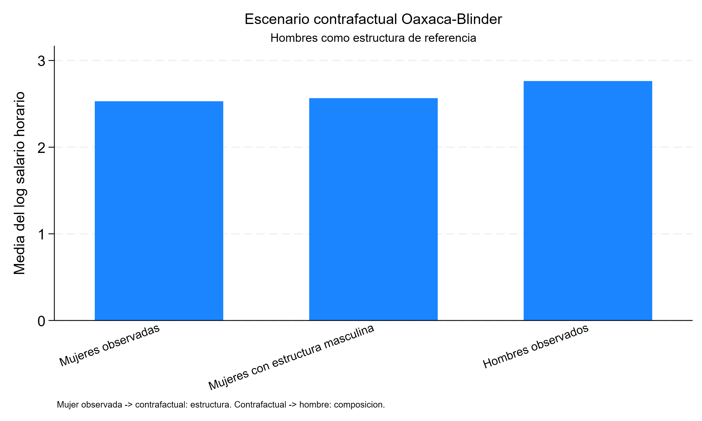
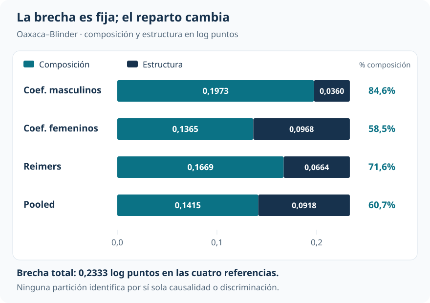
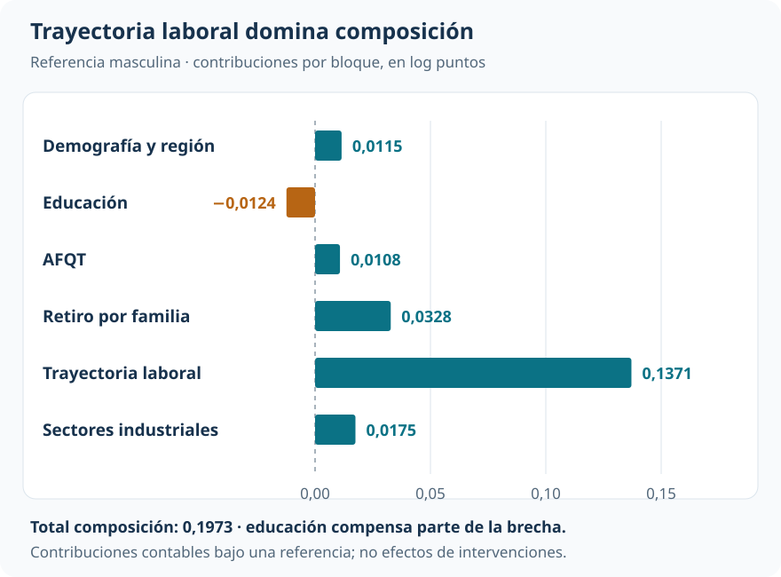

[Econometría](../index.qmd) / [Cuantiles, distribuciones y descomposiciones](../index.qmd#cuantiles)

Brechas y distribuciones contrafactuales

::: {.hero-box}
::: {.hero-title}
Las trayectorias laborales tienen un peso importante en la brecha salarial media. La proporción atribuida a características depende de cómo se construye el contrafactual.
:::
::: {.hero-sub}
Oaxaca–Blinder combina las características de un grupo con la ecuación salarial de otro. Esa comparación permite organizar la brecha entre composición y estructura, y mostrar cuánto cambia el reparto cuando cambia la referencia.
:::
:::

:::: {.metric-grid}
::: {.metric-card}
::: {.metric-label}
Muestra NLSY79, año 2000
:::
::: {.metric-value}
5.309
:::
::: {.metric-note}
2.655 hombres y 2.654 mujeres con información industrial válida.
:::
:::
::: {.metric-card}
::: {.metric-label}
Brecha media observada
:::
::: {.metric-value}
0,2333
:::
::: {.metric-note}
Log puntos; hombres menos mujeres.
:::
:::
::: {.metric-card}
::: {.metric-label}
Composición según referencia
:::
::: {.metric-value}
58,5%–84,6%
:::
::: {.metric-note}
Participación contable en la misma brecha total.
:::
:::
::: {.metric-card}
::: {.metric-label}
Trayectoria laboral
:::
::: {.metric-value}
0,1371
:::
::: {.metric-note}
Log puntos de composición bajo la estructura masculina.
:::
:::
::::

## De documentar una brecha a organizarla

¿Cuánto de la diferencia salarial media se asocia con características distintas y cuánto con relaciones salariales distintas para esas características? Una resta de medias no permite distinguir esas dos dimensiones. Oaxaca–Blinder las organiza alrededor de una predicción contrafactual explícita.

La aplicación utiliza un extracto de la **National Longitudinal Survey of Youth 1979 (NLSY79)** correspondiente a 2000. El resultado es el logaritmo del salario horario. Tras excluir 89 registros sin código industrial válido, quedan 5.309 personas. Las covariables se agrupan en demografía y región, educación, puntaje AFQT, retiro laboral por razones familiares, trayectoria laboral y sector industrial.

La media del log salario es 2,7626 entre hombres y 2,5293 entre mujeres. La brecha de **0,2333 log puntos** es precisa: EE=0,0146. Exponenciarla equivale a una diferencia de aproximadamente 26,3% entre medias geométricas; no es la diferencia porcentual entre salarios medios aritméticos. Mantener log puntos conserva la aditividad de la descomposición.

## Construir el promedio contrafactual

Se estima una ecuación salarial lineal para cada grupo. Como ambas contienen una constante, sus predicciones medias reproducen las medias observadas. Con la estructura masculina como referencia, el contrafactual evalúa sus coeficientes en las características medias femeninas:

$$
\widehat\mu^C=\bar X_f'\widehat\beta_m=2,5652.
$$

La brecha se recorre en dos movimientos. Desde la media femenina, cambiar la ecuación salarial manteniendo su composición lleva al contrafactual; después, cambiar la composición manteniendo la ecuación masculina lleva a la media masculina.

{fig-alt="Recorrido entre la media salarial femenina observada, el promedio contrafactual y la media masculina observada" width="100%"}

::: {.table-box}
| Estado | Media del log salario | Qué se mantiene o cambia |
|---|---:|---|
| Mujeres observadas | 2,5293 | Composición y estructura femeninas |
| Contrafactual | 2,5652 | Composición femenina y estructura masculina |
| Hombres observados | 2,7626 | Composición y estructura masculinas |
:::

El primer movimiento asigna **0,0360** a estructura; el segundo, **0,1973** a composición. Es una identidad contable una vez elegidas las ecuaciones y la referencia. No demuestra qué ocurriría al intervenir realmente sobre educación, experiencia o participación laboral.

## La referencia cambia el reparto

Con los coeficientes masculinos, composición representa el 84,6% de la brecha. Con coeficientes femeninos, cae al 58,5%. Las referencias Reimers y pooled producen valores intermedios. La diferencia total permanece fija.

{#fig-ob-referencia fig-alt="Composición y estructura: referencia masculina, 0,1973 y 0,0360; femenina, 0,1365 y 0,0968; Reimers, 0,1669 y 0,0664; pooled, 0,1415 y 0,0918." width="100%"}

También cambia la inferencia del componente de estructura. Con referencia masculina, p=0,053; con la femenina y Reimers, p<0,001. Por eso ni el porcentaje ni la significatividad de la parte denominada “no explicada” son propiedades únicas de la brecha observada.

La conclusión estable es más acotada: **composición es mayoritaria en las cuatro referencias consideradas**. El porcentaje concreto debe acompañarse siempre del contrafactual que lo define.

## Qué características tienen mayor peso

Dentro de la referencia masculina, trayectoria laboral aporta 0,1371 log puntos, aproximadamente el 69,5% de composición. El bloque combina experiencia, servicio militar y participación a tiempo parcial: no puede reducirse a “años de experiencia”.

{#fig-ob-bloques fig-alt="Contribuciones de composición en log puntos: demografía y región 0,0115; educación menos 0,0124; AFQT 0,0108; retiro familiar 0,0328; trayectoria laboral 0,1371; sectores industriales 0,0175." width="100%"}

El retiro laboral por razones familiares aporta 0,0328 y la distribución industrial 0,0175. La composición educativa opera en dirección contraria, con −0,0124. La descomposición resulta útil precisamente porque no obliga a que todos los factores amplíen la brecha.

Del lado de estructura, el agregado pequeño esconde compensaciones: la constante aporta 0,1277, mientras demografía y región e industria aportan −0,0979 y −0,0920. Un total moderado no implica ecuaciones salariales casi idénticas. Además, cambiar la categoría industrial omitida redistribuye el detalle entre industria y constante sin alterar los componentes agregados.

## Qué significa “explicado” en esta contabilidad

Composición recoge diferencias en las características incluidas, valoradas con una estructura fija. Esas características pueden reflejar decisiones, restricciones y trayectorias que también están relacionadas con los salarios. Una contribución de composición no identifica el efecto causal de modificar esa característica.

Estructura recoge diferencias entre las ecuaciones estimadas. Puede absorber relaciones salariales distintas, variables omitidas, selección, errores de medición y forma funcional. **No equivale automáticamente a discriminación.** Tampoco una gran fracción de composición descarta que existan procesos discriminatorios detrás de las propias trayectorias observadas.

Una interpretación más fuerte del contrafactual exigiría soporte común, supuestos defendibles sobre los inobservables e invariancia de la estructura salarial ante el cambio de composición. El modelo lineal puede predecir fuera del soporte, pero esa posibilidad algebraica no elimina la extrapolación; esta aplicación no establece un diagnóstico formal de soporte.

::: {.section-box}
### Lectura que domina

En esta muestra, las diferencias observadas de trayectoria laboral tienen un peso cuantitativo importante en la contabilidad de la brecha. La división exacta entre composición y estructura depende de la referencia. La lectura profesional reúne la brecha, el contrafactual y su sensibilidad, en lugar de presentar un porcentaje único como explicación causal.
:::

## De una media a una distribución

La aditividad de Oaxaca–Blinder descansa en la media de un modelo lineal. [Salarios: apertura arriba, compresión abajo](t17_dfl.qmd) cambia el objeto: construye una distribución contrafactual completa para estudiar cuantiles y desigualdad. [La descomposición RIF](t19_descomposicion_rif.qmd) recupera después una apertura por bloques, con un costo de aproximación que debe hacerse explícito.

::: {.small-note}
**Fuente:** informe curado «Taller 16: Descomposición Oaxaca–Blinder», aplicación NLSY79 utilizada en la replicación de Fortin, Lemieux y Firpo. Figuras elaboradas con las contribuciones y referencias reportadas. La inferencia citada corresponde a la descomposición del informe.
:::
