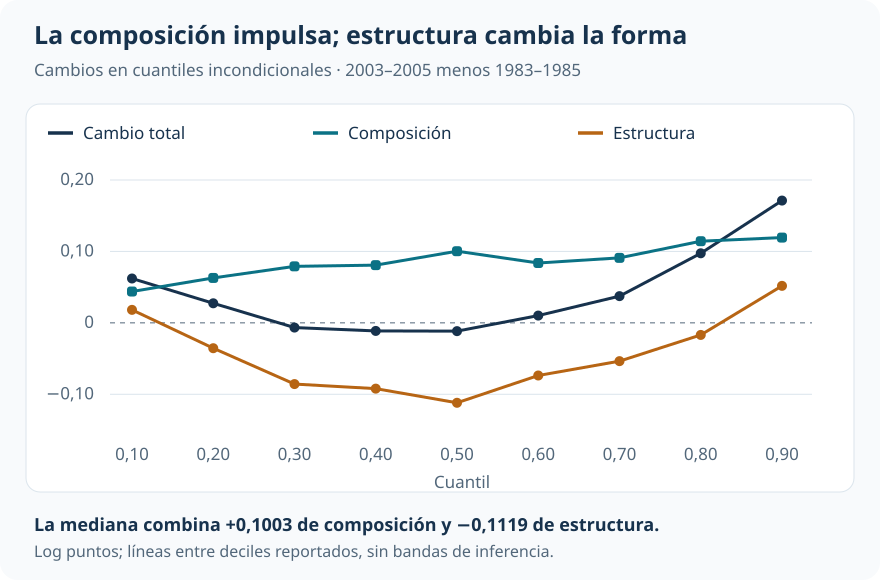
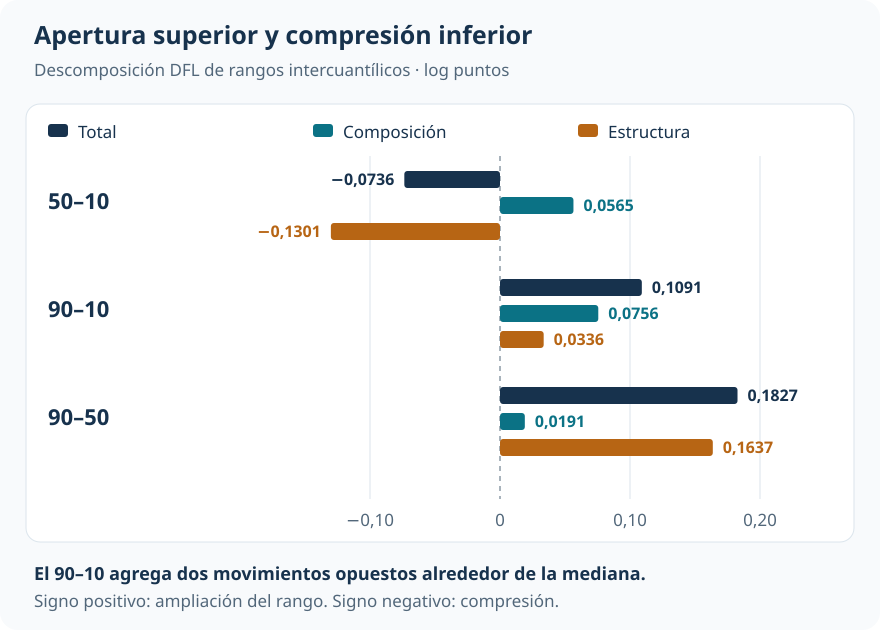

[Econometría](../index.qmd) / [Cuantiles, distribuciones y descomposiciones](../index.qmd#cuantiles)

Brechas y distribuciones contrafactuales

::: {.hero-box}
::: {.hero-title}
El salario medio aumenta, pero la mediana retrocede ligeramente. La distribución se abre por arriba y se comprime por abajo.
:::
::: {.hero-sub}
La reponderación DiNardo–Fortin–Lemieux (DFL) construye una distribución con la composición reciente de trabajadores y la estructura salarial inicial. Ese contrafactual permite distinguir qué parte de la transformación acompaña al cambio de características y qué parte queda en estructura.
:::
:::

:::: {.metric-grid}
::: {.metric-card}
::: {.metric-label}
CPS ORG masculina
:::
::: {.metric-value}
403.477
:::
::: {.metric-note}
Observaciones de 1983–1985 y 2003–2005, con pesos de encuesta.
:::
:::
::: {.metric-card}
::: {.metric-label}
Cambio de la media
:::
::: {.metric-value}
+0,053
:::
::: {.metric-note}
Media del log salario horario; la mediana cambia −0,012.
:::
:::
::: {.metric-card}
::: {.metric-label}
Apertura 90–50
:::
::: {.metric-value}
+0,183
:::
::: {.metric-note}
Log puntos; el componente de estructura aporta aproximadamente 0,164.
:::
:::
::: {.metric-card}
::: {.metric-label}
Compresión 50–10
:::
::: {.metric-value}
−0,074
:::
::: {.metric-note}
Log puntos; estructura más que compensa el impulso de composición.
:::
:::
::::

## La media no localiza el cambio

¿La distribución salarial cambió porque cambió la composición de los trabajadores, porque cambió la relación entre características y salarios, o por ambas razones? La comparación de medias deja sin responder dónde ocurrió el movimiento. En esta aplicación, esa ubicación cambia sustancialmente la historia.

Las muestras masculinas de la **Current Population Survey, Outgoing Rotation Groups (CPS ORG)** contienen 232.784 observaciones de 1983–1985 y 170.693 de 2003–2005. Se estudia el logaritmo del salario horario utilizando los pesos muestrales originales. La composición modelada incluye cobertura sindical, categorías educativas, categorías de experiencia e interacciones entre ellas.

La media aumenta 0,0532 log puntos. El cuantil 0,10 sube 0,0621; la mediana cae 0,0116; el cuantil 0,90 aumenta 0,1712. El promedio reúne movimientos que no corresponden a un desplazamiento paralelo de toda la distribución.

## Una distribución con composición nueva y estructura inicial

DFL conserva los salarios observados en 1983–1985 y cambia el peso de sus observaciones para representar la composición de 2003–2005. No necesita generar un salario nuevo para cada persona.

Llamemos $A$ al período inicial, $B$ al reciente y $C$ al contrafactual:

$$
F_C(y)=\int F_A(y\mid X=x)\,dF_B(x).
$$

La distribución salarial condicional se mantiene en $A$; la distribución de características se sustituye por la de $B$. El cociente de densidades de características se estima mediante un modelo de pertenencia al período. El peso contrafactual multiplica ese cociente por el peso CPS original.

Para cualquier estadístico $v$ calculado sobre esas distribuciones:

$$
\underbrace{v(F_B)-v(F_A)}_{\text{cambio total}}
=\underbrace{v(F_C)-v(F_A)}_{\text{composición}}
+\underbrace{v(F_B)-v(F_C)}_{\text{estructura}}.
$$

La misma distribución contrafactual sirve para la media, la mediana y los rangos intercuantílicos. Estos son estadísticos **incondicionales**; no son coeficientes de una QR condicional ni efectos para un grupo fijo de personas situado en cierto percentil.

## La composición eleva los cuantiles; estructura cambia la forma

El componente de composición es positivo en todos los deciles analizados. Bajo la estructura inicial, la composición reciente habría elevado tanto la parte baja como la mediana y la parte alta. El cambio de estructura tiene otra forma: es negativo en buena parte del centro y positivo en los extremos de la grilla.

{#fig-dfl-cuantiles fig-alt="Descomposición DFL en deciles: composición siempre positiva; estructura negativa entre los cuantiles 0,20 y 0,80, con mínimo de menos 0,1119 en la mediana; cambio total de 0,0621 abajo, menos 0,0116 en la mediana y 0,1712 arriba." width="100%"}

::: {.table-box}
| Cuantil | Inicial | Contrafactual | Reciente | Composición | Estructura |
|---|---:|---:|---:|---:|---:|
| 0,10 | 0,9910 | 1,0348 | 1,0530 | +0,0439 | +0,0182 |
| 0,50 | 1,7890 | 1,8893 | 1,7774 | +0,1003 | −0,1119 |
| 0,90 | 2,4482 | 2,5676 | 2,6194 | +0,1194 | +0,0518 |
:::

La mediana muestra el mecanismo con claridad. La composición la habría llevado de 1,7890 a 1,8893, pero la mediana reciente es 1,7774. El componente de estructura más que revierte el desplazamiento composicional. En el cuantil 0,90, ambas piezas trabajan en la misma dirección.

## La desigualdad cambia de manera distinta en cada mitad

El rango 90–10 aumenta 0,1091 log puntos: 0,0756 corresponden a composición y 0,0336 a estructura. Sin embargo, ese agregado combina una fuerte apertura superior con compresión inferior.

{#fig-dfl-rangos fig-alt="Cambios total, composición y estructura: 50–10, menos 0,0736, más 0,0565 y menos 0,1301; 90–10, más 0,1091, más 0,0756 y más 0,0336; 90–50, más 0,1827, más 0,0191 y más 0,1637." width="100%"}

La composición habría ampliado el 50–10 en 0,0565. La compresión estructural de −0,1301 domina y deja un cambio observado negativo. En la mitad superior, estructura aporta 0,1637 a una apertura total de 0,1827. Decir únicamente que “composición explica más del aumento de desigualdad” omitiría dónde y cómo se transforma la distribución.

## Soporte y pesos sostienen la comparación

El contrafactual necesita representar la composición reciente con observaciones disponibles en el período inicial. Los diagnósticos reportados son favorables: ambos períodos comparten un rango de probabilidades estimadas cercano a [0,100; 0,766], el cociente DFL tiene máximo 3,39 y su media ponderada es 1,0003. No se aplica recorte de soporte en la estimación principal.

La diferencia absoluta media en 14 covariables de primer orden cae de 0,0410 a 0,00015 después de reponderar. El tamaño efectivo asociado a la concentración de los pesos combinados es aproximadamente 137 mil. Es evidencia favorable sobre la construcción; no prueba soporte multidimensional perfecto ni incorpora por sí sola toda la complejidad del diseño de encuesta. El balance reportado tampoco abarca exhaustivamente todas las interacciones.

Mantener la estructura de 1983–1985 es una decisión sustantiva. El contrafactual inverso respondería otra pregunta y podría cambiar el reparto. Además, estructura puede absorber cambios en retornos, instituciones e inobservables condicionales: no identifica una fuerza económica única. La comparación mantiene fija una estructura salarial, sin modelar ajustes de equilibrio general.

## Precisión y alcance

El bootstrap reestima el modelo de pertenencia, reconstruye pesos y contrafactual y vuelve a calcular los estadísticos. Esa secuencia reconoce que los pesos son estimados. Sus **49 réplicas** tienen finalidad docente. Aunque los errores estándar reportados sean pequeños respecto de los cambios centrales, no deben comunicarse como precisión definitiva.

::: {.section-box}
### Lectura que domina

La composición reciente habría elevado los cuantiles bajo la estructura inicial. El cambio de estructura neutraliza ese impulso en el centro y es decisivo para la apertura superior y la compresión inferior. DFL permite sostener esas dos lecturas sobre una misma distribución contrafactual, con diagnósticos explícitos de la reponderación y sin convertir sus componentes en causas identificadas.
:::

## Del cambio agregado al aporte de cada covariable

[Oaxaca–Blinder](t16_oaxaca_blinder.qmd) organiza una diferencia de medias. DFL amplía el alcance a la distribución completa, pero no entrega automáticamente un desglose aditivo por covariable. [UQR y regresiones RIF](t18_uqr_rif.qmd) introduce la herramienta que permite esa apertura; [la descomposición RIF](t19_descomposicion_rif.qmd) la aplica a estas mismas muestras y períodos.

::: {.small-note}
**Fuente:** informe curado «Taller 17: Reponderación DFL y distribuciones contrafactuales», replicación Fortin–Lemieux–Firpo. Figuras elaboradas con los deciles y rangos reportados, en log puntos. Las pequeñas diferencias entre sumas visibles corresponden al redondeo.
:::
