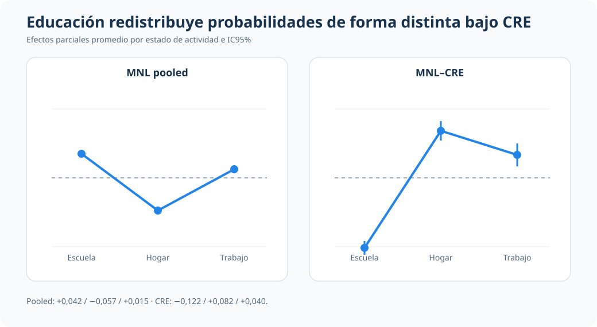

::: {.hero-box}
::: {.hero-title}
En un panel laboral corto, ¿cómo cambia la interpretación de escuela, hogar y trabajo cuando se pasa de multinomial pooled a multinomial-CRE?
:::

::: {.hero-sub}
El análisis compara pooled vs CRE (Mundlak) para ordenar mejor la lectura aplicada y la elección de especificación: el foco está en probabilidades comparables (APE), no en coeficientes latentes.
:::
:::

:::: {.metric-grid}

::: {.metric-card}
::: {.metric-label}
Modelo operativo
:::

::: {.metric-value}
Multinomial-CRE con `cluster(id)`
:::

::: {.metric-note}
Comparado contra multinomial pooled para auditar la sensibilidad de la lectura aplicada
:::
:::

::: {.metric-card}
::: {.metric-label}
Contexto aplicado
:::

::: {.metric-value}
Estados de actividad en panel laboral
:::

::: {.metric-note}
`N=12,665`, `1,881` personas, `1981-1987`, panel no balanceado
:::
:::

::: {.metric-card}
::: {.metric-label}
Hallazgo central
:::

::: {.metric-value}
APEs cambian de forma material
:::

::: {.metric-note}
La lectura pooled mezcla diferencias persistentes entre personas con variación temporal
:::
:::

::: {.metric-card}
::: {.metric-label}
Respaldo formal
:::

::: {.metric-value}
Mundlak conjunto significativo
:::

::: {.metric-note}
`chi2(6)=1636.61`, `p=0.0000` para medias temporales
:::
:::

::::

## Resumen

Este análisis estudia un resultado multinomial de actividad (`status`: escuela, hogar, trabajo) en un panel laboral corto. La pregunta aplicada no es metodológica en abstracto: es si la lectura de probabilidades cambia de forma relevante cuando se reconoce heterogeneidad persistente no observada.

La comparación entre multinomial pooled y multinomial-CRE (Mundlak) muestra diferencias importantes en APEs por categoría. Por eso, el aporte del caso se concentra en criterio de especificación e interpretación profesional de probabilidades, sin exagerar el alcance metodológico.

:::: {.quick-grid}

::: {.section-box}
## Pregunta

En este panel laboral, ¿la asociación entre educación, experiencia y estado de actividad cambia de forma relevante al pasar de multinomial pooled a multinomial-CRE?

::: {.small-note}
Resultado: `status` con tres categorías de actividad: Escuela, Hogar y Trabajo. Variables clave: `educ`, `exper`, `expersq`, `black`, dummies anuales, y medias temporales en CRE.
:::
:::

::: {.section-box}
## Idea central

El valor del análisis está en mostrar cómo cambia la lectura aplicada cuando se controla heterogeneidad persistente correlacionada con regresores en un multinomial de panel.

Portfolio econométrico
:::

::::

## Por qué este problema importa

En decisiones de actividad individual, escuela, hogar y trabajo son alternativas mutuamente excluyentes. Una lectura pooled puede ser útil como punto de partida, pero puede mezclar diferencias estructurales entre personas con cambios dentro de persona a lo largo del tiempo.

Para una lectura profesional, importa saber si ese cruce altera la interpretación de probabilidades. Si la altera, la decisión de especificación deja de ser un detalle técnico y pasa a ser parte del mensaje aplicado.

## Datos y variables

Se usa `keane.dta` en formato panel.

- Unidad de observación: persona-año (`id`, `year`)
- Período: `1981-1987`
- Muestra operativa: `N=12,665`, `1,881` personas, panel no balanceado
- Resultado: `status` con tres categorías de actividad: Escuela, Hogar y Trabajo
- Regresores clave: `educ`, `exper`, `expersq`, `i.black`, `y82-y87`
- En CRE (Mundlak): `educ_bar`, `exper_bar`, `expersq_bar`
- Nota de muestra: la base original contiene `12,723` observaciones; la estimación operativa usa `12,665` con `status` observado

## Estrategia empírica

La secuencia se diseña para mantener foco aplicado:

1. Estimar multinomial pooled con errores `cluster(id)` como referencia inicial.
2. Estimar multinomial-CRE agregando medias temporales por individuo.
3. Comparar APEs por categoría entre pooled y CRE, priorizando magnitudes interpretables.
4. Usar test conjunto de medias temporales tipo Mundlak como respaldo sobre relevancia de heterogeneidad correlacionada.

## Qué evita una lectura automática

Para mantener una lectura profesional, conviene separar planos:

1. **Plano sustantivo:** cómo se redistribuyen probabilidades entre escuela, hogar y trabajo.
2. **Plano de especificación:** cuánto cambia esa lectura cuando se incorpora heterogeneidad persistente.
3. **Plano de diagnóstico:** si las medias temporales tipo Mundlak respaldan que esa heterogeneidad correlacionada es relevante.

Esa separación evita convertir un resultado técnico aislado en una conclusión general del caso.

## Resultados principales

La comparación pooled vs CRE cambia la lectura aplicada en puntos importantes:

1. **Educación (`educ`):** en pooled aumenta la probabilidad de escuela (`+0.0418`) y reduce hogar (`-0.0570`); en CRE esa lectura se revierte para escuela (`-0.1220`) y hogar (`+0.0823`), con aumento de trabajo (`+0.0397`).
2. **Experiencia (`exper`):** en pooled empuja con fuerza hacia trabajo (`+0.2249`), pero en CRE aparece reducción en trabajo (`-0.0482`) y aumento en hogar (`+0.0817`), con cambio de magnitud en escuela.
3. **Perfil demográfico (`black`):** mantiene un patrón de mayor probabilidad relativa de hogar y menor de escuela/trabajo, pero con menor magnitud en CRE.

::: {.table-box}
## Síntesis comparativa de magnitudes (APE)

| Variable | Escuela pooled | Escuela CRE | Hogar pooled | Hogar CRE | Trabajo pooled | Trabajo CRE | Lectura aplicada |
|---|---:|---:|---:|---:|---:|---:|---|
| `educ` | +0.0418 (0.0017) | -0.1220 (0.0055) | -0.0570 (0.0020) | +0.0823 (0.0076) | +0.0152 (0.0020) | +0.0397 (0.0090) | Cambia signo en escuela y hogar al incorporar heterogeneidad persistente |
| `exper` | -0.1493 (0.0062) | -0.0335 (0.0069) | -0.0756 (0.0060) | +0.0817 (0.0095) | +0.2249 (0.0050) | -0.0482 (0.0101) | La lectura pooled sobre trabajo no se sostiene en CRE |
:::

El comparador visual concentra la variable protagonista: para educación, la lectura de Escuela y Hogar invierte su signo al pasar de pooled a CRE, mientras Trabajo conserva un APE positivo y algo mayor.

Estas diferencias no implican una lectura concluyente, pero sí muestran sensibilidad sustantiva de interpretación cuando se corrige la especificación para heterogeneidad persistente.  
`expersq` y `black` se mantienen como evidencia complementaria en el respaldo técnico, sin desplazar las variables protagonistas.

## Diagnósticos de respaldo

El respaldo formal y técnico se mantiene acotado y funcional a la narrativa aplicada:

- **Test Mundlak conjunto:** `chi2(6)=1636.61`, `p=0.0000` para `educ_bar`, `exper_bar`, `expersq_bar`.
- **Implicancia:** la heterogeneidad persistente correlacionada es empíricamente relevante en este caso.

::: {.table-box}
### Resumen de diagnósticos

| Diagnóstico | Evidencia | Lectura profesional |
|---|---:|---|
| Test conjunto Mundlak | chi2(6)=1636.61, p=0.0000 | La heterogeneidad persistente correlacionada es relevante en esta aplicación |
| Comparación APE pooled vs CRE | Cambios de magnitud y signo en educ y exper | La especificación afecta la interpretación aplicada de probabilidades |
:::

## Lectura profesional

Este caso aporta una práctica profesional concreta: antes de cerrar una historia sustantiva en multinomial de panel, conviene auditar cuánto depende esa historia del supuesto pooled sobre heterogeneidad no observada.

En este caso, la comparación pooled vs CRE cambia varias magnitudes y algunos signos en APEs. Por eso, para esta muestra, la lectura principal se ancla en CRE; no por superioridad abstracta del método, sino por consistencia entre pregunta aplicada, estructura de panel y evidencia de Mundlak.

## Cierre

El análisis muestra cómo una decisión de especificación puede cambiar la interpretación aplicada de estados de actividad en panel. Ese es el valor del caso: econometría al servicio de una lectura más creíble y transparente, con foco en probabilidades comparables y con límites explicitados.
