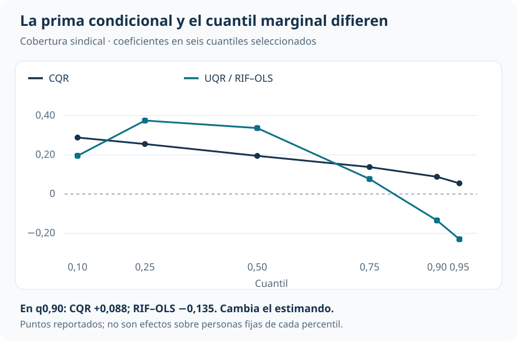
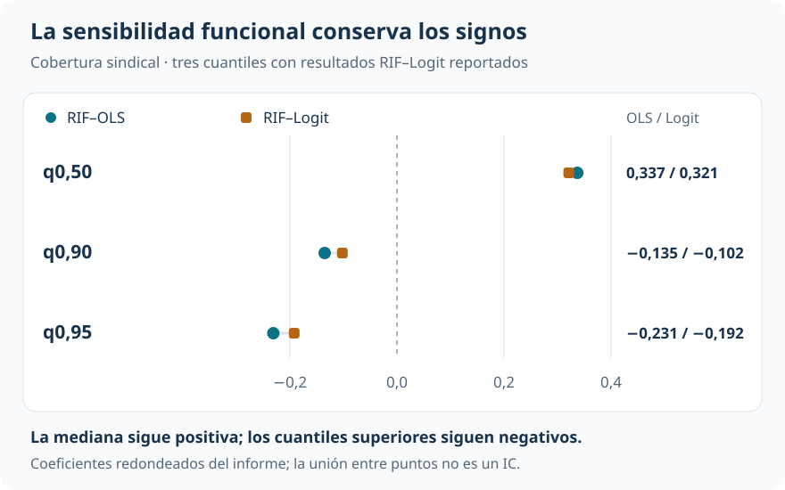

[Econometría](../index.qmd) / [Cuantiles, distribuciones y descomposiciones](../index.qmd#cuantiles)

Brechas y distribuciones contrafactuales

::: {.hero-box}
::: {.hero-title}
La cobertura sindical presenta una prima salarial condicional positiva y, a la vez, un perfil agregado compatible con compresión distributiva.
:::
::: {.hero-sub}
En el cuantil 0,90, CQR arroja un coeficiente positivo y UQR uno negativo. La diferencia se entiende al separar el salario dentro de celdas comparables de características del percentil de la distribución salarial completa.
:::
:::

:::: {.metric-grid}
::: {.metric-card}
::: {.metric-label}
Muestra de replicación
:::
::: {.metric-value}
266.956
:::
::: {.metric-note}
Hombres de CPS ORG 1983–1985; estimación sin pesos de encuesta.
:::
:::
::: {.metric-card}
::: {.metric-label}
Asociación media ajustada
:::
::: {.metric-value}
+0,179
:::
::: {.metric-note}
Coeficiente de cobertura sindical sobre el log salario.
:::
:::
::: {.metric-card}
::: {.metric-label}
CQR, cuantil 0,90
:::
::: {.metric-value}
+0,088
:::
::: {.metric-note}
Asociación en un cuantil condicional, manteniendo las covariables.
:::
:::
::: {.metric-card}
::: {.metric-label}
RIF–OLS, cuantil 0,90
:::
::: {.metric-value}
−0,135
:::
::: {.metric-note}
Coeficiente asociado con el cuantil de la distribución marginal.
:::
:::
::::

## Dos preguntas distributivas

Entre trabajadores con las mismas características observadas, ¿cómo difieren los cuantiles salariales según cobertura sindical? La regresión por cuantiles condicionales (**CQR**) responde esa pregunta. Una segunda pregunta apunta al conjunto de la población: ¿cómo se relaciona una perturbación marginal de la cobertura con la posición de un cuantil de la distribución completa? **UQR**, mediante regresiones de funciones de influencia recentradas, aproxima ese segundo objeto.

La aplicación reproduce la muestra de Firpo, Fortin y Lemieux (2009): 266.956 hombres de CPS ORG 1983–1985. El resultado es el log salario horario en dólares de 1979. Cobertura sindical indica estar cubierto por un contrato sindical; los controles incluyen raza, estado civil y categorías de educación y experiencia potencial. La cobertura muestral es 26,16%.

::: {.small-note}
**Una muestra distinta:** esta replicación no utiliza los pesos de encuesta. DFL y la descomposición RIF de las otras piezas comparan muestras de 232.784 y 170.693 observaciones con pesos CPS. Los resultados aquí no deben compararse numéricamente con aquellos como si representaran exactamente la misma población y ponderación.
:::

Los cubiertos tienen un log salario medio mayor, pero también difieren en edad, experiencia y otras características. MCO ajustado estima una asociación de 0,179. La pregunta distributiva exige ir más allá de esa media, sin suponer que los controles hayan resuelto la selección en cobertura.

## La RIF convierte el cuantil en una esperanza

La función de influencia mide la sensibilidad local de un estadístico distributivo a una perturbación infinitesimal. Al sumarle el propio estadístico se obtiene la **función de influencia recentrada (RIF)**, cuya esperanza recupera ese estadístico.

Para el cuantil marginal $q_\tau$, bajo una distribución continua y densidad positiva en ese punto:

$$
\operatorname{RIF}(Y;q_\tau,F)
=q_\tau+\frac{\tau-\mathbf{1}\{Y\leq q_\tau\}}{f_Y(q_\tau)},
\qquad E[\operatorname{RIF}]=q_\tau.
$$

Cada observación recibe una transformación según esté por encima o por debajo del cuantil. La densidad en el umbral determina la escala: cuando hay poca masa cerca del cuantil, una pequeña perturbación de probabilidad puede desplazarlo más.

RIF–OLS aproxima linealmente la esperanza condicional de esa transformación:

$$
E[\operatorname{RIF}(Y;q_\tau,F)\mid X]\approx X'\gamma(\tau).
$$

La segunda etapa es una regresión de **media sobre la RIF**. El objeto de interés es incondicional, aunque el modelo auxiliar incluya controles. El coeficiente es una aproximación dependiente del modelo a una respuesta distributiva local; no es, por construcción, un efecto finito de política.

La implementación estima cuantiles y densidades kernel con ancho de banda 0,06. En la mediana, el recentrado funciona casi exactamente: el cuantil es 1,804832 y la media empírica de la RIF es 1,804843. La pequeña diferencia refleja construcción muestral y empates; no cambia el objeto que se busca aproximar.

## Prima condicional y compresión agregada

CQR mantiene un coeficiente de cobertura positivo a lo largo de la grilla, aunque decreciente. RIF–OLS muestra otro perfil: positivo abajo y en el centro, cercano a cero alrededor del cuantil 0,80 y negativo arriba.

{#fig-rif-comparacion fig-alt="CQR frente a RIF–OLS en cuantiles seleccionados: en 0,10, 0,2881 frente a 0,1952; en la mediana, 0,1946 frente a 0,3365; en 0,90, 0,0879 frente a menos 0,1348; en 0,95, 0,0546 frente a menos 0,2306." width="100%"}

::: {.table-box}
| Cuantil | CQR | UQR / RIF–OLS | Qué cambia en la lectura |
|---|---:|---:|---|
| 0,10 | +0,2881 | +0,1952 | Ambos coeficientes positivos, para objetos diferentes |
| 0,50 | +0,1946 | +0,3365 | La señal RIF es mayor en la zona central |
| 0,90 | +0,0879 | −0,1348 | Prima condicional positiva y señal marginal negativa |
| 0,95 | +0,0546 | −0,2306 | Contraste más intenso y mayor sensibilidad en la cola |
:::

El patrón RIF es compatible con compresión: una perturbación marginal de cobertura, bajo la aproximación mantenida, se relaciona con cuantiles bajos y centrales mayores y cuantiles altos menores. No significa que el sindicato perjudique a “la persona del percentil 90”. El percentil es un estadístico de toda la distribución, y las personas pueden cambiar de posición.

Tampoco corresponde multiplicar mecánicamente el coeficiente por un aumento arbitrario de cobertura para simular una política. Para una variable binaria, habría que definir quién cambia de estado, cómo cambia la distribución conjunta de características y qué relaciones salariales permanecen invariantes.

## ¿Depende el patrón de la forma lineal?

RIF–Logit modela la probabilidad de superar el umbral salarial y calcula un cambio discreto promedio por cobertura, escalado por la densidad en el cuantil. Conserva el enfoque local, pero utiliza otra forma funcional para la relación auxiliar.

{#fig-rif-sensibilidad fig-alt="RIF–OLS y RIF–Logit: mediana, aproximadamente 0,337 y 0,321; cuantil 0,90, menos 0,135 y menos 0,102; cuantil 0,95, menos 0,231 y menos 0,192." width="100%"}

El resultado no parece exclusivo de RIF–OLS: la versión Logit también es positiva en la mediana y negativa en los cuantiles 0,90 y 0,95. La densidad cae de aproximadamente 0,626 en la mediana a 0,151 en el cuantil 0,95. Su inversa amplifica la sensibilidad de la RIF, por lo que las magnitudes de cola requieren mayor cautela. Esta sensibilidad funcional no sustituye una evaluación del ancho de banda.

## Inferencia y alcance local

El bootstrap vuelve a estimar cuantiles, densidades, RIF y regresión. Se dispone de inferencia seleccionada con **19 réplicas**, apropiada para ilustrar la secuencia pero demasiado reducida para comunicar precisión definitiva. Los intervalos disponibles son puntuales; no son bandas simultáneas del perfil.

La interpretación causal requeriría supuestos adicionales de selección, soporte e invariancia. Controlar las características observadas no los demuestra. La evidencia presentada sostiene un contraste entre preguntas y un patrón compatible con compresión, sin identificar qué produciría una intervención sobre cobertura.

::: {.section-box}
### Lectura que domina

CQR describe diferencias entre cuantiles condicionales de trabajadores comparables. RIF–OLS aproxima una relación local con cuantiles de la distribución completa. En esta muestra, esa distinción permite entender la coexistencia de una prima condicional positiva y una señal marginal de compresión, que conserva su forma cualitativa con RIF–Logit.
:::

## De una respuesta local a una descomposición

[DFL](t17_dfl.qmd) construye una distribución contrafactual ante un cambio global de composición. RIF aproxima un funcional concreto y permite relacionarlo con covariables. [La descomposición RIF](t19_descomposicion_rif.qmd) utiliza esa propiedad para abrir cambios distributivos por bloques, manteniendo visibles las diferencias entre aproximación y contrafactual agregado.

::: {.small-note}
**Fuente:** informe curado «Taller 18: UQR y regresiones RIF», replicación de Firpo, Fortin y Lemieux (2009). Figuras basadas en los coeficientes reportados: seis cuantiles para CQR/UQR y tres puntos de sensibilidad RIF–Logit, estos últimos con el redondeo del informe.
:::
