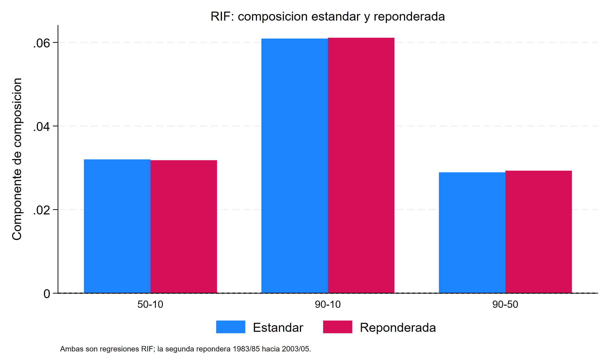
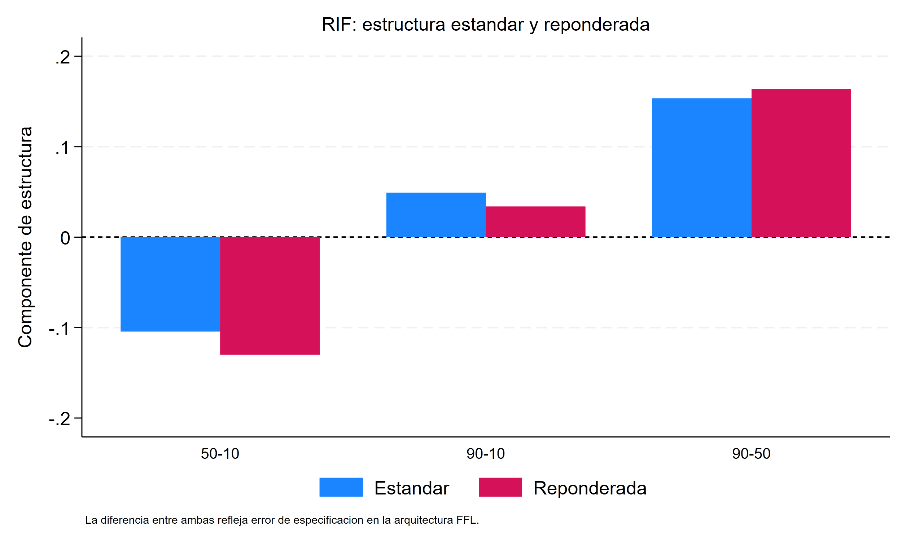
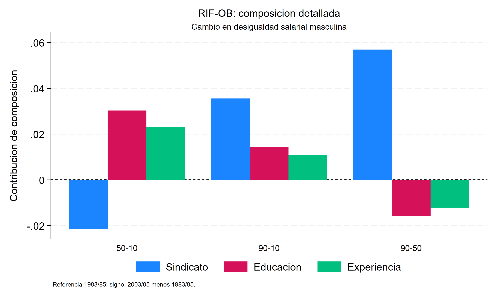
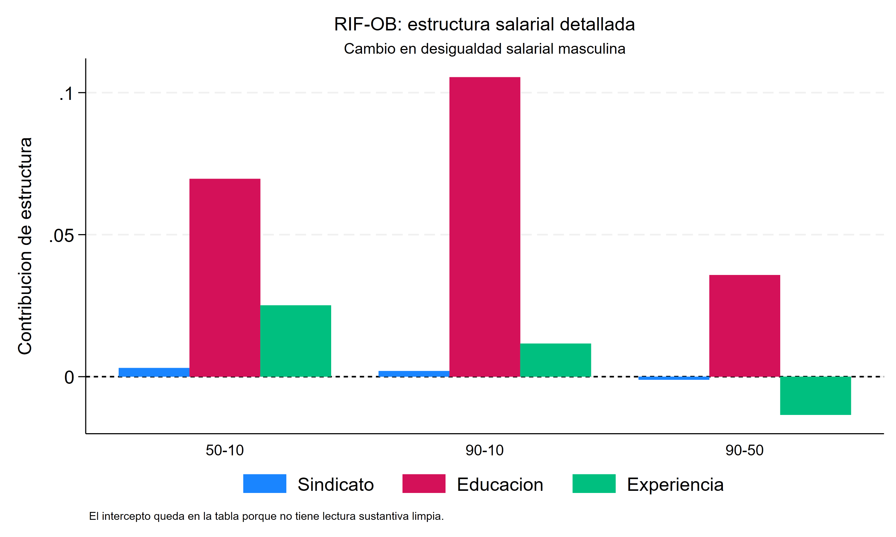
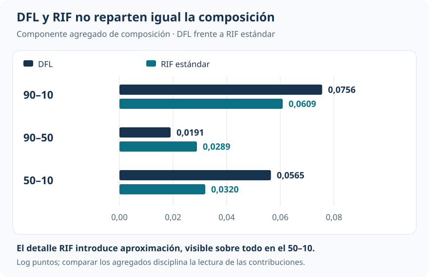

Brechas y distribuciones contrafactuales

::: {.hero-box}
::: {.hero-title}
La apertura salarial se concentra arriba de la mediana. RIF–Oaxaca permite asociar ese cambio con bloques concretos, sin convertir el detalle en mecanismos causales.
:::
::: {.hero-sub}
La caída de cobertura sindical es el mayor aporte de composición al aumento del 90–10 dentro de la especificación. Educación tiene una contribución estructural expansiva importante, con compensaciones de experiencia e intercepto. La ganancia de detalle exige distinguir el cambio observado, el total RIF y el residuo de la versión reponderada.
:::
:::

:::: {.metric-grid}
::: {.metric-card}
::: {.metric-label}
Cambio observado 90–10
:::
::: {.metric-value}
0,109125
:::
::: {.metric-note}
Log puntos; CPS masculina, 2003–2005 menos 1983–1985.
:::
:::
::: {.metric-card}
::: {.metric-label}
Total RIF 90–10
:::
::: {.metric-value}
0,110029
:::
::: {.metric-note}
Reconstrucción por medias de RIF; no coincide exactamente con el cambio observado.
:::
:::
::: {.metric-card}
::: {.metric-label}
Composición reponderada
:::
::: {.metric-value}
0,0611
:::
::: {.metric-note}
Cobertura sindical aporta 0,0358; educación 0,0143 y experiencia 0,0110.
:::
:::
::: {.metric-card}
::: {.metric-label}
Residuo reponderado
:::
::: {.metric-value}
0,01505
:::
::: {.metric-note}
Necesario junto con composición y estructura para cerrar el total RIF del 90–10.
:::
:::
::::

## Qué bloques acompañan el cambio

¿Qué aporta abrir la desigualdad por covariables? El 90–10 aumenta 0,1091 log puntos, pero el 90–50 se amplía 0,1827 y el 50–10 se reduce 0,0736. Una contribución puede tener signos diferentes en cada mitad de la distribución. El detalle permite localizar esas diferencias.

La aplicación utiliza las mismas muestras masculinas de CPS y los mismos pesos de encuesta que [DFL](t17_dfl.qmd): 232.784 observaciones de 1983–1985 y 170.693 de 2003–2005. El resultado es el log salario horario; los bloques sustantivos son cobertura sindical, categorías educativas y experiencia potencial. La cobertura cae de aproximadamente 26,5% a 15,2%.

La comparación con [UQR](t18_uqr_rif.qmd) es conceptual: aquel análisis utiliza otra muestra de replicación sin pesos. Sus coeficientes no se trasladan directamente a esta descomposición temporal.

## Extender Oaxaca–Blinder fuera de la media

Para un estadístico $v(F)$, la esperanza poblacional de su RIF recupera el estadístico. Si se aproxima linealmente la esperanza condicional de la RIF, puede aplicarse a esa transformación el álgebra de Oaxaca–Blinder:

$$
E[\operatorname{RIF}_g\mid X]\approx X'\gamma_g.
$$

En la versión estándar, composición valora las diferencias medias de características con los coeficientes RIF iniciales. Estructura valora las diferencias de coeficientes en la composición reciente. La suma por covariable permite abrir cada componente en cobertura sindical, educación y experiencia; estructura incluye además el intercepto.

Hay dos niveles de aproximación: la función de influencia es local y de primer orden, y la esperanza condicional de la RIF se representa con una forma lineal. La aditividad dentro del modelo no vuelve al detalle invariante a sus categorías, interacciones o especificación.

### Cambio observado y total RIF son objetos distintos

La identidad de recentrado es poblacional. En la muestra, percentiles ponderados, empates y densidades estimadas pueden hacer que la media empírica de la RIF difiera del funcional. En el 90–10, el cambio observado es **0,109125**, mientras que el total reconstruido por medias de RIF es **0,110029**. Esa diferencia es pequeña, pero no debe borrarse cambiando la etiqueta del total.

## Estándar y reponderada: qué cambia

La versión estándar compara las RIF de los dos períodos. La versión reponderada agrega una pseudomuestra: salarios iniciales con composición reciente. Allí se vuelven a estimar **cuantiles, densidades y RIF**. Cambiar solo los pesos de una RIF inicial ya calculada no produciría la misma construcción.

La composición detallada es muy parecida en ambas versiones. Para el 90–10 pasa de 0,0609 a 0,0611. La estructura es más sensible: cambia de 0,0491 a 0,0339, y sus contribuciones de experiencia e intercepto se redistribuyen de forma importante.

::: {.figure-pair}
::: {.figure-pair__item}
{fig-alt="Contribuciones de composición en las versiones RIF estándar y reponderada"}
:::
::: {.figure-pair__item}
{fig-alt="Contribuciones de estructura en las versiones RIF estándar y reponderada"}
:::
:::

::: {.table-box}
| Rango | Cambio observado | Total RIF | Composición reponderada | Estructura reponderada | Residuo |
|---|---:|---:|---:|---:|---:|
| 90–10 | +0,1091 | +0,1100 | +0,0611 | +0,0339 | +0,01505 |
| 90–50 | +0,1827 | +0,1824 | +0,0293 | +0,1639 | −0,01077 |
| 50–10 | −0,0736 | −0,0724 | +0,0318 | −0,1300 | +0,02583 |
:::

Valores reportados, en log puntos y con redondeo. En la versión reponderada la relación relevante es:

$$
\text{total RIF}=\text{composición}+\text{estructura}+\text{residuo}.
$$

El residuo de esta partición es distinto de la diferencia entre cambio observado y total RIF. Son dos discrepancias conceptualmente separadas. Ocultar cualquiera de ellas daría apariencia de exactitud a una apertura aproximada.

## Composición y estructura cuentan historias diferentes

En la composición reponderada del 90–10, cobertura sindical aporta 0,0358, frente a 0,0143 de educación y 0,0110 de experiencia. Su contribución representa cerca del 59% de ese componente. Con una cobertura que cae entre períodos, la desindicalización es el cambio de composición individual más importante dentro de los tres bloques considerados.

Del lado de estructura, educación aporta 0,1224 al 90–10. Experiencia compensa −0,0711 y el intercepto −0,0249. El agregado moderado de estructura es el saldo de aportes mucho mayores y de signos opuestos.

::: {.figure-pair}
::: {.figure-pair__item}
{fig-alt="Contribuciones detalladas de composición para los rangos 50–10, 90–10 y 90–50"}
:::
::: {.figure-pair__item}
{fig-alt="Contribuciones detalladas de estructura para los rangos 50–10, 90–10 y 90–50"}
:::
:::

La localización importa. La contribución sindical de composición es **+0,0573 en el 90–50** y **−0,0215 en el 50–10**: apertura superior y compresión inferior. Educación, por estructura, aporta +0,0770 arriba y +0,0454 abajo. Estos números describen asignaciones dentro de una especificación; no identifican efectos de intervenir sobre cobertura o educación.

La contribución estructural educativa tampoco significa “más trabajadores educados”. Se refiere al cambio en la relación estimada entre categorías educativas y la RIF. Atribuirla a un precio puro ignoraría inobservables, especificación y parametrización.

## DFL proporciona una referencia agregada

DFL construye la distribución contrafactual completa y calcula el estadístico sobre ella. RIF–Oaxaca introduce una aproximación que permite obtener el detalle. No existe una identidad que obligue a coincidir sus componentes agregados de composición.

{#fig-rif-dfl fig-alt="Composición DFL frente a RIF estándar: 90–10, 0,0756 frente a 0,0609; 90–50, 0,0191 frente a 0,0289; 50–10, 0,0565 frente a 0,0320." width="100%"}

Para el 90–10, DFL asigna 0,0756 a composición y RIF estándar 0,0609. En el 50–10, las cifras son 0,0565 y 0,0320. La distancia es suficientemente grande como para mantener visible el costo de la aproximación. Que composición cambie poco entre RIF estándar y reponderada no implica que reproduzca exactamente DFL.

## Diagnóstico del residuo e inferencia

El informe separa el residuo reponderado en dos diferencias internas: el cambio de composición entre versiones, denominado error de reponderación, y el cambio de estructura, denominado error de especificación.

::: {.table-box}
| Rango | Error de reponderación | Error de especificación | Residuo |
|---|---:|---:|---:|
| 90–10 | −0,00021 | +0,01526 | +0,01505 |
| 90–50 | −0,00039 | −0,01038 | −0,01077 |
| 50–10 | +0,00019 | +0,02564 | +0,02583 |
:::

Las etiquetas pertenecen a esta arquitectura. La primera magnitud pequeña muestra estabilidad de composición entre versiones; no es un test de soporte o balance perfecto. La segunda refleja sensibilidad del componente estructural; no es un contraste general de correcta especificación.

La inferencia disponible remuestrea todas las etapas, incluidos pesos, cuantiles, densidades, RIF y descomposición. Sin embargo, utiliza solo **10 réplicas para el 90–10**. Es una demostración del procedimiento: sus errores estándar, p-valores e intervalos no se usan aquí para sostener precisión definitiva ni significatividad de contribuciones.

::: {.section-box}
### Lectura que domina

RIF–Oaxaca permite localizar contribuciones de cobertura sindical, educación y experiencia que el agregado oculta. La composición sindical acompaña la apertura superior; educación tiene una contribución estructural expansiva importante, parcialmente compensada. La utilidad del detalle exige conservar sus límites: cambio observado y total RIF pueden diferir, la versión reponderada necesita un residuo y las contribuciones no son mecanismos causales identificados.
:::

## Una progresión de preguntas

[Oaxaca–Blinder](t16_oaxaca_blinder.qmd) aporta el álgebra de una descomposición de medias; [DFL](t17_dfl.qmd), el contrafactual distributivo agregado; [UQR/RIF](t18_uqr_rif.qmd), la transformación que aproxima funcionales marginales. Este análisis combina las tres ideas para obtener detalle y mostrar su costo de aproximación.

::: {.small-note}
**Fuente:** informe curado «Taller 19: Descomposición RIF», replicación de Firpo, Fortin y Lemieux. Figuras y tablas reproducen valores reportados; el detalle principal corresponde a la versión reponderada y la comparación DFL a la RIF estándar. No se redistribuye el residuo ni se fuerza el cierre de cifras redondeadas.
:::
