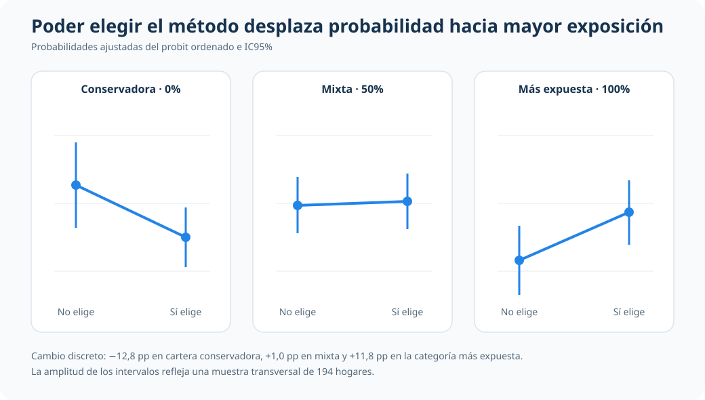

::: {.hero-box}
::: {.hero-title}
¿Cómo cambia la lectura aplicada de una decisión previsional cuando el resultado tiene jerarquía natural?
:::

::: {.hero-sub}
El análisis estudia asignación de cartera previsional en tres niveles ordenados de exposición a acciones y prioriza una interpretación profesional en probabilidades.
:::
:::

:::: {.metric-grid}

::: {.metric-card}
::: {.metric-label}
Modelo operativo
:::

::: {.metric-value}
Ordered probit con APEs
:::

::: {.metric-note}
Resultado ordinal explícito (`pctstck`: cartera conservadora 0% en acciones, cartera mixta 50% en acciones y cartera más expuesta a acciones 100% en acciones)
:::
:::

::: {.metric-card}
::: {.metric-label}
Contexto aplicado
:::

::: {.metric-value}
Asignación previsional de hogares
:::

::: {.metric-note}
`N=194`, unidad familia/hogar (`id`), corte transversal
:::
:::

::: {.metric-card}
::: {.metric-label}
Estructura del resultado
:::

::: {.metric-value}
Tres categorías ordenadas
:::

::: {.metric-note}
0%, 50% y 100% de exposición a acciones
:::
:::

::: {.metric-card}
::: {.metric-label}
Señales narrables
:::

::: {.metric-value}
Elección de método, edad y profit sharing
:::

::: {.metric-note}
Reasignan probabilidad entre cartera conservadora y cartera más expuesta a acciones
:::
:::

::::

## Resumen

Este análisis aborda una decisión financiera ordinal: la proporción del plan previsional invertida en acciones (`pctstck`) toma tres categorías ordenadas (0%, 50% y 100%). La pregunta aplicada es cómo interpretar de forma consistente esa jerarquía en términos de probabilidades.

El valor del caso está en el criterio de lectura: usar un modelo ordenado para respetar la estructura del resultado y traducir la evidencia en cambios de probabilidad comparables, con interpretación sobria y sin sobreinterpretaciones.

:::: {.quick-grid}

::: {.section-box}
## Pregunta

En esta muestra de hogares, ¿qué variables se asocian con mayor o menor probabilidad de ubicarse en carteras previsionales conservadoras, mixtas o más expuestas a acciones?

::: {.small-note}
Resultado: `pctstck` con tres categorías ordenadas de cartera: conservadora (0% en acciones), mixta (50% en acciones) y más expuesta a acciones (100% en acciones). Variables clave: `choice` (puede elegir método de inversión: sí/no), `age` (edad en años), `prftshr` (plan con profit sharing: sí/no), con controles demográficos y de ingreso.
:::
:::

::: {.section-box}
## Idea central

Cuando el resultado tiene orden natural, la lectura aplicada mejora si la econometría modela explícitamente esa jerarquía y comunica resultados en probabilidades por categoría y APEs, no en coeficientes latentes aislados.

Portfolio econométrico
:::

::::

## Por qué este problema importa

En decisiones previsionales, no solo importa invertir o no invertir en acciones: importa el grado de exposición. Esa escala ordenada contiene información práctica para lectura de riesgo y composición de cartera.

Si se ignora esa jerarquía, la interpretación puede perder claridad. En cambio, una especificación ordinal permite organizar la evidencia como reasignación de probabilidades entre perfiles de cartera, en un lenguaje más útil para un lector profesional.

## Datos y variables

Se utiliza `pension.dta` en corte transversal.

- Unidad de observación: familia/hogar (`id`)
- Tamaño muestral: `N=194`
- Variable de resultado: `pctstck` (0% en acciones: cartera conservadora; 50% en acciones: cartera mixta; 100% en acciones: cartera más expuesta a acciones)
- Distribución observada: 0% en acciones (cartera conservadora) = `64` casos (`32.99%`), 50% en acciones (cartera mixta) = `72` (`37.11%`), 100% en acciones (cartera más expuesta a acciones) = `58` (`29.90%`)
- Regresores de mayor interés para la lectura: `choice` (puede elegir método de inversión: sí/no), `age` (edad en años), `prftshr` (plan con profit sharing: sí/no)
- Controles: `educ`, `wealth89`, `female`, `married`, `black`, tramos de ingreso familiar (`finc*`)
- Alcance: al ser corte transversal, la lectura se mantiene en asociaciones probabilísticas contemporáneas

## Estrategia empírica

1. Estimar un modelo ordenado como referencia principal para respetar la jerarquía de `pctstck`.
2. Traducir resultados a probabilidades por categoría de cartera (conservadora, mixta y más expuesta a acciones) para lectura directa del caso.
3. Reportar APEs por outcome en variables narrables (`choice`, `age`, `prftshr`).
4. Mantener la comparación de enlace (`ologit`/`oprobit`) como respaldo breve, sin desplazar la historia aplicada.

## Resultados principales

La lectura aplicada se organiza en cuatro mensajes:

1. La masa de probabilidad está distribuida entre los tres niveles de cartera, con mayor concentración en la categoría mixta.
2. Poder elegir método de inversión (sí vs no) se asocia con menor probabilidad de cartera conservadora y mayor probabilidad de cartera más expuesta a acciones.
3. `age` muestra una reasignación hacia el perfil conservador y una caída en la probabilidad del perfil más expuesto a acciones.
4. `prftshr` muestra una reasignación en sentido opuesto (desde perfil conservador hacia perfil más expuesto a acciones), con precisión más acotada en parte de los outcomes.

::: {.table-box}
## APEs narrables (ordered probit)

| Variable | dPr(cartera conservadora: 0% en acciones) | dPr(cartera mixta: 50% en acciones) | dPr(cartera más expuesta a acciones: 100% en acciones) | Lectura profesional |
|---|---:|---:|---:|---|
| Puede elegir método de inversión (sí vs no) | -0.1281 (0.0621) | +0.0104 (0.0119) | +0.1178 (0.0547) | Reasigna probabilidad desde cartera conservadora hacia cartera más expuesta a acciones |
| `age` (+1 año) | +0.0169 (0.0081) | -0.0007 (0.0013) | -0.0162 (0.0078) | En promedio, la edad se asocia con mayor peso en la categoría conservadora |
| Plan con profit sharing (sí vs no) | -0.1521 (0.0692) | -0.0137 (0.0219) | +0.1658 (0.0877) | Se asocia con menor probabilidad conservadora y mayor probabilidad en la categoría más expuesta a acciones |
:::

El gráfico muestra directamente la redistribución asociada con poder elegir el método de inversión. La probabilidad ajustada cae de 0,411 a 0,283 en la cartera conservadora, apenas cambia en la mixta (0,362 a 0,372) y aumenta de 0,227 a 0,345 en la categoría más expuesta.

Como objeto final de decisión, el análisis prioriza tres covariables protagonistas (posibilidad de elegir método de inversión, edad y profit sharing): en esta muestra, allí se concentra la señal narrable de reasignación de probabilidades.

Estas magnitudes describen asociaciones probabilísticas promedio en la muestra; no implican una interpretación concluyente.

## Diagnósticos de respaldo

El respaldo técnico se mantiene acotado y funcional a la historia aplicada.

::: {.table-box}
### Resumen de diagnósticos

| Diagnóstico | Evidencia | Uso en el análisis |
|---|---:|---|
| Relevancia conjunta del bloque explicativo | Wald chi2(14)=25.32, p=0.0315 | Respalda que el modelo capta señal empírica en esta muestra |
| Sensibilidad de enlace | Patrón cualitativo similar en ologit y oprobit | Evita que la narrativa dependa de una elección de enlace puntual |
:::

## Lectura profesional

El aporte de este caso es mostrar criterio econométrico aplicado: cuando el resultado tiene jerarquía natural, conviene preservar ese orden y comunicar resultados como probabilidades y reasignaciones de probabilidad entre categorías.

En esta aplicación previsional, la lectura útil para un tercero no está en presentar una técnica como superior, sino en explicar con claridad cómo ciertas características se asocian con perfiles conservadores, mixtos o más expuestos a acciones, manteniendo límites explícitos de interpretación.

Para evitar dispersión, la lectura dominante se concentra en la posibilidad de elegir método de inversión, la edad y el profit sharing, mientras el resto de covariables cumple un rol de control y contexto.

## Cierre

Este análisis traduce un problema financiero ordinal a un lenguaje profesional y narrable: probabilidades por categoría y APE comparables, con foco en decisión aplicada y sin exagerar el alcance metodológico.

El valor del caso queda en esa combinación: jerarquía del resultado bien modelada, foco en covariables protagonistas narrables y prudencia interpretativa en un contexto de corte transversal.

Dado el tamaño muestral (`N=194`) y la naturaleza transversal del caso, los resultados se presentan como evidencia asociativa útil para lectura profesional, no como base para extrapolaciones amplias o predicción fuera de muestra.

