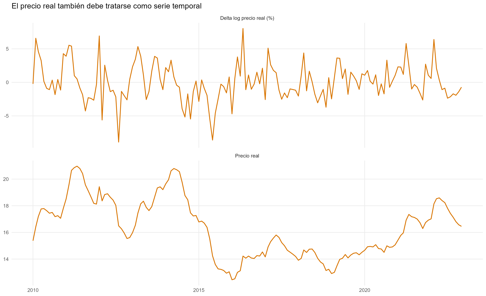
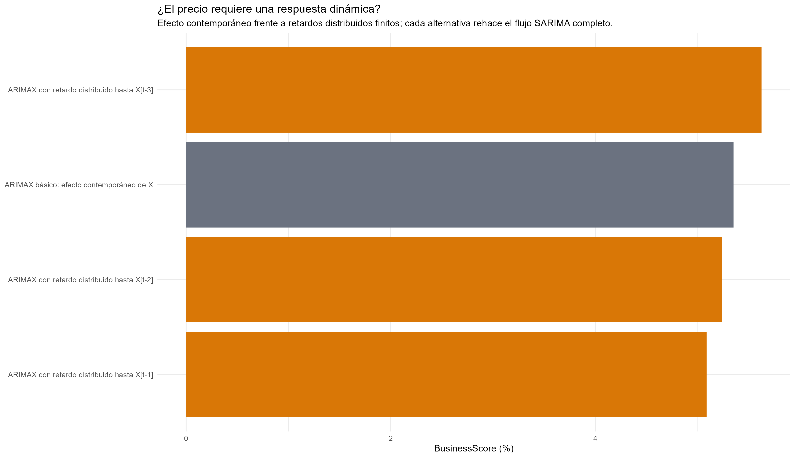
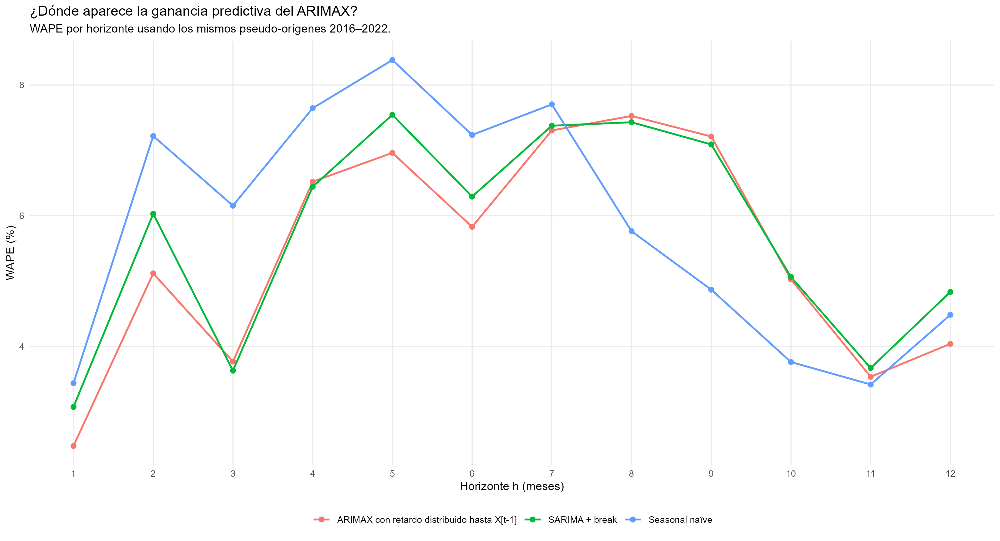
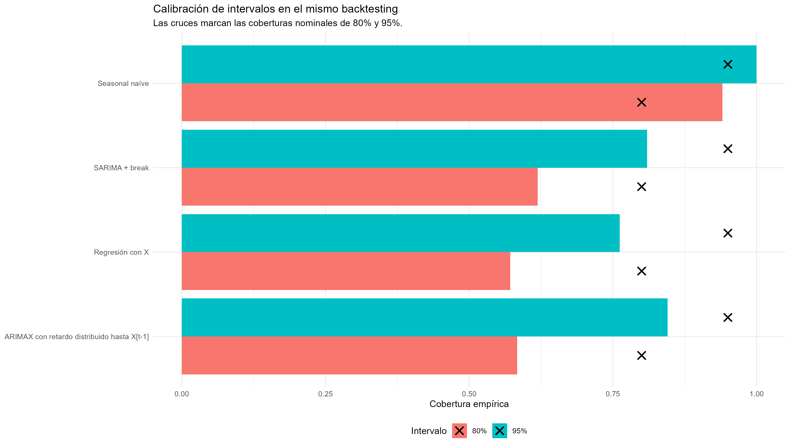
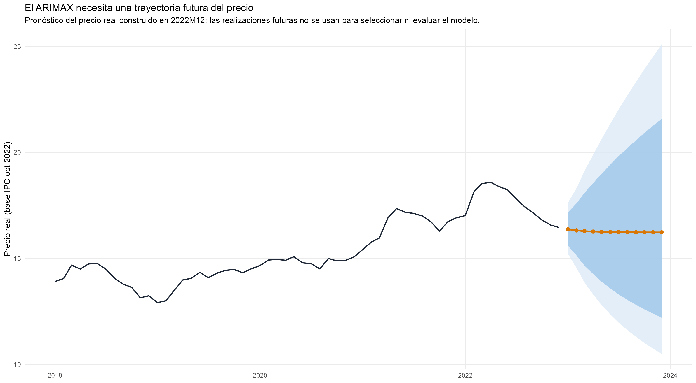
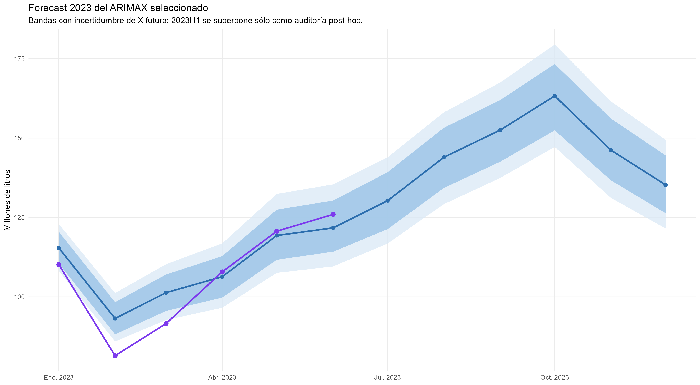
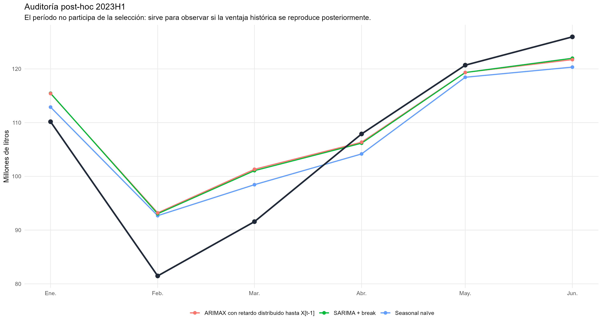

Series temporales y forecasting · Información externa

::: {.hero-box}
::: {.hero-title}
El precio real agrega señal predictiva cuando entra con una memoria corta. La mejora promedio no se reproduce en todos los horizontes ni en la auditoría posterior.
:::
::: {.hero-sub}
La remisión de producto lácteo se pronostica combinando cambios del precio real al productor con su dinámica temporal remanente. Un rezago adicional supera al benchmark estacional en los presupuestos históricos de selección. Los resultados también muestran qué limita esa ventaja: coeficientes imprecisos, intervalos subcalibrados y necesidad de pronosticar el propio regresor externo.
:::
:::

:::: {.metric-grid}
::: {.metric-card}
::: {.metric-label}
Score histórico ARIMAX
:::
::: {.metric-value}
5,088%
:::
::: {.metric-note}
Pérdida presupuestaria en 2016–2022.
:::
:::
::: {.metric-card}
::: {.metric-label}
Mejora sobre el benchmark
:::
::: {.metric-value}
4,14%
:::
::: {.metric-note}
Reducción relativa del score de selección.
:::
:::
::: {.metric-card}
::: {.metric-label}
Cobertura de bandas 95%
:::
::: {.metric-value}
84,5%
:::
::: {.metric-note}
La mejora puntual no asegura calibración.
:::
:::
::: {.metric-card}
::: {.metric-label}
WAPE en auditoría 2023H1
:::
::: {.metric-value}
5,307%
:::
::: {.metric-note}
El benchmark obtiene 5,080% en esos seis meses.
:::
:::
::::

## Pregunta y disponibilidad de información

¿El precio real recibido por el productor contiene información para anticipar la remisión de producto lácteo que no esté contenida en la historia del volumen? La motivación económica es que cambios en incentivos pueden acompañar decisiones productivas con rezagos. El análisis evalúa esa señal predictiva; no identifica una respuesta causal de oferta.

Se mantiene el resultado del [caso univariado](ts_sarima_producto_lacteo.qmd): volumen mensual $Y_t$, normalizado por días calendario y modelado como $y_t=\log(Y_t/D_t)$. El desarrollo comprende 2010–2022; los siete orígenes de diciembre generan presupuestos completos de 2016–2022, con doce horizontes por origen.

El predictor parte del precio nominal al productor **sin reliquidaciones retrospectivas**, deflactado por IPC. Excluir pagos conocidos posteriormente evita imputarlos al conjunto de información histórico. ADF y KPSS favorecen trabajar con el cambio logarítmico del precio real:

$$
X_t=\Delta\log P_t^{real}.
$$

Se trata del cambio mensual del precio, no de su nivel rezagado. Una posible relación en niveles exigiría estudiar cointegración y queda fuera de esta especificación de corto plazo.

{fig-alt="Nivel del precio real al productor y cambio logarítmico mensual utilizado en el forecasting de producto lácteo" width="100%"}

## Estrategia: dos fuentes de dinámica

Una regresión con precio, tendencia, ruptura y efectos mensuales deja autocorrelación residual intensa: los Ljung–Box a 12, 24 y 36 rezagos rechazan con valores p prácticamente nulos. Agregar información externa no elimina la memoria del error. La regresión dinámica separa dos bloques:

$$
y_t=Z_t'\gamma+\beta_0X_t+\beta_1X_{t-1}+n_t,
$$

donde $Z_t$ representa la trayectoria determinística y $n_t$ sigue errores SARIMA. Los rezagos de precio describen su entrada en la media; SARIMA representa la dependencia que permanece después de condicionar en esa información.

Cada forma del precio vuelve a identificar ruptura, integración residual, representación estacional, órdenes y tratamiento de anomalías dentro de cada origen. Cambiar la media puede cambiar el error: la variante con tres rezagos llega a seleccionar efectos mensuales sin diferencia estacional, mientras las variantes más cortas favorecen $D=1$.

## Una memoria corta aporta más que una cola larga

El ARIMAX contemporáneo baja el score de 5,479 de la regresión a 5,349, pero no supera al benchmark, 5,308. Permitir $X_t+X_{t-1}$ lo reduce a 5,088; dos y tres rezagos empeoran a 5,236 y 5,624. Una transferencia geométrica $\omega_0/(1-\delta_1L)$ alcanza 5,164 y tampoco supera a la forma finita con un rezago.

{fig-alt="Scores de ARIMAX contemporáneo y variantes con uno, dos y tres rezagos del cambio de precio real" width="100%"}

La pérdida conserva los pesos del caso univariado: 60% para error anual absoluto porcentual medio y 40% para WAPE mensual. Así, introducir precio no cambia el criterio con el que se juzga la mejora.

::: {.table-box}
| Procedimiento central | WAPE mensual (%) | Error anual absoluto medio (%) | Score (%) |
|---|---:|---:|---:|
| **ARIMAX con un rezago de precio** | **5,479** | **4,827** | **5,088** |
| Benchmark estacional | 5,674 | 5,063 | 5,308 |
| SARIMA con ruptura | 5,720 | 5,220 | 5,420 |
| Regresión con precio, sin errores SARIMA | 5,956 | 5,161 | 5,479 |
:::

Este ranking central compara ARIMAX con el SARIMA de historia completa y ruptura. **No incluye como competidor central el SARIMA de ventana móvil del caso univariado**. La reducción de 4,14% corresponde al benchmark estacional; el diseño no aísla una contribución causal del precio manteniendo idéntica toda la arquitectura.

El ARIMAX reduce el error anual absoluto en cuatro de siete años frente al benchmark. En WAPE por horizonte gana en 1–7 y 12, y pierde en 8–11. La ventaja promedio combina mejoras y deterioros, en lugar de una reducción uniforme del error.

{fig-alt="WAPE por horizonte de doce meses para ARIMAX, SARIMA con ruptura y benchmark estacional" width="100%"}

## Diagnóstico e interpretación de coeficientes

El ajuste final utiliza errores $ARIMA(1,0,0)(0,1,1)_{12}$, tendencia y un quiebre de pendiente en febrero de 2012, reestimado después de condicionar en precio. No retiene outliers. Los Ljung–Box finales son 0,621, 0,356 y 0,632 a 12, 24 y 36 rezagos; las raíces son admisibles.

Los coeficientes de precio son negativos e individualmente imprecisos: $\widehat\beta_0=-0,0895$ e $\widehat\beta_1=-0,0546$, con intervalos 95% aproximados de [−0,301; 0,122] y [−0,264; 0,155]. Se conservan esos signos. La utilidad predictiva de un bloque no implica que cada coeficiente sea preciso; tampoco autoriza leerlo como elasticidad causal ante simultaneidad, shocks comunes y variables omitidas.

La cobertura es 58,3% al nivel nominal de 80% y 84,5% al de 95%. El benchmark alcanza 94,0% y 100%, con interval scores ligeramente menores. Sus bandas son conservadoras, pero la mayor precisión puntual del ARIMAX **no se convierte en una dominancia probabilística**.

{fig-alt="Cobertura empírica de intervalos de 80 y 95 por ciento de ARIMAX y procedimientos comparados" width="100%"}

## Pronosticar el precio también es parte del modelo

El precio futuro no se sustituye por valores realizados después del origen. En cada presupuesto histórico se pronostica su logaritmo con un modelo auxiliar usando solo el pasado. Con datos hasta diciembre de 2022 se selecciona $ARIMA(2,1,0)$. A un mes, $X_T$ ya es conocido, pero $X_{T+1}$ necesita forecast; desde dos meses, ambos términos de precio son futuros.

{fig-alt="Forecast auxiliar del precio real al productor desde diciembre de 2022 con bandas que se ensanchan" width="100%"}

La simulación adicional genera trayectorias de precio y, condicionando en cada una, trayectorias del volumen. En esta corrida, incorporar incertidumbre del precio modifica poco las bandas mensuales y de forma no monotónica. Los anchos simulados seleccionados ilustran el resultado; no se fuerza un ensanchamiento que los outputs no muestran.

::: {.table-box}
| Mes de 2023 | Ancho PI95, precio puntual | Ancho PI95, precio incierto |
|---|---:|---:|
| Enero | 15,136 | 14,748 |
| Junio | 24,612 | 25,842 |
| Diciembre | 27,975 | 27,881 |
:::

Anchos en millones de litros. La comparación condicional/simulada depende de la sensibilidad estimada al precio y de la aproximación Monte Carlo; no demuestra que incorporar una fuente de incertidumbre reduzca en general la varianza predictiva.

## Forecast mensual y auditoría posterior

El centro presupuestario conserva la media predictiva en litros, con corrección lognormal en la retransformation. Al sumar trayectorias completas, la media anual simulada es aproximadamente 1.528 millones de litros, con PI80 [1.466; 1.592] y PI95 [1.428; 1.623] millones. Los cuantiles anuales se obtienen de totales conjuntos; no se suman bandas marginales.

{fig-alt="Forecast ARIMAX de producto lácteo para 2023 con bandas predictivas y realizaciones posteriores del primer semestre" width="100%"}

2016–2022 es validación de selección temporal, aunque cada forecast sea fuera de muestra respecto de su ajuste. 2023H1 permanece fuera de la selección final, pero ya había sido observado durante etapas anteriores: se reporta como **auditoría post-hoc**, no como test protegido.

::: {.table-box}
| Auditoría enero–junio de 2023 | WAPE (%) | Sesgo acumulado (%) |
|---|---:|---:|
| Benchmark estacional | **5,080** | +1,444 |
| SARIMA con ruptura | 5,241 | +3,027 |
| ARIMAX con un rezago | 5,307 | +3,074 |
:::

{fig-alt="Realizaciones del primer semestre de 2023 comparadas con ARIMAX, SARIMA con ruptura y benchmark estacional" width="100%"}

## Decisión y límites

El resultado anual se apoya en siete presupuestos completos. La ganancia depende de la calidad del forecast del regresor; las bandas quedan subcalibradas y los coeficientes de precio son imprecisos. La auditoría semestral no permite inferir el ranking de todo 2023. Variables físicas como precipitación serían candidatas para una extensión, pero su valor predictivo no fue evaluado en este caso.

::: {.callout-note}
## Decisión profesional

Conservar el ARIMAX con precio contemporáneo y un rezago como ganador de la selección histórica bajo la pérdida declarada, junto con la evidencia favorable al benchmark en intervalos y en 2023H1. La información externa aporta valor cuando su disponibilidad y su dinámica se evalúan dentro del procedimiento completo; la complejidad adicional debe volver a justificarlo.
:::
