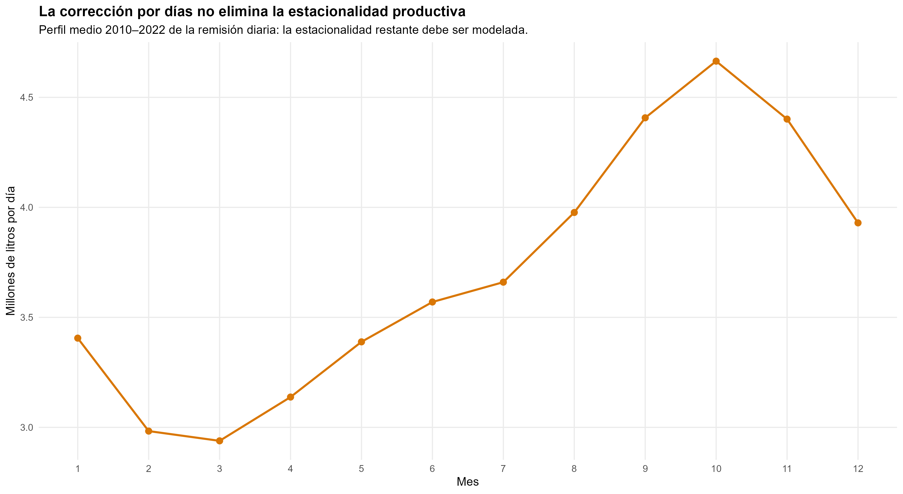
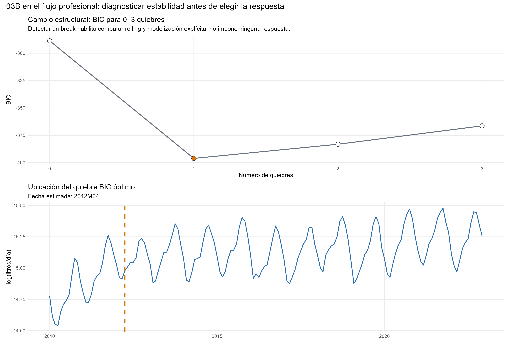
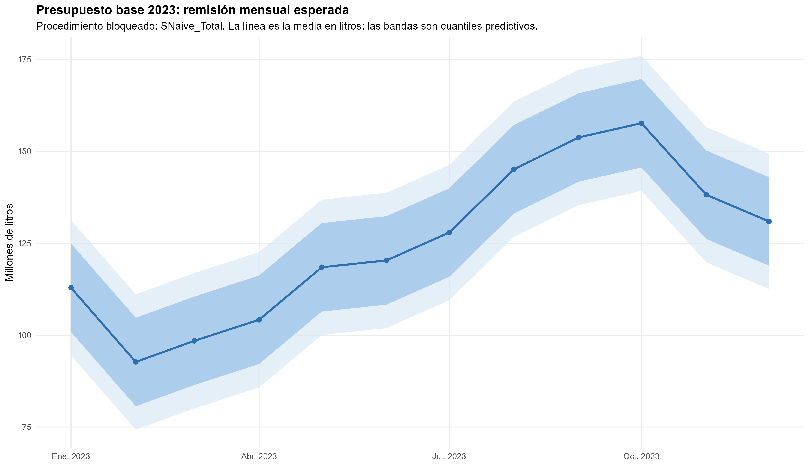
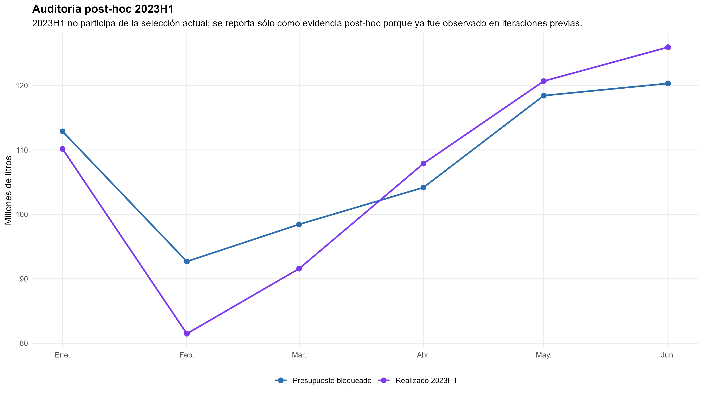

Series temporales y forecasting · Historia propia

::: {.hero-box}
::: {.hero-title}
El mejor SARIMA queda casi empatado con una regla estacional simple. La decisión depende de la pérdida presupuestaria, además del ajuste del modelo.
:::
::: {.hero-sub}
Esta aplicación anonimizada pronostica la remisión de producto lácteo a doce meses. La comparación resuelve integración, estacionalidad, trayectoria y ventana de estimación antes de elegir una regla. El benchmark conserva el primer lugar por una diferencia mínima; el SARIMA reciente aporta una dinámica más rica y el modelo con ruptura permite representar el cambio de régimen.
:::
:::

:::: {.metric-grid}
::: {.metric-card}
::: {.metric-label}
Historia de desarrollo
:::
::: {.metric-value}
156 meses
:::
::: {.metric-note}
Enero de 2010 a diciembre de 2022.
:::
:::
::: {.metric-card}
::: {.metric-label}
Validación temporal
:::
::: {.metric-value}
7 presupuestos
:::
::: {.metric-note}
84 predicciones; años completos 2016–2022.
:::
:::
::: {.metric-card}
::: {.metric-label}
Distancia entre líderes
:::
::: {.metric-value}
0,19%
:::
::: {.metric-note}
Diferencia relativa del score; casi empate.
:::
:::
::: {.metric-card}
::: {.metric-label}
Volumen anual esperado
:::
::: {.metric-value}
1.500,468
:::
::: {.metric-note}
Millones de litros; presupuesto construido desde diciembre de 2022.
:::
:::
::::

## Pregunta y datos

¿Qué procedimiento habría producido mejores presupuestos mensuales y anuales de remisión de producto lácteo utilizando únicamente la información disponible en diciembre del año anterior? El total anual importa para planificación de capacidad y presupuesto; la distribución mensual importa porque errores de signo opuesto pueden compensarse al sumar el año.

El resultado $Y_t$ es el volumen total remitido durante el mes, en litros. Para separar intensidad productiva y duración del mes, los modelos dinámicos trabajan sobre

$$
R_t=Y_t/D_t,\qquad x_t=\log R_t,
$$

donde $D_t$ es la cantidad de días calendario. $R_t$ es una intensidad diaria **promedio del mes**: la frecuencia sigue siendo mensual. Al pronosticar se reincorpora la duración de cada mes para recuperar el objeto presupuestario.

{fig-alt="Perfil mensual de intensidad diaria promedio de remisión de producto lácteo, con máximo en octubre" width="100%"}

## De la estructura temporal a los candidatos

La persistencia regular se estudia con ADF y KPSS, cuidando la selección de rezagos y la autocorrelación de las regresiones auxiliares. La evidencia conjunta favorece $d=0$ **alrededor de una trayectoria determinística**. Por eso la tendencia permanece en el forecast; retirar la diferencia regular sin conservar esa trayectoria cambiaría la interpretación del modelo.

La estacionalidad enfrenta tres representaciones: diferencia estacional con dinámica autorregresiva/media móvil estacional; dinámica estacional estacionaria sin diferencia; y efectos mensuales determinísticos con dinámica residual. Las tres se evalúan con y sin ruptura. Los diagnósticos por frecuencia son matizados y no prueban todas las raíces que impone $1-L^{12}$. La representación predictiva se decide en validación temporal: $D=1$ obtiene el menor score en las tres estrategias de estimación.

El diagnóstico de estabilidad localiza una ruptura alrededor de abril de 2012. La fecha reaparece en los siete orígenes históricos, aunque el tipo de ruptura alterna entre pendiente y nivel más pendiente. Se conserva como una transición estadística de trayectoria; no se atribuye a una causa empresarial ni a un evento puntual.

{fig-alt="Comparación BIC del número de rupturas y ubicación de abril de 2012 en la intensidad de remisión" width="100%"}

Para el error alrededor de la trayectoria, la grilla manual elige $ARIMA(1,0,0)(0,1,1)_{12}$ en los ajustes finales. Los candidatos deben tener raíces admisibles y diagnósticos residuales aceptables antes de priorizar AICc. La rama sin ruptura se evalúa también con una ventana móvil de 84 meses, que reduce el peso del régimen inicial.

## Validación que reproduce la decisión

Cada diciembre entre 2015 y 2021 se vuelve a estimar con el pasado disponible y se pronostican doce meses completos. Se reaprenden tendencia, integración, representación estacional y órdenes; en la rama con ruptura también su existencia, fecha y tipo. Así se obtienen siete presupuestos de 2016–2022.

La pérdida predefinida combina el error anual absoluto porcentual medio y el WAPE mensual —error absoluto total como porcentaje del volumen observado—:

$$
S=0{,}60\,\overline{|B_k|}+0{,}40\,WAPE.
$$

Menor es mejor. El peso anual de 60% expresa la prioridad presupuestaria. Este bloque sirve para **seleccionar** la regla final: las predicciones son fuera de muestra respecto de cada ajuste, pero el ranking no es un test protegido e independiente de la selección.

## Resultado: casi empate, con objetos distintos

::: {.table-box}
| Procedimiento | WAPE mensual (%) | Error anual absoluto medio (%) | Score (%) |
|---|---:|---:|---:|
| **Benchmark estacional en volumen mensual** | 5,674 | **5,063** | **5,308** |
| SARIMA, ventana móvil de 84 meses | **5,646** | 5,099 | 5,318 |
| SARIMA con ruptura, historia completa | 5,720 | 5,220 | 5,420 |
:::

El SARIMA móvil tiene WAPE ligeramente menor, pero el benchmark cierra mejor el total anual y gana bajo la combinación declarada. La distancia de score es aproximadamente 0,010 puntos porcentuales: **no permite sostener una superioridad sustantiva del benchmark sobre el SARIMA reciente**.

{fig-alt="Scores históricos de SARIMA expansivo, SARIMA con ruptura y SARIMA con ventana móvil de 84 meses" width="100%"}

La mejora de ventana es 13,29%, superior al umbral previo de 3% para activarla. El auditor automático no supera a la grilla manual; tratar las anomalías detectadas empeora el score de 5,318 a 5,532. Las intervenciones por COVID tampoco mejoran los criterios de información. Detectar una anomalía o conocer un evento no basta para incorporarlo permanentemente.

El diagnóstico acompaña la decisión. El SARIMA móvil deja Ljung–Box aceptables a 12, 24 y 36 rezagos. El ganador estacional conserva señal residual: es una regla presupuestaria competitiva, aunque no agota la dinámica. En intervalos, el benchmark cubre 94,0% y 100% para niveles nominales de 80% y 95%; el SARIMA móvil cubre 72,6% y 91,7%. La cobertura excesiva sugiere conservadurismo; la insuficiente advierte sobre bandas demasiado estrechas. Los intervalos de la rama con ruptura quedan especialmente subcalibrados y condicionan en una estructura seleccionada.

## Forecast e incertidumbre anual

La regla elegida replica para cada mes de 2023 el volumen del mismo mes de 2022:

$$
\widehat Y_{T+h\mid T}=Y_{T+h-12},\qquad h=1,\ldots,12.
$$

{fig-alt="Forecast mensual de remisión de producto lácteo para 2023 con bandas predictivas de 80 y 95 por ciento" width="100%"}

Los modelos en logaritmos distinguen mediana y media: bajo una distribución gaussiana transformada, la media mensual es $D_{T+h}\exp(\mu_h+\sigma_h^2/2)$; los cuantiles se transforman por monotonía sin sumar esa corrección. Para el benchmark en niveles, media y mediana mensuales coinciden bajo la innovación simétrica implementada.

La incertidumbre del año se calcula sumando cada una de **5.000 trayectorias conjuntas** y tomando cuantiles de esos totales. Sumar los extremos de doce bandas marginales no produce un intervalo anual válido.

::: {.table-box}
| Resumen anual de 2023 | Millones de litros |
|---|---:|
| Suma de medias mensuales | 1.500,468 |
| Media simulada | 1.500,944 |
| Mediana simulada | 1.500,884 |
| Intervalo predictivo 80% | [1.459,810; 1.542,342] |
| Intervalo predictivo 95% | [1.437,117; 1.564,345] |
:::

La diferencia de 0,476 millones entre suma de medias y media simulada es compatible con error Monte Carlo, menor a 0,04% del total.

## Auditoría posterior y alcance

Las seis realizaciones disponibles de enero–junio de 2023 no participan de la selección final. Ya habían sido observadas antes de la ampliación metodológica del análisis, por lo que se presentan como **auditoría post-hoc**, no como test intocado. El WAPE es 5,080% y el sesgo acumulado +1,444%; febrero y marzo se sobrepredicen, mientras abril–junio compensan en dirección opuesta.

{fig-alt="Comparación del presupuesto mensual bloqueado y el volumen realizado de producto lácteo en enero a junio de 2023" width="100%"}

Solo hay siete realizaciones del objeto anual, y 2023H1 no permite evaluar el año completo. La fecha de ruptura es más estable que su forma exacta; algunos orígenes de la rama estructural dejan tensión residual. Las bandas tampoco incorporan toda la incertidumbre de selección.

::: {.callout-note}
## Decisión profesional

Retener el benchmark bajo la pérdida presupuestaria declarada, reconocer el casi empate del SARIMA reciente y conservar la ruptura como lectura de trayectoria. Una mejora adicional debe demostrar valor con información nueva disponible en el origen y con evaluación temporal; añadir otra variante de la misma historia tiene rendimientos decrecientes.
:::
