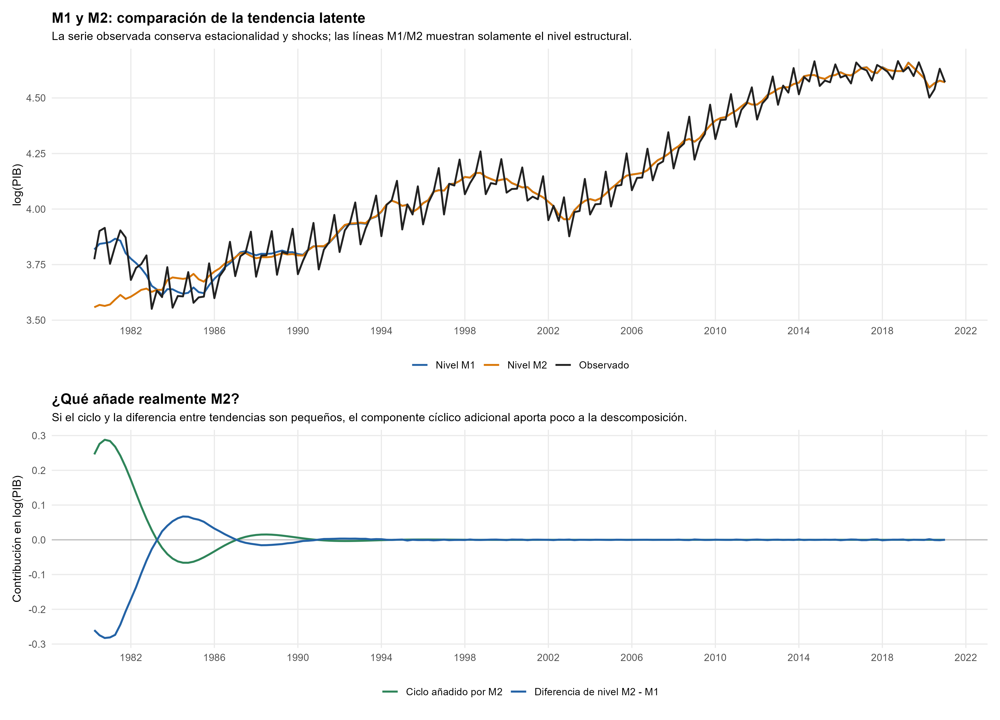
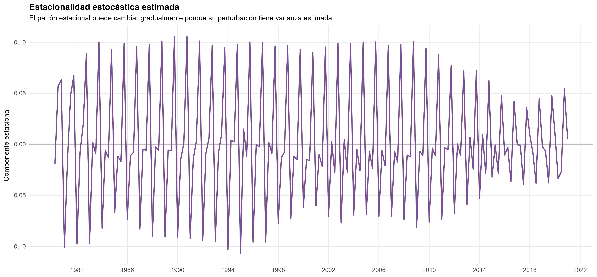
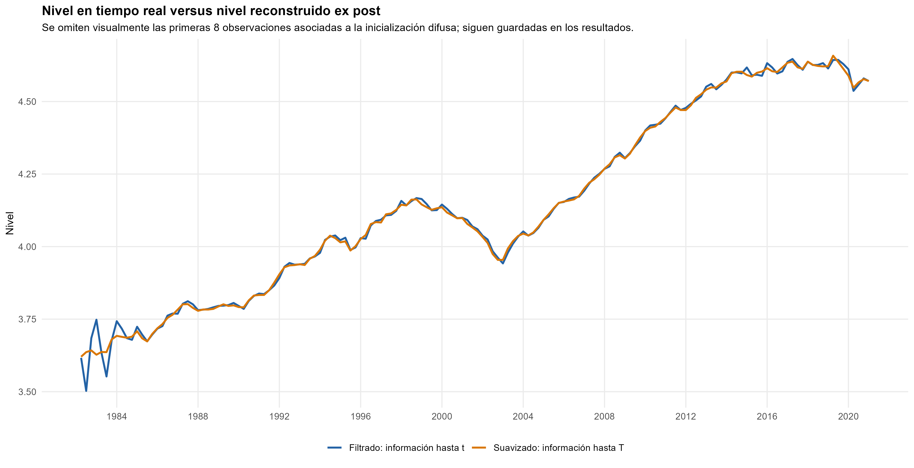
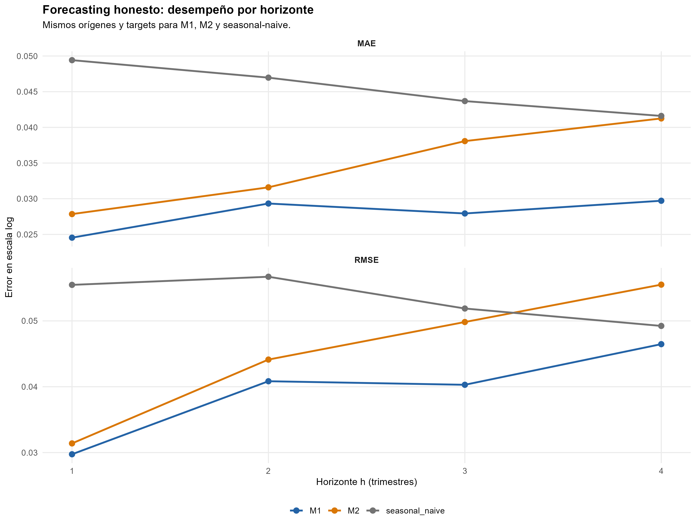
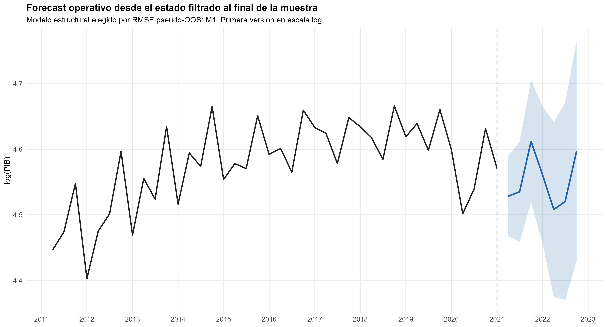
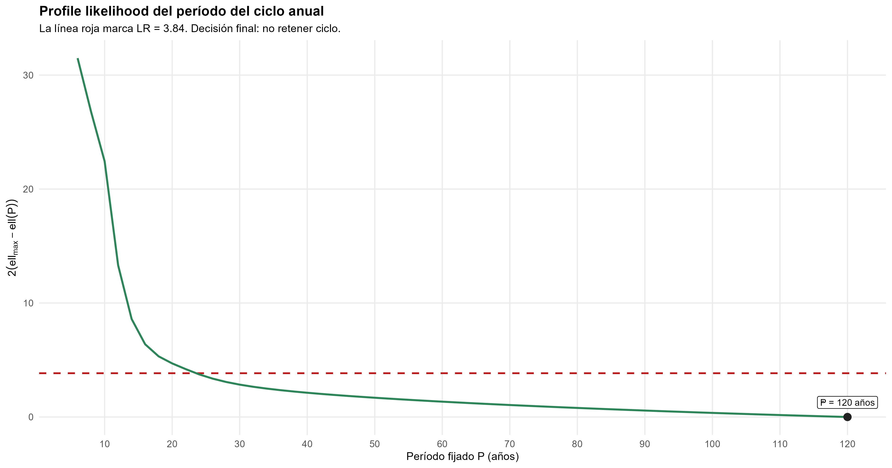

Series temporales y forecasting · Componentes latentes

::: {.hero-box}
::: {.hero-title}
Una tendencia y una estacionalidad flexibles resultan suficientes. El ciclo adicional mejora AIC, pero recibe poca innovación y empeora la predicción histórica.
:::
::: {.hero-sub}
El PIB trimestral de Uruguay se representa mediante estados no observados con leyes de movimiento explícitas. La comparación combina ajuste penalizado, extracción de señal y evaluación pseudo-fuera-de-muestra. El enfoque aporta también un criterio interpretativo: una curva estimada o un período numéricamente plausible no bastan para identificar un ciclo económico.
:::
:::

:::: {.metric-grid}
::: {.metric-card}
::: {.metric-label}
PIB trimestral observado
:::
::: {.metric-value}
164 trimestres
:::
::: {.metric-note}
1980Q2–2021Q1; variable en logaritmos.
:::
:::
::: {.metric-card}
::: {.metric-label}
Evaluación temporal
:::
::: {.metric-value}
20 orígenes
:::
::: {.metric-note}
Cuatro horizontes; 80 forecasts por procedimiento.
:::
:::
::: {.metric-card}
::: {.metric-label}
RMSE medio retenido
:::
::: {.metric-value}
0,03933
:::
::: {.metric-note}
Escala log; promedio sobre cuatro horizontes.
:::
:::
::: {.metric-card}
::: {.metric-label}
Reducción frente al benchmark
:::
::: {.metric-value}
26,2%
:::
::: {.metric-note}
Reducción relativa del RMSE medio.
:::
:::
::::

## Pregunta y datos

¿Cómo separar el crecimiento subyacente y la estacionalidad del PIB uruguayo, y qué evidencia justifica añadir un ciclo independiente? La aplicación principal utiliza el logaritmo del PIB trimestral observado entre 1980Q2 y 2021Q1. Un regresor de Pascua separa un efecto calendario de la dinámica latente; los períodos vacíos posteriores se reservan para forecast, sin convertirlos en datos observados.

Se comparan **M1**, con tendencia lineal local, estacionalidad estocástica y Pascua, y **M2**, que añade un ciclo estocástico. Las figuras del competidor M2 permiten inspeccionar qué cambia al ampliarlo; la especificación finalmente retenida para forecasting es M1.

{fig-alt="PIB trimestral observado, tendencias latentes M1 y M2, y aporte adicional del ciclo de M2" width="100%"}

## Estrategia: declarar la dinámica de cada componente

M1 representa la observación como suma de nivel, estacionalidad, calendario e irregular:

$$
\begin{aligned}
y_t&=\mu_t+\gamma_t+\beta_{P}P_t+\varepsilon_t,\\
\mu_t&=\mu_{t-1}+b_{t-1}+\eta_t,\\
b_t&=b_{t-1}+\zeta_t.
\end{aligned}
$$

$\mu_t$ es el nivel de la tendencia y $b_t$ su pendiente local. La estacionalidad trimestral se compensa a lo largo de cuatro trimestres, pero puede cambiar con perturbaciones propias. El irregular es el ruido de observación separado de los shocks de los estados. M2 agrega un ciclo bidimensional con período y amortiguación estimados.

La representación en espacio de estados reúne estas leyes en una ecuación de medición y otra de transición:

$$
y_t=Z_t\alpha_t+\varepsilon_t,\qquad
\alpha_{t+1}=T_t\alpha_t+u_t.
$$

La estructura se elige antes de estimar. Las varianzas y parámetros dinámicos se estiman por máxima verosimilitud de innovaciones; dados esos hiperparámetros, Kalman actualiza los estados al llegar observaciones. Los estados varían en el tiempo, pero no cuentan como un coeficiente independiente por fecha en AIC/BIC.

## Señal extraída y límite del ciclo

El nivel y la pendiente son objetos distintos: una trayectoria puede seguir creciendo mientras su tasa subyacente cae. La pendiente suavizada de M2 fluctúa aproximadamente entre −0,0026 y 0,0125 por trimestre; en logaritmos, 0,01 equivale aproximadamente a 1% trimestral de crecimiento de la tendencia. Son estados estimados con incertidumbre, no tasas observadas directamente ni atribuciones causales a episodios históricos.

{fig-alt="Componente estacional trimestral estimado por M2 a lo largo de cuatro décadas" width="100%"}

M2 devuelve un período de 30,54 trimestres, unos 7,6 años, pero la varianza de innovación del ciclo es solo $5,90\times10^{-9}$. La mayor parte de su trayectoria visible corresponde al inicio y después se extingue. La varianza irregular también resulta prácticamente nula en ambos modelos: bajo esta estructura, la variación se atribuye casi enteramente a componentes y calendario. Eso no demuestra ausencia de ruido económico ni inexistencia de fluctuaciones cíclicas; delimita lo que esta descomposición logra separar.

## Filtering y smoothing responden a información distinta

El estado filtrado en una fecha usa observaciones hasta esa fecha; el suavizado incorpora observaciones posteriores hasta el final de la muestra:

$$
\widehat\mu_{t\mid t}=E(\mu_t\mid y_1,\ldots,y_t),\qquad
\widehat\mu_{t\mid T}=E(\mu_t\mid y_1,\ldots,y_T).
$$

{fig-alt="Nivel filtrado y nivel suavizado ex post del PIB trimestral bajo la estructura estimada" width="100%"}

La revisión máxima de nivel posterior a esa fase inicial es del orden de 0,134 puntos logarítmicos. El gráfico ilustra la diferencia de conjuntos de observaciones **condicionando en hiperparámetros estimados con la muestra completa**; no reconstruye por sí solo los vintages completos de una estimación histórica. En la evaluación predictiva se reestima el modelo dentro de cada origen y se parte de su estado filtrado, sin usar el smoother del futuro.

## Selección: ajuste penalizado y predicción

AIC favorece M2, mientras BIC favorece M1. La mayor likelihood del ciclo no es concluyente al penalizar tres parámetros estáticos adicionales.

::: {.table-box}
| Especificación | AIC | BIC | MAE medio pseudo-OOS | RMSE medio pseudo-OOS |
|---|---:|---:|---:|---:|
| **M1: tendencia + estacionalidad + Pascua** | −624,218 | **−608,718** | **0,02788** | **0,03933** |
| M2: M1 + ciclo | **−630,108** | −605,309 | 0,03469 | 0,04521 |
| Benchmark estacional | — | — | 0,04542 | 0,05332 |
:::

Los errores están en escala logarítmica y se promedian sobre cuatro horizontes. La evaluación usa veinte orígenes expansivos de 2000Q4 a 2019Q4, separados por un año, con horizontes de uno a cuatro trimestres. Cada ajuste solo ve su pasado; M1, M2 y el benchmark del mismo trimestre del año anterior comparten orígenes y targets. El primer origen no hereda hiperparámetros de la muestra completa.

{fig-alt="MAE y RMSE pseudo-fuera-de-muestra por horizonte trimestral de M1, M2 y benchmark estacional" width="100%"}

M1 reduce el MAE medio 38,6% y el RMSE medio 26,2% frente al benchmark; frente a M2 reduce el RMSE aproximadamente 13,0%. Sus coberturas nominales de 95% son 95%, 90%, 95% y 95% por horizonte. Con veinte realizaciones por punto, una observación mueve la cobertura cinco puntos porcentuales: las diferencias pequeñas requieren cautela.

Los Ljung–Box a doce rezagos de las innovaciones estandarizadas son 0,579 para M1 y 0,272 para M2. Persiste una innovación extraordinaria en 2020Q2 (−3,38 en M1). Se conserva sin intervención: tratarla como mejora predictiva exigiría una competencia adicional bajo el mismo diseño, que no se realizó.

## Forecast desde el estado final

M1 se reestima hasta 2021Q1 y propaga estados e incertidumbre para 2021Q2–2022Q4. Sin observaciones futuras no hay actualización, solo transición y acumulación de perturbaciones. El forecast operativo es histórico y mantiene la escala **log-PIB** utilizada en la estimación.

{fig-alt="Forecast histórico del logaritmo del PIB para 2021Q2 a 2022Q4 desde M1 con intervalo predictivo de 95 por ciento" width="100%"}

Exponenciar su centro no entrega en general la media condicional del PIB en niveles. Informar ese objeto exigiría retransformar la distribución predictiva; esta aplicación no realiza esa extensión.

## Una comprobación adicional de identificación

El PIB anual de 1870–2019 permite examinar un límite diferente: separar un ciclo de muy baja frecuencia de una tendencia suave. El candidato con ciclo mejora BIC, pero el perfil de verosimilitud sigue mejorando hasta el extremo de 120 años; el soporte aproximado LR95% permanece abierto hasta esa frontera, desde 24 años.

{fig-alt="Perfil de verosimilitud del período cíclico en el PIB anual de 1870 a 2019 con máximo en la frontera de 120 años" width="100%"}

No se retiene un ciclo periódico identificado: las desviaciones anuales siguen siendo fluctuaciones observadas. Un mejor criterio de información no basta cuando el parámetro que da significado económico al componente no está localizado por los datos.

::: {.callout-note}
## Decisión profesional

Retener M1 para el PIB trimestral por parsimonia y desempeño pseudo-OOS. Distinguir reconstrucción histórica de información disponible en un origen, e interpretar cada estado junto con su incertidumbre. La principal contribución es una descomposición defendible; el ciclo adicional debe aportar señal identificada, además de convergencia y ajuste.
:::
