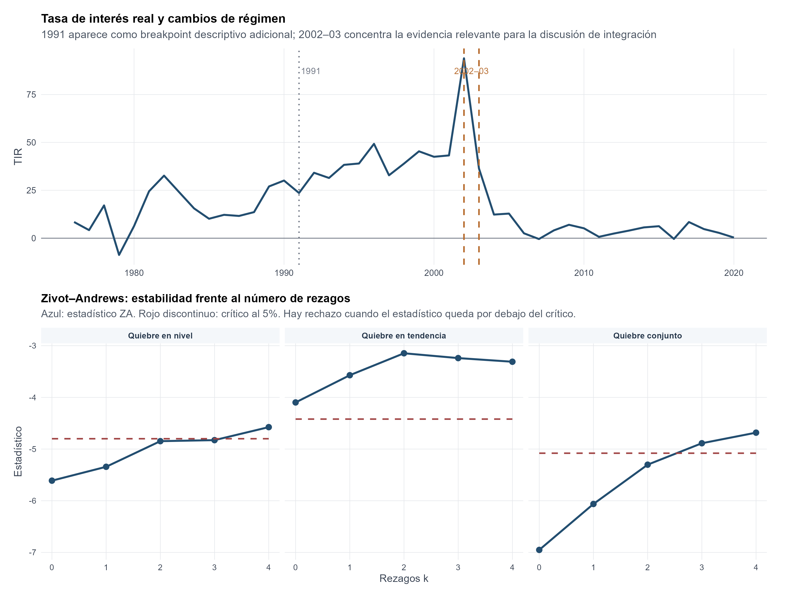
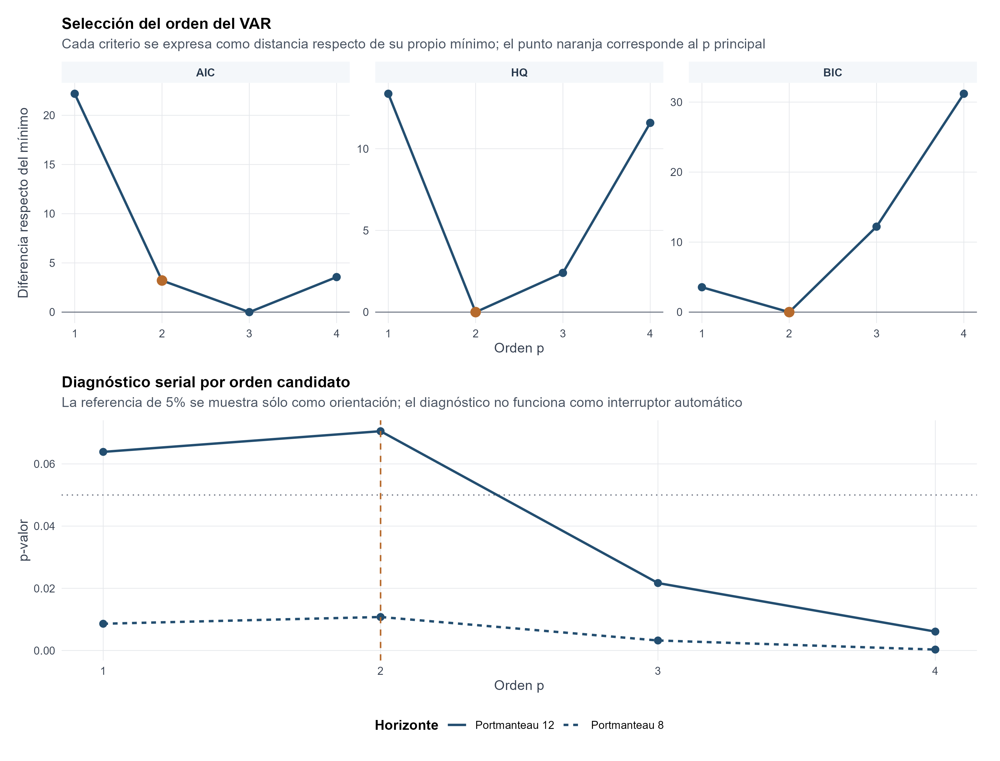
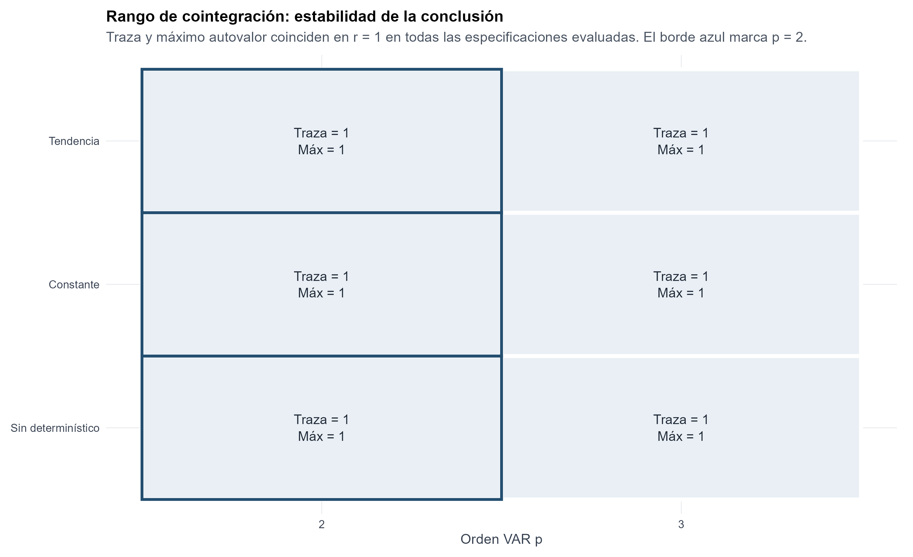
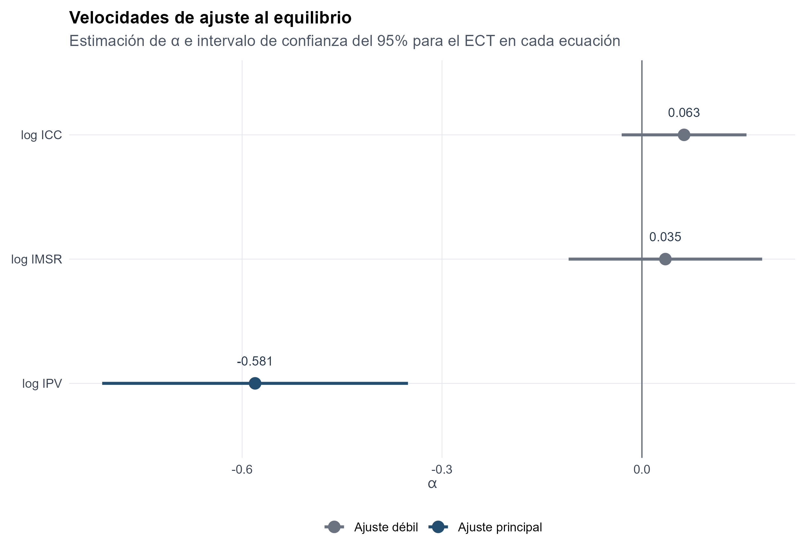
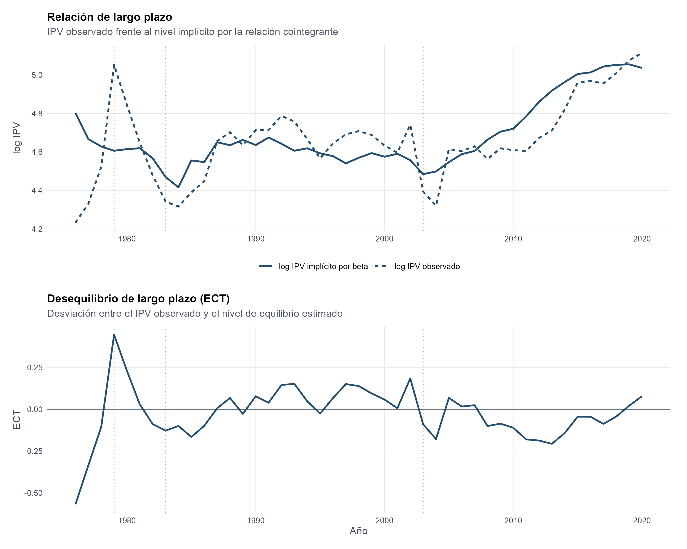
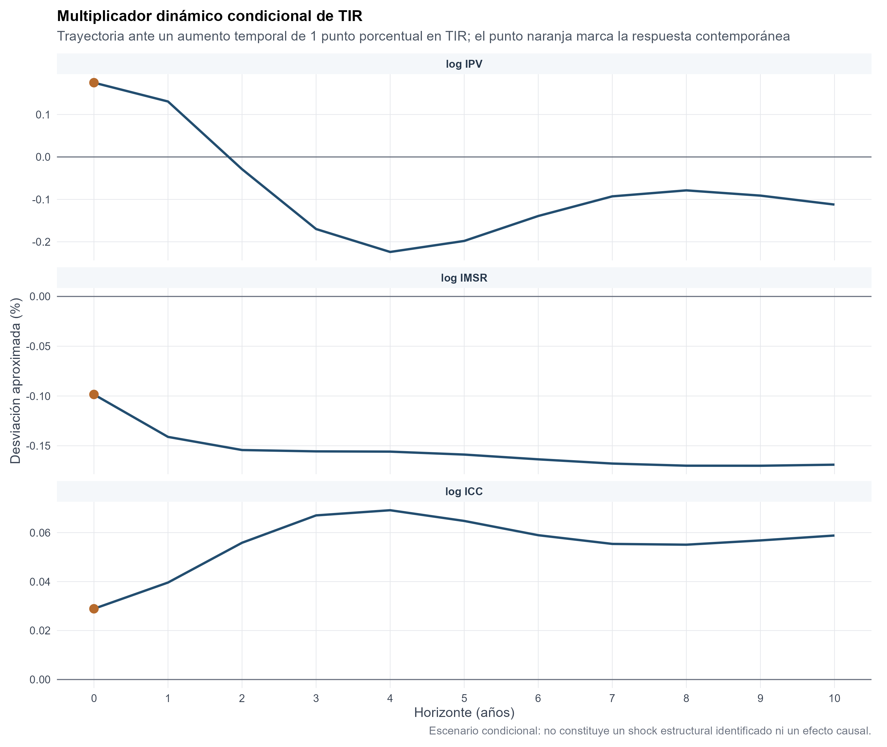

Series temporales y forecasting · Equilibrio multivariado

::: {.hero-box}
::: {.hero-title}
La evidencia más estable es conjunta: una relación de largo plazo y un precio que absorbe principalmente sus desequilibrios.
:::
::: {.hero-sub}
El precio real de vivienda en Montevideo, el salario real y el costo real de construcción comparten una restricción cointegrante. El VECM vincula esa relación con la transición de corto plazo y mantiene la tasa real como condicionante. El signo negativo de costos se conserva con su límite interpretativo: es parte de una relación reducida de equilibrio, sin identificación causal.
:::
:::

:::: {.metric-grid}
::: {.metric-card}
::: {.metric-label}
Muestra anual
:::
::: {.metric-value}
45 años
:::
::: {.metric-note}
1976–2020; precio de vivienda referido a Montevideo.
:::
:::
::: {.metric-card}
::: {.metric-label}
Rango cointegrante
:::
::: {.metric-value}
r = 1
:::
::: {.metric-note}
Estable frente a órdenes y determinísticos evaluados.
:::
:::
::: {.metric-card}
::: {.metric-label}
Dinámica subyacente
:::
::: {.metric-value}
VAR(2)
:::
::: {.metric-note}
Un rezago de primeras diferencias en el VECM.
:::
:::
::: {.metric-card}
::: {.metric-label}
Ajuste en el precio
:::
::: {.metric-value}
α = −0,581
:::
::: {.metric-note}
Respuesta condicional al desequilibrio rezagado.
:::
:::
::::

## Pregunta económica y datos

¿Existe una relación de largo plazo entre vivienda real, salarios reales y costos reales de construcción, y cómo se corrigen sus desvíos? El objetivo es representar equilibrio y dinámica del sistema. Esta pieza no presenta forecasting fuera de muestra ni una estrategia de inversión validada.

El precio de vivienda combina la serie histórica utilizada en el curso con una reconstrucción desde boletines inmobiliarios del INE, ponderando por operaciones de propiedad horizontal y padrón único. Se convierte a pesos, empalma y deflacta por IPC. El salario real y los costos de construcción provienen del INE; la tasa de interés real, del Banco Mundial.

::: {.table-box}
| Símbolo | Variable | Tratamiento en el sistema |
|---|---|---|
| $p_t$ | Logaritmo del índice real de precio de vivienda en Montevideo | Candidata integrada de orden uno; endógena |
| $w_t$ | Logaritmo del índice de salario real | Candidata integrada de orden uno; endógena |
| $c_t$ | Logaritmo del índice real de costo de construcción | Candidata integrada de orden uno; endógena |
| $r_t$ | Tasa de interés real en puntos porcentuales | Condicionante de corto plazo, estandarizada; fuera del vector cointegrante |
:::

La escala de los tres índices permite interpretar proporciones en la relación log–log. La tasa real tiene otra escala y otra dinámica. Un control descriptivo del empalme de vivienda en 2006 no encuentra discontinuidad relevante en primeras diferencias; la construcción de la serie sigue siendo una limitación de comparabilidad.

## Integración y quiebres condicionan la arquitectura

ADF y KPSS se leen conjuntamente, con sensibilidad a determinísticos, rezagos y banda de varianza de largo plazo. Con 45 observaciones, no rechazar raíz unitaria no demuestra integración. La clasificación de $p_t$, $w_t$ y $c_t$ como candidatas $I(1)$ combina pruebas, primeras diferencias y estabilidad del sistema posterior.

La tasa real presenta otra evidencia: Zivot–Andrews rechaza raíz unitaria al permitir un quiebre de nivel en cuatro de cinco elecciones de rezagos, con fechas alrededor de 2002–2003. Se trata como estacionaria alrededor de regímenes y se mantiene fuera de la relación de largo plazo, conservando su papel transitorio.

{fig-alt="Tasa de interés real anual y sensibilidad de Zivot-Andrews a rezagos y tipos de quiebre" width="100%"}

## Dinámica parsimoniosa antes de interpretar el equilibrio

La selección iterativa retiene pulsos en 1979, 1983 y 2003 por mejoras penalizadas del sistema, reestimando después de cada incorporación. No se atribuye a cada fecha una causa estructural única. La anomalía residual de 1985 se conserva como sensibilidad.

Los órdenes del VAR se comparan sobre 41 observaciones efectivas comunes: AIC favorece tres rezagos, HQ y BIC favorecen dos. Se adopta $p=2$, manteniendo $p=3$ como contraste. El VECM resultante tiene un rezago de primeras diferencias.

{fig-alt="Selección del orden VAR con AIC, HQ y BIC y diagnósticos Portmanteau por orden candidato" width="100%"}

Traza y máximo autovalor de Johansen rechazan rango cero, pero no rechazan como máximo una relación. El resultado es $r=1$, estable para $p=2$ y $p=3$ en las variantes determinísticas evaluadas. Tres variables y rango uno implican dos tendencias estocásticas comunes y una combinación estacionaria.

{fig-alt="Rango uno de cointegración bajo órdenes VAR dos y tres y distintas especificaciones determinísticas" width="100%"}

## Relación de largo plazo y un signo que requiere cautela

Normalizada en vivienda, la relación estimada es

$$
p_t=7{,}89487+0{,}32724\,w_t-1{,}05497\,c_t.
$$

Dentro de ese equilibrio estadístico, 1% más de salario se asocia aproximadamente con 0,33% más de precio; 1% más de costos, con 1,05% menos. El coeficiente salarial es impreciso. El signo de costos es estable entre alternativas, pero contraintuitivo bajo una lectura simple de costos que causan precios: podría reflejar oferta o stock omitidos, simultaneidad y diferencias entre costos físicos y precios de transacción. El análisis no distingue esas explicaciones.

**La cointegración no convierte esta ecuación en una relación causal ni en un valor fundamental identificado.** Su aporte defendible es una restricción estacionaria de largo plazo del sistema.

## Quién corrige el desequilibrio

El término de corrección del error es

$$
ECT_t=p_t-0{,}32724w_t+1{,}05497c_t-7{,}89487.
$$

Un $ECT$ positivo ubica el precio por encima del nivel compatible con la relación estimada. Como $\widehat\alpha_p=-0,581$, aporta una contribución negativa a la variación posterior del precio; un $ECT$ negativo aporta una contribución positiva. Salario y costos muestran ajustes pequeños, 0,035 y 0,063, con mayor incertidumbre relativa.

{fig-alt="Velocidades de corrección del error de vivienda, salario y costos con intervalos de confianza de 95 por ciento" width="100%"}

La magnitud −0,581 describe el coeficiente de una ecuación del sistema; no equivale automáticamente a una vida media de todo el desequilibrio, porque también evolucionan las otras variables y los términos transitorios.

{fig-alt="Precio real de vivienda observado e implícito por la cointegración y término de desequilibrio ECT anual" width="100%"}

En 2002, $ECT\approx0,184$ aporta cerca de −0,107 puntos logarítmicos a la variación de 2003. En 2003, un desequilibrio de −0,090 aporta +0,052 a 2004, aunque el precio todavía cae: los demás términos de corto plazo pueden dominar la corrección. El ECT es una fuerza dentro de la ecuación, no la predicción completa.

## Corto plazo y tasa real

El sistema puede resumirse como

$$
\Delta\mathbf y_t=\alpha ECT_{t-1}+\Gamma_1\Delta\mathbf y_{t-1}
+\delta r_t^z+\Psi\mathbf D_t+\varepsilon_t.
$$

En la ecuación del crecimiento del precio, el propio crecimiento rezagado tiene coeficiente 0,605; en la ecuación del crecimiento del salario, su propia variación rezagada tiene coeficiente 0,515. La tasa real estandarizada entra en la ecuación de precio con 0,0335, aproximadamente 0,175% contemporáneo por un punto porcentual en unidades originales. Se conserva ese signo positivo, seguido de reversión en el multiplicador dinámico condicional.

{fig-alt="Multiplicador dinámico condicional de vivienda, salarios y costos ante un aumento temporal de un punto porcentual de tasa real" width="100%"}

Las respuestas de forma reducida del análisis tampoco identifican shocks económicos estructurales. No se añaden identificación por Cholesky ni interpretaciones causales de política o ingreso.

## Validación y sensibilidad

El Portmanteau ajustado entrega p=0,0569 a ocho rezagos y 0,2351 a doce. Por ecuación, los Ljung–Box a doce rezagos son 0,663, 0,639 y 0,204. Persisten no normalidad por curtosis (Jarque–Bera multivariante p≈0,000024) y ARCH moderado (p=0,0418), que aconsejan cautela inferencial en esta muestra pequeña.

::: {.table-box}
| Escenario | Rango | Salario en ecuación de precio | Costos en ecuación de precio | Ajuste del precio | Portmanteau 12, p |
|---|---:|---:|---:|---:|---:|
| **Principal, VAR(2)** | **1** | +0,327 | −1,055 | −0,581 | **0,235** |
| Mismos pulsos, VAR(3) | 1 | +0,361 | −0,989 | −0,955 | 0,152 |
| Principal + pulso 1985 | 1 | +0,264 | −1,045 | −0,594 | 0,048 |
:::

La tabla expresa los coeficientes al despejar vivienda: sus signos son opuestos a los de salario y costos dentro del ECT. Agregar 1985 mejora criterios de información y normalidad, pero empeora el diagnóstico serial; por eso no se retiene. El rango y los signos son más estables que la velocidad exacta de ajuste.

::: {.callout-note}
## Decisión profesional

Conservar una relación cointegrante entre vivienda, salario y costos, con la tasa real como condicionante transitorio. La corrección se concentra en el precio, mientras su intensidad depende del orden dinámico. El equilibrio estimado organiza una lectura conjunta; usar el ECT como señal de inversión o predictor exigiría estimación recursiva y evaluación fuera de muestra, que esta pieza no realiza.
:::
