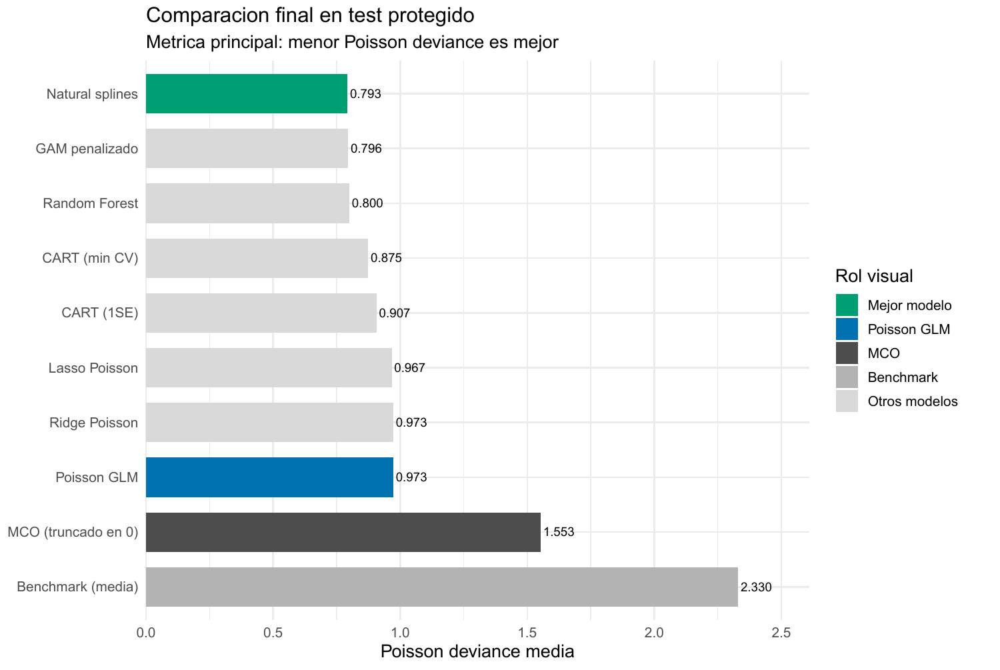
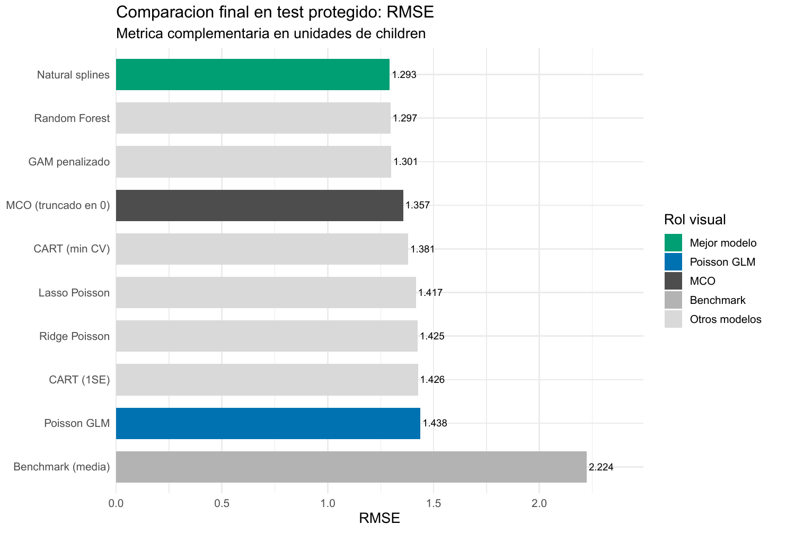

::: {.eyebrow}
E01 · Outcome de conteo · Poisson y pérdidas predictivas
:::

::: {.hero-box}
# Contar bien: predecir hijos sin tratar el outcome como gaussiano

::: {.hero-box__lead}
Cuando el target es un conteo, el soporte, el enlace y la pérdida forman parte de la predicción. En `fertil2`, flexibilizar una media Poisson reduce la deviance externa mucho más que contraer una recta.
:::
:::

:::: {.metric-grid}
::: {.metric-card}
**4.168**

casos analíticos; 3.334 en desarrollo y 834 en test
:::
::: {.metric-card}
**`children`**

conteo discreto y no negativo de hijos vivos
:::
::: {.metric-card}
**0,7929**

deviance Poisson de natural splines en test
:::
::: {.metric-card}
**0,9733**

deviance del GLM Poisson log-lineal
:::
::::

## Antes del modelo, el outcome ya impone condiciones

`children` es un conteo entero y no negativo. En desarrollo toma valores entre 0 y 13, tiene media 2,21 y 26,15 % de ceros; su varianza, 4,70, supera ampliamente la media. Una regla constante que predice 2,21 hijos para todos ofrece el benchmark mínimo y alcanza deviance Poisson 2,3302 en el test.

MCO agrega información mediante una media lineal y pérdida cuadrática, pero no garantiza predicciones no negativas ni aprovecha que cero, uno y dos son resultados discretos. El GLM Poisson cambia la formulación:

$$
\log \mu(x)=X\beta, \qquad \mu(x)=\exp(X\beta)>0.
$$

El objeto sigue siendo la media condicional esperada, que puede ser fraccional aunque el outcome observado sea entero. El enlace log garantiza una media positiva; adoptar una familia Poisson completa sería una afirmación adicional sobre varianza y probabilidades puntuales.

## Soporte, modelo, pérdida y evaluación son decisiones distintas

La naturaleza del target define el soporte. La familia y el enlace determinan cómo algunos modelos representan $\mu(x)$. La deviance Poisson es la pérdida declarada para seleccionar complejidad y comparar medias predichas. RMSE y MAE se calculan además sobre el test en unidades de hijos.

CART y Random Forest producen medias positivas adaptadas a conteos, pero la comparación no convierte automáticamente cada algoritmo en una distribución Poisson completa. La deviance funciona como criterio común para la calidad de $\widehat\mu(x)$. Por eso respetar el soporte, usar enlace log y evaluar con deviance son decisiones conectadas, aunque no equivalentes.

## La evaluación mantiene el test fuera del aprendizaje

La muestra analítica contiene 4.168 casos completos: 3.334 forman desarrollo y 834 quedan protegidos para test. No se necesita CV anidada porque la selección ocurre íntegramente dentro de desarrollo y existe una evaluación externa separada.

Ridge, Lasso, natural splines y CART utilizan los mismos cinco folds. El GAM selecciona suavidad mediante REML y Random Forest elige `mtry` por deviance OOB. El test no selecciona $\lambda$, grados de libertad, poda, `mtry` ni la decisión de descartar una Binomial Negativa.

## El tuning permite identificar qué flexibilidad importa

Ridge alcanza su mínimo con $\lambda=0,06394$ y Lasso con $\lambda=0,02232$. Sus deviances de CV, 0,9912 y 0,9865, permanecen cerca del GLM sin penalizar: contraer coeficientes conserva la misma log-media lineal y aporta poco.

Natural splines recorre 200 combinaciones y selecciona grados de libertad $(6,2,3)$ para edad, educación e hijos ideales, con deviance CV 0,8066. El mínimo es interior a la grilla y concentra la flexibilidad en edad. El GAM llega a una lectura coherente mediante suavizado penalizado: usa 8,32 grados de libertad efectivos en edad, 2,94 en educación y 5,10 en hijos ideales. Su diagnóstico de base para esta última curva es marginal y queda como cautela, aunque el desempeño externo sea bueno.

CART selecciona 25 hojas por mínimo de CV; la regla 1SE reduce el árbol a 14. Random Forest ajusta 1.000 árboles y la deviance OOB elige `mtry = 5` entre 15 candidatos, con 0,8130. Estas decisiones se cerraron antes de abrir el test.

## La evaluación externa favorece la forma, no la contracción

::: {.table-box}
| Modelo | Deviance Poisson | RMSE | MAE | Mejora vs. benchmark |
|---|---:|---:|---:|---:|
| Natural splines Poisson | **0,7929** | **1,2927** | **0,9006** | **65,97 %** |
| GAM penalizado Poisson | 0,7955 | 1,3005 | 0,9060 | 65,86 % |
| Random Forest | 0,8005 | 1,2967 | 0,9180 | 65,65 % |
| CART mínimo CV | 0,8747 | 1,3807 | 0,9558 | 62,46 % |
| CART 1SE | 0,9074 | 1,4265 | 0,9959 | 61,06 % |
| Lasso Poisson | 0,9668 | 1,4168 | 1,0249 | 58,51 % |
| Ridge Poisson | 0,9732 | 1,4252 | 1,0239 | 58,24 % |
| GLM Poisson | 0,9733 | 1,4382 | 1,0264 | 58,23 % |
| MCO truncado a cero | 1,5531 | 1,3566 | 0,9512 | 33,35 % |
| Media de desarrollo | 2,3302 | 2,2243 | 1,7810 | 0,00 % |
:::

{#fig-e01-dev fig-alt="Natural splines Poisson alcanza deviance 0,7929, seguido por GAM 0,7955 y Random Forest 0,8005; GLM Poisson 0,9733." width="100%"}

Natural splines reduce 18,53 % la deviance del GLM Poisson. GAM y RF quedan apenas 0,33 % y 0,95 % por encima del mejor valor. La diferencia pequeña entre los tres líderes no respalda una historia de creciente complejidad: dos superficies aditivas suaves igualan o superan al bosque, que también puede aprender interacciones.

La comparación que sí es amplia aparece frente a la forma lineal. Ridge mejora la deviance del GLM apenas 0,01 % y Lasso 0,67 %. CART captura parte de la curvatura, pero el bosque reduce su deviance de 0,8747 a 0,8005. Simplificar CART de 25 a 14 hojas eleva la deviance otro 3,74 %, un costo externo visible de la parsimonia 1SE.

## RMSE revela una tensión que no conviene ocultar

{#fig-e01-rmse fig-alt="RMSE de natural splines 1,2927, Random Forest 1,2967, GAM 1,3005 y GLM Poisson 1,4382." width="100%"}

Natural splines también obtiene el menor RMSE y los tres modelos flexibles siguen formando el grupo líder. El orden completo, sin embargo, cambia. MCO truncado presenta RMSE 1,3566: supera al GLM Poisson, a Ridge, Lasso y ambos CART bajo pérdida cuadrática, aunque su deviance 1,5531 es mucho peor.

Ese resultado incómodo importa. MCO produjo 89 predicciones crudas negativas, 10,67 % del test, y debió truncarse en cero antes de calcular las métricas. Un RMSE competitivo no corrige la incompatibilidad de soporte; una buena deviance tampoco garantiza ser la mejor regla si la decisión real penaliza prioritariamente errores absolutos grandes. La métrica define la pregunta y debe fijarse antes de observar el test.

## La mejora flexible tiene una explicación visible

El GLM obliga a que edad produzca crecimiento multiplicativo continuo de la media. Splines y GAM encuentran crecimiento inicial, una meseta y una leve caída en edades altas. También permiten que la relación con hijos ideales alcance un máximo interior, algo que Ridge y Lasso no pueden crear al limitarse a contraer una pendiente lineal.

La calibración por deciles acompaña esa lectura: splines y GAM siguen de cerca las medias observadas, mientras el GLM sobrepredice en grupos bajos, subpredice buena parte de la zona media-alta y vuelve a sobrepredecir arriba. RF también se aproxima bien, aunque en el decil superior predice 5,51 frente a 6,04 observados. Son patrones predictivos condicionados, no mecanismos de fertilidad.

## La dispersión no se diagnostica con una comparación marginal

Que la varianza marginal sea mayor que la media no demuestra sobredispersión condicional. Tras modelar $X$, el GLM reporta dispersión de Pearson 0,8402 y el estimador de momentos NB2 es negativo, $\widehat\alpha=-0,0114$. No aparece evidencia para forzar una Binomial Negativa.

Esto tampoco demuestra que Poisson describa perfectamente toda la distribución. Como diagnóstico adicional, el GLM reproduce aproximadamente la masa de ceros del test —0,256 predicha frente a 0,265 observada—, pero sobrepredice el conteo uno. La comparación principal evalúa medias condicionales; modelar todas las probabilidades puntuales exigiría una afirmación distribucional más fuerte.

::: {.section-box}
### Decisión bajo la pérdida declarada

Natural splines Poisson es la opción con menor deviance y RMSE observados. GAM y Random Forest quedan tan próximos que la elección práctica puede considerar interpretabilidad y mantenimiento. La conclusión más estable es que la mejora proviene de flexibilizar la forma de la media respetando el target, no de penalizar una log-media rígida.
:::

El resultado depende de una única partición, de casos completos y de una pérdida predefinida. El GAM conserva una cautela sobre la base de `idlnchld`; RF solo ajusta `mtry`; el ejercicio no construye un modelo operativo posterior al test. Ningún perfil, corte o ranking de importancia admite interpretación causal.

[Loanapp](e02_loanapp_gamma.qmd) muestra el caso continuo positivo: cambiar de soporte discreto a continuo no vuelve automáticamente adecuada la pérdida gaussiana.

::: {.small-note}
**Fuente:** informe curado «E01: fertil2, conteo y Poisson». Figuras originales del informe convertidas a PNG; no se generaron estimaciones nuevas.
:::
